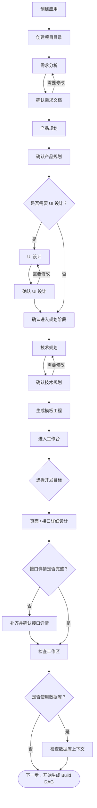

# 应用创建到 Build DAG 前置流程

## 范围

本文描述从创建应用到开始生成 Build DAG 之前的关键流程。

UI 设计是可选节点：选择 UI 设计时先完成页面视觉稿确认，跳过时保存明确的 skipped 状态。两条路径都只到达“等待进入规划阶段”。用户点击绿色入口卡后，当前工作台创建或恢复该应用的独立 PLAN StageSession，并原地切换到规划阶段。后端继续使用原初始化 Graph checkpoint，规划 Agent 使用独立的前端 conversation thread；当前工作台只提交一次 `enter_planning`，然后才生成技术规划。

## 流程图



## 设计、规划阶段职责与四类产物

四类产物分别确认，但不重复确认同一类事实；TechnicalPlan 位于独立规划阶段。以下 JSON 是职责收敛后的简化示意；正式用户文档以 Markdown 为主，JSON 用于内部结构化状态、版本引用和校验。生成候选时使用 `pending_user_confirmation`，用户确认后改为 `confirmed`。

| 阶段 | 核心问题 | 权威内容 | 不负责的内容 |
| --- | --- | --- | --- |
| RequirementSpec | 为什么做、给谁做、范围是什么 | 需求事实、目标、角色、能力、范围、业务流程 | 验收标准、稳定页面动作、页面布局、接口和数据库方案 |
| ProductPlan | 用户具体看到什么、怎么操作 | 页面、信息项、动作、跳转、角色可见性、状态和产品验收 | API、数据库、技术架构和代码文件 |
| UiDesign | 页面长什么样 | 布局、组件、视觉层级、交互呈现和主题 | 新增产品事实或真实业务接口 |
| TechnicalPlan | 工程如何实现 | 架构、数据模型、API Contract、工程边界和落地约束 | 重新定义产品行为或页面视觉 |

### 1. 需求文档：RequirementSpec

产物路径：`.xcodeagent/specs/requirement-spec.md`、`.xcodeagent/specs/requirement-spec.json`

```json
{
  "artifact_type": "requirement-spec",
  "confirmation_status": "pending_user_confirmation",
  "app_info": {
    "name": "订单管理应用",
    "problem": "客服需要在多个系统中查找订单，处理时间较长",
    "goal": "让客服能够快速查询订单并查看订单状态"
  },
  "scope": {
    "in_scope": [
      "按订单号查询订单",
      "查看订单当前状态"
    ],
    "out_of_scope": [
      "支付和退款"
    ]
  },
  "user_roles": [
    {
      "roleId": "user",
      "name": "普通用户",
      "needs": [
        "按订单号查询",
        "查看订单状态"
      ]
    }
  ],
  "capabilities": [
    {
      "capabilityId": "order-management",
      "name": "订单管理",
      "description": "用户可以查看和处理订单"
    }
  ],
  "business_flows": [
    {
      "flowId": "order-search",
      "capability_ids": ["order-management"],
      "name": "查询订单",
      "goal": "用户能够快速找到目标订单",
      "steps": [
        "提供订单号",
        "获得匹配订单"
      ]
    }
  ],
  "requested_pages": [
    {
      "name": "订单列表",
      "reason": "承载订单查询和结果展示"
    }
  ]
}
```

备注：

- `artifact_type` 标识产物类型；`confirmation_status` 标识当前是否已经过用户确认。
- `app_info` 记录应用要解决的问题和期望结果；`scope` 划定本次需求做什么、不做什么。
- `user_roles` 记录角色及其需求；`capabilities` 记录能力层级的需求，不拆成具体页面按钮。
- `business_flows` 记录业务目标和高层步骤；`flowId` 用于 ProductPlan 需求追溯，`capability_ids` 用于关联它使用的业务能力。
- `requested_pages` 只记录用户明确提出的页面候选，不代表已经决定要实现该页面。
- 本阶段不定义 `acceptance_criteria`；`app_info.goal` 只描述期望方向，具体可验证标准在 ProductPlan 中形成。
- 只记录用户提出或确认的需求事实，不记录模型自行补出的产品方案。
- `requested_pages` 不分配正式 `pageId`、路由和页面动作；`business_flows` 不描述页面控件或接口调用。
- 信息不足时先澄清；澄清回答不等于确认，必须单独确认 RequirementSpec。

### 2. 产品规划：ProductPlan

草稿路径：`.xcodeagent/drafts/plans/product-plan.md`、`.xcodeagent/drafts/plans/product-plan.json`；确认后正式路径：`.xcodeagent/plans/product-plan.md`、`.xcodeagent/plans/product-plan.json`

```json
{
  "artifact_type": "product-plan",
  "confirmation_status": "pending_user_confirmation",
  "source_refs": {
    "requirement_spec_sha256": "sha256:requirement-spec-example"
  },
  "pages": [
    {
      "pageId": "orders",
      "name": "订单列表",
      "path": "/orders",
      "goal": "查看和处理订单",
      "information_items": [
        {
          "informationItemId": "order-number",
          "label": "订单编号"
        }
      ],
      "actions": [
        {
          "actionId": "search-orders",
          "name": "查询订单",
          "allowed_role_ids": ["user"],
          "behavior": {
            "type": "business",
            "expectedResult": "展示符合条件的订单"
          }
        },
        {
          "actionId": "open-order-detail",
          "name": "查看订单详情",
          "allowed_role_ids": ["user"],
          "behavior": {
            "type": "navigation",
            "targetPageId": "order-detail",
            "expectedResult": "进入订单详情页"
          }
        }
      ],
      "allowed_role_ids": ["user"],
      "states": [
        {
          "name": "empty",
          "expectedBehavior": "无匹配订单时保留查询条件，并提示用户调整条件"
        },
        {
          "name": "error",
          "expectedBehavior": "查询失败时提供重试操作"
        }
      ],
      "page_acceptance_criteria": [
        {
          "criterionId": "orders-search",
          "description": "输入订单号后可以看到匹配订单",
          "verification": "手工输入已存在的订单号进行验证"
        }
      ]
    },
    {
      "pageId": "order-detail",
      "name": "订单详情",
      "path": "/orders/:orderId",
      "goal": "查看单个订单的完整信息",
      "information_items": [
        {
          "informationItemId": "order-status",
          "label": "订单状态"
        }
      ],
      "actions": [
        {
          "actionId": "back-to-orders",
          "name": "返回订单列表",
          "allowed_role_ids": ["user"],
          "behavior": {
            "type": "navigation",
            "targetPageId": "orders",
            "expectedResult": "返回订单列表页"
          }
        }
      ],
      "allowed_role_ids": ["user"],
      "states": [
        {
          "name": "empty",
          "expectedBehavior": "订单不存在时提示用户返回订单列表"
        },
        {
          "name": "error",
          "expectedBehavior": "详情加载失败时提供重试操作"
        }
      ],
      "page_acceptance_criteria": [
        {
          "criterionId": "order-detail-visible",
          "description": "从订单列表可以进入订单详情页",
          "verification": "点击订单后检查页面跳转和订单状态展示"
        }
      ]
    }
  ],
  "requirement_traceability": [
    {
      "flowId": "order-search",
      "pageIds": ["orders", "order-detail"],
      "actionIds": [
        "search-orders",
        "open-order-detail"
      ]
    }
  ],
  "product_acceptance_criteria": [
    {
      "criterionId": "complete-order-query-flow",
      "description": "用户可以从订单列表查询订单并进入详情页",
      "covers": [
        "orders",
        "order-detail",
        "search-orders",
        "open-order-detail"
      ]
    }
  ]
}
```

备注：

- 把需求事实展开为可确认的产品方案，并为页面和动作分配稳定 ID。
- 只有 ProductPlan 才定义正式页面、路由、信息项、用户动作、跳转和产品状态。
- `requirement_traceability` 只保存 RequirementSpec 的流程 ID，以及承接它的页面和动作 ID，不复制整段需求文本。
- `information_items` 是产品层定义的页面信息项；后续 UI 设计通过 `control_bindings[].informationItemId` 引用它们。
- `pages` 定义页面级产品结构；`pageId` 是稳定引用 ID，`path` 是产品路由，`goal` 是页面目标。
- `information_items` 定义页面需要展示或处理的信息，例如订单号、订单状态；`informationItemId` 供 UI 和技术规划引用。
- `actions` 统一定义用户动作及其产品结果；`actionId` 是稳定引用 ID，`behavior.type` 区分业务动作和页面跳转。
- 当 `behavior.type` 为 `navigation` 时，`targetPageId` 直接定义目标页面，避免再通过单独的导航关系重复声明。
- `pages.allowed_role_ids` 定义哪些角色可以进入或看到页面；`actions.allowed_role_ids` 定义哪些角色可以执行具体动作。角色可以有页面访问权，但没有某个动作的执行权。
- `states` 只定义需要产品明确行为的特殊状态，例如无数据和加载失败；正常成功状态不需要单独声明。
- ProductPlan 只描述状态下的产品行为，不规定具体 UI 文案和视觉表现；这些由 UI 设计阶段决定。
- 页面级 `page_acceptance_criteria` 验收单页行为，`product_acceptance_criteria` 验收完整产品流程。
- `actions` 描述产品结果，不决定 HTTP 方法、endpoint、数据库或代码文件。
- ProductPlan 确认后，UI 设计和 TechnicalPlan 分别生成并确认；UI 可跳过，TechnicalPlan 不等待或读取 UI 产物。

### 3. UI 设计：UiDesign（可选）

产物路径：`.xcodeagent/ui-design/pages/<PageKey>/index.tsx`、`.xcodeagent/specs/ui-designs.json`

```json
{
  "artifact_type": "ui-design",
  "confirmation_status": "pending_user_confirmation",
  "source_refs": {
    "product_plan_sha256": "sha256:product-plan-example"
  },
  "pages": [
    {
      "pageId": "orders",
      "page_key": "Orders",
      "code_path": ".xcodeagent/ui-design/pages/Orders/index.tsx",
      "code_sha256": "sha256:orders-ui-example",
      "control_bindings": [
        {
          "controlId": "orders-order-number-input",
          "informationItemId": "order-number"
        },
        {
          "controlId": "orders-search-button",
          "actionId": "search-orders"
        },
        {
          "controlId": "orders-order-detail-link",
          "actionId": "open-order-detail"
        }
      ]
    },
    {
      "pageId": "order-detail",
      "page_key": "OrderDetail",
      "code_path": ".xcodeagent/ui-design/pages/OrderDetail/index.tsx",
      "code_sha256": "sha256:order-detail-ui-example",
      "control_bindings": [
        {
          "controlId": "order-detail-status-display",
          "informationItemId": "order-status"
        },
        {
          "controlId": "order-detail-back-button",
          "actionId": "back-to-orders"
        }
      ]
    }
  ]
}
```

备注：

- 只把已确认 ProductPlan 转换成页面视觉稿，不新增业务字段、动作、跳转或角色。
- `control_bindings` 将具体 UI 控件映射回 ProductPlan 的动作或信息项；它不是新的产品定义。
- TSX 页面稿负责布局、组件、视觉层级、交互呈现、响应式和明暗主题。
- 页面稿使用 Mock 数据和本地状态，不接入真实业务接口。
- `page_key` 是页面稿目录使用的代码标识；`code_path` 和 `code_sha256` 用于定位和校验页面稿文件。
- `confirmation_status` 标识整个 UI 设计阶段的确认状态；UI 被跳过时使用 `skipped`，不需要生成页面稿。
- `controlId` 由 UI 阶段按页面和控件语义生成，例如 `orders-search-button`；它是 UI 层稳定标识，不要求成为 DOM 的 `id`。
- `actionId` 和 `informationItemId` 必须引用已确认 ProductPlan 中的定义；装饰性组件不需要生成 `controlId`。
- UI 代码生成器根据 `control_bindings` 生成输入框、按钮及其对应的动作接线。
- 页面生成过程可以在内部检查绑定和渲染结果，但这些检查结果不写入最终 UiDesign JSON；用户只确认页面稿及其产品绑定。
- 如果跳过 UI 设计，`confirmation_status` 为 `skipped`，不生成页面稿；技术规划必须能在没有 UI 产物时继续。

### 4. 技术规划：TechnicalPlan

产物路径：`.xcodeagent/plans/technical-plan.md`、`.xcodeagent/plans/technical-plan.json`

```json
{
  "artifact_type": "technical-plan",
  "confirmation_status": "pending_user_confirmation",
  "source_refs": {
    "product_plan_sha256": "sha256:product-plan-example"
  },
  "architecture": {
    "style": "modular-monolith",
    "frontend": "React + TypeScript",
    "backend": "FastAPI",
    "database": "PostgreSQL"
  },
  "engineering_design": {
    "module_boundaries": [
      {
        "moduleId": "order-query-service",
        "responsibility": "查询订单并返回列表数据",
        "owner": "Backend/app/services/order_query.py"
      },
      {
        "moduleId": "orders-page",
        "responsibility": "实现订单列表和订单详情页面",
        "owner": "Frontend/src/renderer/src/pages/orders"
      }
    ],
    "data_models": [
      {
        "entityId": "Order",
        "note": "非权威工程说明；字段以顶层 entities 为准"
      }
    ]
  },
  "entities": [
    {
      "id": "Order",
      "name": "订单",
      "description": "订单业务实体",
      "fields": [
        {"name": "order_number", "label": "订单编号", "description": "订单唯一业务编号", "type": "text", "required": true},
        {"name": "status", "label": "状态", "description": "订单当前状态", "type": "enum", "required": true, "enum_values": ["pending", "completed"]}
      ]
    }
  ],
  "api_contracts": [
    {
      "id": "orders_api",
      "entity_ids": ["Order"],
      "resource": "Order",
      "base_path": "/api/orders",
      "schemas": {},
      "endpoints": []
    }
  ],
  "pages": [
    {
      "pageId": "orders",
      "references": {
        "endpoint_dependencies": [
          {
            "endpointId": "orders.list",
            "purpose": "加载和筛选订单列表"
          }
        ],
        "action_implementations": [
          {
            "actionId": "search-orders",
            "endpointId": "orders.list",
            "implementation": "将订单号作为 query 参数提交并刷新列表"
          }
        ],
        "information_implementations": [
          {
            "informationItemId": "order-number",
            "endpointId": "orders.list",
            "responsePath": "items[].order_number",
            "modelField": "Order.order_number"
          }
        ]
      }
    },
    {
      "pageId": "order-detail",
      "references": {
        "endpoint_dependencies": [
          {
            "endpointId": "orders.get",
            "purpose": "进入详情页时加载订单状态和详情"
          }
        ],
        "information_implementations": [
          {
            "informationItemId": "order-status",
            "endpointId": "orders.get",
            "responsePath": "status",
            "modelField": "Order.status"
          }
        ]
      }
    }
  ]
}
```

备注：

- `artifact_type` 标识技术规划类型；`confirmation_status` 控制是否可以进入模板生成和后续开发。
- `source_refs` 保存已确认 ProductPlan 的版本；TechnicalPlan 不读取 RequirementSpec 的 `entities`，而是根据 ProductPlan 的页面、信息项、业务操作与业务流程生成实体身份、名称、描述和顺序，也不从 UI 设计推导实体。
- 只补充产品落地所需的架构、数据、接口、权限和工程边界。
- `architecture` 说明整体技术形态和主要技术栈；`engineering_design.module_boundaries` 只划分代码模块及职责，不得定义实体；`data_models` 是非权威工程说明，不得覆盖顶层 `entities`。
- `entities` 由技术规划模型独立生成并补齐规范字段，是 API Contract 和 EntityDesign 的唯一字段事实源。
- `api_contracts` 通过非空 `entity_ids` 绑定一个或多个实体，禁止 `data_source_id`，也不直接绑定角色权限。
- `pages.references.endpoint_dependencies` 说明页面依赖哪些接口；`action_implementations` 说明 ProductPlan 的动作如何落到具体接口。
- `information_implementations` 说明 ProductPlan 的信息项如何映射到接口返回值和数据模型字段，例如 `order-status` 对应 `orders.get` 的 `status`。
- 角色权限以 ProductPlan 的 `actions.allowed_role_ids` 为准；TechnicalPlan 只说明权限如何在工程中落地，不在 API Contract 中重复定义。
- 将 ProductPlan 中需要后端或数据实现的业务动作绑定到 API Contract；导航和本地界面行为不在此重新决策。
- UI 设计和 TechnicalPlan 都基于 ProductPlan 独立生成；二者通过 `pageId`、`actionId` 和 `informationItemId` 保持语义一致，但不互相依赖。
- 技术规划必须经过开发确认；确认后才进入模板生成、工作台和 Build DAG 前置检查。

## Build DAG 前的最后一步

进入工作台后，先选择页面或接口目标，补齐并确认所需的接口详细设计，再检查工作区；如果当前范围使用数据库，还要先完成数据库上下文检查。上述步骤完成后，才开始生成 Build DAG。
