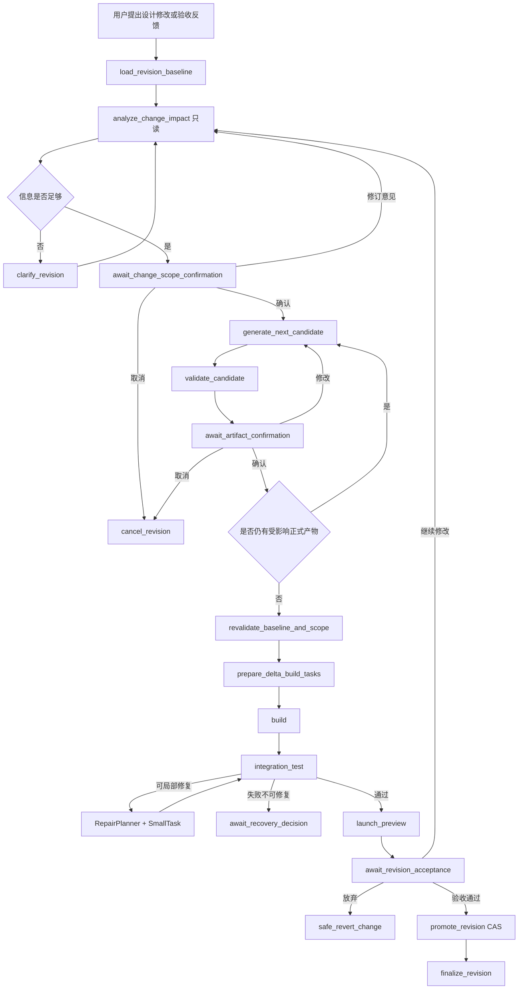
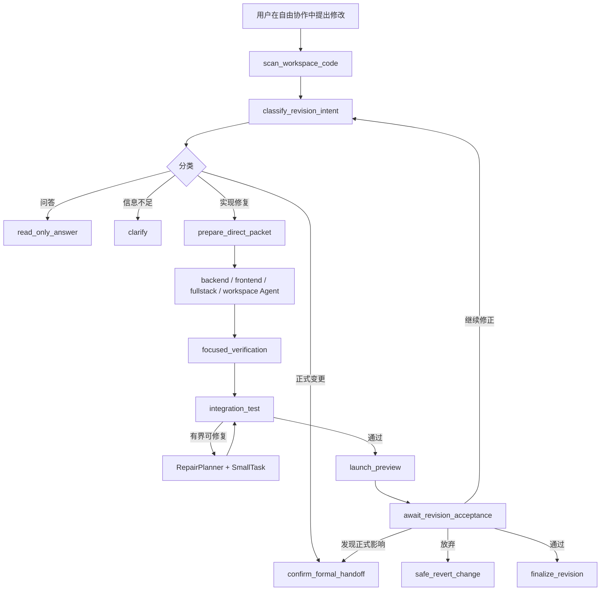

# 应用二次修改产品与 Agent 实施设计

## 0. 文档结论

本文定义应用进入工作台后，对已确认设计或已生成代码再次修改时的统一产品和 Agent 流程。本文中的“二次修改”统一称为 `Application Revision`，一次具体修改称为 `Change`。

最终结论如下：

1. 二次修改不是“从某个旧 Workflow 节点重跑”，而是“基于当前有效版本创建一个有稳定 ID、基线、影响范围、候选产物、执行记录和验收结果的 Change”。
2. 用户只描述想要的结果，不再先选择“局部修复、页面调整、接口调整、数据来源调整、项目计划调整”这类内部枚举。系统先做只读影响分析，再把建议范围交给用户确认。
3. 二次修改必须区分两条执行路径：
   - `implementation_fix`：不改变任何已确认产品或技术语义，只修正现有实现；走有界代码修改、验证、预览和验收。
   - `formal_revision`：会改变 RequirementSpec、ProductPlan、UiDesign、TechnicalPlan、EndpointDetail 或数据库设计；先生成并确认候选正式产物，再执行增量构建、测试、预览和验收。
4. 正式产物的目标依赖链固定为：

   ```text
   RequirementSpec
     -> ProductPlan
     -> UiDesign
     -> TechnicalPlan / PageImplementationContract
     -> EndpointDetail
     -> Build DAG
     -> Code / Test / Acceptance
   ```

5. 新流程不再生成或更新 PageDetail。页面产品语义属于 ProductPlan，真实视觉属于 UiDesign，页面实现绑定属于 TechnicalPlan。历史 PageDetail 不参与新流程。
6. 每个新生成或被修改的正式产物都必须单独等待用户确认；上游候选未确认，下游生成不得开始。澄清答案不等于确认。
7. 已确认候选在最终交付前不覆盖当前有效版本。用户拒绝、取消或生成失败时，当前有效正式产物保持不变。
8. Build DAG 是执行权威。`application.json.menus[].developmentTasks` 只能作为开发路线投影，不能成为第二套执行计划。
9. 所有产品动作继续使用 AG-UI。正式变更复用 `/workflow/run`，快速实现修复继续使用 `/conversation/run`；两条流共享 Change 记录和最终验收语义。
10. `application-lifecycle.json.initialization` 在 `ready_for_workbench` 后永不倒退。二次修改只进入 `activeExecutions` 和独立 Change 记录。

本文是目标实现规范，不以当前旧流程的兼容行为作为目标。实施顺序、文件清单、数据结构、事件契约和验收用例都在后文给出。

---

## 1. 为什么当前流程需要重构

### 1.1 当前实际上存在四种“修改”

当前产品把以下行为混在“二次修改”里：

| 行为 | 真实含义 | 是否应进入正式变更 |
| --- | --- | --- |
| 确认前编辑 | 修改同一个尚未确认的草稿 | 否 |
| 回答澄清 | 补足生成正式产物所需的信息 | 否 |
| 实现修复 | 在既有语义内修 Bug、样式偏差或实现错误 | 否，走 `implementation_fix` |
| 正式变更 | 改变已确认的需求、产品行为、UI、契约、数据或架构 | 是，走 `formal_revision` |
| 技术重试 | 对同一计划、同一输入重试失败步骤 | 否 |
| 测试修复 | 根据确定性失败证据修复实现 | 否，仍属于原 Change |
| 验收反馈 | 用户在预览后提出新的修改结果 | 需要重新分析，可能是实现修复，也可能是正式变更 |

这些行为需要不同的版本、确认和恢复语义。只靠 `resume_from` 把请求送回旧节点，无法表达“基于哪个已确认版本修改、哪些下游已经失效、用户确认的是哪一版候选”。

### 1.2 当前代码中的阻断问题

#### P0：验收“提出修改”无法进入目标节点

当前前端 `useWorkflowConversation.ts::handleAdjustPlan` 会同时提交：

- `page_acceptance = changes_requested`；
- `acceptance_adjustment`；
- `workflowDebug.resumeFrom`。

后端 `Backend/app/protocols/workflow/request.py::workflow_run_inputs` 只要解析到 `acceptance_decision`，就把 `resume_from` 无条件改成 `acceptance`。虽然 `acceptance_adjustment_resume_node` 已导入，但没有参与实际路由。因此真实流程是：

```text
acceptance -> requires_user_input -> END
```

而不是文档宣称的：

```text
local_fix           -> small_task_repair
page/endpoint/data  -> detail_confirmation
project_plan_change -> project_planning
```

#### P0：新四层规划与旧 PageDetail 流程冲突

当前工作区中的创建流程已经演进为：

```text
RequirementSpec -> ProductPlan -> UiDesign -> TechnicalPlan
```

但主 Workflow 仍生成并确认 PageDetail，`page_design_change` 仍被映射到 `detail_confirmation`。这会同时产生两套页面视觉和交互事实：

- UiDesign React 稿；
- PageDetail 文本布局、组件和交互描述。

目标实现必须以 `docs/PRODUCT_UI_TECHNICAL_PLANNING.md` 的新分层为准，停止新增 PageDetail。

#### P1：正式候选会直接污染 canonical 文件

当前候选通常直接写入 `project-plan.*` 等正式路径，只靠 `confirmation_status=pending_user_confirmation` 阻止下游消费。这会导致：

- 旧的已确认版本没有独立保留；
- 取消候选时无法证明当前有效版本是什么；
- 不能可靠展示新旧差异；
- 两个并发运行可能互相覆盖；
- checkpoint、磁盘和前端快照可能分别指向不同内容。

#### P1：缺少统一失效传播

上游变化后，当前没有一个确定性服务统一计算：

```text
ProductPlan 变化
  -> 哪些 UiDesign 失效
  -> 哪些 PageImplementationContract 失效
  -> 哪些 EndpointDetail 失效
  -> 哪些 Build DAG / developmentTasks 失效
```

结果是不同产物可能来自不同版本。

#### P1：用户被迫理解内部路由

当前验收弹窗要求用户先选择五种调整类型。用户通常只知道“哪里不对”和“希望改成什么”，不应该负责判断应该回到哪个 Graph 节点。类型误选还可能把产品语义变化误送到 SmallTask。

#### P2：快速修改缺少用户验收

当前 `/conversation/run` 的修改链路是：

```text
integration_test -> launch_project -> finalize_direct_modification
```

预览启动后直接完成，没有“接受本次修改 / 继续调整 / 放弃本次修改”的最终门禁。

#### P2：自由协作没有发送当前目标

页面或 endpoint 会话切到自由协作时，协议只发送工作区，不发送当前 `pageId` 或 `apiContractId + endpointId`。用户说“这个页面”时，后端只能依靠扫描猜测目标。

---

## 2. 产品定义与边界

### 2.1 Change 的定义

一个 Change 是一次完整、可恢复、可审计的修改单元，至少包含：

- 稳定 `changeId`；
- 发起来源；
- 用户原始目标；
- 页面、endpoint、应用或工作区目标；
- 当前有效产物和代码基线；
- 只读影响分析；
- 用户确认的影响范围；
- 候选正式产物及每一版确认记录；
- 增量任务和实际代码差异；
- 测试、修复、预览和最终验收记录；
- 结束状态和失败原因。

同一个页面会话可以连续产生多个 Change，但每个 Change 必须拥有新的 `changeId` 和 `runId`，不能复用旧运行的 repair counter、审批令牌或候选产物。

### 2.2 两种修改路径

#### 路径 A：实现级修复 `implementation_fix`

只允许处理以下请求：

- 已确认视觉没有被正确实现；
- 已确认交互存在 Bug；
- 现有 API 实现不符合已确认契约；
- 局部样式、文案或状态反馈实现偏差；
- 测试、类型、构建或运行错误；
- 不改变产品语义的性能、可访问性或代码质量修复。

禁止处理：

- 新增或删除业务页面、操作、角色、业务字段；
- 修改 API method/path/request/response schema；
- 修改数据来源或数据库结构；
- 修改已确认的 UI 设计；
- 修改任何 `.xcodeagent` 正式产物；
- 扩大到未确认的页面、endpoint 或共享资源。

#### 路径 B：正式变更 `formal_revision`

满足任一条件就必须进入正式变更：

- 用户想改变应用范围、业务流程或验收标准；
- 改页面结构、视觉、业务信息项、操作或状态；
- 改 API 契约、权限、页面实现绑定；
- 改 endpoint 内部数据来源、事务、副作用或数据库操作；
- 新增或删除页面、endpoint、数据源、角色；
- 需要修改正式产物才能准确描述目标；
- Agent 无法证明修改完全处于现有正式语义内。

安全默认值是“无法证明是实现修复，就先进入只读影响分析”，而不是直接写代码。

### 2.3 产品入口

工作台保留两个用户可理解的输入模式，但不再显示内部调整类型：

| 模式 | 用户预期 | 后端入口 |
| --- | --- | --- |
| 设计修改 | 我想改变已经确认的产品、页面、接口或数据设计 | `/workflow/run`，创建正式 Change |
| 自由协作 | 问问题，或在不改变设计的前提下修正实现 | `/conversation/run`，只读回答、实现修复或正式变更 handoff |

验收页的“提出修改”不要求用户选类型，只显示一个结果输入框。提交后先创建或续接 Change，执行同一套影响分析。

### 2.4 用户界面中的核心对象

#### 修改影响卡

影响分析完成后展示：

- 用户要求的结果；
- 系统判断的最早事实层；
- 当前目标和直接依赖；
- 将修改的正式产物；
- 明确保留不变的正式产物；
- 受影响页面、endpoint、数据源和共享资源；
- 是否涉及数据库写操作或敏感权限；
- 将重新执行的构建和测试范围；
- 风险、假设和需要补充的信息。

用户操作：

- `确认影响范围`；
- `补充或纠正`；
- `取消本次修改`。

#### 正式产物确认卡

每个候选正式产物独立展示：

- 当前有效版本；
- 候选版本；
- Markdown 差异或 UI 预览差异；
- 当前候选依赖的上游版本哈希；
- 系统一致性校验结果；
- `确认当前版本`、`提出修改`、`取消 Change`。

RequirementSpec、ProductPlan、TechnicalPlan 和 EndpointDetail 继续以 Markdown 为用户可编辑产物。JSON 只作为内部结构状态，不展示为可编辑文件。UiDesign 通过真实 React 页面稿预览和结构化变化摘要确认。

#### 执行与验收卡

候选全部确认后，展示：

- 增量 Build DAG；
- 本 Change 实际占用的资源；
- 当前任务、工具活动和进度；
- 真实代码差异；
- 确定性测试和 Test Agent 评审；
- 预览入口；
- `验收通过`、`继续修改`、`放弃本次修改`。

---

## 3. 变更分类与影响规则

### 3.1 用户可理解的变更类型

内部允许以下稳定分类，但它们由系统产生，用户只负责确认或纠正：

| 类型 | 最早权威层 | 典型请求 |
| --- | --- | --- |
| `implementation_fix` | 不改正式产物 | “按钮点击报错”“样式没有按设计稿实现” |
| `ui_visual_change` | UiDesign | “卡片改成双列”“弹窗视觉重新设计” |
| `product_behavior_change` | ProductPlan | “增加批量删除”“新增空状态操作” |
| `technical_contract_change` | TechnicalPlan | “列表接口增加筛选字段”“权限绑定改为管理员” |
| `endpoint_implementation_change` | EndpointDetail | “删除操作改为软删除并记录审计” |
| `data_source_change` | TechnicalPlan + EndpointDetail | “从 mock 改为 MySQL”“新增字段并迁移” |
| `requirement_scope_change` | RequirementSpec | “增加供应商管理模块”“删除整个审批流程” |

### 3.2 确定性升级规则

模型输出只是候选。后端必须在模型分类后执行以下升级规则：

1. 目标路径包含 `.xcodeagent` 正式产物、migration、DDL、schema 时，禁止 `implementation_fix`。
2. 请求出现新增/删除业务实体、页面、操作、角色、字段或流程，并且当前正式产物未声明时，至少升级到相应正式层。
3. API method、path、request、response、错误码或权限变化，至少为 `technical_contract_change`。
4. 数据来源、表、列、约束、事务、副作用变化，至少为 `data_source_change` 或 `endpoint_implementation_change`。
5. 页面视觉和交互目标本身发生变化，进入 `ui_visual_change`，不能进入历史 PageDetail。
6. 置信度低于 0.70、目标不唯一或期望结果存在实质歧义时，先澄清。
7. 用户手动选择“快速修复”或旧客户端发送 `local_fix` 只能作为提示，不能绕过上述规则。

### 3.3 依赖与失效传播

逻辑依赖图如下：

```text
RequirementSpec
  └─ ProductPlan
      ├─ UiDesign(page)
      └─ TechnicalPlan
          ├─ PageImplementationContract(page)
          └─ EndpointDetail(endpoint)

UiDesign(page)
  └─ PageImplementationContract(page)

TechnicalPlan + UiDesign + EndpointDetail
  └─ Build DAG slice
      └─ Code / Test / Preview / Acceptance
```

影响传播必须由确定性 `RevisionImpactService` 计算，不能由模型自由决定：

| 上游变化 | 必须重新生成或确认 | 默认保留 |
| --- | --- | --- |
| RequirementSpec 范围变化 | ProductPlan、受影响 UiDesign、TechnicalPlan、相关 EndpointDetail、DAG | 未受影响且能通过引用校验的页面实现 |
| ProductPlan 页面/操作/角色变化 | 受影响 UiDesign、TechnicalPlan/PIC、相关 EndpointDetail、DAG | 无直接依赖的 endpoint 内部实现 |
| UiDesign 纯视觉变化 | 当前页面 UiDesign、对应 PIC、页面 DAG | API Schema、无关 EndpointDetail |
| TechnicalPlan 页面绑定变化 | 对应 PIC、页面 DAG | 无关 UiDesign、无关 endpoint |
| TechnicalPlan API/Schema 变化 | 相关 EndpointDetail、依赖页面 PIC、DAG | 无关页面 UiDesign |
| EndpointDetail 内部实现变化 | 当前 endpoint DAG、依赖它的集成检查 | RequirementSpec、ProductPlan、UiDesign |
| 数据来源/数据库变化 | TechnicalPlan、相关 EndpointDetail、数据库上下文、DAG | 无关页面和 endpoint |
| 纯实现修复 | 代码任务、测试、预览 | 全部正式产物 |

每个下游产物都保存直接上游的 `artifactKey + sha256`。只有引用的上游哈希发生变化才标记 stale，不能用“整个应用有变化”作为无差别全量重做的理由。

---

## 4. 目标端到端流程

### 4.1 正式二次修改



关键规则：

- `analyze_change_impact` 不写正式产物和业务代码。
- `generate_next_candidate` 每次只生成依赖已确认的一个正式产物或一个可独立确认的切片。
- `await_artifact_confirmation` 返回 END；下一次 AG-UI 请求使用稳定交互 ID 恢复。
- 所有候选确认完成后才能生成 Build DAG。
- Build 和 Test 消费的是本 Change 的已确认候选引用，不读取可能过期的 canonical 文件。
- 最终用户验收通过后才把候选晋升为当前有效正式版本。

### 4.2 实现级快速修改



现有 `/conversation/run` 的扫描、分类、owner 分流、before/after 变更捕获、集成测试和最多三轮修复可以复用。必须补充：

- 当前页面或 endpoint 目标；
- Change 记录；
- preview 后验收节点；
- 安全放弃/撤销；
- 反馈重新分类；
- 正式 handoff 时保留同一个 `changeId` 和原始目标。

### 4.3 验收后的继续修改

验收反馈不是“重试”，而是当前 Change 的新一版用户目标：

1. 保存反馈并增加 `changeRevision`；
2. 基于当前候选和实际代码差异重新执行只读影响分析；
3. 如果仍是实现修复，生成新的 bounded task attempt；
4. 如果触及正式语义，暂停并展示正式变更影响卡；
5. 新正式候选必须重新确认；
6. 修复完成后重新测试、预览和验收。

用户反馈版本、模型网络重试次数、Build task attempt 和 RepairPlanner iteration 必须使用不同计数器。

---

## 5. Graph 状态机设计

### 5.1 新节点

主 `/workflow/run` 增加 revision 子流程节点：

| 节点 | 职责 | 是否调用模型 | 是否允许写业务代码 |
| --- | --- | --- | --- |
| `load_revision_baseline` | 解析当前有效产物、目标、代码指纹和现有 Change | 否 | 否 |
| `analyze_change_impact` | 产生结构化分类和影响候选 | 是，只读 | 否 |
| `await_change_scope_confirmation` | 发布影响卡并等待结构化确认 | 否 | 否 |
| `generate_next_candidate` | 按依赖顺序生成一个正式候选 | 按产物类型 | 只写 Change candidate 目录 |
| `validate_candidate` | schema、引用、哈希和领域一致性校验 | 否；失败可最多回灌模型一次 | 否 |
| `await_artifact_confirmation` | 发布候选差异并等待确认 | 否 | 否 |
| `revalidate_revision_baseline` | 校验 base manifest、资源租约和重叠文件哈希 | 否 | 否 |
| `prepare_delta_build_tasks` | 从候选切片编译增量 Unit Graph 和 Task DAG | 规划模型 + 确定性编译器 | 否 |
| `await_revision_acceptance` | 保存预览、测试和 diff，等待最终验收 | 否 | 否 |
| `promote_revision` | CAS 晋升正式产物版本并重建兼容投影 | 否 | 只写正式产物投影 |
| `cancel_revision` | 取消未执行 Change 或进入安全撤销 | 否 | 条件性撤销本 Change 代码 |
| `finalize_revision` | 持久化交付记录、释放资源并发送提交提醒信号 | 否 | 否 |

现有 `inspect_workspace`、`inspect_database_context`、`build`、`integration_test`、`small_task_repair`、`launch_project` 可以复用，但必须让它们读取 revision-aware build context。

### 5.2 `ProjectState` 新字段

建议在 `Backend/app/graph/state.py` 增加：

```python
change_id: str
change_revision: int
change_source: str
change_request: dict[str, Any]
change_target: dict[str, Any]
revision_baseline: dict[str, Any]
revision_context_ref: str
revision_classification: dict[str, Any]
revision_impact: dict[str, Any]
revision_candidates: list[dict[str, Any]]
revision_confirmations: list[dict[str, Any]]
revision_next_artifact: dict[str, Any]
revision_manifest_candidate: dict[str, Any]
revision_code_baseline: dict[str, Any]
revision_code_change_sets: list[dict[str, Any]]
revision_acceptance: dict[str, Any]
revision_route: str
```

Graph State 只保存小对象、路径、哈希和摘要。候选正文、完整日志、完整 diff、数据库原始结果和 Agent 消息不进入 `ProjectState`。

### 5.3 产品入口动作

新增稳定 `workflowAction`：

```text
start_revision
submit_revision_interaction
retry_failed_tasks
stop_revision
cancel_revision
```

产品请求不得再发送 `workflowDebug.resumeFrom` 决定业务路由。`resume_from` 只保留给明确开启的开发调试面板。后端根据 `changeId + pendingInteraction` 确定性恢复。

### 5.4 旧验收调整兼容

旧类型映射只用于请求适配，不再直接映射 Graph 节点：

| 旧类型 | 新分析提示 |
| --- | --- |
| `local_fix` | 倾向 `implementation_fix`，仍需确定性升级检查 |
| `page_design_change` | 从 `ui_visual_change` 或 `product_behavior_change` 分析，不再进入 PageDetail |
| `endpoint_change` | 从 `technical_contract_change` 或 `endpoint_implementation_change` 分析 |
| `data_source_change` | 从 `data_source_change` 分析 |
| `project_plan_change` | 从 TechnicalPlan 开始分析；若涉及产品语义则继续上溯 |

Phase 0 的临时修复至少要保证：

```text
accepted                         -> acceptance
changes_requested + adjustment  -> analyze_change_impact
```

不能再让 `changes_requested` 覆盖为 `acceptance`。

---

## 6. 持久化与版本模型

### 6.1 目录结构

```text
.xcodeagent/revisions/
├── current.json
├── manifests/
│   └── revision--<revisionId>.json
├── objects/
│   └── <sha256>/
│       ├── artifact.md
│       ├── artifact.json
│       └── source.tsx
└── changes/
    └── change--<changeId>/
        ├── change.json
        ├── context.json
        ├── candidates/
        │   └── <candidateId>/
        │       ├── artifact.md
        │       ├── artifact.json
        │       ├── source.tsx
        │       └── metadata.json
        ├── code-baseline.json
        ├── code-changes.json
        ├── tasks/
        └── reports/
```

`current.json` 是一个很小的原子指针：

```json
{
  "schemaVersion": "revision-current.v1",
  "revisionId": "rev_01...",
  "manifestPath": ".xcodeagent/revisions/manifests/revision--rev_01....json",
  "manifestSha256": "...",
  "updatedAt": "..."
}
```

正式读取方先通过 `current.json` 解析当前有效产物。现有 `.xcodeagent/specs/*`、`.xcodeagent/plans/*` 和 UI 设计路径保留为兼容投影，不再作为版本判断的唯一权威。

### 6.2 RevisionManifest

```json
{
  "schemaVersion": "revision-manifest.v1",
  "revisionId": "rev_01...",
  "parentRevisionId": "rev_00...",
  "createdAt": "...",
  "sourceChangeId": "chg_01...",
  "artifacts": [
    {
      "artifactKey": "ui:order-list",
      "kind": "ui_design",
      "targetId": "order-list",
      "objectPath": ".xcodeagent/revisions/objects/<sha>/source.tsx",
      "sha256": "...",
      "upstreams": [
        {"artifactKey": "product-plan", "sha256": "..."}
      ]
    }
  ],
  "derivedProjections": [
    {
      "path": ".xcodeagent/plans/technical-plan.json",
      "derivedFrom": ["technical-plan"]
    }
  ]
}
```

稳定 `artifactKey`：

```text
requirement-spec
product-plan
ui:<pageId>
technical-plan
page-contract:<pageId>
endpoint:<apiContractId>:<endpointId>
```

### 6.3 ChangeRecord

```json
{
  "schemaVersion": "application-change.v1",
  "changeId": "chg_01...",
  "revision": 7,
  "source": "design_mode",
  "status": "awaiting_artifact_confirmation",
  "threadId": "...",
  "activeRunId": "...",
  "target": {
    "type": "page",
    "pageId": "order-list"
  },
  "request": "订单列表增加批量归档，并重新设计批量操作栏。",
  "baseRevisionId": "rev_00...",
  "baseArtifacts": [
    {"artifactKey": "product-plan", "sha256": "..."}
  ],
  "classification": {
    "type": "product_behavior_change",
    "confidence": 0.94,
    "reason": "新增业务操作，需要先更新产品计划。"
  },
  "affectedResources": ["page:order-list", "endpoint:orders:archive-many"],
  "candidates": [],
  "confirmations": [],
  "invalidatedArtifacts": [],
  "buildRunIds": [],
  "acceptance": {},
  "createdAt": "...",
  "updatedAt": "..."
}
```

`revision` 每次写入单调增加，并通过 `expected_revision` 做 CAS。任何确认提交必须同时校验：

- lifecycle revision；
- pending interaction ID；
- ChangeRecord revision；
- candidate SHA-256；
- 当前 `baseRevisionId`。

### 6.4 候选与晋升

候选生成规则：

1. 写入 Change candidate 目录，不写 canonical 路径；
2. 计算内容哈希和上游引用；
3. 执行 schema 与引用校验；
4. 生成用户可读差异；
5. 用户确认后只标记该 candidate confirmed；
6. 下游可以消费 confirmed candidate，但它仍不是当前有效版本；
7. 最终验收后才执行 promotion。

Promotion 顺序：

1. 校验 `current.json.revisionId == change.baseRevisionId`；
2. 校验所有 candidate、确认记录和上游哈希；
3. 校验受影响资源租约与重叠代码文件哈希；
4. 把已确认候选写入不可变 object 目录并 fsync；
5. 生成完整新 RevisionManifest；
6. 原子写入 manifest；
7. 原子替换 `current.json`，这是正式提交点；
8. 从新 manifest 重建兼容 canonical 投影；
9. 投影失败时记录 recoverable error，读取方仍以 manifest 为准并可重建；
10. Change 标记 `delivered`。

### 6.5 代码基线与安全撤销

不要求用户工作区绝对 clean。每个 Change 只记录授权范围内的代码基线：

```json
{
  "head": "optional git HEAD",
  "dirtyFingerprint": "...",
  "files": [
    {"path": "frontend/src/pages/Orders/index.tsx", "beforeSha256": "..."}
  ]
}
```

Agent 写入后记录 `afterSha256` 和 patch。用户放弃时：

- 只有当前文件哈希仍等于本 Change 的 `afterSha256` 才允许自动恢复 before image；
- 文件被用户或其他运行再次修改时，不自动覆盖，进入冲突处理卡；
- 新文件可在哈希未变化时安全移入可恢复的 Change trash；
- 不执行工作区级 `git reset`、`git checkout --` 或目录级删除；
- 正式候选直接丢弃，不需要改当前 manifest。

未来可以把 `ChangeWorkspace` 替换为 Git worktree 或 copy-on-write overlay，但首版必须先提供上述 per-file CAS 撤销。

---

## 7. Agent 架构

### 7.1 总体原则

外层 Graph 是业务权威，Agent 是受限的候选生成器或任务执行器：

| 决策 | 负责人 |
| --- | --- |
| 当前阶段、下一节点 | 确定性 Graph |
| 正式产物依赖与失效传播 | `RevisionImpactService` |
| 是否已经确认 | lifecycle + ChangeRecord CAS |
| 候选内容建议 | 专业 Revision Agent |
| 任务 DAG | planning model + 确定性 compiler |
| 文件是否真的变化 | before/after workspace capture |
| 测试是否通过 | 确定性 test runner + Test Agent review |
| 是否可以执行敏感操作 | tool permission / HITL |
| 最终是否交付 | 用户结构化验收 |

不新增一个拥有所有工具和全部上下文的“万能 Main Agent”。

### 7.2 Change Analysis

建议实现为“确定性 gather + 结构化只读模型判断”：

输入：

- 用户请求和最多 4000 字符会话摘要；
- 当前 target；
- current revision 中直接相关正式产物的摘要、路径和哈希；
- 有界 WorkspaceSnapshot 和 code graph 导航摘要；
- 当前 scoped dirty diff 摘要；
- 旧客户端的调整类型提示，可选。

输出 Pydantic 模型：

```json
{
  "kind": "implementation_fix | formal_revision | clarification | read_only",
  "revisionType": "ui_visual_change",
  "earliestArtifact": "ui:order-list",
  "owner": "frontend",
  "affectedArtifactKeys": [],
  "affectedResourceKeys": [],
  "candidatePaths": [],
  "assumptions": [],
  "risks": [],
  "questions": [],
  "reason": "...",
  "confidence": 0.9
}
```

模型不能写文件、不能决定跳过确认、不能直接给 Agent 扩权。确定性服务在输出后执行升级和依赖闭包计算。

### 7.3 Product Revision Agent

职责：

- 修改 RequirementSpec 或 ProductPlan 的候选切片；
- 保持稳定 pageId、actionId、角色和未受影响隐藏字段；
- 输出完整候选结构，而不是 patch 文本；
- 不设计 HTTP、数据库或代码文件。

输入只包含当前正式上游、用户反馈、受影响切片和既有候选；不读取仓库源码。

### 7.4 UI Revision Agent

职责：

- 只修改受影响页面的候选 React 稿和 UiManifest；
- 复用当前 ProductPlan 中的业务信息项、actionId、状态和角色；
- 不发明 ProductPlan 不存在的业务操作或字段；
- 支持浅色和深色主题；
- 产出可预览候选，不直接覆盖当前 UiDesign。

单页一个任务上下文。多页变更可以并行生成候选，但每页独立确认；共享设计 token 的变化必须串行并按 application 资源处理。

### 7.5 Technical Revision Agent

职责：

- 修改 TechnicalPlan 候选；
- 编译或修订 PageImplementationContract；
- 维护 API Contract、Schema、权限、响应字段和跳转绑定；
- 记录所依赖 ProductPlan 和 UiDesign 哈希；
- 不重新描述页面视觉。

模型输出必须经过 API `$ref`、endpoint 引用、action binding、response binding、permission binding 和 navigation binding 的确定性校验。

### 7.6 Endpoint Design Agent

职责：

- 只处理单个 endpoint 的数据来源、字段差异、数据库操作、处理逻辑、事务、副作用和异常语义；
- 不静默改变 TechnicalPlan 中已确认的 method/path/schema；
- 契约不足时返回 `technical_plan_revision_required`；
- 数据库事实来自受控数据库上下文，而不是说明文本猜测。

### 7.7 Build、SmallTask 与 RepairPlanner

- 正式变更继续使用 Unit Graph、BuildTaskPlan 和现有 owner Agent。
- `implementation_fix` 最多生成一个 backend task 和一个 frontend task；fullstack 固定 backend -> structured handoff -> frontend。
- SmallTask 禁止修改 `.xcodeagent`、API Contract、migration、DDL 和未授权路径。
- RepairPlanner 始终只读，只消费结构化失败证据并生成任务包。
- Agent 报告的 `completed` 只表示可以进入独立验证，不等于业务成功。
- 真实 changed files 必须由执行前后快照产生，不能相信模型自报。

### 7.8 子 Agent 使用边界

只在以下场景使用子 Agent：

- 大范围只读影响分析；
- 多个互不依赖页面或模块的只读检查；
- 大日志或测试证据分析；
- 专业领域验证。

以下场景不使用：

- 单文件或单 endpoint 小改；
- 正式产物写入和 promotion；
- 需要用户审批的副作用操作；
- 必须观察中间工具过程才能裁决的任务。

子 Agent 只返回有界结构化摘要：

```json
{
  "summary": "...",
  "affectedFiles": [],
  "risks": [],
  "evidenceRefs": [],
  "confidence": 0.9
}
```

快速修改 Agent 应在 harness profile 层禁用 Deep Agents 默认 `general-purpose` 子 Agent，而不仅是在 middleware 中临时隐藏 `task` 工具。

---

## 8. 128k 上下文设计

### 8.1 ContextPack

每次专业 Agent 调用都重新构造最小 `RevisionContextPack`：

```json
{
  "changeId": "chg_...",
  "changeRevision": 7,
  "target": {},
  "request": "...",
  "baseline": {
    "revisionId": "rev_...",
    "workspaceRevision": "...",
    "artifactHashes": {}
  },
  "artifactRefs": [],
  "workspaceSnapshotRef": "...",
  "candidateFiles": [],
  "directDependencies": [],
  "evidenceRefs": []
}
```

源码正文由执行 Agent 按需读取。代码图用于导航，最终判断必须读取实时文件。完整仓库树、其他页面正文、全量 Git diff、完整聊天历史、完整测试日志和数据库原始结果不进入模型上下文。

### 8.2 单任务预算

| 内容 | 目标上限 |
| --- | ---: |
| system prompt、工具 schema、AGENTS memory | 12k tokens |
| 用户目标和正式产物切片 | 16k |
| 当前源码读取 | 24k |
| 测试和工具摘要 | 8k |
| 最近交互和 handoff | 8k |
| 预留给推理、后续工具和输出 | 60k |

活跃输入目标控制在 48k 内，72k 为软上限。达到软上限后停止继续扩展上下文，先把大结果落盘并返回摘要/引用。

### 8.3 Deep Agents 配置风险

当前环境中的 Deep Agents 自动摘要在模型 profile 缺少 `max_input_tokens` 时可能使用高于 128k 的回退阈值。实现时必须：

- 校验模型 profile 的上下文窗口；
- 显式配置不高于 128k 的 summarization threshold；
- 不把自动摘要当成唯一保护；
- 外层 Graph 不保存 Deep Agent 的完整 messages；
- 每个专业任务使用独立短上下文；
- 大工具输出落盘并返回路径、哈希和短摘要。

Checkpoint、workspace 业务事实和长期 memory 必须分离：

- checkpoint：本 thread 的技术恢复状态；
- revision files：Change、正式产物、任务、测试和 diff；
- long-term memory：用户偏好、团队规范和编码风格。

未确认产品决策、当前 Change 状态、测试失败日志、工作区路径和凭据禁止写入长期 memory。

---

## 9. AG-UI 协议设计

### 9.1 请求

正式变更仍使用标准 AG-UI message 和 `/workflow/run`：

```json
{
  "forwardedProps": {
    "workflowAction": "start_revision",
    "changeRequest": {
      "source": "design_mode",
      "target": {
        "type": "page",
        "pageId": "order-list"
      },
      "request": "增加批量归档，并重新设计批量操作栏。"
    }
  }
}
```

提交交互：

```json
{
  "forwardedProps": {
    "workflowAction": "submit_revision_interaction",
    "revisionInteraction": {
      "changeId": "chg_01...",
      "interactionId": "interaction_01...",
      "basedOnLifecycleRevision": 31,
      "basedOnChangeRevision": 7,
      "candidateSha256": "optional",
      "decision": "confirm",
      "feedback": "optional",
      "editedMarkdown": "optional"
    }
  }
}
```

`decision` 只允许：

```text
confirm
revise
reject
cancel
accept
```

快速修改 `/conversation/run` 增加 `conversation.target` 和 `changeId`：

```json
{
  "forwardedProps": {
    "conversation": {
      "workspaceRoot": "...",
      "target": {
        "type": "endpoint",
        "apiContractId": "orders",
        "endpointId": "orders.list"
      },
      "changeId": "optional"
    }
  }
}
```

### 9.2 自定义事件

所有事件必须出现在完整 AG-UI run lifecycle 内：

| 事件 | 最小载荷 | 用途 |
| --- | --- | --- |
| `application-revision` | `changeId, revision, status, target, summary` | 顶层 Change 状态投影 |
| `revision-impact` | `classification, affectedResources, affectedArtifacts, risks` | 影响卡 |
| `revision-artifact` | `candidateId, artifactRef, diffRef, confirmationStatus` | 正式候选确认 |
| `revision-progress` | `phase, currentArtifact, completedCount, totalCount` | 候选生成进度 |
| `revision-conflict` | `kind, expected, actual, resolutionActions` | CAS 或重叠写冲突 |
| `revision-acceptance` | `previewUrl, testSummary, codeChangesRef` | 最终验收 |
| `application-lifecycle` | 既有完整 lifecycle snapshot | 冷启动和输入门禁 |

事件只投影紧凑数据。完整 Markdown、diff 和报告可以通过受控 artifact reference 加载，但用户确认卡所需 Markdown 正文应在对应确认 payload 中直接提供，保持现有正式文档确认体验。

### 9.3 生命周期

`ApplicationLifecycle` 升级 schema，并给 `WorkbenchExecution` 增加可选字段：

```json
{
  "executionKind": "initial_build | revision",
  "changeId": "chg_...",
  "changeRevision": 7,
  "baseRevisionId": "rev_..."
}
```

`PendingInteraction` 的 artifactRefs 必须包含候选路径、revision/hash。提交仍使用当前已有的：

- interaction id；
- lifecycle `basedOnRevision`；
- `submittedAt` 防重放。

同时新增 Change revision 和 candidate hash 校验。

初始化状态保持 `ready_for_workbench`。revision 的 running、awaiting_user、failed、stopped、completed 只出现在 `activeExecutions[runId]`。

### 9.4 Run 完整性

每次 AG-UI action 都必须发送：

```text
RUN_STARTED
-> assistant message start/content/end
-> revision custom event 或 error event
-> STATE_SNAPSHOT
-> RUN_FINISHED
```

未处理异常发送 `RUN_ERROR`，不得再发送 `RUN_FINISHED`。可预期的业务失败使用结构化 revision error/result，仍完成正常 run lifecycle。

---

## 10. 并发、权限与安全

### 10.1 资源与写入冲突

`resourceLocks` 不能继续只作为展示元数据。revision 至少对以下重叠资源执行互斥：

- 同一个 page；
- 同一个 endpoint；
- 同一个 API Contract；
- 同一个 data source；
- application 级菜单、角色、共享 schema 和架构。

无关页面可以并行。真实安全仍由 CAS 保证：

- 正式产物：base revision + artifact hash；
- ChangeRecord：expected change revision；
- 代码文件：before hash / after hash；
- 数据库：plan hash + actual schema hash + statement fingerprint。

外部 IDE 修改了不重叠文件时不阻塞；修改了本 Change 将写入的文件时，执行前停止并展示冲突。

### 10.2 权限分层

产品门禁与工具审批是两种不同机制：

- 产品门禁：影响范围、正式产物、范围扩大、最终验收；由外层 Graph + AG-UI 管理。
- 工具审批：SQL、敏感路径、破坏性命令、外部副作用；由 tool permission / Deep Agents HITL 管理。

Agent Prompt 不是安全边界。文件、shell、数据库和敏感操作必须由工具层 enforce。

### 10.3 数据库变更

- 影响分析只声明可能需要数据库变化，不生成可执行 SQL。
- EndpointDetail 和 database context 确认后编译 Database task。
- 执行前重新读取真实 schema。
- 数据库审批显示结构化操作、目标 schema、风险和回滚说明。
- 已批准操作用 operation key 防重放：

  ```text
  <changeId>:<taskId>:<attempt>:<statementFingerprint>
  ```

- interrupt 恢复从节点开头执行，因此任何非幂等副作用必须在 interrupt 之后，并先检查 operation key。

---

## 11. 恢复、重试与错误处理

### 11.1 稳定 checkpoint 边界

以下阶段必须能恢复：

- baseline/context 已生成；
- 影响分析已生成；
- 等待影响范围确认；
- 每个候选产物已生成；
- 等待候选确认；
- 每个 Build batch 已完成；
- 每轮 integration test 已完成；
- RepairPlanner 计划已生成；
- preview 已启动；
- 等待最终验收。

Checkpoint 身份至少由以下信息隔离：

```text
workspace / workflow-kind / threadId / changeId / runId
```

### 11.2 重试分层

| 类型 | 策略 |
| --- | --- |
| 模型网络错误 | 仅 timeout、429、5xx 自动重试；沿用配置上限 |
| 只读工具瞬时失败 | 相同参数最多自动重试一次 |
| 写文件失败 | 先检查文件哈希和落盘结果，禁止盲目重复 |
| 候选校验失败 | 错误最多回灌同一专业模型一次，仍失败则等待用户 |
| 任务内实现修复 | focused check 前后最多两次有证据修正 |
| 集成测试修复 | RepairPlanner -> SmallTask -> integration test，最多三个真实修复 iteration |
| 正式范围扩大 | 不自动重试，进入用户确认 |
| 用户提出候选修改 | 创建 candidate version n+1，旧确认失效 |
| baseline 冲突 | 停止执行，重新 gather 和 impact analysis |

### 11.3 停止与取消

- `stop`：保留 Change、候选、任务状态和代码差异，可从同一 Change 恢复。
- `cancel`：取消未交付 Change；未写代码时直接丢弃候选，已写代码时进入安全撤销。
- `reject candidate`：不等于取消整个 Change，可以带反馈生成新版本。
- `reject acceptance`：用户选择继续修改或放弃；不能隐式标记 delivered。
- 服务重启：从 ChangeRecord、lifecycle 和 checkpoint 校准，不从前端 localStorage 反推业务状态。

### 11.4 幂等性

- interaction 只能提交一次；
- candidate 由 `changeId + artifactKey + candidateVersion` 标识；
- candidate 内容按 SHA 去重；
- promotion 以 `current.json` CAS 为提交点；
- lifecycle 同义更新不增加 revision；
- 已完成副作用在 replay 时通过 operation key 返回已有结果；
- 事件允许重放，前端按 `changeId + changeRevision` 和 lifecycle revision 合并。

---

## 12. 前端设计

### 12.1 Composer

修改 `ChatComposer`：

- 页面/API 已进入工作台后显示“设计修改 / 自由协作”；
- 设计修改只要求用户描述结果，不展示五类内部调整 Select；
- 自由协作发送当前 target；
- active revision 执行期间，底部输入替换为 revision control dock；
- 等待澄清或确认时只允许对应结构化交互；
- 历史卡片若 interaction 已过期，显示只读状态。

### 12.2 Revision 卡片

建议新增：

```text
Frontend/src/renderer/src/components/AiChatPanel/components/ApplicationRevisionCard/
├── RevisionImpactReview.tsx
├── RevisionArtifactReview.tsx
├── RevisionConflictCard.tsx
├── RevisionAcceptanceCard.tsx
└── ApplicationRevisionCard.less
```

所有卡片必须支持浅色和深色主题，使用现有紫色 token，不引入另一套 UI 框架。

### 12.3 PlanExecutionDock

重构当前 `PlanExecutionDock`：

- 删除用户手选 `WorkflowAcceptanceAdjustmentType`；
- “提出修改”只提交反馈；
- 增加 `正在分析影响`、`等待影响确认`、`等待产物确认`、`存在版本冲突`、`等待修改验收` 模式；
- `继续执行` 使用 change interaction，不发送 debug resume；
- 只有开发调试开关启用时才显示节点级 resume。

### 12.4 前端状态合并

- application lifecycle：按 application ID + 单调 revision 合并；
- revision event：按 changeId + changeRevision 合并；
- 同一页面多个 Change 历史可展示，但只允许当前 active interaction 提交；
- AG-UI 实时状态优先于本地消息历史；
- 冷启动读取只用于校准，不轮询；
- 当前 target 与 session identity 一起持久化，避免“这个页面”丢失上下文。

---

## 13. 后端实施结构

### 13.1 建议新增文件

```text
Backend/app/domain/application_revision.py
Backend/app/services/application_revision.py
Backend/app/services/revision_impact.py
Backend/app/services/revision_artifact_graph.py
Backend/app/services/revision_promotion.py
Backend/app/services/revision_code_baseline.py
Backend/app/workspace/revision_documents.py
Backend/app/graph/nodes/application_revision.py
Backend/app/protocols/workflow/revision.py
```

职责：

| 文件 | 职责 |
| --- | --- |
| `domain/application_revision.py` | Change、baseline、impact、candidate、confirmation、manifest Pydantic 模型 |
| `services/application_revision.py` | ChangeRecord CAS、状态转换和幂等更新 |
| `services/revision_impact.py` | 确定性分类升级、依赖闭包和 stale 传播 |
| `services/revision_artifact_graph.py` | artifactKey、上游引用和生成顺序 |
| `services/revision_promotion.py` | object store、manifest 和 current pointer 原子晋升 |
| `services/revision_code_baseline.py` | scoped file hash、patch、冲突和安全撤销 |
| `workspace/revision_documents.py` | 目录限制、原子读写、正文和 diff 引用 |
| `graph/nodes/application_revision.py` | 薄 Graph 节点和路由状态更新 |
| `protocols/workflow/revision.py` | AG-UI 请求校验、公开投影和事件载荷 |

### 13.2 必须修改的后端文件

| 文件 | 修改 |
| --- | --- |
| `Backend/app/graph/workflow.py` | 接入 revision 子流程；产品路由不再依赖任意 `resume_from` |
| `Backend/app/graph/state.py` | 增加紧凑 revision 字段 |
| `Backend/app/protocols/workflow/request.py` | 解析 changeRequest/revisionInteraction；修复 changes_requested 覆盖路由 P0 |
| `Backend/app/protocols/workflow/lifecycle.py` | 投影 revision execution 和 pending interaction |
| `Backend/app/domain/application_lifecycle.py` | schema 升级和 revision execution 字段 |
| `Backend/app/services/application_lifecycle.py` | Change 交互 CAS、资源互斥和恢复校验 |
| `Backend/app/graph/direct_modification_workflow.py` | 增加最终验收、安全撤销和正式 handoff |
| `Backend/app/graph/nodes/direct_modification.py` | 绑定 changeId/target，不再 preview 后直接完成 |
| `Backend/app/graph/nodes/planning.py` | 停止新 PageDetail；候选写 Change 目录；读取 manifest-aware artifact |
| `Backend/app/graph/nodes/ui_confirmation.py` | 支持 post-workbench 单页候选，不直接覆盖正式 UI |
| `Backend/app/graph/nodes/product_planning.py` | 支持 confirmed baseline -> candidate revision |
| `Backend/app/graph/nodes/tasks.py` | 从 confirmed candidate refs 编译 delta Build DAG |
| `Backend/app/graph/subgraphs/build.py` | 任务携带 changeId、artifact hashes 和 code baseline |
| `Backend/app/graph/subgraphs/testing.py` | 报告绑定 changeId、candidate manifest 和代码指纹 |
| `Backend/app/domain/acceptance_adjustment.py` | 降级为旧协议兼容提示，不再掌握节点映射 |

### 13.3 必须修改的前端文件

| 文件 | 修改 |
| --- | --- |
| `Frontend/src/renderer/src/components/AiChatPanel/hooks/useWorkflowConversation.ts` | 发送 changeRequest/interaction/target，移除产品 debug resume |
| `Frontend/src/renderer/src/components/AiChatPanel/components/PlanExecutionDock/index.tsx` | 删除五类手选，接入 revision 状态 |
| `Frontend/src/renderer/src/components/AiChatPanel/components/ChatComposer/index.tsx` | 新入口文案和 current target |
| `Frontend/src/renderer/src/components/AiChatPanel/conversationMode.ts` | formal handoff 和 revision waiting 状态 |
| `Frontend/src/renderer/src/service/agUiAgent.ts` | revision custom event 和请求字段 |
| `Frontend/src/renderer/src/typings/workflow.ts` | Change、impact、candidate、interaction、manifest 类型 |
| `Frontend/src/renderer/src/typings/application.ts` | lifecycle revision execution 新字段 |
| `Frontend/src/renderer/src/components/AiChatPanel/planExecutionMode.ts` | revision UI 模式和交互活性判断 |
| `Frontend/src/renderer/src/service/chatSessions.ts` | target/changeId 历史归属 |

实施完成时需要同步更新 `docs/CODEBASE_INDEX.md`、`docs/WORKFLOW.md`、`docs/APPLICATION_LIFECYCLE.md` 和完整流程文档。

---

## 14. 分阶段实施计划

### Phase 0：恢复现有验收修改可用性

目标：先修复当前用户点击“提出修改”无效的 P0，不等待完整版本系统。

1. `accepted` 才路由到 `acceptance`。
2. `changes_requested` 携带 adjustment 时进入新的 `analyze_change_impact`；若新节点尚未落地，临时使用经过校验的 legacy mapping。
3. 前端产品请求停止发送 `workflowDebug.resumeFrom`。
4. `/conversation/run` preview 后增加用户验收状态。
5. 自由协作请求发送当前页面/endpoint target。

验收：现有五种旧类型至少都能到达可执行路径，且每条修改完成后必须重新验收。

### Phase 1：ChangeRecord 与影响分析

1. 新增领域模型、ChangeRecord 原子 CAS 持久化。
2. 新增 target-aware baseline/context pack。
3. 新增 Change Analysis structured model 和确定性升级规则。
4. 新增影响确认 AG-UI 事件和前端卡片。
5. lifecycle execution 绑定 changeId/changeRevision。
6. 旧 adjustment 类型转兼容 hint。

验收：任何正式修改在写文件前都先产生可恢复 Change 和影响卡；过期确认被拒绝。

### Phase 2：正式产物候选与版本 manifest

1. 初始化或迁移 current revision manifest。
2. 所有 post-workbench 正式修改写 candidate，不覆盖 canonical。
3. 按 Requirement -> Product -> UI -> Technical -> Endpoint 顺序逐层确认。
4. 新增依赖哈希与 stale 传播。
5. 停止新增 PageDetail。
6. Build Context 能读取 confirmed candidate refs。

验收：取消 Change 后当前有效正式产物字节级不变；上游新版本未确认时下游不运行。

### Phase 3：增量执行、冲突与最终晋升

1. 从影响闭包编译 delta Unit Graph / Build DAG。
2. 资源互斥和 scoped code baseline。
3. build/test/preview/acceptance 全部绑定 Change。
4. 安全撤销和冲突卡。
5. 最终验收后原子 promotion。
6. `developmentTasks` 改为 Build DAG 投影并保存 basedOnArtifacts/stale。

验收：两个无关页面可并行；同一 endpoint 或共享 TechnicalPlan 的冲突运行不会覆盖；最终 current manifest 只在验收后变化。

### Phase 4：清理旧路径

1. 删除产品 UI 中的五类 adjustment Select。
2. 删除 PageDetail 新建、编辑、确认和路由。
3. 删除 product code 对任意 product `resume_from` 的依赖。
4. 清理旧 project-plan 语义，不保留 TechnicalPlan 兼容投影。
5. 清理重复 development planning 权威状态。

---

## 15. 测试与验收标准

### 15.1 后端单元测试

必须覆盖：

- 七类 revision classification 的确定性升级；
- `local_fix` 不能绕过 API/schema/database/formal artifact 规则；
- artifact dependency closure 和 stale 传播；
- ChangeRecord expected revision 冲突；
- candidate hash 和 confirmation 防重放；
- current manifest promotion CAS；
- promotion 中断后的恢复；
- scoped code safe revert 的 before/after hash；
- lifecycle interaction ID + lifecycle revision + change revision 联合校验；
- 旧 acceptance adjustment 映射兼容；
- `changes_requested` 不再路由到 acceptance；
- PageDetail 不再被新运行写入。

### 15.2 Graph/协议测试

每条路径检查完整 AG-UI 生命周期：

1. 正式变更需要澄清；
2. 影响范围确认；
3. ProductPlan -> UiDesign -> TechnicalPlan 多级候选确认；
4. 单 endpoint 内部实现变更；
5. 实现修复直接执行；
6. direct -> formal handoff；
7. Build 失败 -> RepairPlanner -> SmallTask -> Test；
8. preview -> changes requested -> reanalysis；
9. preview -> accepted -> promotion；
10. stop/restart/resume；
11. stale interaction；
12. baseline conflict。

每次 run 必须验证：

- `RUN_STARTED`；
- assistant message lifecycle；
- custom revision result/error；
- `STATE_SNAPSHOT`；
- 成功时 `RUN_FINISHED`，异常时只有 `RUN_ERROR`。

### 15.3 前端测试

- 用户不再需要选择内部修改类型；
- 影响卡能确认、修订和取消；
- Markdown 候选可编辑但保存不等于确认；
- UI 候选有真实预览和浅/深主题；
- 历史 interaction 只读；
- 页面切换不会串用 Change；
- 后台 Change 完成不会抢占当前页面；
- lifecycle 冷读不覆盖更新的实时 revision；
- conflict、failed、stopped、empty、loading 状态完整；
- direct 修改 preview 后不会自动显示 completed。

### 15.4 端到端产品用例

#### 用例 A：纯实现 Bug

用户：“订单列表删除按钮点了没反应。”

预期：`implementation_fix -> frontend task -> test -> preview -> acceptance`，所有正式产物哈希不变。

#### 用例 B：纯视觉变化

用户：“订单卡片改成双列，批量操作固定在顶部。”

预期：UiDesign 候选 -> 对应 PIC 候选 -> delta page build -> test -> preview -> acceptance。不得生成 PageDetail，不改 API Contract。

#### 用例 C：新增产品操作

用户：“订单列表增加批量归档。”

预期：ProductPlan -> UiDesign -> TechnicalPlan/API -> EndpointDetail -> DAG，每个正式候选独立确认。

#### 用例 D：接口内部实现变化

用户：“删除改成软删除，并写审计记录，接口字段不变。”

预期：EndpointDetail -> database context/approval -> endpoint DAG；ProductPlan 和 UiDesign 不变。

#### 用例 E：需求范围变化

用户：“增加供应商管理模块。”

预期：从 RequirementSpec 开始传播，不能直接从 TechnicalPlan 或 Build 开始。

#### 用例 F：验收继续修改

用户在预览后：“批量归档完成后不要跳页，保留当前筛选条件。”

预期：重新影响分析；若 ProductPlan 已定义该行为则为实现修复，否则更新产品/技术候选；修改后重新测试和验收。

#### 用例 G：并发冲突

两个会话同时修改同一 endpoint。

预期：第二个 Change 在资源确认或 baseline revalidation 阶段被阻断，不覆盖第一个 Change；用户可等待或基于新 revision 重新分析。

#### 用例 H：放弃 Change

用户在预览后放弃，期间没有外部编辑。

预期：正式 current manifest 不变；本 Change 代码通过 scoped CAS 安全恢复；Change 标记 cancelled。

### 15.5 完成定义

满足以下条件才可认为二次修改实现完成：

- 用户只描述结果，不需要理解 Graph 节点或旧五类枚举；
- 所有正式修改都有 changeId、base revision、候选、确认和影响闭包；
- 任何正式候选修订后都重新确认；
- 上游未确认时没有下游生成或代码执行；
- 实现修复不能改正式产物或数据库结构；
- 测试通过不等于完成，必须用户验收；
- 拒绝、停止、重启和冲突都可恢复且不会静默覆盖；
- current revision 只在最终验收后通过 CAS 晋升；
- 前后端全部使用 AG-UI；
- 浅色和深色主题均经过验证；
- Build DAG 是唯一执行权威。

---

## 16. 参考架构映射

### 16.1 learn-coding-agent

采用：

- 收集上下文 -> 行动 -> 验证的紧凑循环；
- 工具执行前输入验证和权限检查；
- 追加式会话记录和可恢复运行；
- 大任务使用独立上下文，按需加载知识；
- 旧历史压缩、最近交互保真；
- 任务图和执行结果持久化到磁盘。

来源：

- [核心循环与查询生命周期](https://github.com/YYYWYF/learn-coding-agent/blob/ce8ca4a8e7224817f46e5db08973b4022bd1eb0a/README.md#L95-L115)
- [工具与权限](https://github.com/YYYWYF/learn-coding-agent/blob/ce8ca4a8e7224817f46e5db08973b4022bd1eb0a/README.md#L369-L474)
- [子 Agent 与上下文隔离](https://github.com/YYYWYF/learn-coding-agent/blob/ce8ca4a8e7224817f46e5db08973b4022bd1eb0a/README.md#L478-L515)
- [上下文压缩](https://github.com/YYYWYF/learn-coding-agent/blob/ce8ca4a8e7224817f46e5db08973b4022bd1eb0a/README.md#L519-L558)
- [会话持久化](https://github.com/YYYWYF/learn-coding-agent/blob/ce8ca4a8e7224817f46e5db08973b4022bd1eb0a/README.md#L620-L645)

该仓库当前公开内容主要是研究文档，不应声称直接复用了不存在的源码模块。XCodeAgent 的 artifact manifest、Change CAS 和 promotion 是自己的确定性业务实现。

### 16.2 OpenCode

采用：

- plan 与 build Agent 的权限分离；
- session、message、question、permission 使用稳定 ID；
- busy/idle 运行状态与持久业务事实分离；
- permission ask/reply 与 ordinary question 分离；
- snapshot + patch 支持局部 revert/unrevert；
- 上下文压缩保留近期 turn、裁剪旧工具结果；
- 子 Agent 独立权限和上下文。

来源：

- [内置 build/plan Agent 边界](https://github.com/anomalyco/opencode#agents)
- [Session 持久模型与 fork](https://github.com/anomalyco/opencode/blob/dev/packages/opencode/src/session/session.ts)
- [Session revert 与 snapshot patch](https://github.com/anomalyco/opencode/blob/dev/packages/opencode/src/session/revert.ts)
- [Question 稳定请求和 reply/reject](https://github.com/anomalyco/opencode/blob/dev/packages/opencode/src/question/index.ts)
- [Permission ask/reply 与 once/always/reject](https://github.com/anomalyco/opencode/blob/dev/packages/opencode/src/permission/index.ts)
- [Session compaction](https://github.com/anomalyco/opencode/blob/dev/packages/opencode/src/session/compaction.ts)

XCodeAgent 不直接照搬 message-level revert 作为正式产品版本。代码撤销使用 scoped snapshot，而正式产物使用候选、确认和 manifest promotion，因为业务产物的依赖与确认语义比普通会话 patch 更严格。

### 16.3 Deep Agents / LangGraph

采用：

- LangGraph 负责 durable execution、checkpoint、stream 和 interrupt；
- Deep Agents 负责 planning、filesystem、skills、memory、subagent context isolation；
- 大工具结果落盘并只返回引用；
- 子 Agent 隔离高容量探索；
- tool permission 和 HITL 保护敏感操作；
- 同一 thread ID 恢复 interrupt；
- checkpoint 与长期 memory 分离。

来源：

- [Deep Agents Overview](https://docs.langchain.com/oss/python/deepagents/overview)
- [Context Engineering](https://docs.langchain.com/oss/python/deepagents/context-engineering)
- [Subagents](https://docs.langchain.com/oss/python/deepagents/subagents)
- [Human-in-the-loop](https://docs.langchain.com/oss/python/deepagents/human-in-the-loop)
- [Memory](https://docs.langchain.com/oss/python/deepagents/memory)

XCodeAgent 的有意差异：

- 产品确认和正式产物依赖由外层确定性 Graph 管理，不交给通用 Agent todo；
- 正式产物保存在 revision object/manifest 中，Agent 文件系统只是候选工作区；
- 子 Agent 不参与 promotion 和用户确认；
- 128k 是硬设计预算，不能依赖框架默认压缩阈值；
- AG-UI 是所有产品动作的统一前后端协议。

---

## 17. 最终产品流程摘要

用户看到的流程应当足够简单：

```text
提出想要的修改
-> 系统分析会影响什么
-> 用户确认影响范围
-> 逐个确认真正发生变化的设计/契约
-> 系统只实现受影响部分
-> 自动测试与修复
-> 用户预览验收
-> 形成一个可追溯的新版本
```

Agent 内部的流程应当足够严格：

```text
baseline
-> bounded context
-> structured impact
-> deterministic closure
-> HITL gates
-> candidate artifacts
-> CAS
-> delta DAG
-> scoped agents
-> independent verification
-> preview acceptance
-> atomic revision promotion
```

这套边界既能处理一个按钮 Bug，也能处理新增页面、修改接口或切换数据库；复杂度来自真实影响范围，而不是来自用户要理解多少内部节点。
