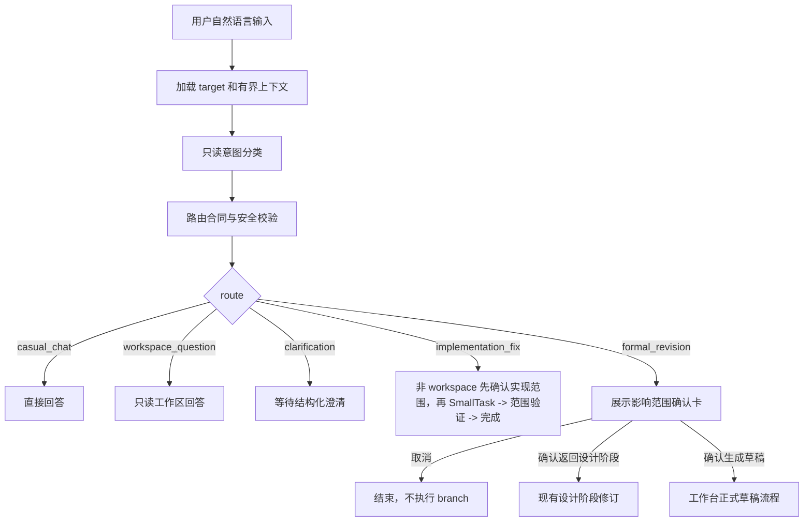
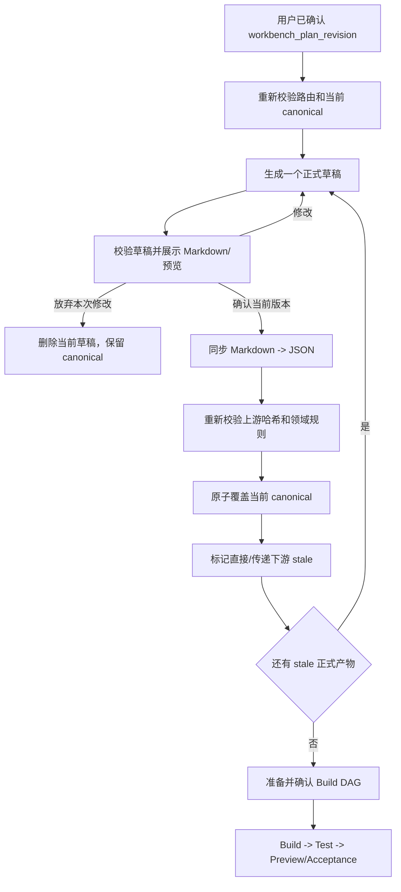
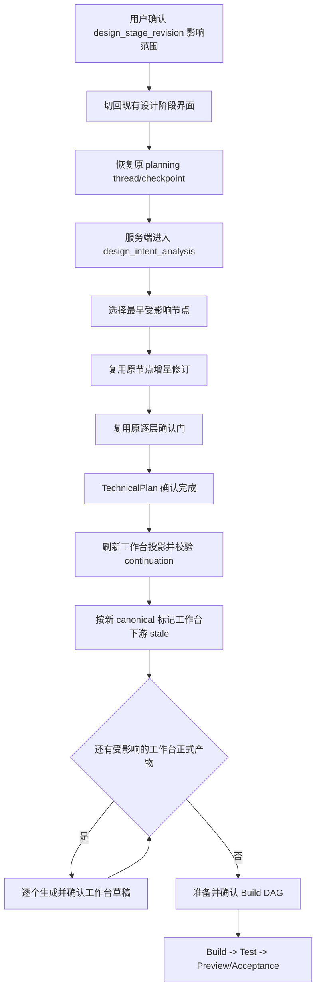

# 应用二次修改与统一路由实施设计

## 0. 文档结论

本文定义应用进入工作台后的二次修改流程。最终方案保持简单：

1. 用户在工作台通过统一对话入口描述问题、代码修改或正式计划修改，不需要选择内部 Workflow 节点。
2. `Workbench Conversation Coordinator` 负责只读分类和确定性路由，但它不是拥有全部工具的万能 Agent。
3. 不改变已确认产品或技术语义的修改走 `implementation_fix`；普通工作区文件可由现有 SmallTask 路径直接修改，前端/后端代码修改必须先弹出实现范围确认，再由 SmallTask 修改、验证并完成。
4. 改变正式产品/技术语义的请求走 `formal_revision`，再确定是 `design_stage_revision` 还是 `workbench_plan_revision`。
5. 改变 RequirementSpec 或 ProductPlan 语义的请求走 `design_stage_revision`：用户确认影响范围后返回现有设计阶段，复用原 `application_planning_workflow`、原 thread/checkpoint、最早节点路由和逐层确认逻辑；既有页面的 UI 小改动不走该分支。
6. 不需要重跑需求、产品或 UI 的 TechnicalPlan、API 契约或数据约束修改走 `workbench_plan_revision`：用户确认影响范围后创建独立规划阶段会话，并通过原 planning checkpoint 的 `technical_planning` 节点重新生成 `technical-plan.json`。
7. 工作台草稿和当前已确认 canonical 产物隔离。用户放弃时只删除当前草稿，canonical 产物不变。
8. 用户确认工作台草稿后，服务端先同步 Markdown 编辑到内部 JSON，再校验并原子覆盖 canonical；从这一刻起，新产物就是唯一正确版本。
9. 不引入 RevisionManifest、历史版本仓库、promotion、正式产物回滚或 Change 级代码自动撤销。
10. TechnicalPlan 草稿记录直接上游 canonical 的 SHA-256；确认和 Build 前都会拒绝上游哈希已经变化的草稿或正式产物。
11. Build 只消费 `confirmation_status=confirmed` 且直接上游哈希匹配的当前 TechnicalPlan。
12. `ready_for_workbench` 后仍保留原设计规划 thread 引用；只有用户确认 RequirementSpec/ProductPlan 语义变化的 `design_stage_revision` 影响范围后，才允许受控返回现有设计阶段。既有页面 UI 小改动直接走当前前端实现修复。
13. branch 只决定正式修改从哪里开始，不决定修改是否落实到代码。两个 formal branch 在全部受影响正式产物确认且非 stale 后，都必须切回开发阶段，汇合到工作区扫描、Build DAG 确认、Build、Test、Preview 和 Acceptance；用户不需要再次描述或手动发起开发。
14. 所有产品动作继续使用 AG-UI；不增加普通 REST、手写 SSE 或前端拼装 Graph State。

这是 current-contract-only 设计：不读取历史形状、不迁移、不双写、不保留旧 adjustment 类型或 PageDetail 路由。

---

## 1. 现有能力与缺口

### 1.1 已经具备的能力

当前仓库已有以下基础，实施时直接复用：

- `design_intent_analysis` 已能在原 planning Graph/thread/checkpoint 中选择最早受影响的 RequirementSpec、ProductPlan 或 UiDesign 节点，并重新经过后续确认门；这套稳定逻辑直接作为 `design_stage_revision` 的执行基础。
- 当前正式规划链是 RequirementSpec -> ProductPlan -> UiDesign -> TechnicalPlan，PageDetail 不再是当前权威。
- `/conversation/run` 已有工作区扫描、闲聊、只读问答、frontend/backend/fullstack/workspace owner 分流。
- SmallTask 已有精确路径限制、真实 before/after diff、集成测试和 RepairPlanner 有界修复。
- page/endpoint target 已进入自由协作协议和分类上下文。
- 主 Workflow 已有 TechnicalPlan、Build DAG 确认、Build、Test、Preview 和 Acceptance 能力。

### 1.2 当前实现边界

当前合同已经接入统一五类路由、两条 formal branch、原 planning thread 保留、独立可见 revision 会话、隔离草稿、直接上游哈希校验、一次性 formal continuation、SmallTask 动态重新路由和自然语言验收反馈。Build 前置门禁会从工作区重读当前正式产物，并拒绝未确认或 `basedOn` 不匹配的 TechnicalPlan。最终 Acceptance 通过后释放 active formal revision，停止、失败和继续执行同步其生命周期状态。

本次不解决历史版本浏览、正式计划回滚、多分支 candidate promotion、Change 级 Git 撤销或多个正式修订并行写入。

---

## 2. 核心产品语义

### 2.1 三条修改路径

#### 实现级修复 `implementation_fix`

适用于：

- 已确认视觉没有正确实现；
- 已确认交互存在 Bug；
- 现有 API 实现不符合已确认契约；
- 局部样式、文案、状态反馈、类型、构建或测试错误；
- 普通仓库文档、测试、脚本和配置的小范围修改；
- 不改变正式产品或技术语义的性能、可访问性和代码质量修复。

SmallTask 禁止通过该路径：

- 修改 `.xcodeagent` 正式产物；
- 新增或删除页面、endpoint、角色、业务字段、业务操作或数据源；
- 修改 API method/path/request/response/error/permission；
- 修改 schema、DDL、migration、数据库结构、事务或副作用语义；
- 改变已确认的 UI 目标或产品验收标准。

无法证明属于既有正式语义时，必须升级为 `formal_revision`。

#### 返回设计阶段 `design_stage_revision`

满足任一条件时，`formal_revision` 选择该 branch：

- 改应用范围、角色、模块、页面清单、业务流程或业务验收；
- 改页面产品行为、操作、信息项、状态或跳转；
- 用户明确要求回到需求、产品或设计阶段继续修改；
- 修改必须从 RequirementSpec、ProductPlan 或现有设计阶段开始才语义完整。

用户确认影响范围后，前端返回现有设计阶段界面，后端复用当前稳定逻辑：

```text
原 application_planning_workflow
-> 原 planning thread/checkpoint
-> design_intent_analysis
-> 最早受影响节点
-> 原节点增量修订
-> 原逐层确认门
-> TechnicalPlan 确认
-> 受控进入共同执行 continuation
-> 补齐受影响的工作台正式产物
-> Build DAG 确认
-> Build / Test / Preview / Acceptance
```

这里的“返回现有设计阶段”同时包含两个不同层面的身份，二者不能混用：

- 前端为二次修改的 DESIGN、PLAN、DEVELOPMENT 三个业务阶段分别创建独立 StageSession 和独立 conversation thread；同一轮通过 `workflowId + changeId + revisionContext` 保持 lineage，不复制聊天上下文，也不复用跨阶段 thread。
- 后端不创建第二个设计 Graph，仍以 lifecycle 中的原 `planningThreadId` 恢复原 `application_planning_workflow` checkpoint；新的 conversation thread 只承接前端消息展示和流式投影，不作为 Graph 恢复依据。
- 二次修改 session 持久化绑定 `impactInteractionId + sourceSessionId + sourceConversationThreadId + sourceRunId + planningThreadId + changeId`。其中 `changeId` 由审批后的 lifecycle 补齐，冷恢复必须按完整身份匹配，不能按标题猜测或退回原可见规划会话。
- 发起二次修改的来源会话保留一条交接回执，记录目标 session/thread 和原始请求，并提供“打开二次修改会话”入口；交接回执不是新的审批，也不改变原 checkpoint 的权威性。
- DESIGN 确认进入 PLAN 时同样在 DESIGN 来源会话写入可点击交接回执；阶段启动失败时先撤销回执，再删除尚未成功进入的预创建 StageSession，并保留来源会话供用户重试。若回执撤销无法落盘，则保留其目标 StageSession，不能制造悬空跳转。
- TechnicalPlan 确认后再创建一个新的、用户可见的二次修改开发会话；该会话使用新的 AG-UI conversation thread，但通过同一个 `changeId`、TechnicalPlan 哈希和来源需求设计会话与 revision lineage 绑定。
- “进入开发”是显式且幂等的 handoff：重复触发同一 `workflowId + changeId + technicalPlanSha256 + 来源 PLAN session/thread` 时复用已持久化的开发会话；只有开发 Workflow 成功接管 continuation 后才切换到开发阶段并写入来源回执。创建或启动失败时保留在 PLAN 会话，清理未成功进入且没有成功回执指向的预创建 DEVELOPMENT StageSession，并允许重试。

该 branch 不新建第二套设计 Graph，不复制设计节点，不改变 UiDesign 当前内部增量/重建策略。

两个 branch 只是不同入口：`design_stage_revision` 先回原设计 Graph，`workbench_plan_revision` 创建独立规划阶段会话并恢复原 `technical_planning` 节点，不重跑 RequirementSpec、ProductPlan 或 UiDesign；二者最终都汇合到同一个代码执行阶段。

#### 工作台正式修改 `workbench_plan_revision`

满足任一条件即进入正式修改：

- 改 TechnicalPlan、PageImplementationContract、API Contract 或权限绑定；
- 改接口的数据来源、事务、副作用、数据库操作或异常语义；
- 改数据库正式设计，但不需要重新进入需求/产品/设计阶段；
- 需要修改工作台正式 Markdown 才能准确描述用户目标。

### 2.2 正式修改确认

`formal_revision` 在执行 branch 前先展示一次只读确认卡：

- 用户可见内容只展示分类 JSON 的 `reason`，不再调用第二个模型生成或展示影响范围证据；
- `design_stage_revision` 显示“确认并返回设计阶段”；`workbench_plan_revision` 显示“确认并进入规划阶段”；
- 确认前不进入设计 Graph、不创建草稿、不修改 canonical、不获取 formal revision planning lease；
- 用户确认后才进入对应 branch；
- 用户取消时结束本次请求，当前 canonical 完全不变。

正式修改确认只决定是否进入对应 branch，不代替设计阶段原确认门或工作台草稿确认。

### 2.3 草稿、确认与放弃

本节适用于所有进入工作台正式产物确认的流程：包括直接进入 `workbench_plan_revision`，以及 `design_stage_revision` 完成 TechnicalPlan 后的共同 continuation。设计阶段原产物仍使用原 Graph 的 pending artifact，不改为这里的隔离草稿。

每个工作台正式产物同时最多存在：

```text
一个当前已确认 canonical
+
一个当前 revision 草稿
```

规则如下：

1. 生成草稿时不覆盖 canonical Markdown、JSON 或 React source。
2. 草稿必须记录生成时依赖的 canonical 直接上游哈希。
3. 用户可以编辑草稿 Markdown；`save` 只更新草稿 Markdown，不等于确认。
4. 用户点击“确认当前版本”时，服务端重新读取最新草稿 Markdown，将可编辑内容同步到内部 JSON 并保留隐藏结构。
5. schema、引用、上游哈希和领域规则全部通过后，原子覆盖当前 canonical 文件。
6. 覆盖成功后删除本草稿；新 canonical 立即成为唯一正确版本。
7. 用户点击“放弃本次修改”时，只删除当前未确认草稿；canonical 完全不变。

不提供“确认后再晋升”。确认本身就是正式提交点。

### 2.4 正式修改的交互含义

`workbench_plan_revision` 当前只生成一个正式 TechnicalPlan 草稿：

```text
TechnicalPlan 草稿 -> 确认并成为 canonical -> Build DAG
```

“放弃本次修改”只作用于尚未确认的 TechnicalPlan 草稿；放弃后全部现有正式产物不变。TechnicalPlan 一旦确认，不提供“放弃整个修改并恢复上一版”；用户若认为已确认内容不正确，应基于当前 canonical 再提交修改并生成新草稿。

前端在按钮附近明确说明“只删除当前草稿，已确认计划不受影响”，不提供恢复上一版或整体回滚入口。

### 2.5 代码修改语义

代码不是正式计划草稿：

- `implementation_fix` 的 workspace owner 可直接写入精确授权的普通工作区文件；frontend/backend/fullstack owner 必须先通过 `implementation_fix_confirmation`，再写入代码并执行独立验证。用户取消确认时以正常完成终态结束且不展示异常卡；独立验证通过后直接完成当前小修改，不启动项目预览，也不进入正式验收。
- formal revision 不以“计划已修改”为终点。所有受影响正式产物确认且非 stale 后，必须生成并确认 Build DAG，再进入代码修改、测试、预览和验收。
- 设计 branch 完成原 TechnicalPlan 确认后，由系统自动继续同一次 revision；用户不需要回到工作台重新输入需求或再次确认影响范围。
- Build/Test 后的用户反馈重新进入统一路由，形成下一次向前修正；不自动恢复代码或已确认正式产物。
- 数据库操作继续使用现有结构化审批和受控工具，不承诺通用自动回滚。

---

## 3. 统一路由设计

### 3.1 Coordinator 路由结果

工作台自然语言输入收敛为五种稳定结果：

```text
casual_chat
workspace_question
clarification
implementation_fix
formal_revision
```

| 路由 | 执行者 | 是否允许写入 |
| --- | --- | --- |
| `casual_chat` | tool-less ChatModel | 否 |
| `workspace_question` | 只读 WorkspaceAssistant | 否 |
| `clarification` | AG-UI 结构化澄清门 | 否 |
| `implementation_fix` | frontend/backend/workspace SmallTask wrapper | workspace 普通文件可直接写入；frontend/backend/fullstack 需先确认实现范围 |
| `formal_revision` | Coordinator 再选择 branch | 先确认只读影响范围，再进入设计阶段或工作台草稿流程 |

模型只能输出结构化分类候选，不能输出任意 Graph 节点名或直接获得写权限。

### 3.2 正式修改最早节点

正式分类还需输出 `formalBranch` 和最早受影响事实层：

| revisionType | formalBranch | 最早权威产物 | 示例 |
| --- | --- | --- | --- |
| `requirement_scope_change` | `design_stage_revision` | RequirementSpec | 增加供应商管理模块 |
| `product_behavior_change` | `design_stage_revision` | ProductPlan | 增加批量归档操作 |
| 既有页面 UI-only 小改动 | `implementation_fix` | 当前前端源码 | 卡片改为双列布局 |
| `technical_contract_change` | `workbench_plan_revision` | TechnicalPlan | 列表接口增加筛选字段 |
| `endpoint_implementation_change` | `workbench_plan_revision` | TechnicalPlan | 删除改为软删除并记录审计 |
| `data_source_change` | `workbench_plan_revision` | TechnicalPlan | mock 改为 MySQL |

一条请求跨越多层时选择最早层；只有需求或产品语义变化才选择 `design_stage_revision`。既有页面的视觉、布局、间距、文案、响应式和交互微调均视为当前 `implementation_fix/frontend`，立即在工作台执行，不创建 UI 设计阶段修订。

### 3.3 分类优先级与安全校验

Coordinator 先由模型按语义分类，再由服务端执行不依赖自然语言关键词的合同和安全校验：

1. 新增、删除、移除、下线或重命名页面、实体、角色、模块、操作或业务流程，属于 `formal_revision`；口语表达与正式表达等价。
2. API method、path、request、response、错误码、权限、数据来源、表、列、约束、事务或副作用变化，按模型输出进入对应 formal branch。
3. 既有页面的视觉、布局、间距、文案、响应式和交互微调属于 `implementation_fix/frontend`；只有新增页面/模块或改变业务行为、验收规则等产品语义时才进入 `formal_revision`。
4. 目标不唯一、期望结果存在实质歧义或置信度低于 0.70 时先澄清，不能猜测代码路径。
5. 请求或候选路径涉及 `.xcodeagent` 正式产物时，服务端禁止 `implementation_fix`。
6. 服务端校验 route、branch、revisionType、earliestArtifact、owner 和候选范围字段；只纠正不安全或不一致的结构，不重新解释用户自然语言，也不追加模型证据分析。
7. `implementation_fix` 的 frontend/backend/fullstack owner 必须先通过 `implementation_fix_confirmation`；workspace owner 的普通文件修改可以直接执行。

### 3.4 上下文输入

Coordinator 分类只读取有界上下文：

- 用户当前请求和最多 4000 字符会话摘要；
- 当前 application/page/endpoint target；
- 直接相关 canonical 正式产物摘要、路径和 SHA-256；
- 有界 WorkspaceSnapshot 和 code graph 导航摘要；
- 当前 scoped dirty diff 摘要；
- 当前页面/API 目标与会话上下文；普通自然语言由 Coordinator 自动分类。

输出示例：

```json
{
  "route": "formal_revision",
  "formalBranch": "design_stage_revision",
  "revisionType": "product_behavior_change",
  "earliestArtifact": "product-plan",
  "owner": "frontend",
  "affectedArtifactKeys": ["product-plan", "ui:order-list", "technical-plan"],
  "affectedResourceKeys": ["page:order-list"],
  "candidatePaths": [],
  "questions": [],
  "reason": "新增已确认计划中不存在的产品操作。",
  "confidence": 0.94
}
```

---

## 4. 下游失效传播

`design_stage_revision` 不在原设计 Graph 内新增一套 stale 传播器：它复用现有 planning Graph 的顺序边和每层确认门，从最早设计节点重新走到 TechnicalPlan。TechnicalPlan 确认后的共同 continuation 与 `workbench_plan_revision` 一样，使用 `ArtifactInvalidationService` 处理工作台下游和后续 Build 门禁。

### 4.1 依赖图

```text
RequirementSpec
  -> ProductPlan
      -> UiDesign(page)
      -> TechnicalPlan
          -> PageImplementationContract(page)

UiDesign(page)
  -> PageImplementationContract(page)

confirmed formal artifacts
  -> Build DAG
  -> Code / Test / Preview / Acceptance
```

### 4.2 基于直接上游哈希的 stale 判断

每个下游内部 JSON 保存直接上游引用：

```json
{
  "confirmation_status": "confirmed",
  "basedOn": [
    {"artifactKey": "product-plan", "sha256": "..."}
  ]
}
```

上游草稿生成、编辑或放弃时不影响 Build。只有上游确认并覆盖 canonical 后才执行：

1. 重新计算上游 canonical SHA-256；
2. 重新编译 TechnicalPlan 内的 PageImplementationContract；
3. Build 前重新校验 TechnicalPlan 的 `basedOn`；
4. 哈希不匹配时拒绝继续并要求重新生成 TechnicalPlan 草稿。

### 4.3 传播规则

| 已确认变化 | 标记 stale/重新确认 | 默认保持 confirmed |
| --- | --- | --- |
| TechnicalPlan 页面绑定 | 对应 PIC | 无关页面 |
| TechnicalPlan API/Schema | 对应接口 Build scope、依赖页面 PIC | 无关页面 |

当前 PageImplementationContract 不是独立可编辑 canonical：它由已确认 TechnicalPlan、ProductPlan 与 UiManifest 确定性编译，并在 TechnicalPlan 草稿确认时通过同一领域校验和用户确认门。TechnicalPlan 变化会重新编译受影响 PIC；Build 再从当前正式产物编译并校验，不创建第二份 PIC 草稿、历史版本或双写文件。接口实现语义属于 TechnicalPlan，不再生成独立 EndpointDetail 正式产物。
| 纯实现修复 | 不标记任何正式产物 stale | 全部正式产物 |

`ArtifactInvalidationService` 负责闭包计算和状态写入，模型不能自由决定保留哪些已失效产物。

---

## 5. 端到端流程

### 5.1 工作台统一输入



`implementation_fix` 不复用正式 Workflow 的完整 `integration_test`。代码写入后由 `validate_direct_fix` 读取本轮真实 diff，只执行受影响的 frontend/backend 构建与对应测试；同层失败只有在证据命中真实变更文件，或本轮修改了 package、tsconfig、pom 等工程级配置时才阻断，无法归因的既有失败只作为 advisory。验证失败后的自动修复仍限制在这些真实文件内。缺少或仅有占位文件路径时直接停止并展示失败证据，不能据此推断正式语义变化；只有 RepairPlanner 显式输出 `formal_revision` 才展示正式修改确认。

### 5.2 工作台正式草稿流程



关键规则：

- 每次只生成一个草稿，避免用户同时面对多层未确认内容。
- 任何正式草稿确认后立即 canonical，不等待 Build 或最终 Acceptance。
- 放弃草稿不会启动下游，也不会改变 canonical。
- 已确认上游导致下游 stale 后，Build 必须等待下游重新确认。
- Build/Acceptance 的继续修改重新进入统一路由，不恢复旧节点名。

### 5.3 返回现有设计阶段



该 branch 直接参考并复用当前稳定设计节点二次修改逻辑：

- 使用原 `application_planning_workflow`，不创建 `Application Revision Graph` 的设计节点副本；
- 使用原 planning thread/checkpoint，并继续以服务端 checkpoint 为权威；
- 使用现有 `design_intent_analysis`、`earliest_available_design_target` 和 generation cursor；
- 使用现有 `gateId + artifactRevision + artifact`、原生 interrupt、同 thread 恢复锁和逐层确认门；
- RequirementSpec/ProductPlan/设计阶段修改完成后，继续沿原 Graph 生成并确认下游直到 TechnicalPlan；
- 本次不修改 UiDesign 的 `adjust_pages`、整页重建、生成池或确认实现；
- TechnicalPlan 确认不是终点。服务端保留原始请求、target、changeId 和已确认影响范围，随后自动进入共同执行 continuation；
- continuation 重新投影新 TechnicalPlan 和确定性编译的 PIC，不把 RequirementSpec、ProductPlan 或设计节点复制进 revision Graph；
- 全部受影响产物 confirmed 且非 stale 后，进入 Build DAG 确认并落实代码。

### 5.4 自由协作正式 handoff

`/conversation/run` 高置信识别到 `formal_revision` 时，返回带 `formalBranch` 的 `revision_impact_confirmation` 结构化交互。前端只展示分类 JSON 的 `reason` 和确认动作，用户确认后按 branch handoff：

- `design_stage_revision`：调用 `/application-page-planning/run` 的受控 `start_design_revision`，随后切回现有设计阶段界面；
- `workbench_plan_revision`：先创建新的用户可见规划会话，再由该会话调用 `/application-page-planning/run` 的 `start_technical_revision`；服务端恢复原 planning checkpoint 的 `technical_planning` 节点，重新生成 `technical-plan.json`。

低置信或目标有实质歧义时先进入 `clarification`，不展示不可靠的影响范围。

- 原始请求必须原样保留；
- page/endpoint target 必须保留；
- 确认卡只展示服务端 `reason`，前端不自行推导或展示影响范围证据；
- 取消确认只结束当前 conversation handoff，不进入设计阶段也不创建 formal revision；
- 设计 branch 使用新的 `runId` 恢复原 planning thread；工作台 branch 使用新的规划会话 thread/run 生成草稿，并在确认后转交新的开发 run；
- 两个 branch 从影响范围 approved 开始共享同一个 `changeId`、原始请求和 target，直到 Acceptance 完成；Graph 切换不能丢失这些字段；
- 前端不回传 WorkspaceSnapshot、模型 messages 或 Graph State；
- branch 接收端重新执行确定性分类和安全升级校验，不能直接信任模型输出。

### 5.5 创建规划期、设计返回与工作台期

- 初始化尚未进入 `ready_for_workbench`：继续使用 `application_planning_workflow` 原 thread/checkpoint 的 `design_intent_analysis`。
- 进入 `ready_for_workbench` 时不再删除原 planning thread 引用；它作为后续返回设计阶段的唯一服务端定位，不表示当前仍在初始化。
- 已进入 `ready_for_workbench` 且选择 `design_stage_revision`：通过显式 `start_design_revision` 受控恢复原 planning thread/checkpoint，并把界面切回现有设计阶段。
- 已进入 `ready_for_workbench` 且选择 `workbench_plan_revision`：不重跑需求/产品/UI 节点，但显式切到独立规划阶段会话生成和确认 TechnicalPlan 草稿。
- 任一 formal revision 完成 TechnicalPlan 确认后，服务端生成一次性 continuation token；前端先为同一 `changeId` 创建或复用独立开发会话，再依据 AG-UI 结果自动调用 `/workflow/run` 的 `continue_revision_build`。只有调用成功后才切回开发阶段，不要求用户再次输入。
- `/workflow/run` 校验 token、changeId、原 planning thread、TechnicalPlan confirmed hash、lifecycle revision 和 target 后，重新投影 application/workbench 数据并生成 Build DAG。独立 `application_planning` continuation 不依赖规划 execution；只有主 Workflow continuation 携带有效来源 execution 时才执行原子替换。
- continuation 只能从服务端已完成的 TechnicalPlan confirmation 产生；不能从前端快照重建设计 Graph State，也不能接受前端节点名。

---

## 6. Graph 与状态设计

### 6.1 Coordinator 形态

Coordinator 由以下部分组成，不新增 `main_agent.py`：

1. `/conversation/run` 请求适配器和 `direct_modification_workflow`；
2. 只读 Change Analysis 模型 wrapper；
3. `RevisionRoutingService` 的模型结果合同、安全校验和 branch 对齐；
4. 现有 `/application-page-planning/run`、`application_planning_workflow` 和 design revision adapter；
5. `/workflow/run` 中的工作台 formal revision 节点，以及两个 branch 共用的正式产物收口、Build DAG 和代码执行 continuation；
6. `RevisionDraftService` 与 `ArtifactInvalidationService`；
7. 现有 lifecycle、LangGraph checkpoint 和 pending interaction。

Coordinator 不直接写代码或正式产物。模型不得决定跳过确认、扩大 SmallTask 权限或把任意字符串变成 `resume_from`。

影响范围确认由 Coordinator 的现有结构化 handoff 交互承载，发生在 branch 执行之前，不新增版本对象或 promotion 状态。

### 6.2 两个 branch 的 Graph 边界

`design_stage_revision` 不在设计 Graph 内新增节点；只新增受控入口 `start_design_revision`，然后进入现有 `design_intent_analysis`，其余设计节点、interrupt 和确认路径全部复用。TechnicalPlan 确认后通过一次性 continuation token 进入主 Workflow，不从设计 Graph 直接跳任意开发节点。

`workbench_plan_revision` 新增以下节点：

| 节点 | 职责 | 是否调用模型 | 允许写入 |
| --- | --- | --- | --- |
| `analyze_revision_intent` | 分类、最早产物和影响范围 | 是，只读 | 否 |
| `generate_revision_draft` | 调用对应专业能力生成一个草稿 | 按产物类型 | 仅 draft 目录 |
| `validate_revision_draft` | schema、引用、上游哈希和领域校验 | 否 | draft metadata |
| `await_revision_draft_confirmation` | 展示工作台 Markdown 草稿并等待动作 | 否 | lifecycle/checkpoint |
| `confirm_revision_draft` | 同步 Markdown、校验并原子覆盖 canonical | 否 | 当前 artifact canonical |
| `discard_revision_draft` | 删除当前未确认草稿 | 否 | 当前 draft 目录 |
| `invalidate_downstream_artifacts` | 按直接上游哈希标记 stale | 否 | 下游内部 JSON 状态 |
| `select_next_stale_artifact` | 选择下一个草稿或进入 Build | 否 | Graph State |

两个 branch 的全部受影响正式产物确认完成后，共同复用现有：

```text
inspect_workspace
-> prepare_build_tasks
-> Build DAG confirmation
-> build
-> integration_test
-> small_task_repair
-> launch_project
-> acceptance
```

共同 continuation 的固定下游是 `development_readiness_gate -> inspect_workspace -> prepare_build_tasks`。服务端只能在下列条件全部满足时创建该入口：当前 active formal revision 与 changeId 匹配、原始请求和 target 完整、TechnicalPlan 已确认且 basedOn 哈希匹配。`workbench_plan_revision` 使用独立的 `application_planning` Graph，确认后直接创建新的开发 execution；不要求规划 Graph 先登记为 `application_revision` execution，也不执行规划 execution 转交。若 continuation 来自主 Workflow 已登记的 `application_revision` execution，则仍可按已有绑定原子替换该 execution；前端不能指定替换任意 run。任一条件不满足时不得提前生成 DAG。

### 6.3 `ProjectState` 最小新增字段

以下字段属于主 Workflow 的 workbench revision/共同 continuation；设计 Graph 内继续使用现有 `design_change_*` 状态。跨 Graph 所需的 changeId、原始请求、target、formalBranch、影响范围和 continuation token 由 application lifecycle 持有，不复制进设计 Graph State：

```python
change_id: str
revision_route: str
revision_branch: str
revision_type: str
revision_request: str
revision_target: dict[str, Any]
revision_earliest_artifact: str
revision_affected_artifacts: list[str]
revision_affected_resources: list[str]
revision_current_artifact: str
revision_draft: dict[str, Any]
revision_stale_artifacts: list[str]
revision_interaction: dict[str, Any]
```

Graph State 只保存路径、哈希、ID、枚举和短摘要。完整 Markdown、JSON、React source、测试日志和模型 messages 不进入 `ProjectState`。

### 6.4 状态与动作

主 Workflow 中的 workbench revision/共同 continuation 公开状态保持最小集合：

```text
analyzing
generating_draft
awaiting_draft_confirmation
confirming_draft
waiting_for_next_draft
checking_downstream_artifacts
preparing_build
building
testing
awaiting_acceptance
completed
failed
stopped
discarded
```

稳定 `workflowAction`：

```text
start_revision
continue_revision_build
submit_revision_interaction
retry_failed_tasks
stop_revision
```

设计 branch 使用 `/application-page-planning/run` 的稳定动作：

```text
start_design_revision
```

该动作只接受已确认的影响范围 interactionId、原始请求和 target；服务端据此恢复原 planning thread 并进入 `design_intent_analysis`，不接受前端指定任意节点。

`continue_revision_build` 不是用户按钮动作。它只接受任一 formal branch 在 TechnicalPlan 确认后签发的一次性 token；服务端消费 token 后切回开发阶段，先执行 `development_readiness_gate`，通过后进入 `inspect_workspace -> prepare_build_tasks`，并停在 Build DAG 用户确认门。

草稿交互 `action`：

```text
confirm
save
revise
discard
```

产品动作不接受 `workflowDebug.resumeFrom`。`resume_from` 只保留给明确的开发调试面板，不属于当前产品 contract。

---

## 7. 草稿与 canonical 存储

本章只描述工作台 TechnicalPlan 草稿。`design_stage_revision` 的 RequirementSpec、ProductPlan 和设计阶段产物继续使用现有 application-planning 文档服务、原 checkpoint 和原确认持久化，不另建 revision draft 目录。

### 7.1 目录结构

不新增版本 object store。沿用现有 canonical 正式产物路径，并新增当前 revision 草稿目录：

```text
.xcodeagent/
├── specs/                         # RequirementSpec canonical Markdown/JSON
├── plans/                         # ProductPlan/TechnicalPlan canonical
└── drafts/
    └── revisions/
        └── <changeId>/
            └── <artifactKey>/
                ├── artifact.md
                ├── artifact.json
                └── metadata.json
```

每个 application 同时只允许一个 active formal revision，因此同一 artifact 不会存在多个并行草稿。

### 7.2 草稿 metadata

```json
{
  "schemaVersion": "revision-draft.v1",
  "changeId": "chg_01...",
  "artifactKey": "technical-plan",
  "kind": "technical_plan",
  "targetId": "application",
  "status": "pending_user_confirmation",
  "baseCanonicalSha256": "...",
  "basedOnCanonical": [
    {"artifactKey": "product-plan", "sha256": "..."}
  ],
  "generatedAt": "..."
}
```

不保存 draft version history。用户提出修改时覆盖当前草稿文件，并重新计算哈希；旧草稿无需保留。

### 7.3 确认算法

`RevisionDraftService.confirm` 按以下顺序执行：

1. 校验 active formal revision、`changeId`、pending interaction 和 artifactKey；
2. 加载最新草稿 Markdown、内部 JSON 和 metadata；
3. 校验 `baseCanonicalSha256` 仍与当前 artifact canonical 一致，且 `basedOnCanonical` 仍与当前直接上游 canonical 哈希一致；
4. 将用户编辑的 Markdown 同步到内部 JSON，保留隐藏字段和稳定 ID；
5. 运行产物对应 schema、引用和领域 validator；
6. 在同一 artifact 范围内原子替换 canonical Markdown/JSON；
7. 删除当前 artifact 草稿目录；
8. 计算新 canonical 哈希；
9. 调用 `ArtifactInvalidationService` 标记下游 stale；
10. 创建下一个 stale artifact 草稿或进入 Build DAG 准备。

若第 3 步发现 canonical 上游被外部编辑，拒绝确认并要求重新生成草稿；不得静默套用旧草稿。

一个工作台 artifact 可能包含 Markdown 和 JSON 多个文件。确认时先为全部文件写同目录临时文件并完成校验，再替换 Markdown，最后替换内部 JSON；JSON 中的 `confirmation_status=confirmed` 与正文哈希是提交标记。所有读取方必须校验这些哈希，进程若在中间失败则把 artifact 视为未确认/损坏并保留草稿供重试，不能继续 Build。

### 7.4 放弃算法

`RevisionDraftService.discard` 只做：

1. 校验当前 pending interaction；
2. 删除当前 `<changeId>/<artifactKey>` 草稿目录；
3. 清空当前 draft projection；
4. 保留所有 canonical 文件不变；
5. formal revision 进入 discarded 并释放 planning lease；用户以后可以基于当前 canonical 重新发起。

放弃不会：

- 恢复以前的 canonical；
- 修改已经 confirmed 的上游；
- 执行 Git reset/checkout；
- 删除业务代码；
- 回滚数据库操作。

### 7.5 current-contract-only

- canonical 和 draft 各只有一种当前 schema。
- 不读取 RevisionManifest、candidate object store 或旧 PageDetail。
- 不探测旧字段、不转换旧 adjustment、不双写旧路径。
- 工作台 branch 缺少当前正式产物时由对应正式节点重新生成，不从历史 checkpoint 恢复旧格式。
- 设计 branch 只恢复 current-contract 的原 planning checkpoint；缺失原 planning thread 时明确失败并要求重新进入设计规划，不能猜测或从前端状态重建。

---

## 8. Agent 边界与上下文

### 8.1 总体职责

| 决策/动作 | 负责人 |
| --- | --- |
| 输入分类候选 | 只读 Change Analysis 模型 |
| 确定性升级、formalBranch 与最早产物 | `RevisionRoutingService` |
| 返回设计阶段后的最早节点 | 现有 `design_intent_analysis` + `earliest_available_design_target` |
| 下游 stale 闭包 | `ArtifactInvalidationService` |
| 设计 branch 当前/下一节点 | 原 `application_planning_workflow` |
| 工作台 branch 当前/下一节点 | formal revision LangGraph |
| 草稿内容建议 | 对应专业 Agent |
| Markdown -> JSON 同步 | 对应 artifact document service |
| 草稿确认与 canonical 原子覆盖 | `RevisionDraftService` |
| 代码任务 DAG | planning model + deterministic compiler |
| 小代码修改/测试修复 | SmallTask |
| 测试结果 | deterministic runner + Test Agent review |
| 是否按当前影响范围进入对应 branch | 用户结构化交互 |
| 是否确认正式草稿 | 用户结构化交互 |

### 8.2 SmallTask 最终定位

SmallTask 只执行有界实现任务：

- 不承担统一输入路由；
- 不生成或修改正式草稿/canonical；
- 不新增未确认产品行为；
- 不修改 API Contract、schema、DDL、migration 或数据来源；
- 越界时返回 `requires_workflow`，由 Coordinator 重新分类；
- `completed` 只表示修改可进入独立验证，不等于正式计划确认。

普通 `README`、`docs/*.md`、测试、脚本和配置可以由 workspace SmallTask 修改；RequirementSpec、ProductPlan 和设计阶段修改进入 `design_stage_revision`，TechnicalPlan Markdown 进入 `workbench_plan_revision`。

### 8.3 专业 Agent 复用

| artifact | 复用能力 | 草稿约束 |
| --- | --- | --- |
| RequirementSpec | 直接复用现有 application-planning requirements 节点 | 保留当前增量修订与确认逻辑 |
| ProductPlan | 直接复用现有 product_planning 节点 | 只消费 confirmed RequirementSpec |
| UiDesign | 直接复用现有 ui_confirmation 节点 | 本次不修改内部增量/重建逻辑 |
| TechnicalPlan/PIC | technical planner/compiler | 记录直接上游哈希；校验 `$ref` 和 action/API binding |

设计 branch 恢复原 planning checkpoint 并复用完整节点链；工作台 branch 只复用专业 Agent、validator 和 document service，不复制设计节点或 revision 专用模型。

### 8.4 128k 上下文边界

单次专业 Agent 调用只包含：

- 当前用户目标；
- 当前 artifact canonical 与直接 confirmed 上游；
- 当前草稿（如属于 revise）；
- 受影响 target；
- 必要的源码候选、测试证据或数据库上下文引用。

不加载完整仓库、所有页面正文、完整聊天历史、全量 diff、完整日志或其他无关草稿。活跃输入目标不超过 48k tokens，72k 为软上限；大结果落盘并传递路径、哈希和短摘要。

---

## 9. AG-UI 协议

### 9.1 工作台正式修改请求

`workbench_plan_revision` 使用 `/application-page-planning/run`，但 `start_technical_revision` 只接受 Coordinator 影响范围确认后产生的请求；用户输入不能绕过确认直接调用：

```json
{
  "forwardedProps": {
    "workflowAction": "start_technical_revision",
    "revisionRequest": {
      "source": "conversation_handoff",
      "formalBranch": "workbench_plan_revision",
      "target": {
        "type": "endpoint",
        "apiContractId": "orders",
        "endpointId": "orders.list"
      },
      "request": "订单列表接口增加 status 筛选字段。",
      "confirmedImpact": {
        "interactionId": "impact_01..."
      }
    }
  }
}
```

服务端生成稳定 `changeId`，仅用于关联本次 formal revision 的 AG-UI runs、draft 路径和 lifecycle execution，不代表历史版本。

### 9.2 工作台草稿交互

```json
{
  "forwardedProps": {
    "workflowAction": "submit_revision_interaction",
    "revisionInteraction": {
      "changeId": "chg_01...",
      "interactionId": "interaction_01...",
      "basedOnLifecycleRevision": 31,
      "artifactKey": "technical-plan",
      "draftSha256": "...",
      "action": "confirm",
      "feedback": "optional",
      "editedMarkdown": "optional"
    }
  }
}
```

规则：

- interaction 必须携带 artifactKey 和 draftSha256。
- `save` 校验 expected draftSha256 后只保存 editedMarkdown，并返回新的 draftSha256；不更新内部 JSON 或 confirmation status。
- `confirm` 可以携带最新 editedMarkdown；服务端先更新草稿，再执行 Markdown -> JSON 同步和 canonical 确认。前端不回传完整 JSON。
- `revise` 必须提供反馈并重新生成当前草稿；旧草稿直接覆盖。
- `discard` 删除当前草稿并结束 formal revision。
- 过期 interaction、artifactKey 不匹配或 draft hash 不一致时，在任何 canonical 写入前拒绝。

### 9.3 自由协作 handoff

`/conversation/run` 先返回 `revision_impact_confirmation`；服务端保留 branch 和产物失效所需的结构化字段，用户界面只展示 `reason`。

`design_stage_revision` approved 后发送：

```json
{
  "forwardedProps": {
    "applicationPlanningAction": "start_design_revision",
    "designRevisionRequest": {
      "source": "conversation_handoff",
      "request": "原始用户目标",
      "target": {"type": "page", "pageId": "order-list"},
      "confirmedImpact": {"interactionId": "impact_01..."}
    }
  }
}
```

服务端从 application lifecycle 读取原 planning threadId，把当前 canonical/checkpoint 作为权威状态，并由服务端进入原 `technical_planning` 节点。前端不提交内部节点名或 `resume_from`。

`workbench_plan_revision` approved 后发送：

```json
{
  "forwardedProps": {
    "workflowAction": "start_technical_revision",
    "revisionRequest": {
      "source": "conversation_handoff",
      "formalBranch": "workbench_plan_revision",
      "target": {
        "type": "endpoint",
        "apiContractId": "orders",
        "endpointId": "orders.list"
      },
      "request": "原始用户目标",
      "confirmedImpact": {
        "interactionId": "impact_01..."
      }
    }
  }
}
```

规则：

- `design_stage_revision` 使用“确认并返回设计阶段”；`workbench_plan_revision` 使用“确认并进入规划阶段”；“取消”提交 rejected。
- rejected 只结束当前 handoff，不恢复设计 Graph、不创建 draft/changeId，也不获取 planning lease。
- approved 后才发送对应的 `start_design_revision` 或 `start_revision`。
- `interactionId` 是一次性确认凭据，服务端校验它属于当前 pending card、已经 approved，且绑定同一原始请求和 target。
- 过期、重复或不匹配的 `interactionId` 被拒绝，不生成草稿；用户重新提交请求即可获得新的影响范围卡。
- branch 接收端必须重新执行确定性分类和安全升级，不能直接信任 conversation 模型输出。

### 9.4 TechnicalPlan 确认后的自动执行 continuation

两个 formal branch 的 TechnicalPlan 确认 run 都在正常 AG-UI result 中返回一次性 continuation，不由用户手工构造：

```json
{
  "revisionContinuation": {
    "changeId": "chg_01...",
    "formalBranch": "design_stage_revision",
    "action": "continue_revision_build",
    "token": "opaque-single-use-token",
    "technicalPlanSha256": "..."
  }
}
```

前端收到后自动向 `/workflow/run` 发起新的 AG-UI run：

```json
{
  "forwardedProps": {
    "workflowAction": "continue_revision_build",
    "revisionContinuation": {
      "changeId": "chg_01...",
      "token": "opaque-single-use-token"
    }
  }
}
```

服务端必须从 lifecycle 重新读取原始 request、target、formalBranch、confirmed impact、planning threadId 和 TechnicalPlan hash。token 仅能消费一次，并绑定 application、changeId、planning thread、TechnicalPlan revision 和 lifecycle revision；工作台 branch 还绑定 TechnicalPlan 确认所在的规划 run，由服务端在开发阶段原子接管其 execution 与资源锁。前端不能通过该动作提交 node、`resume_from`、待替换 run、artifact 列表或新的用户目标。

消费成功后按固定顺序执行：重新投影工作台状态 -> 确认 TechnicalPlan/PIC 当前有效 -> `inspect_workspace` -> `prepare_build_tasks` -> Build DAG 确认；仍不能跳过 DAG 用户确认。

### 9.5 自定义事件

| 事件 | 最小载荷 | 用途 |
| --- | --- | --- |
| `application-revision` | `changeId, status, route, formalBranch, target, currentArtifact` | 工作台 formal revision 顶层状态 |
| `revision-impact` | `interactionId, formalBranch, revisionType, earliestArtifact, affectedArtifacts, affectedResources, reason, status` | 正式修改确认；结构化范围仅供 lifecycle 和失效闭包使用，用户界面只展示 `reason` |
| `revision-draft` | `artifactKey, markdown, draftSha256, basedOn, status` | 草稿确认卡 |
| `revision-progress` | `phase, currentArtifact, staleArtifacts` | 进度展示 |
| `workflow-run` | 既有 application-planning projection | 返回设计阶段后的原 Graph 进度和确认门 |
| `revision-continuation` | `changeId, formalBranch, status, technicalPlanSha256` | 设计完成后自动接入工作台收口和 Build DAG 的状态；不公开 opaque token |
| `application-lifecycle` | 既有完整 lifecycle snapshot | 输入门禁和恢复 |

设计 branch 在 TechnicalPlan 确认前继续使用现有 application-planning artifact projection；进入共同 continuation 后使用主 Workflow 的 revision/DAG projection。工作台正式产物的用户可编辑事实仍通过既有 Markdown 草稿展示，JSON 不作为编辑界面。

### 9.6 Run 完整性

每次 action 必须发送：

```text
RUN_STARTED
-> assistant message start/content/end
-> branch 对应 custom result/error
-> STATE_SNAPSHOT
-> RUN_FINISHED
```

未处理异常发送 `RUN_ERROR`，不再发送 `RUN_FINISHED`。可预期的业务失败使用结构化 error/result 并正常完成 run lifecycle。

---

## 10. 并发、恢复与安全

### 10.1 首版并发策略

首版每个 application 同时只允许一个 active formal revision，包括设计 branch 和工作台 branch：

- 用户确认影响范围后，对应 branch 获取同一个 application 级 planning lease；
- 设计 branch 还继续使用现有原 planning thread 恢复锁；
- lease 存续期间允许闲聊和只读问答；
- 新的正式修订或代码写请求返回“当前有计划修改正在进行”；
- formal revision 只有在 Acceptance 完成后才算 completed；放弃当前未确认草稿或用户明确结束时也可以提前终止并释放对应锁；
- stopped/failed formal revision 保留 lease 供恢复，用户明确结束后再释放；
- 不实现多页面正式草稿并行、资源合并或冲突卡。

该策略优先保证简单和确定性。未来如果确有并行需求，再扩展到 page/endpoint 细粒度 lease。

### 10.2 工作台过期草稿保护

即使只有一个 formal revision，也必须防止外部编辑：

- 草稿记录当前 artifact canonical SHA-256 和直接上游 canonical SHA-256；
- 确认时重新计算并比较；
- 当前 artifact 或 canonical 上游变化则拒绝确认并重新生成草稿；
- pending interaction 使用 lifecycle revision + interactionId 防重放；
- canonical 文件使用同目录临时文件 + fsync + atomic replace。

这只是当前草稿确认保护，不建立历史版本或 promotion 系统。

### 10.3 停止与恢复

- 设计 branch：使用原 planning thread/checkpoint、原生 interrupt 和现有冷启动恢复；TechnicalPlan 确认后先把 active formal revision 和锁受控交给共同 continuation，不能在 Build handoff 前释放 planning lease。
- 共同 continuation 成功获取主 Workflow execution lock 后释放 planning lease；active formal revision 继续存在，直到 Acceptance 完成、放弃当前未确认草稿或用户明确结束。
- `stop_revision`：停止模型/工具运行，保留当前草稿和 checkpoint，可继续审阅或恢复。
- `discard`：只删除当前草稿并结束 formal revision。
- 服务重启：使用 workspace checkpoint、当前 draft 文件和 lifecycle pending interaction 校准当前运行。
- 不从前端 localStorage、聊天文本或历史 artifact 反推 Graph State。

### 10.4 数据库与工具审批

- 影响分析只声明可能涉及数据库，不生成可执行 SQL。
- TechnicalPlan 确认后才编译数据库任务。
- SQL、敏感路径、破坏性命令和外部副作用继续使用现有 tool permission/HITL。
- 设计阶段原确认门或工作台草稿确认是产品门禁，工具审批是副作用门禁，两者不能互相替代。

---

## 11. 前端设计

### 11.1 Composer

- 工作台普通输入不显示模式切换，统一进入 `/conversation/run`，由 Coordinator 决定安全路由。
- 用户只描述结果，不展示五类 acceptance adjustment Select。
- page/API 会话始终发送当前 target。
- 等待影响范围确认时按 branch 显示“确认并返回设计阶段”或“确认并进入规划阶段”，以及“取消”。
- `design_stage_revision` approved 后切回现有设计阶段界面，继续使用原确认卡和底部设计对话。
- `workbench_plan_revision` active 时切到独立 TechnicalPlan 规划会话，底部输入替换为 revision control dock。
- 等待草稿确认时只允许当前结构化 interaction。

### 11.2 Revision 卡片

建议新增：

```text
Frontend/src/renderer/src/components/AiChatPanel/components/ApplicationRevisionCard/
├── RevisionImpactReview.tsx
├── RevisionDraftReview.tsx
└── ApplicationRevisionCard.less
```

`RevisionImpactReview` 在执行 branch 前展示：

- 分类 JSON 的 `reason`；
- branch 为设计阶段时显示 `确认并返回设计阶段`；branch 为工作台时显示 `确认并进入规划阶段`；两者都有 `取消`。

该卡片只读，不提供手工勾选 Graph 节点或编辑影响范围。用户认为范围不正确时取消并重新描述需求。

`RevisionDraftReview` 只展示工作台 TechnicalPlan 草稿：

- artifact 名称和最早受影响原因；
- 只读影响范围摘要；
- 当前 canonical 摘要；
- 最新草稿 Markdown；
- 用户编辑状态；
- `确认当前版本`、`提出修改`、`放弃本次修改`。

不展示 promotion、版本历史、整体回滚、冲突合并或 candidate manifest。

### 11.3 状态合并

- lifecycle 按 application ID + 单调 revision 合并；
- impact event 按 interactionId 合并；formal revision event 按 changeId + lifecycle revision 合并；
- 只有当前 pending interaction 可以提交；历史卡片只读；
- AG-UI 实时状态优先于本地消息历史；
- 冷启动读取只用于校准，不轮询；
- target 与 session identity 一起保存。

### 11.4 主题与 Electron 验证

新增卡片必须沿用 Ant Design v4 和现有紫色 theme token，完整覆盖浅色/深色背景、边框、文本、hover/focus、loading、empty、stale 和 error 状态。UI 验证必须在已运行 Electron 应用中完成，Vite 页面只能作为服务健康信号。

---

## 12. 后端实施结构

### 12.1 建议新增文件

以下新增文件服务工作台正式草稿和两个 branch 的共同执行 continuation；`design_stage_revision` 仍不新增第二套设计 Graph 文件：

```text
Backend/app/domain/application_revision.py
Backend/app/services/revision_routing.py
Backend/app/services/revision_drafts.py
Backend/app/services/artifact_invalidation.py
Backend/app/workspace/revision_draft_documents.py
Backend/app/graph/nodes/application_revision.py
Backend/app/protocols/workflow/revision.py
Backend/app/domain/change_impact.py
Backend/app/agents/change_impact_analyzer.py
Backend/app/services/change_contracts.py
Backend/app/services/contract_evidence.py
Backend/app/services/change_code_scan.py
```

| 文件 | 职责 |
| --- | --- |
| `domain/application_revision.py` | route、formalBranch、impact interaction、工作台 draft metadata/interaction Pydantic 模型 |
| `services/revision_routing.py` | 模型输出归一化、正式产物安全校验、branch 和最早 artifact 对齐 |
| `services/revision_drafts.py` | 草稿生成上下文、确认、Markdown 同步协调、discard |
| `services/artifact_invalidation.py` | basedOn hash、stale 闭包和下一 artifact 选择 |
| `workspace/revision_draft_documents.py` | draft 路径、原子读写和安全目录删除 |
| `graph/nodes/application_revision.py` | 薄 Graph 节点和路由状态更新 |
| `protocols/workflow/revision.py` | `/workflow/run` revision request/interaction 校验和公开投影 |
| `domain/change_impact.py` | 只读 Analyzer 事实模型、契约阶段、冲突关系和代码扫描证据模型；不包含 Workflow 决策 |
| `agents/change_impact_analyzer.py` | 先读取当前确认 JSON、再归一化 `invalidates/preserves/unknown`；模型不能返回路由或写入决策 |
| `services/change_contracts.py`, `contract_evidence.py` | 四个权威确认 JSON 的搜索/读取和证据定位（artifact key、JSON Pointer、文件哈希） |
| `services/change_code_scan.py` | 契约保持后限定源码扫描，只返回局部实现证据，不判定 Bug 类型 |

不新增以下文件或概念：

```text
revision_manifest.py
revision_promotion.py
revision_code_baseline.py
revision object store
safe revert service
```

### 12.2 必须修改的后端文件

| 文件 | 修改 |
| --- | --- |
| `Backend/app/graph/workflow.py` | 接入工作台 formal revision 节点、design completion continuation 和通往现有 Build DAG 的确定性边 |
| `Backend/app/graph/state.py` | 增加第 6.3 节 workbench revision 字段；设计 branch 继续使用现有 design_change 字段 |
| `Backend/app/agents/direct_modification.py` | 分类输出升级为稳定 route + formalBranch + revisionType + earliestArtifact |
| `Backend/app/graph/direct_modification_workflow.py` | 保留 quick path，formal 产生带影响范围的结构化确认交互 |
| `Backend/app/graph/nodes/direct_modification.py` | 删除固定 `detail_confirmation` 语义并保留原始请求/target |
| `Backend/app/protocols/direct_modification.py` | 投影 formal handoff 的 branch、target、影响范围和一次性 interactionId |
| `Backend/app/protocols/application_page_planning.py` | 增加 `start_design_revision`，校验 impact interaction 后恢复原 planning thread；TechnicalPlan 确认后投影一次性 continuation token |
| `Backend/app/graph/application_planning_revision.py` | 接收受控 design-stage handoff 并复用现有 `design_intent_analysis`；不修改 UiDesign 内部逻辑 |
| `Backend/app/graph/application_planning_workflow.py` | 允许服务端动作从 completed checkpoint 进入现有设计意图入口；不接受前端任意节点 |
| `Backend/app/protocols/workflow/request.py` | 解析 revisionRequest/revisionInteraction/`continue_revision_build` token，删除产品 acceptance adjustment 路由 |
| `Backend/app/protocols/workflow/lifecycle.py` | 投影 active formal revision 和 pending interaction |
| `Backend/app/domain/application_lifecycle.py` | ready 后保留原 planning thread 引用；active execution 增加 branch/changeId/currentArtifact/status、原始请求/target 和 continuation 状态 |
| `Backend/app/services/application_lifecycle.py` | 受控 reopen design stage、application 级 planning lease、continuation token 签发/消费和交互校验 |
| TechnicalPlan document services | 为 workbench branch 支持 draft 读写、Markdown 同步和确认时 canonical atomic replace |
| `Backend/app/graph/nodes/tasks.py` | Build 前拒绝 stale/unconfirmed 正式产物 |
| `Backend/app/domain/acceptance_adjustment.py` | 与前后端当前 contract 同批删除 |

### 12.3 必须修改的前端文件

| 文件 | 修改 |
| --- | --- |
| `useWorkflowConversation.ts` | 提交影响范围确认；按 branch 调用 start_design_revision 或在独立规划会话调用 start_technical_revision 恢复原 planning checkpoint；收到 TechnicalPlan continuation 后切回开发会话并自动调用 continue_revision_build；处理工作台草稿 interaction；删除五类 adjustment |
| `ApplicationPagePlanningModal.tsx` | design branch approved 后恢复原 planning session，并展示现有设计阶段流程 |
| `PlanExecutionDock` | 展示 revision running/HITL/stopped；不显示内部节点类型 |
| `ChatComposer` | 统一输入和 target |
| `conversationMode.ts` | `revision_impact_confirmation`、design-stage handoff 与 workbench draft waiting 状态 |
| `service/agUiAgent.ts` | revision events/request fields |
| `typings/workflow.ts` | route、formalBranch、impact、draft、interaction、stale artifact 类型 |
| `planExecutionMode.ts` | formal revision UI 门禁 |
| `chatSessions.ts` | target/changeId 会话归属 |

### 12.4 复用矩阵

| 现有能力 | 处理方式 |
| --- | --- |
| workspace scan、闲聊、只读问答 | 原样复用 |
| frontend/backend/workspace SmallTask | 原样复用，继续禁止正式产物 |
| direct integration test + RepairPlanner | 原样复用 |
| direct formal handoff | 替换固定节点为影响范围确认；approved 后按 branch handoff |
| application-planning Graph/thread/checkpoint | design branch 原样复用，返回最早设计节点并沿原确认链执行 |
| application-planning 专业 Agent/validator | design branch 直接复用节点；workbench branch 只复用 TechnicalPlan 能力 |
| formal artifact review interrupt | design branch 原样复用 gateId/artifactRevision/同-thread恢复锁；workbench branch复用同类校验模式 |
| Build DAG、Build、Test、Preview、Acceptance | 在所有正式产物 confirmed 且非 stale 后复用 |
| 五类 acceptance adjustment | 删除，由自然语言重新路由替代 |

实施完成时同步更新 `docs/CODEBASE_INDEX.md`、`docs/WORKFLOW.md`、`docs/APPLICATION_LIFECYCLE.md` 和相关当前 contract 文档。

---

## 13. 分阶段实施计划

每个 Phase 必须保持前后端 contract 一致、代码可构建、AG-UI lifecycle 完整。产品入口切换时同批删除被替代类型和路由，不保留 compatibility branch。

### Phase 0：路由、branch 与设计阶段返回

1. 新增 application revision Pydantic 模型。
2. 将 direct classifier 收敛为五类 route，并输出 formalBranch/revisionType/earliestArtifact。
3. 新增确定性 `RevisionRoutingService` 及分类/branch/升级测试。
4. ready 后保留原 planning thread 引用，并增加受控 `start_design_revision`。
5. approved design branch 恢复原 thread/checkpoint，进入现有 `design_intent_analysis`；禁止前端指定节点。
6. 复用现有 gateId/artifactRevision/interrupt/恢复锁/逐层确认测试，不修改 UiDesign 内部实现。
7. TechnicalPlan 确认后签发一次性 continuation token，自动调用 `/workflow/run` 的 `continue_revision_build`；服务端校验并保留同一 changeId/request/target。

验收：工作台需求进入 design branch 后能切回现有设计阶段，从最早节点完成原确认链；TechnicalPlan 确认后自动进入主 Workflow 的正式产物收口和 Build DAG 准备，不要求用户重新输入；不存在第二套设计 Graph。

### Phase 1：工作台正式草稿 Graph 与 AG-UI

1. 在 `/workflow/run` 增加 `start_revision` 和 `submit_revision_interaction`。
2. 接入 analyze/generate draft/review/confirm/discard/invalidate/next 节点。
3. 增加 application 级 formal revision lease。
4. 增加 `application-revision`、`revision-draft`、`revision-progress` 事件。
5. 仅 TechnicalPlan 接入工作台草稿确认语义；数据库和接口约束作为 TechnicalPlan 内容处理。
6. 所有草稿确认继续执行 Markdown -> JSON 同步和显式用户确认门。
7. 新增 revision draft workspace 读写、`ArtifactInvalidationService`、直接上游 `basedOn` 哈希和 stale 测试。
8. 让 design completion continuation 和直接 workbench branch 汇合到同一个 stale 收口、`inspect_workspace`、`prepare_build_tasks` 与 DAG 确认路径。

验收：每次只生成一个工作台草稿；confirm 立即更新 canonical 并标记下游 stale；discard 不改变 canonical；两个 branch 均在全部正式产物 confirmed 且非 stale 后生成 DAG；重启后可从 checkpoint/draft/lifecycle 恢复。

### Phase 2：统一入口与前端卡片

1. `/conversation/run` formal handoff 保留原始请求和 target，将固定 `detail_confirmation` 替换为 `revision_impact_confirmation`，并投影 `revision-impact` 事件。
2. 新增只读影响范围确认卡；design branch 显示“确认并返回设计阶段”，workbench branch 显示“确认并进入规划阶段”。
3. design branch approved 后切回现有设计阶段；workbench branch approved 后创建独立规划会话和草稿确认卡；二者确认 TechnicalPlan 后均自动切回开发阶段并衔接工作区扫描/DAG。完整支持浅色/深色主题。
4. 删除五类 acceptance adjustment Select、前后端类型和直接节点映射。
5. Build/Acceptance 的“继续修改”重新进入自然语言路由。
6. 历史 interaction 只读，只有当前 pending impact/draft interaction 可提交。
7. 在 Electron 中完成页面、endpoint、切换会话和后台运行验证。

验收：用户只描述一次结果；简单代码修改仍走 SmallTask；设计类修改确认后返回现有设计阶段并自动继续到 DAG；工作台正式修改确认后生成草稿并继续到 DAG；不暴露内部节点名、promotion、回滚或版本历史。

### Phase 3：Build 门禁、收口与完整验证

1. Build Context、DAG generation 和 Build gate 拒绝 stale/unconfirmed 正式产物。
2. 验证设计 branch 的 Requirement -> Product -> UI -> Technical 原链路、一次性 continuation，以及 workbench branch 的 TechnicalPlan 草稿确认和 Build 衔接。
3. 删除旧 acceptance adjustment、PageDetail product route、任意 product `resume_from` 和无用兼容字段。
4. 检查仓库不存在 RevisionManifest、promotion、历史 reader、双写和 safe-revert 实现。
5. 执行后端单元测试、Graph/协议测试、Frontend build、Electron UI 验证和端到端用例。
6. 更新索引、Workflow、Lifecycle 和最终实现文档。

验收：第 14.4 节完成定义全部满足，健康元数据、Pydantic schema、前端类型、事件和文档一致。

---

## 14. 测试与完成定义

### 14.1 后端单元测试

必须覆盖：

- 五类顶层路由和六类 formal revisionType；
- `design_stage_revision` / `workbench_plan_revision` 的确定性 branch 选择；
- 影响范围 interactionId 与原始请求/target 的绑定和一次性消费；
- rejected/expired 影响范围确认不能恢复设计 Graph、创建 draft/changeId 或获取 planning lease；
- ready 后原 planning thread 引用保留，`start_design_revision` 只能恢复该 thread；
- design branch 不能接受客户端节点名或任意 `resume_from`；
- design completion token 绑定 application/changeId/thread/TechnicalPlan hash/lifecycle revision，且只能消费一次；
- `continue_revision_build` 必须从 lifecycle 读取原始 request/target，不能接受客户端覆盖影响范围或指定 DAG 节点；
- `implementation_fix` 不能绕过 API/schema/database/formal artifact 规则；
- workbench draft path 安全和单 active formal revision；
- 保存 Markdown 不等于确认；
- confirm 前 Markdown -> JSON 同步且保留隐藏结构；
- confirm 原子覆盖 canonical；
- discard 只删除草稿；
- direct upstream hash 与 stale 闭包；
- stale/unconfirmed artifact 被 Build gate 拒绝；
- stale interaction、错误 artifactKey 和 draft hash 被拒绝；
- 旧 acceptance adjustment 载荷被当前 Pydantic contract 拒绝；
- PageDetail 不再被新运行生成。

### 14.2 Graph/协议测试

每条路径验证完整 AG-UI lifecycle：

1. 闲聊；
2. 工作区只读问答；
3. implementation fix；
4. 正式修改需要澄清；
5. design branch -> 影响范围确认 -> approved -> 恢复原 planning thread；
6. design branch 从最早节点进入现有 RequirementSpec -> ProductPlan -> UiDesign -> TechnicalPlan 确认链；
7. 任一 formal branch TechnicalPlan confirmed -> 自动切回开发并调用 `continue_revision_build` -> 工作区扫描 -> DAG 确认 -> Build/Test/Preview/Acceptance；
8. workbench branch -> 影响范围确认 -> approved -> 生成第一个草稿 -> DAG 确认 -> Build/Test/Preview/Acceptance；
9. 影响范围确认 rejected -> 不进入任何 branch 且 canonical 不变；
10. 过期、重复或请求/target 不匹配的 impact interaction 被拒绝；
11. TechnicalPlan 草稿 confirm 后进入 Build 准备；
12. 草稿 save，只更新 Markdown 和 draftSha256，不触发确认；
13. 草稿 revise；
14. 草稿 discard；
15. basedOn 不匹配阻止 Build；
16. 两个 branch 的 stop/restart/resume；
17. 同 application 第二个 formal revision 被 lease 拒绝；
18. design planning lease 在共同 continuation 成功接管后释放，active formal revision 在 Acceptance completed、discarded 或明确结束后释放。

每次 run 检查：

- `RUN_STARTED`；
- assistant message lifecycle；
- custom revision result/error；
- `STATE_SNAPSHOT`；
- 成功时 `RUN_FINISHED`，异常时只有 `RUN_ERROR`。

### 14.3 前端与 Electron 测试

- 用户不选择内部调整类型；
- 正式修改确认卡只展示 `reason` 和确认/取消动作；
- design branch 点击“确认并返回设计阶段”后切回现有设计界面和原确认卡；
- design branch 完成 TechnicalPlan 确认后无需用户再次输入或点击，自动返回工作台并展示正式产物收口或 Build DAG 确认状态；
- workbench branch 点击“确认并进入规划阶段”后创建新的规划会话，草稿卡只出现在该会话；取消时不进入任何 branch；
- Markdown 草稿可编辑，保存不等于确认；
- 按钮文案是“放弃本次修改”，并明确提示只删除当前未确认草稿；
- discard 后 canonical 展示不变；
- confirm 后立即展示新 canonical；
- stale 下游明确显示“需重新生成/确认”；
- 历史 interaction 只读；
- 页面/endpoint target 不串会话；
- 浅色和深色状态完整；
- Electron 中验证 loading、empty、error、stopped 和 lease blocked。

### 14.4 完成定义

满足以下条件才算完成：

- 用户通过一个对话入口描述结果，不理解 Graph 节点或五类 adjustment；
- 路由能稳定区分问答、实现修复、返回设计阶段和工作台正式草稿；
- formal revision 在进入任何 branch 前都经过影响范围确认；
- 影响范围确认取消或过期时不恢复设计 Graph、不创建 draft/changeId，也不获取 planning lease；
- design branch 复用原 application_planning_workflow/thread/checkpoint、最早节点路由和全部原确认门；
- design branch 不创建第二套设计 Graph，也不修改 UiDesign 内部逻辑；
- design branch 的设计阶段产物继续使用原确认机制；TechnicalPlan 确认后的工作台下游与直接 workbench branch 共用隔离草稿和 stale 服务；
- 两个 formal branch 都在全部受影响正式产物 confirmed 且非 stale 后生成并确认 Build DAG，并最终落实到代码、测试、预览和验收；
- design branch 到主 Workflow 的 continuation 自动发生且保持同一 changeId/request/target，用户不需要重新提交需求；
- SmallTask 不能修改正式产物或创造未确认产品行为；
- 每个 application 同时最多只有一个 active formal revision；其中 workbench branch 同时最多只有一个当前草稿，design branch 继续使用原 planning Graph 的 pending artifact；
- 草稿确认前 canonical 不变；
- discard 只删除草稿；
- confirm 后新计划立即成为 canonical；
- 每个正式产物生成或修订后都经过显式用户确认；
- Markdown 编辑先同步内部 JSON，再确认；
- 上游确认后下游按直接哈希确定性 stale；
- stale/unconfirmed 正式产物不能进入 Build；
- 不存在 RevisionManifest、promotion、历史版本、正式计划回滚或代码自动撤销；
- 所有产品动作使用 AG-UI；
- Frontend build、Electron 双主题验证、后端检查和端到端测试通过；
- Build DAG 仍是唯一代码执行计划权威。

---

## 15. 最终流程摘要

用户看到：

```text
描述想要的结果
-> 系统判断是简单代码修改还是正式修改
-> 简单修改直接执行并验证
-> 正式修改展示影响范围
-> 设计类修改：确认后返回现有设计阶段，复用原流程逐层修改和确认
-> 工作台计划修改：确认后生成一个草稿
-> 两条正式修改路径汇合：补齐并确认所有受影响的工作台正式产物
-> 生成并确认 Build DAG
-> Build / Test / Preview / Acceptance，把二次修改落实到代码
```

用户在影响范围卡取消：

```text
取消
-> 不进入设计阶段
-> 不生成工作台草稿
-> 当前 canonical 不变
```

用户放弃工作台草稿：

```text
放弃本次修改
-> 删除草稿
-> 当前 canonical 不变
```

内部实现：

```text
bounded context
-> structured route candidate
-> deterministic routing
-> impact confirmation
-> branch choice
   - design branch: original planning graph/thread/checkpoint
     -> single-use continuation into main workflow
   - workbench branch: enter workbench artifact closure directly
-> shared workbench artifact closure: one draft at a time
-> Markdown sync + validation + canonical atomic replace
-> basedOn hash invalidation
-> confirmed-only Build gate
-> inspect_workspace + prepare_build_tasks
-> DAG confirmation + Build + Test + Preview + Acceptance
```
