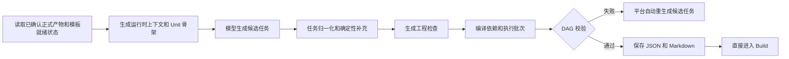
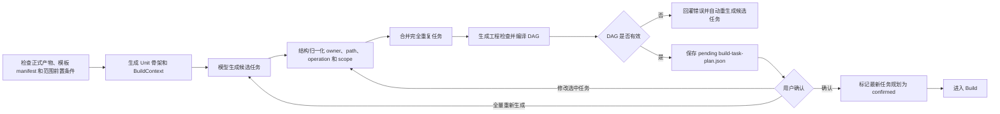

# DAG 任务生成和校验节点最小改动方案

## 1. 文档目的

本文面向 XCodeAgent 项目开发人员，给出 `prepare_build_tasks` 节点的最小改动方案。

本次调整以“修复流程不通、误阻断、任务边界隐藏和缺少确认”为目标，不进行大规模字段清理、Graph 重构或调度架构调整。

当前分支的 Build DAG 位于正式产物确认和模板就绪之后。正式上游链路是
`RequirementSpec → ProductPlan → UiDesign（可选）→ TechnicalPlan → 模板初始化 → Workbench`；
页面或接口进入 DAG 前，还必须使用当前范围内已确认的 `PageImplementationContract`、
`EndpointDetail` 和实体设计。运行时的 `project_plan` 是由当前 TechnicalPlan 和上游产物物化出的上下文投影，
不是新的可编辑正式产物。本方案中的“上游计划”均按此边界理解。

## 2. 调整边界

### 2.1 本期处理范围

本期只处理以下问题：

1. 移除 DAG 节点内部对运行时 `project_plan` 和正式 TechnicalPlan 的修改、回写和确认职责；
2. 从 DAG 中移除菜单、路由注册任务和页面占位文件生成职责；
3. 修复任务失败重试时 `add/modify` 判断失真的问题；
4. 增加完全重复任务的自动合并；
5. 优化阻断错误，使错误能够定位到具体任务、字段或路径；
6. 增加轻量级 DAG 用户确认；
7. 增加最小的 DAG scope 和 confirmation 字段；
8. 增加“最新任务规划已经确认才能进入 Build”的门禁；
9. 将当前正式产物、模板 manifest 和范围内详细设计作为 DAG 的显式前置条件；
10. 将平台设计的任务边界校验失败交给模型自动重生成，不把任务拆分规则交给用户人工修正。

### 2.2 本期明确不处理

- 不升级 `build-dag.v3`；
- 不拆分新的 LangGraph 节点或规划子图；
- 不重新设计 Unit Graph、Task Graph、owner 或 Scheduler；
- 不重新设计 `target_files`、`allowed_paths` 和 `change_scope` 的字段结构；保留当前将 `change_scope.path` 投影到
  `target_files`、并以 `target_files` 作为 `allowed_paths` 兜底的确定性归一化，不把三个字段合并成单一字段；
- 不清理现有兼容字段和命名风格；
- 不改 RequirementSpec、ProductPlan、UiDesign、TechnicalPlan 或模板初始化本身的正式产物协议；
- 不新增独立的“新增页面初始化”Graph 节点，新增页面继续复用现有模板初始化生命周期和 manifest 门禁；
- 不在 Normal Build 中新增 database-owner 任务或 `database:*` Unit，数据库操作继续由实体确认阶段负责；
- 不增加相似任务的语义判断，本期只处理可确定的完全重复任务；
- 不维护 DAG revision 或历史版本，每次只保存最新任务规划；
- 不增加 DAG 根 fingerprint；现有 Unit 级 `input_fingerprint` 保持不变，不将其误删或改名；
- 不增加独立单元测试任务；
- 不将详细设计中的业务验收标准复制到 DAG。

## 3. 当前流程与调整后流程

### 3.1 当前流程



当前主要断点：

- 当前节点还会兼容处理未确认的运行时 `project_plan`，并可能把运行时投影回写到 TechnicalPlan 路径，容易混淆确认对象；
- DAG 校验通过后直接进入 Build，缺少执行前确认；
- DAG 还会补充菜单、路由注册任务并在页面入口缺失时注入占位文件，职责超出任务实现阶段；
- 失败重试后文件已经存在时，原始 `add` 检查可能误判；
- 完全重复任务可能重复执行；
- 错误信息通常只告诉用户“重新拆分”，缺少具体任务和路径。

### 3.2 调整后流程



工作流节点关系仍保持：

```text
inspect_workspace → prepare_build_tasks → build
```

有效 DAG 的用户确认通过现有 `await_user_input` 和 Build resume 机制完成，不新增 Graph 节点；确认动作可以经由
`prepare_build_tasks` 的确认分支校验最新 JSON 后进入 `build`。

任务候选的拓扑、owner、Unit、路径边界和平台职责属于系统设计，不属于用户需要决策的业务输入。
候选任务校验失败时，平台将具体错误回灌给任务规划模型并自动重新生成完整候选；只有通过校验的 DAG
才进入用户确认。达到自动重生成上限仍失败时，工作流进入平台失败处理，不展示要求用户编辑或拆分任务的人工修正问题。

这里需要扩展的是现有恢复协议，而不是新增普通问题文本：DAG 确认、任务 patch 和全量重新生成必须通过
AG-UI 结构化动作恢复，并使用独立的 `build_task_plan_confirmation` mode，不能复用正式文档确认 mode。

## 4. 第一批：修复流程阻塞

### 4.1 移除上游正式产物修改和确认职责

当前节点不再修改、重新生成或确认运行时 `project_plan`，也不把运行时投影写回
`.xcodeagent/plans/technical-plan.json` 或任何正式上游 Markdown。

进入 DAG 前的当前前置条件为：

- RequirementSpec 已确认；
- ProductPlan 已确认；
- UiManifest 已确认或明确跳过；
- 当前 TechnicalPlan 的 `artifact_type=technical-plan` 且已确认；
- 模板初始化完成，`.xcodeagent/template-generation-manifest.json` 的完成门禁通过；
- 当前范围需要的 PageImplementationContract、EndpointDetail 和实体设计均已确认。

调整后规则：

- 上述正式产物和范围上下文均满足：继续生成 DAG；
- 任一正式产物或模板初始化未完成：停止 DAG 生成，返回对应的上游恢复路径；
- 缺少 EndpointDetail 或实体设计：返回当前 Workbench 的详细设计确认流程；
- 用户提出架构、API、数据源、页面产品事实或技术设计变更：引导回相应正式规划/详细设计阶段，不在 DAG 节点内部处理；
- “确认 TechnicalPlan/EndpointDetail”和“确认 DAG”使用不同的 `mode`，避免恢复时误识别。

`project_plan` 只能作为本次 Build 的运行时上下文使用。DAG 节点不得调用
`sync_project_plan_from_markdown`、`revise_project_plan_with_chat_model` 或
`write_project_plan_json` 来完成上游确认；上游 Markdown 编辑也必须回到对应的正式产物确认流程。

上下游调整点：工作流恢复逻辑需要把正式产物、模板 manifest 和详细设计前置条件错误交回对应流程，
而不是由 DAG 节点修改计划或把运行时投影写回正式 TechnicalPlan。

### 4.2 移除菜单、路由和页面占位文件任务

DAG 阶段只负责任务规划、页面内容实现、API 调用和后端实现，不再负责前端工程骨架初始化，
也不在 Normal Build 中生成数据库 owner 任务。数据库表结构和数据源操作继续由已确认的实体设计流程负责。

本期从 DAG 中移除：

- 菜单注册任务；
- 路由注册任务；
- 隐藏路由注册任务；
- 对共享菜单、路由配置文件的修改；
- 页面目录和 `index.tsx` 占位文件的新增；
- 为菜单、路由或页面占位文件生成的工程检查；
- 当页面入口不存在时，由 DAG 自动注入 canonical page entry 的兜底逻辑。

调整后的职责边界：

| 内容 | 负责阶段 | DAG 处理方式 |
| --- | --- | --- |
| 初始页面占位文件 | 模板初始化 | 只消费，不创建 |
| 初始菜单和路由配置 | 模板初始化 | 只消费，不修改 |
| 后续新增页面的占位文件 | 现有模板初始化的增量流程 | 只消费，不创建 |
| 后续新增页面的菜单和路由 | 现有模板初始化的增量流程 | 只消费，不修改 |
| 页面业务内容和交互实现 | DAG / Build | 生成页面实现任务 |
| 页面 API 调用 | DAG / Build | 按已确认设计生成实现任务 |
| 数据库表结构和数据源操作 | 实体确认流程 | DAG 只消费已确认的实体上下文 |

数据库来源后端还必须拥有独立的 `backend:bootstrap` 基础能力任务：它幂等检查现有
`backend/pom.xml`、数据源配置和 MyBatis-Plus 配置，只补充确实缺失的能力，不生成业务分层代码。
endpoint-only 与前后端混合规划使用相同规则；external_api-only 和 static-only 范围不创建或依赖该 Unit。
当 `backend:bootstrap` 位于本轮待规划 Unit 集合但模型遗漏对应任务时，确定性 DAG 校验必须报告错误并进入
平台自动重生成，不能静默接受缺少前置能力的候选，也不能由编译器硬编码合成任务。

新增页面必须在进入工作区检查和 DAG 之前完成以下前置动作。这里的页面初始化不是新的 Graph 节点，
而是复用现有 `/application-lifecycle/run` 的模板准备和完成门禁：

```text
更新并确认 ProductPlan
→ 确认或跳过 UiDesign
→ 更新并确认 TechnicalPlan
→ 执行模板初始化增量流程（创建页面占位、菜单和路由）
→ 更新并通过 .xcodeagent/template-generation-manifest.json 门禁
→ Workbench 编译 PageImplementationContract
→ 完成所需 EndpointDetail 和实体设计确认
→ inspect_workspace
→ prepare_build_tasks
```

DAG 生成时只做前置条件检查：

- 页面入口文件存在；
- 页面路径与 ProductPlan、UiManifest 和 PageImplementationContract 一致；
- 菜单和路由已经由上游完成；
- `.xcodeagent/template-generation-manifest.json` 的 `download`、`templateFiles`、`menus` 和 `gate` 状态均已完成；
- 当前范围需要的 EndpointDetail 和实体设计已经确认；纯静态页面不因不存在这些产物而阻断。

任一前置条件缺失时，DAG 返回新增页面初始化或模板初始化流程恢复，不生成兜底任务，也不把缺失文件改写成普通页面开发任务。

`reconcile_live_page_paths` 如继续保留，只能用于把任务路径校对到已经存在的页面入口，不得创建目录、占位文件或菜单、路由任务；
它不负责修剪任务边界。

`ensure_page_route_registration_task` 和 `_inject_canonical_page_entry` 不再作为 DAG 编译步骤调用；菜单和页面入口的
存在性检查可以保留为只读前置校验。模型提示词也必须同步移除“DAG 负责登记菜单”和“允许修改 menus.ts”的描述。
模型若仍返回共享菜单、路由、隐藏路由或页面占位变更，编译器必须保留原候选并把任务 ID、字段和路径写入
`task_graph.validation.errors`，不得删除任务、剥离路径或把 `add` 改成 `modify`。

上下游调整点：现有模板初始化流程必须完整负责页面占位文件、菜单和路由，并提供可供 DAG 校验的
`.xcodeagent/template-generation-manifest.json` 状态；DAG 只消费该状态。

### 4.4 修复失败重试时的文件操作误判

问题场景：

```text
规划时：A.ts 不存在，change_scope.operation=add
第一次执行：A.ts 已创建，但任务失败或中断
第二次执行：A.ts 已存在，本轮差异表现为 modified
```

调整原则：

- DAG 中的 `change_scope[].operation` 继续表示规划时的目标操作；
- 不修改现有 `change_scope` 字段结构；
- 当前代码已经在每次 owner action 前后捕获工作区快照；工程验收需要把该快照明确视为本次 attempt 的校验基线；
- 原任务为 `add`，且 `retry_count>0` 或存在前一次失败尝试证据时，本轮允许产生 `modified`；不能只对 `kind=repair` 放宽；
- `delete` 仍以最终文件不存在为准；
- 不能仅凭文件存在就认定任务 `already_satisfied`，仍需验证任务目标是否完成。

上下游调整点：Build 执行需要把重试信息传入工程验收；工程验收使用本次 attempt 的工作区基线，
同时保留原任务的规划 operation，不把本轮实际 diff 反写成新的规划 operation。

### 4.5 自动合并完全重复任务

本期不增加大模型语义相似度判断，只处理可以确定的完全重复任务。

完全重复判定至少要求：

- `owner` 相同；
- `unit_id` 相同；
- `task_type` 相同；
- 规范化后的任务目标一致；
- `change_scope` 或数据库修改范围一致。

合并时需要：

- 保留一个稳定任务 ID；
- 合并双方依赖并去重；
- 将其他任务对被删除任务 ID 的依赖改写为保留任务 ID；
- 合并 `source_refs`；
- 重新执行循环依赖、缺失依赖和并行冲突检查。

模型提示词中的“自行去重”只能作为候选生成优化，不能替代后端确定性合并。合并必须发生在工程验收编译、
执行批次和最终 DAG 校验之前；合并后的 task registry、Unit task_ids、依赖边和 `source_refs` 必须保持一致。

如果无法确定两个任务完全等价，则保留，不在本期自动合并，也不因此阻断。

### 4.6 优化阻断错误

错误处理维持现有 `requires_user_input` 和系统异常两类主流程，但提示必须可定位。

| 错误类型 | 处理方式 |
| --- | --- |
| owner、path、operation 的可确定格式问题 | 自动归一化，不阻断 |
| 完全重复任务 | 自动合并，不阻断 |
| 缺失依赖或循环依赖 | 阻断，并列出 task ID 和依赖 ID |
| 文件范围越权或并行写冲突 | 阻断，并列出 task ID 和路径 |
| 缺少 PageImplementationContract、EndpointDetail、实体设计或数据库上下文 | 阻断，并说明缺失的上游产物 |
| 模型输出无法解析 | 使用现有模型重试；耗尽后提示重新生成 |
| 产物写入失败 | 返回系统错误，不询问用户如何修改 DAG |

本期继续使用现有 `task_graph.validation.errors`，只改善错误内容，不新增结构化 `issues` 字段。

`requires_user_input` 的前端投影也必须按实际原因区分正式产物前置失败、详细设计前置失败、DAG 校验失败和
DAG 确认等待，不能把所有 `prepare_build_tasks` 用户输入都显示为“项目计划未确认”。

## 5. 第二批：补齐最小 DAG 确认

### 5.1 确认时机

DAG 编译和校验通过后：

1. 将最新任务规划写入 `build-task-plan.json`；
2. 将 `confirmation_status` 设置为 `pending`；
3. 通过 AG-UI 和可视化界面展示最新任务规划；
4. 工作流节点返回 `requires_user_input`，而不是把 DAG 生成标记为已完成并直接进入 Build；
5. 用户确认后，将当前 JSON 标记为 `confirmed`，才允许进入 Build。

确认动作本身不重新调用任务规划模型。

状态字段必须分开理解：`build_task_plan.status` 只表示 DAG 的 `ready/blocked`，工作流结果的
`status` 表示是否等待用户输入，Build summary 的 `status` 继续沿用调度器现有语义。不能用
`build_task_plan.status=ready` 或工作流 `status=completed` 代替 DAG confirmation。

### 5.2 用户确认内容

默认每个任务只展示两个可编辑字段：

1. 任务名称 `title`；
2. 任务描述 `description`。

以下字段只读或折叠展示：

- owner；
- 依赖关系；
- 修改范围；
- 工程完成检查。

不要求用户逐项确认或编辑 `acceptance_checks`。它由后端确定性生成，是执行后的工程门禁，不是用户需要理解的业务验收标准。

确认界面通过 AG-UI 传递结构化动作，最小载荷如下：

```json
{
  "mode": "build_task_plan_confirmation",
  "action": "patch",
  "patches": [
    {
      "task_id": "task-001",
      "title": "可选的新任务名称",
      "description": "可选的新任务描述"
    }
  ]
}
```

`action` 的允许值为 `confirm`、`patch`、`regenerate`；上例展示任务 patch。

只有 `title` 和 `description` 可由用户 patch；后端必须拒绝通过同一 patch 修改 owner、Unit、依赖、
路径范围、operation、数据库范围或 `acceptance_checks`。`confirm` 不调用模型，`patch` 重新执行归一化、
重复合并、工程验收编译和 DAG 校验，`regenerate` 才重新调用候选任务模型。

### 5.3 用户操作

| 操作 | 处理方式 |
| --- | --- |
| 确认并继续 | 校验工作区中的最新 JSON，将其标记为 confirmed，进入 Build |
| 修改一个任务 | 提交一个任务 patch，重新归一化、编译、校验和确认 |
| 批量修改任务 | 提交多个任务 patch，处理流程与单任务修改相同 |
| 全量重新生成 | 重新调用候选任务生成，从模型规划阶段重新执行 |

单任务修改和批量修改共用同一个结构化 patch 协议，只通过 patch 数量区分，不增加两套后端流程。

每次修改或重新生成都会直接覆盖工作区中的最新 `build-task-plan.json`，并把 `confirmation_status` 重置为 `pending`。用户通过结构化确认界面查看和修改任务，不再使用 Markdown 作为确认载体。

### 5.4 修改后的恢复路径

```text
首次生成并校验通过
→ 保存最新 build-task-plan.json、pending
→ requires_user_input
→ 用户确认
→ confirmation_status=confirmed
→ 现有确认恢复分支校验最新 JSON
→ Build
```

```text
用户修改一个或多个任务
→ confirmation_status=pending
→ 从任务归一化阶段重新执行
→ 覆盖保存最新 JSON
→ 再次确认
```

```text
用户选择全量重新生成
→ 重新调用模型
→ 覆盖保存最新 JSON
→ 重新编译、校验并确认
```

Build DAG 确认阶段不提供独立的取消动作；未确认的 pending JSON 仍由工作区保存，后续恢复必须重新读取工作区中的最新 JSON，不能只信任旧
checkpoint 中的任务计划。若用户在 DAG 阶段提出正式设计变更，则退出本 mode，返回对应的正式规划或详细设计流程。

## 6. 产物字段调整

本期只保留一份 DAG 持久化产物：

```text
.xcodeagent/plans/build-task-plan.json
```

这里的“一份”只针对 DAG 规划产物；`.xcodeagent/plans/repair-task-plan.json` 仍是现有修复审批和调度流程的独立产物，
不因删除 DAG Markdown 而删除或并入 Build Task Plan。

### 6.1 `build-task-plan.json`

保持 `schema_version=build-dag.v3`，只增加确认闭环所需的最小字段。

| 操作 | 字段 | 类型 | 说明 |
| --- | --- | --- | --- |
| 增 | `build_execution_scope` | object | 记录本次 application、page、data_source 或 endpoint 范围 |
| 增 | `confirmation_status` | string | `pending` 或 `confirmed` |
| 增 | `confirmed_at` | string/null | 最新任务规划的确认时间；未确认时为 null |
| 改 | `change_scope[].operation` | string | 字段结构不变，明确为规划操作意图；重试差异按 attempt 基线判断 |
| 不动 | `status` | string | 继续使用 `ready` 或 `blocked`，避免影响 Scheduler |
| 不动 | `version`、`schema_version` | string | 保持当前 v3 版本；不增加历史产物读取或旧格式默认确认逻辑 |
| 不动 | `task_registry`、`task_graph` | object | 保持 BuildScheduler 输入结构 |
| 不动 | `build_units`、`unit_graph` | object | 不调整 Unit 结构 |
| 不动 | `execution.batches` | array | 不调整现有执行批次结构 |
| 保留 | `source_project_plan_version` | string | 保留现有字段名；当前值来自运行时所基于的 TechnicalPlan 版本，本期不做命名清理 |
| 不动 | 任务字段 | object | 不删除或重命名现有任务字段 |

示例：

```json
{
  "version": "3.0.0",
  "schema_version": "build-dag.v3",
  "status": "ready",
  "build_execution_scope": {
    "type": "page",
    "targetId": "order-list"
  },
  "confirmation_status": "pending",
  "confirmed_at": null,
  "build_units": {},
  "task_registry": {},
  "task_graph": {},
  "execution": {}
}
```

字段更新规则：

- 首次生成有效 DAG：`confirmation_status=pending`、`confirmed_at=null`；
- 用户确认：`confirmation_status=confirmed`，写入 `confirmed_at`；
- 用户修改或重新生成：覆盖最新 JSON，并重置为 `confirmation_status=pending`、`confirmed_at=null`；
- 任务执行状态变化不清除确认状态；
- 任务规划内容变化必须清除原确认状态并重新确认。

重建任务 registry、执行批次或 Unit 元数据时必须显式区分“执行状态更新”和“任务规划内容变化”：
普通任务完成、失败、重试以及现有修复审批产生的运行时结果不得静默清除初始 DAG confirmation；
如果 patch 或重新生成改变了任务规划内容，则必须先重置为 pending。

### 6.2 删除 Markdown 产物

删除以下 DAG 产物及其写入流程：

```text
.xcodeagent/plans/BUILD_TASK_DAG.md
```

具体调整：

- `prepare_build_tasks` 不再生成或更新 `BUILD_TASK_DAG.md`；
- Graph State、Workflow definition 和 AG-UI 结果不再返回 `build_task_dag_path`；
- 可视化确认界面直接消费 `build-task-plan.json` 的安全投影或对应 AG-UI 状态；
- 现有历史 `BUILD_TASK_DAG.md` 不再作为有效产物或恢复输入；
- 不新增历史迁移或兼容读取；历史文件是否由独立清理流程删除，不影响当前 JSON DAG 生成和执行。
- 进度摘要、Build scheduler 结果、修复任务追加和前端 DAG 快照均不得重新生成该 Markdown。

### 6.3 本期不维护 revision 和 fingerprint

本期不新增以下 DAG 根字段：

```text
revision
confirmed_revision
dag_fingerprint
```

Unit 内已有的 `input_fingerprint` 继续由 Unit 编译器维护，不能因为本期不增加 DAG 根 fingerprint 而删除。
本期不维护 DAG 历史版本，每次确认的对象都是 `.xcodeagent/plans/build-task-plan.json` 中的最新任务规划。
revision 和 DAG 根 fingerprint 可在后续需要防止并发覆盖、检测外部文件修改或提供历史审计时再引入。

## 7. Build 入口门禁

BuildScheduler 的任务结构和调度算法不变，只在进入 Build 前增加最小校验。门禁必须同时覆盖主图路由、
`build` 节点和可被 `resumeFrom=build` 直接调用的 `run_build_scheduler`，不能只依赖
`route_prepare_build_tasks`：

```text
build_task_plan.status == ready
confirmation_status == confirmed
```

不满足时：

- `pending`：返回 `build_task_plan_confirmation` DAG 确认；
- DAG `blocked`：返回已有 DAG 校验错误；
- 不允许为了兼容旧产物而默认视为已确认。

门禁只读取并校验 `.xcodeagent/plans/build-task-plan.json` 中的最新计划，至少检查 `schema_version`、
`status`、`confirmation_status`、当前 `build_execution_scope` 和任务图校验结果。任何任务修改或重新生成都必须先把
该字段重置为 `pending`，避免旧确认状态被新计划继承。

`replace_build_task_plan_tasks`、修复任务追加和 scheduler 结果回写必须保留确认字段；普通任务状态更新不得清除
`confirmed`。修复任务仍沿用现有 repair scope approval，不得通过追加修复任务绕过既有修复确认流程。

上下游调整点：Build 入口拒绝未确认的最新任务规划，但不调整批次选择、owner 调度、并行锁和任务执行逻辑；
直接恢复 Build 也必须遵守同一门禁。

## 8. 涉及模块

| 模块 | 最小改动内容 |
| --- | --- |
| `Backend/app/graph/nodes/tasks.py` | 只消费已确认正式产物、模板 manifest 和范围详细设计；移除上游计划回写；处理 DAG pending、确认、patch 和重新生成 |
| `Backend/app/services/build_task_planner.py` | 完全重复任务确定性合并；写入 scope 和确认字段；对菜单、路由、页面占位和数据库职责越界执行显式 DAG 校验，不修改或删除候选；保留 Unit 级 fingerprint |
| `Backend/app/services/build_task_menu.py` | 删除 DAG 菜单/路由任务生成、菜单任务修剪和 canonical page entry 注入逻辑；仅保留已存在页面入口的只读路径校对和必要的菜单状态解析 |
| `Backend/app/services/build_unit_skeleton.py` | 保持数据库已在实体确认阶段落地的当前边界，不为 Normal Build 创建 `database:*` Unit |
| `Backend/app/services/build_context_resolver.py`、`page_implementation_contract.py`、`entity_definitions.py` | 将 PageImplementationContract、EndpointDetail 和实体设计作为范围前置条件；PageDetail 仅保留内部旧数据 hydration 语义 |
| `Backend/app/services/build_unit_compiler.py` | 保留 Unit 来源引用和 `input_fingerprint`；更新当前 source_refs 语义时不得引入新的 PageDetail 正式产物 |
| `Backend/app/agents/main/task_preparer.py` | 删除“DAG 负责菜单登记、允许修改 menus.ts”的提示词；将 DAG 校验错误自动回灌模型并有界重生成；保留页面内容和 API 实现边界 |
| `Backend/app/services/engineering_acceptance.py` | 明确规划 operation 与 attempt 验收的边界，更新当前 PageImplementationContract/EndpointDetail 术语 |
| `Backend/app/services/engineering_acceptance_verifier.py`、`build_scheduler.py` | 重试时按本次 attempt 基线接受合理的 added/modified 差异，并把原任务 retry 信息传入验收 |
| `Backend/app/services/application_template_generation.py`、`frontend_scaffold.py`、`application_lifecycle.py` | 提供并校验现有 `.xcodeagent/template-generation-manifest.json`；DAG 只消费模板就绪状态，不接管初始化 |
| `Backend/app/workspace/task_documents.py` | 只保留 Build Task Plan JSON 和 repair task plan JSON；删除 DAG Markdown 路径、渲染和写入逻辑 |
| `Backend/app/services/build_task_progress.py` | 移除 `BUILD_TASK_DAG.md` artifact 摘要，改为输出 JSON 安全投影和 DAG confirmation 状态 |
| `Backend/app/services/build_repair_planner.py` | 保持 repair-task-plan 独立产物和既有修复确认；追加修复任务时保留主计划 confirmation 语义 |
| `Backend/app/graph/subgraphs/build.py` | 在 Build/scheduler/直接恢复入口增加最新 JSON 确认门禁；任务结果和修复流程不再写入 Markdown |
| `Backend/app/graph/workflow.py` | 保持现有 Graph 节点关系，但区分 DAG confirmation 等待和进入 Build 的恢复路由 |
| `Backend/app/graph/state.py`、`Backend/app/protocols/workflow/definition.py` | 移除 `build_task_dag_path`；确认状态只存于计划内部，不新增重复 Graph State 字段 |
| `Backend/app/protocols/workflow/request.py` | 增加 `build_task_plan_confirmation` 的 confirm/patch/regenerate 结构化恢复动作；恢复时读取最新 JSON |
| `Backend/app/protocols/workflow/projection.py`、`runtime.py` | 投影 DAG confirmation、scope、任务可编辑字段和局部错误；不再将 DAG Markdown 作为确认 artifact |
| `Frontend/src/renderer/src/typings/workflow.ts`、`service/agUiAgent.ts` | 增加 DAG confirmation、patch、scope 和 JSON-safe snapshot 类型；移除 Markdown DAG artifact 类型 |
| `Frontend/src/renderer/src/components/WorkflowRunCard`、`AiChatPanel.tsx`、`processStepHistory.ts`、`workbenchPhase.ts` | 展示任务名称/描述和 pending/confirmed 状态，支持确认、批量 patch、全量重新生成及恢复；不复用正式文档确认卡片 |

## 9. 验收场景

本期至少覆盖以下场景：

<!-- 1. Static 项目仍能正常生成前端和 Mock 任务； -->
2. Database 项目在实体确认阶段完成数据库操作后，DAG 能消费已确认实体上下文并生成允许的后端/前端任务，且 Normal Build 不生成 database-owner 任务；
3. RequirementSpec、ProductPlan、UiManifest、TechnicalPlan 未满足当前确认门禁时，DAG 不修改或回写任何正式产物；
4. 运行时 `project_plan` 不会被写回 `.xcodeagent/plans/technical-plan.json`；
5. 模板 manifest 缺失、未完成或真实页面/菜单不一致时，会返回模板初始化流程，不生成 DAG 兜底任务；
6. 模型若返回菜单、路由、隐藏路由或共享注册文件修改任务，候选不会被静默删除，`task_graph.validation.errors` 会定位到任务和路径，并自动触发重生成；
7. 模型若返回页面目录或 `index.tsx` 占位文件新增任务，候选不会被改写，平台会自动重生成；
8. 新增页面的模板初始化增量流程完成后，DAG 只生成页面内容和 API 调用实现任务；
9. 当前范围缺少 PageImplementationContract、EndpointDetail 或实体设计时，会返回对应 Workbench 详细设计流程；
10. DAG 校验通过后不会直接进入 Build；
11. 用户确认最新任务规划后才能进入 Build；
12. 用户修改一个任务时，其他任务保持不变，最新 JSON 的确认状态重置为 pending；
13. 单个或批量 patch 只通过同一个结构化 AG-UI 协议提交，且不能修改 owner、依赖、路径范围或工程验收；
14. 全量重新生成会覆盖最新 JSON 并重新确认；
15. 完全重复任务被自动合并，依赖引用、Unit task_ids 和 source_refs 同步改写；
16. 初次执行创建文件后失败，重试修改该文件不会因 `add/modify` 不一致被误判；
17. 缺失依赖、循环依赖、路径冲突和详细设计缺失能够定位到具体任务、路径或上游产物；
18. DAG 任务边界或拓扑校验失败时由平台自动重生成，用户只接收通过校验的 DAG 确认，不需要人工修正任务拆分；
19. `confirmation_status` 不是 confirmed 的最新 JSON 无法通过主图、直接 Build 恢复或 scheduler 门禁；
20. DAG 阶段及 Build/repair 回写只生成或更新 `build-task-plan.json`，不再生成或读取 `BUILD_TASK_DAG.md`；
21. `repair-task-plan.json` 仍作为独立修复产物保留，不与 DAG JSON 混淆；
22. 可视化界面展示的 scope、任务内容和确认状态与最新 JSON 一致，并能区分前置阻断、DAG 自动重生成失败和 DAG 确认等待；
22. 普通任务执行、重试和修复流程不会错误清除已经确认的任务规划。

## 10. 后续优化项

以下内容不纳入本期：

- 增加 DAG revision、确认 revision 和 DAG 根 fingerprint；
- 检测高度相似但不完全重复的任务；
- 将运行状态和规划产物拆分；
- 清理重复字段和 camelCase/snake_case 混用；
- 将 DAG 生成拆成可单独 checkpoint 的规划子图；
- Static 路线及其提示词、检查和分支的最终移除。
