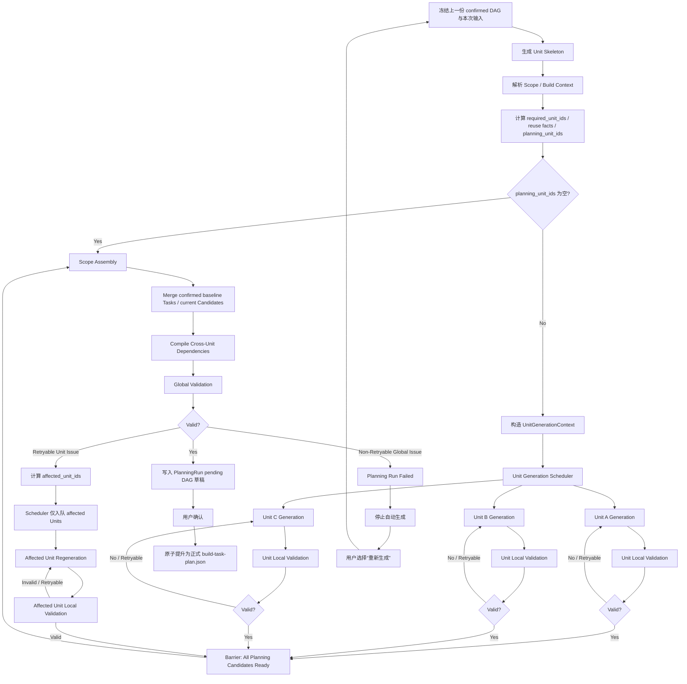

# DAG 任务生成优化——指导性设计计划

> 本文是后续详细设计的架构基线。本文中的 `UnitCandidate` 始终指当前 `PlanningRun` 新生成的任务增量，不是某个 Unit 的历史任务全集；上一份 confirmed DAG 是只读基线。

## 0. 本轮改造目标

当前任务规划流程的主要问题是：

- 一个 Scope 的多个 `planning_unit_ids` 一次性交给模型；
- 模型返回一份大的扁平 `tasks[]`；
- Task 数量越多，完整输出越慢，也更容易发生截断；
- 任意一个 Unit / Task 校验失败，整个 Scope 重新生成；
- 已成功内容在重试中被重复生成，存在成本浪费和语义漂移；
- 用户只能看到“生成中”，无法知道具体生成到哪里、哪里正在重试。

本次改造目标不是重做现有 DAG 系统，而是：

> 保留现有 Unit Graph、Task DAG、Scope Assembly、用户确认和 Build 执行模型，只重构“任务生成阶段”。

核心目标：

> **将 Scope 级整批任务生成，改造成 Unit 级独立 Candidate 生成、局部校验、有限并行和局部自动重试；最终仍由 Scope 负责完整 DAG 的原子组装和一致性确认。**

---

# 一、总体架构原则

当前需要明确两个最重要的边界。

## 1. Unit：生成隔离边界

可生成 Unit 是当前 Planning Run 内：

- 模型生成；
- Candidate 保存；
- 局部校验；
- 自动重试；
- 失败隔离；

的最小边界。

即：

```text
Task 出错
    ↓
归属到 Unit
    ↓
重新生成该 Unit 在当前 PlanningRun 中的完整 UnitCandidate
```

当前阶段**不进一步做 Task 级局部重新生成**。

原因是：

- 同 Unit Task 数量可能变化；
- Unit 内 Task dependency 相关；
- `change_scope` / 文件范围可能整体变化；
- 单独替换一个 Task 容易造成新旧 Task 不一致。

因此：

```text
Unit = Generation / Validation / Retry Boundary
```

这里的“整个 Unit”只指本轮 Candidate。上一份 confirmed DAG 中已经确认的 Task 不进入 Candidate，也不会因为本轮失败而重新生成。

同一个 `unit_id` 在流程中有三种不同载体，不能混称为“同一个 Unit”：

```text
Unit Skeleton Node
= 生成前 Unit Graph 中的结构节点

UnitCandidate
= 当前 PlanningRun 针对一个 unit_id 生成的临时任务包，只含本轮任务

build-task-plan.build_units[unit_id]
= Scope Assembly 后根据 Task.unit_id 编译出的累计 DAG 分组
```

本设计把第二种 `UnitCandidate` 作为生成和重试边界；第三种 `build_units` 仍按现有 `build-task-plan.json` 契约保留，不应把二者混为一体。

---

## 2. Scope：全局一致性和提交边界

Unit Candidate 成功并不代表已经正式进入应用 DAG。

只有：

```text
所有 planning Unit Candidate 稳定
且 required Unit 的复用事实有效
        ↓
Scope Assembly
        ↓
Global Validation
        ↓
通过
```

以后，才可以：

```text
生成本轮 pending DAG 草稿
        ↓
用户确认
        ↓
原子替换正式 build-task-plan.json
```

因此：

```text
Unit = Candidate Isolation Boundary
Scope = Commit / Consistency Boundary
```

或者更简单地描述为：

> **Unit 负责失败隔离，Scope 负责全局一致性。**

---

# 二、顶层流程

目标流程建议固定为：



---

# 三、整个系统建议划分成四层

后续项目分析建议按这四层逐层深入。

```text
┌──────────────────────────────────────────┐
│ Layer 1：Planning Run / Scope            │
│                                          │
│ 管理本轮任务规划生命周期和最终 Commit        │
└──────────────────────┬───────────────────┘
                       │
┌──────────────────────▼───────────────────┐
│ Layer 2：Unit Generation                 │
│                                          │
│ Unit Context / Generation / Retry        │
│ Candidate Lifecycle                      │
└──────────────────────┬───────────────────┘
                       │
┌──────────────────────▼───────────────────┐
│ Layer 3：Validation & Assembly           │
│                                          │
│ Unit Local Validation                    │
│ Scope Assembly                           │
│ Global Validation / Error Attribution    │
└──────────────────────┬───────────────────┘
                       │
┌──────────────────────▼───────────────────┐
│ Layer 4：Infrastructure                  │
│                                          │
│ Model Invocation / Concurrency / Timeout │
│ Progress Events / Persistence            │
└──────────────────────────────────────────┘
```

第一阶段项目分析时，不要直接跳到 Layer 4。

优先把：

```text
Scope
Unit
Candidate
Validation
Assembly
```

这些领域边界定义清楚。

---

# 四、Unit 类型继续沿用现有项目定义

不重新设计 Unit 分类。

## 结构 Unit

```text
application:root
app:integration
```

设计目标：

```text
generatable = false
```

只参与：

- Unit Graph；
- 结构关系；
- Scope Assembly；

不参与模型 Task Generation。

同时需要项目内确认并补强：

- `planning_unit_ids` 不允许包含 structural Unit；
- Task 不允许归属 structural Unit；
- Task 缺少 `unit_id` 时不能继续 fallback 到 `application:root`。

---

## 共享能力 Unit

```text
frontend:shell
frontend:api-client
frontend:auth-guard
backend:bootstrap
```

它们：

- 属于应用级共享能力；
- Candidate 可以由某个 Scope 触发生成，但只包含本轮新增或替换的任务；
- 但正式生效必须等待当前 Scope Commit；
- 生效后进入应用累计 DAG，供后续 Scope 复用。

本设计采用以下外部前提：

> 同一项目不会同时存在两个 Scope Planning Run。

该约束由 PlanningRun 上游生命周期负责实现，不属于本轮任务生成改造。基于该前提，本轮暂时不解决 Shared Unit 多 Scope 并发版本问题。

但后续仍需要单独分析：

- 共享能力不足时如何重新打开 Unit；
- `frontend:auth-guard` 的准确生成策略；
- `frontend:api-client` 生命周期是否需要进一步拆分。

---

## 业务实现 Unit

```text
backend:endpoint:<contractId>:<endpointId>
frontend:data:<sourceId>
page:<pageId>
```

这里的 `frontend:data:<sourceId>` 是目标抽象；当前 `build_context_resolver.py` 对 static 场景仍使用 `frontend:data:static`。后续若要改为按 sourceId 拆分，应作为单独的 Unit Skeleton / resolver 契约调整，不能在本轮并行生成改造中默认它已经实现。

是 Unit 独立生成机制最主要的对象。

当前已经基本确认：

- Page 不需要 Endpoint Task 内容；
- Endpoint 不需要 Bootstrap Task 内容；
- 生成依赖的是正式 Contract，而不是上游 Task Candidate；
- 跨 Unit Task dependency 由 Unit Graph 编译。

因此默认可以独立生成。

---

# 五、模型调用边界

在进入模型调用前，必须先区分三个概念：

```text
required_unit_ids
= 当前 Scope 构成完整 DAG 所需要的全部 Unit

reuse_facts
= 从上一份 confirmed DAG 确定性计算出的可复用 Task / capability / endpoint owner

planning_unit_ids
= required_unit_ids 中本轮确实存在生成缺口、需要产生 UnitCandidate 的 Unit
```

因此，`required_unit_ids` 本身不是“需要重新生成的 Unit 列表”，也不能仅凭“该 Unit 历史上有 Task”判断整个 Unit 可复用。共享 Unit 可能同时包含历史可复用 Task 和本轮需要新增的 Task。

第一版应优先沿用并收敛项目中的现有逻辑：

- `_replaceable_unit_ids`：作为计算 `planning_unit_ids` 的起点；
- `_add_reusable_task_context`：投影可复用任务事实；
- `_retained_frontend_endpoint_owner_constraints`：投影已确认的 API endpoint owner；
- `frontend_endpoint_ownership_errors` 与 `retained_frontend_endpoint_owner_conflict_errors`：作为生成后的确定性兜底校验。

需要补强的是：现有显式 reusable task context 主要只覆盖 `frontend:shell`，不能直接视为完整的通用复用机制。新设计应统一以“上一份 confirmed DAG + 本轮正式输入”为依据计算复用和生成缺口。

如果 `planning_unit_ids` 为空，说明本轮所需能力均可由 confirmed baseline 满足，应跳过模型调用，直接进入 Scope Assembly 和 Global Validation。

当前：

```text
Scope
    ↓
多个 planning_unit_ids
    ↓
一个 combined prompt
    ↓
一个大 tasks[]
```

目标：

```text
Scope
    ↓
planning_unit_ids
    ↓
多个 UnitGenerationContext
    ↓
多个 Unit Generation Request
```

例如：

```text
frontend:api-client
        ↓
Model Request A

backend:bootstrap
        ↓
Model Request B

backend:endpoint:user:list
        ↓
Model Request C

page:user-list
        ↓
Model Request D
```

这些调用由统一：

```text
Unit Generation Scheduler
```

管理。

默认采用：

```text
bounded concurrency
```

而不是无限并发。

具体并发数暂不在当前设计层决定。

---

# 六、解除 combined prompt 的关键耦合

当前最明确的跨 Unit 一致性问题是：

```text
业务 API module
到底属于 frontend:api-client
还是 page:*
```

例如：

```text
user.ts
```

项目当前 prompt 已经基本规定：

```text
业务 API module → frontend:api-client
页面实现 → page:user-list
```

因此，这不是让模型在两个 Unit 之间自由选择 owner。改造重点是把当前 combined prompt 中的约束提升为生成前的平台 Ownership Rule，并在单 Unit Context 中显式提供：

```text
API module
→ frontend:api-client

Page implementation
→ page:*
```

例如：

```text
responseEntity.ts
Unit = frontend:api-client

user.ts
Unit = frontend:api-client

frontend/src/pages/UserList/index.tsx
Unit = page:user-list
```

这属于：

> **生成前确定性 Ownership Rule**

而不是运行过程中再让模型跨 Unit 协商。

后续项目内还应继续寻找类似的：

```text
当前依赖 combined prompt 协调
但实际上可以平台确定
```

的规则。

## API module 的复用判断时机

API module 重复利用需要“生成前判断 + 生成后校验”，但两者职责不同：

```text
上一份 confirmed DAG
        ↓
平台确定性提取 endpoint owner / 已有 capability / 可复用 Task 摘要
        ↓
计算本轮缺口和 planning_unit_ids
        ↓
只把必要的复用约束放入 UnitGenerationContext
        ↓
模型生成缺失任务
        ↓
平台再次校验 endpoint owner 唯一性和历史冲突
```

- **生成前**：平台判断哪些能力已经存在、哪些任务无需二次生成。模型不负责判断历史结果是否可信或是否应复用。
- **给模型的上下文**：只提供结构化的 owner / capability / retained Task 摘要，不把全部历史 Task 内容塞进 prompt。
- **生成后**：确定性校验是安全兜底，用来阻止模型重复声明已经由历史 Task 拥有的 API module 或 endpoint。

因此，现有 retained frontend endpoint owner constraint 应保留并下沉为 Unit Context 的一部分；现有 ownership conflict validation 也应保留。不能二选一。

---

# 七、UnitGenerationContext

这是实现 Unit 独立生成最关键的新契约之一。

原则：

> 一个 Unit 必须能够仅依赖自己的 `UnitGenerationContext` 完成任务规划，不读取其他 Unit 的 Candidate Task 内容。

建议概念模型：

```text
UnitGenerationContext
├── planning_run_id
├── scope_id
├── unit_id
├── unit_kind
├── base_confirmed_plan_digest
│
├── formal_contracts
│   ├── PageImplementationContract
│   ├── Endpoint Contract
│   ├── API Contract
│   ├── EntityDesign
│   └── EntitySourceBinding
│
├── workspace_context
│   ├── WorkspaceSnapshot
│   ├── architecture facts
│   └── reuse conventions
│
├── dependency_context
│   ├── dependency_unit_ids
│   ├── dependency_capabilities
│   ├── retained_task_summaries
│   ├── retained_endpoint_owner_constraints
│   └── Unit Graph slice
│
├── constraints
│   ├── owner constraints
│   ├── authorization constraints
│   ├── managed-file constraints
│   └── capability ownership rules
│
└── generation_policy
    ├── max_attempts
    ├── strong rules
    └── expected task rules
```

注意：

当前 `Unit.source_refs` 仍然可以继续作为：

```text
traceability metadata
```

但不要直接等同于 `UnitGenerationContext`。

---

# 八、Unit Candidate 数据结构

模型响应不再返回 Scope 级扁平：

```text
tasks[]
```

而改成单 Unit Candidate。

建议概念：

```text
UnitCandidate
├── unit_id
├── planning_run_id
├── input_fingerprint
├── generation_attempt
├── status
├── tasks[]
├── validation_issues[]
└── generation_metadata
```

`UnitCandidate.tasks[]` 只表达该 Unit 在当前 PlanningRun 中的新增或替换任务。模型不得回传上一份 confirmed DAG 中已经复用的历史任务；历史任务由平台在 Scope Assembly 时合并。

`unit_id`、`planning_run_id`、attempt、状态和校验问题属于平台 envelope。模型真正需要返回的核心是当前 Unit 的 `tasks[]`；平台必须校验所有返回 Task 的 `unit_id` 与请求 Unit 一致。

模型最小响应协议可以类似：

```json
{
  "unit_id": "page:user-list",
  "tasks": [
    {
      "id": "page:user-list::implementation",
      "unit_id": "page:user-list",
      "owner": "frontend"
    }
  ]
}
```

平台随后负责：

```text
parse
→ normalize
→ compile local structure
→ validate
→ candidate_ready / retry
```

---

# 九、Planning Run 数据结构

建议正式引入一个运行时概念：

```text
PlanningRun
```

它与最终：

```text
build-task-plan.json
```

不是一回事。

建议：

```text
PlanningRun
├── planning_run_id
├── scope
├── status
├── phase
├── frozen_input_revision
├── base_confirmed_plan_ref
├── base_confirmed_plan_digest
├── required_unit_ids
├── planning_unit_ids
├── retained_task_ids
├── reusable_capabilities
├── unit_states
├── global_issues
├── started_at
└── completed_at
```

重要原则：

> `PlanningRun` 描述“本次生成过程”。

而持久化产物明确分为：

```text
build-task-plan.pending.json
= 当前唯一 PlanningRun 已通过全局校验、等待确认的 DAG 草稿

build-task-plan.json
= 最近一次经过用户确认的正式累计 DAG
```

文件名是建议契约，详细设计可以调整，但“草稿与正式文件物理隔离”的边界不应改变。Build 执行和下一次 PlanningRun 的 baseline 只能读取正式文件；确认界面读取草稿。不要混用两者状态。

`retained_unit_ids` 不足以准确表达复用。更准确地说：当前 `UnitCandidate` 只包含本轮任务；Scope Assembly 后，累计 DAG 的 `build_units[unit_id]` 才可能同时登记历史保留 Task 和本轮新增 Task。PlanningRun 应记录 Task / capability 粒度的复用事实，同时让 UnitCandidate 继续作为本轮生成和重试边界。

这也是一项需要明确实现的改动：当前 `_merge_prepared_scope_tasks` 对 `replaceable_unit_ids` 采用“同 Unit 旧任务整体替换、其他 Unit 整体保留”的合并方式，尚不支持在一个被重新打开的共享 Unit 内保留旧 Task、只追加本轮缺失 Task。若采用本计划，Assembly 必须按确定性的 Task / capability ownership 规则完成同 Unit 增量合并；不能误写成当前已经具备的能力。

### 已知实现前置条件：草稿与正式 DAG 分离

当前工作区使用唯一的 `build-task-plan.json`。在一次 PlanningRun 的生成和全局校验过程中，旧 confirmed DAG 已加载到内存，并不会提前被覆盖；全局校验通过后，新的 pending DAG 才写回同一路径。

目标设计改为：全局校验通过后只写 `build-task-plan.pending.json`，不修改正式 `build-task-plan.json`。如果用户重新生成，废弃当前草稿并继续从正式文件建立新 PlanningRun；如果用户确认，则校验草稿的 `planning_run_id`、输入指纹和基线摘要，再原子替换正式文件。

这不是跨 PlanningRun 复用失败 Candidate，也不是历史兼容机制；它只是保护当前有效的 confirmed 权威状态。首次规划不存在正式文件时，以空 DAG 作为 baseline。

---

# 十、关键状态设计

## PlanningRun Status

第一版建议尽量简单：

```text
preparing
generating_units
assembling
validating
ready_for_confirmation
failed
cancelled
```

生命周期：

```text
preparing
    ↓
generating_units
    ↓
assembling
    ↓
validating
   /       \
success    failure
  ↓           ↓
ready         failed
```

---

## Unit Generation Status

建议：

```text
pending
generating
validating
retrying
candidate_ready
failed
reused
```

生命周期：

```text
pending
   ↓
generating
   ↓
validating
   ↓
┌───────────────┐
│ valid         │
↓               │
candidate_ready │
                │
invalid         │
↓               │
retrying ───────┘
```

达到最大次数：

```text
retrying
   ↓
failed
```

---

## Candidate 生命周期

Candidate 只属于当前 Planning Run。

```text
Candidate
    ↓
candidate_ready
    ↓
参与 Scope Assembly
```

如果 Scope 成功：

```text
candidate
    ↓
Scope Assembly + Global Validation
    ↓
写入 pending DAG 草稿
    ↓
用户确认
    ↓
Scope Commit：原子替换正式 DAG
```

如果整个 Planning Run 最终失败：

```text
candidate
    ↓
随 Run 结束
    ↓
不跨 Run 复用
```

用户点击：

```text
重新生成
```

意味着：

```text
创建新的 PlanningRun
重新读取上一份 confirmed DAG 作为只读基线
重新计算 required_unit_ids / reuse facts / planning_unit_ids
```

“重新生成”不会继承失败或被放弃 Run 的 Candidate，也不会把上一份 pending DAG 当作基线。它从上一份 confirmed DAG 重新开始，但其中仍然有效的历史 Task 可以继续被确定性复用。

---

# 十一、重试模型

当前项目：

```text
初始调用 + 最大 2 次 retry
= 最多调用 3 次
```

第一版可以继续沿用。

但 Retry Scope 从：

```text
整个 planning scope 的全部 Candidate
```

改成：

```text
单 Unit
```

例如：

```text
Unit A
attempt 1 → valid

Unit B
attempt 1 → invalid
attempt 2 → invalid
attempt 3 → valid

Unit C
attempt 1 → valid
```

A、C 不因为 B 失败而重新生成。

---

# 十二、Infrastructure Retry 和 Generation Retry 分开

需要区分两类失败。

## 模型基础设施失败

例如：

```text
timeout
429
5xx
connection error
```

属于：

```text
Model Invocation Retry
```

## Candidate 内容失败

例如：

```text
deliverable 缺失
owner 错误
路径越界
Unit 内依赖错误
缺少必要 Task
```

属于：

```text
Unit Regeneration
```

概念上最好至少区分：

```text
infra_attempt
generation_attempt
```

不要全部混成一个 `retry_count`。

---

# 十三、Validation Issue 必须结构化

这是整个局部重试机制能否成立的核心基础。

当前：

```text
errors: [
  "Task xxx deliverables invalid..."
]
```

不足以支撑可靠调度。

建议结构：

```text
ValidationIssue
├── code
├── level
├── unit_ids
├── task_ids
├── retryable
├── category
├── message
└── details
```

例如：

```json
{
  "code": "missing_page_deliverable",
  "level": "unit",
  "unit_ids": ["page:user-list"],
  "task_ids": ["page:user-list::implementation"],
  "retryable": true,
  "category": "generation",
  "message": "缺少 frontend.page deliverable"
}
```

全局非模型问题：

```json
{
  "code": "unit_graph_cycle",
  "level": "global",
  "unit_ids": [],
  "task_ids": [],
  "retryable": false,
  "category": "platform",
  "message": "Unit Graph contains a cycle"
}
```

---

# 十四、Validation 分成两层

这是下一阶段项目分析的重点。

## Unit Local Validation

只判断：

> 当前 Unit Candidate 自己是否完整、合法、自洽。

对于共享 Unit，“本地”不等于完全忽略历史。校验对象仍然只是本轮 Candidate，但可以读取上一份 confirmed DAG 投影出的 owner / capability / retained Task 摘要，以判断本轮增量是否重复或越界；历史 Task 本身不参与重生成。

例如待分析归属：

```text
Task schema
Task 必填字段
Unit / owner 对应关系
deliverables
change_scope
托管文件
同 Unit dependencies
同 Unit cycle
强规则 Task 是否完整
```

## Global Validation

判断：

> 多个 Unit Candidate + 上一份 confirmed DAG 中保留的 Tasks 组合以后，是否构成完整有效 DAG。

例如：

```text
跨 Unit dependency
Endpoint implementation ownership
共享能力唯一性
完整 DAG cycle
required Unit completeness
历史 DAG compatibility
全局 capability completeness
```

后续项目分析需要把当前：

```text
build_task_planner.py
```

里的所有 validation rule 列出来，然后逐条决定：

```text
Local
OR
Global
OR
Pre-generation
```

这是下一阶段非常重要的一项工作。

---

# 十五、Global Validation 的错误处理

Global Validation 失败以后不能默认：

```text
regenerate all
```

而是：

```text
Global Validation Issue
        ↓
Error Attribution
        ↓
能否定位 affected Unit？
```

如果能够：

```text
affected_unit_ids = [...]
retryable = true
```

则重新生成相应 Unit。

例如：

```text
保留：
frontend:api-client

重试：
page:user-list

原因：
Page 重复拥有 user.list API implementation
```

如果是：

```text
Unit Graph 自身错误
Contract 冲突
历史 retained DAG 错误
持久化失败
无法通过重新生成 Unit 修复
```

则：

```text
retryable = false
Planning Run Failed
```

---

# 十六、Planning Run 的失败语义

本轮自动修复不能无限进行。

如果：

```text
Unit 达到最大 generation attempts
```

或者：

```text
Global Validation 出现 non-retryable issue
```

或者：

```text
有限局部修复后仍无法形成有效 Scope
```

则：

```text
PlanningRun.status = failed
```

用户界面：

```text
任务规划失败

page:user-list
生成 3 次后仍未通过校验

原因：
……

[重新生成]
```

系统停止自动工作。

用户点击“重新生成”：

```text
New PlanningRun
```

从上一份 confirmed DAG 重新建立基线开始；失败 Run 的 Candidate 全部丢弃，但仍有效的 confirmed Task 继续复用。

---

# 十七、Scope Assembly

Scope Assembly 继续承担现有平台核心职责：

```text
上一份 confirmed DAG 中保留的 Tasks
+
当前 PlanningRun 的 Unit Candidates
        ↓
Task normalization
        ↓
Task registry merge
        ↓
Task ID conflict handling
        ↓
Cross-Unit dependency compile
        ↓
Acceptance compile
        ↓
最终 Task Graph
```

这里的合并结果指累计 DAG：最终 `build_units[unit_id]` 可以登记“历史保留 Tasks + 本轮 Candidate Tasks”。单次 UnitCandidate 仍只包含本轮任务，不要求模型重新输出该 Unit 的历史内容。

重要原则：

> 并行只发生在 Candidate Generation 阶段。

Assembly / Commit 第一版继续：

```text
single-threaded / serialized
```

尤其不能让多个 Unit Candidate 并发修改：

```text
build-task-plan.pending.json
或
build-task-plan.json
```

---

# 十八、权威状态写入

整个过程中：

```text
Unit Candidate
```

都是 Planning Run 内部状态。

当：

```text
Scope Assembly
+
Global Validation
=
SUCCESS
```

以后只允许：

```text
写入 build-task-plan.pending.json
status = ready
confirmation_status = pending
```

此时正式 `build-task-plan.json` 保持不变。用户确认时必须重新核对草稿身份和输入未漂移，然后：

```text
将确认元数据写入待提升内容
        ↓
原子替换 build-task-plan.json
        ↓
正式 DAG 的 confirmation_status = confirmed
```

确认过程不得重新调用模型或重新编译出另一份 DAG；除确认元数据外，提升内容必须就是用户看到并确认的草稿。原子替换是目标实现要求，当前直接把 pending 内容写入正式路径的方式需要调整。

存在当前 PlanningRun 的 pending 草稿时，Build 执行必须继续被确认门禁阻止。旧的正式 DAG 只作为复用基线，不能被误认为“本轮已经确认”；确认动作应把 `planning_run_id` 和草稿摘要绑定到正式 DAG，供 Build 启动时核对。

因此：

```text
Unit candidate_ready
```

绝对不能被其他流程误认为：

```text
应用已经正式拥有该 Unit capability
```

---

# 十九、进度模型

具体传输属于后续执行层，但必须遵循项目现有 AG-UI 端到端约束，不新增手写 SSE / WebSocket 产品协议。顶层状态现在就应设计好，再映射为 AG-UI lifecycle、custom event 和 state snapshot / delta。

用户进度可以天然映射到：

```text
PlanningRun.phase
+
Unit.status
```

例如：

```text
正在生成任务

✓ frontend:api-client
  已生成并校验通过

✓ backend:bootstrap
  已生成并校验通过

⟳ backend:endpoint:user:list
  校验未通过，正在重新生成 2/3

● page:user-list
  正在生成
```

所有 Unit Candidate Ready 后：

```text
正在整合任务关系

✓ Unit 生成完成
● Scope Assembly
○ Global Validation
```

失败：

```text
任务规划未完成

backend:endpoint:user:list
连续 3 次未通过任务校验

[重新生成]
```

---

# 二十、第一版明确不做什么

为了控制范围，目前建议明确不做：

### 不做 Task 级独立生成

默认：

```text
1 Unit → 1 model generation request
```

第一版用 Unit 级请求降低单次输出规模，但不对 Unit 内 Task 数量设置架构假设；共享 Unit 和多实体 Endpoint Unit 都可能增长。

但代码设计不要把这个假设写死。

未来可以扩展：

```text
Unit
  ↓
Unit Planner
  ↓
Task Outline
  ↓
Task-level fan-out
```

---

### 不做跨 Planning Run Candidate 缓存

失败 Run Candidate：

```text
不复用
```

---

### 不做 Shared Unit Versioning

基于外部前提：

```text
同一项目不允许两个 Planning Scope 并发
```

暂时没有必要。若上游未能保证该约束，本设计不能自行推导出并发安全。

---

### 不改 Build 执行调度

本轮范围仅为：

```text
任务规划 / DAG Generation
```

不涉及：

```text
Build Task execution scheduling
```

---

# 二十一、建议的项目内分析顺序

接下来不要一次设计所有细节。

建议按下面顺序继续分析。

## Step 1：Validation Rule Inventory

把所有现有校验列出来：

```text
validation rule
当前代码位置
发生时机
当前错误格式
```

然后分类：

```text
Pre-generation
Unit Local
Global
System / Persistence
```

这是下一步最高优先级。

---

## Step 2：UnitGenerationContext Inventory

逐类 Unit 分析：

```text
backend:bootstrap
frontend:api-client
frontend:auth-guard
frontend:shell
backend:endpoint:*
frontend:data:*
page:*
```

回答：

```text
独立生成需要什么输入？
哪些输入目前在 Scope Context？
哪些需要重新投影？
哪些可以确定性计算？
哪些仍需模型判断？
```

最终定义统一的：

```text
UnitGenerationContext
```

---

## Step 3：Unit Generation Strategy

然后再分析不同 Unit 是否需要：

```text
rule-based
rule-constrained model
free-form model planning
reuse-only
```

这一阶段重点尤其是：

```text
frontend:shell
frontend:api-client
frontend:auth-guard
backend:bootstrap
```

---

## Step 4：Structured Issue Contract

把现在字符串：

```text
errors[]
```

改造成统一 Issue Contract。

重点确认：

```text
code
level
affected_unit_ids
retryable
```

是否足够驱动调度。

---

## Step 5：PlanningRun / Unit State Model

结合现有持久化方式决定：

```text
哪些状态只存在内存？
哪些需要持久化？
前端刷新后是否需要恢复进度？
```

再决定最终存储结构。

---

## Step 6：Unit Scheduler

到这一步才进入：

```text
线程 / asyncio
Semaphore
并发数
Timeout
Cancellation
模型 SDK
```

此时前面的领域边界应该已经稳定。

---

# 二十二、当前架构基线总结

最终可以暂时用这一句话作为本次改造的 Architecture Baseline：

> **保留现有 Unit Graph、Task DAG 和 Scope 原子提交机制，将任务规划从 Scope 级 combined generation 重构为 Unit 级独立 Candidate generation。每个 PlanningRun 以上一份 confirmed DAG 为只读基线：`required_unit_ids` 描述当前 Scope 的完整 Unit 需求，平台根据 confirmed Task / capability / endpoint owner 等复用事实计算真正需要生成的 `planning_unit_ids`。UnitCandidate 只包含本轮贡献，Unit 是本轮最小的生成、局部校验和自动重试边界；多个 Unit 可以在稳定 Contract 输入下有限并行生成。所有 Unit Candidate 仅在当前 Run 内有效，全部稳定后与 confirmed baseline 统一进行 Scope Assembly 和 Global Validation。完整 Scope DAG 校验通过后只写 pending 草稿，正式 `build-task-plan.json` 保持不变；用户确认其看到的草稿后，平台才将同一 DAG 原子提升为新的 confirmed DAG。可归因的全局问题只重新生成 affected Units，不可通过模型修复的问题直接终止 PlanningRun；最终失败后由用户主动开启新的 PlanningRun，并再次从上一份 confirmed DAG 建立基线。**

这份基线之后所有详细设计，都应该能够回答一个问题：

> **它是在强化这个边界，还是又把 Unit 和 Scope 重新耦合到一起？**

如果后续某个设计导致：

```text
Unit A 错误
→ 必须重新生成 A/B/C/D
```

就应该重新检查是不是又引入了不必要的跨 Unit 生成耦合。
