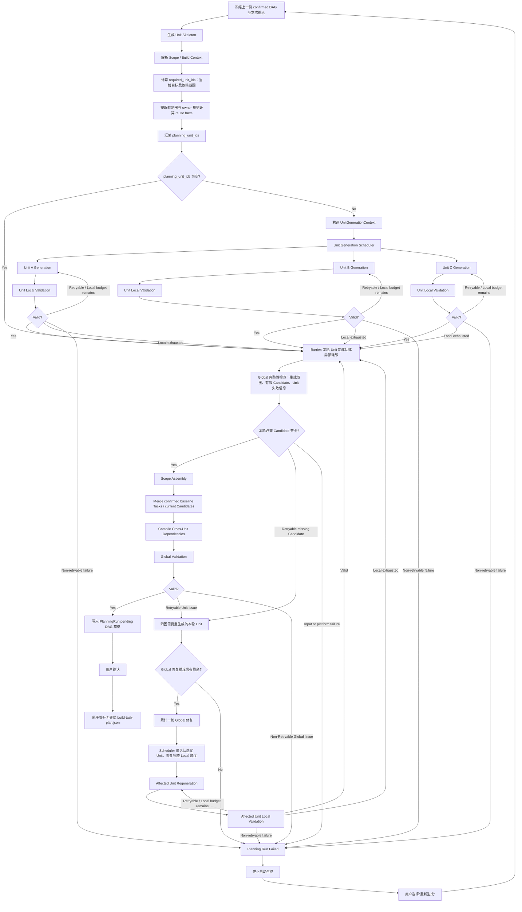

# DAG 任务生成优化——指导性设计计划

> 本文是后续详细设计的架构基线。本文中的 `UnitCandidate` 始终指当前 `PlanningRun` 新生成的任务增量，不是某个 Unit 的历史任务全集；上一份 confirmed DAG 是只读基线。

## 当前讨论进度与剩余议题

本表对应本轮讨论的十项议题，不改变正文的指导性计划与六个实施 Step。区分已确认决策、待确认建议和必要实施衔接；第 6 项已收口，后续按第 7—10 项顺序推进，不因正文保留早期概念草图而重新讨论已确认边界。

| 议题 | 当前进度 | 还需要明确的内容 |
| --- | --- | --- |
| 1. UnitGenerationContext | 输入范围、来源与切片主线已讨论；必需合同提供途径、冻结输入和 UI 代码不进入规划已确认。 | 公共／专属输入字段表最后统一对齐，尤其生成范围、资源清单与正式来源的表达；不重新讨论输入范围。冻结材料的工具签名、读取限额及上下文管理归第 10 项，持久化引用归第 8 项。 |
| 2. 各类 Unit 生成与复用 | Endpoint、static、Page、adapter 与 auth-guard 方向已确认；shell 前置检查／复用边界已明确。 | 文档仍有一个具体尾项：shell 无可复用任务且确需贡献时，原有规划职责如何落成具体任务与输入。只沿用现有职责，不增加自动修复。bootstrap 具体数据源配置判断继续延期；同 Unit 追加／替换归第 7 项。 |
| 3. UnitCandidate 与模型响应 | 已确认，可以收口。 | 状态枚举及存储归第 8 项，具体校验接入沿第 4、5 项落实；不重新讨论模型响应与整 Unit 重生成边界。 |
| 4. 现有校验盘点与分层 | 已完成代码盘点并讨论分层；Local／Global 与输入／平台原因的区分已由后续议题进一步明确。 | 分层表与第 5 项已确认归因规则统一复核；原始响应严格检查、auth-guard 精确路径例外、环路定位等属于已识别的实施适配，不再另开通用校验设计。 |
| 5. 结构化错误与归因 | 已确认，可以收口。 | 无独立新议题。Task 替换相关归因要引用第 7 项最终规则，错误与状态的保存归第 8 项。 |
| 6. 重试次数与失败处理 | 已确认，可以收口：Local 每轮 3 次总尝试、Global 2 轮修复、基础设施自动重试 0 次；Global 与 Local 反馈显式分区；基础设施故障结束 Run，由上层人工发起新 Run。 | 无独立新议题。具体轮次／失败结果存储归第 8 项，调用中断、收尾时限和事件格式归第 10 项。 |
| 7. Scope Assembly | 串行合并、历史只读、Candidate 仅本轮贡献已确定，细则尚未展开。 | 明确保留／新增／显式替换的 Task 集合；共享 Unit 保留旧 Task 并追加新 Task；ID 碰撞与合法替换的区分；替换后的依赖引用、跨 Unit／保留任务依赖及验收编译。不能照搬当前整个 Unit 替换。 |
| 8. PlanningRun / Unit / Candidate 状态与存储 | 身份与生命周期职责已区分，具体结构尚未定稿。 | 状态及转换；Unit 本轮耗尽与 Run 最终失败分别表达；生成轮次和局部次数；同 Unit 同时复用与生成的状态；内存／持久化分工；刷新后的进度和失败详情。基础设施故障按上层新 Run 方向处理，不额外设计 PlanningRun 内人工暂停／继续。 |
| 9. 草稿确认与正式 DAG 提升 | 草稿与正式文件隔离、确认同一份 DAG 后原子提升已确定。 | 最终路径与草稿身份绑定、确认时精确定位、防止陈旧确认、原子替换和写入失败处理；取消／重新生成对草稿的处理；确认界面与 Build 读取与门禁契约。 |
| 10. Unit Scheduler 与进度交互 | 有限并发只用于 Candidate 生成，沿用 AG-UI 已确定。 | 并发数与模型调用方式；请求／Unit 会话超时、调用／读取上限和上下文管理；取消及迟到结果隔离；Unit 重试与 Global 缺项／校验事件；基础设施错误的上层重新生成动作、进度与失败展示。 |

第 1、2 项尾项最后集中对齐即可；第 4 项以现有盘点和已确认规则落实，不重新从代码盘点开始。主线剩余工作是第 7—10 项逐项明确。

继续延期或排除：Task 输入依赖表、跨 Run 输入变化检测和精确失效传播、Task 级独立生成／局部重试、跨 Run Candidate 缓存、共享 Unit 多 Scope 并发版本管理、Build 执行调度改造、通用语义覆盖校验及额外审核模型。bootstrap 具体数据源配置判断、api-client 进一步拆分、static 按 sourceId 改造均不成为本轮前置要求。

## 0. 本轮改造目标

当前任务规划流程的主要问题是：

- 一个 Scope 的多个 `planning_unit_ids` 一次性交给模型；
- 模型返回一份大的扁平 `tasks[]`；
- Task 数量越多，完整输出越慢，也更容易发生截断；
- 任意一个 Unit / Task 校验失败，整个 Scope 重新生成；
- 已成功内容在重试中被重复生成，存在成本浪费和语义漂移；
- 用户只能看到“生成中”，无法知道具体生成到哪里、哪里正在重试。

本次改造目标不是重做现有 DAG 系统，而是：

> 保留现有 Unit Graph、Task DAG、Scope Assembly、用户确认和 Build 执行模型，只重构“任务生成阶段”。

核心目标：

> **将 Scope 级整批任务生成，改造成 Unit 级独立 Candidate 生成、局部校验、有限并行和局部自动重试；最终仍由 Scope 负责完整 DAG 的原子组装和一致性确认。**

本轮范围收敛：Task 前置输入依赖清单、跨 PlanningRun 输入变化检测、精确失效与自动替换传播暂不设计，待上游产物结构稳定后专项处理。现有复用逻辑、正式产物有效性检查和确认门禁继续保留，本轮不新增业务失效机制，也不保证前置产物变化后的自动正确复用。

---

# 一、总体架构原则

当前需要明确两个最重要的边界。

## 1. Unit：生成隔离边界

可生成 Unit 是当前 Planning Run 内：

- 模型生成；
- Candidate 保存；
- 局部校验；
- 自动重试；
- 失败隔离；

的最小边界。

即：

```text
Task 出错
    ↓
归属到 Unit
    ↓
重新生成该 Unit 在当前 PlanningRun 中的完整 UnitCandidate
```

当前阶段**不进一步做 Task 级局部重新生成**。

原因是：

- 同 Unit Task 数量可能变化；
- Unit 内 Task dependency 相关；
- `change_scope` / 文件范围可能整体变化；
- 单独替换一个 Task 容易造成新旧 Task 不一致。

因此：

```text
Unit = Generation / Validation / Retry Boundary
```

这里的“整个 Unit”只指本轮 Candidate。上一份 confirmed DAG 中已经确认的 Task 不进入 Candidate，也不会因为本轮失败而重新生成。

同一个 `unit_id` 在流程中有三种不同载体，不能混称为“同一个 Unit”：

```text
Unit Skeleton Node
= 生成前 Unit Graph 中的结构节点

UnitCandidate
= 当前 PlanningRun 针对一个 unit_id 生成的临时任务包，只含本轮任务

build-task-plan.build_units[unit_id]
= Scope Assembly 后根据 Task.unit_id 编译出的累计 DAG 分组
```

本设计把第二种 `UnitCandidate` 作为生成和重试边界；第三种 `build_units` 仍按现有 `build-task-plan.json` 契约保留，不应把二者混为一体。

---

## 2. Scope：全局一致性和提交边界

Unit Candidate 成功并不代表已经正式进入应用 DAG。

每轮 Unit 均成功或局部耗尽后，先进入 Global 完整性检查；必需 Candidate 缺失时，在 Global 独立修复预算内补生成对应 Unit。下面是允许提交草稿的条件，不是首次进入 Global 检查的条件。

只有：

```text
所有 planning Unit Candidate 稳定
且 required Unit 的复用事实有效
        ↓
Scope Assembly
        ↓
Global Validation
        ↓
通过
```

以后，才可以：

```text
生成本轮 pending DAG 草稿
        ↓
用户确认
        ↓
原子替换正式 build-task-plan.json
```

因此：

```text
Unit = Candidate Isolation Boundary
Scope = Commit / Consistency Boundary
```

或者更简单地描述为：

> **Unit 负责失败隔离，Scope 负责全局一致性。**

---

# 二、顶层流程

目标流程建议固定为：



---

# 三、整个系统建议划分成四层

后续项目分析建议按这四层逐层深入。

```text
┌──────────────────────────────────────────┐
│ Layer 1：Planning Run / Scope            │
│                                          │
│ 管理本轮任务规划生命周期和最终 Commit        │
└──────────────────────┬───────────────────┘
                       │
┌──────────────────────▼───────────────────┐
│ Layer 2：Unit Generation                 │
│                                          │
│ Unit Context / Generation / Retry        │
│ Candidate Lifecycle                      │
└──────────────────────┬───────────────────┘
                       │
┌──────────────────────▼───────────────────┐
│ Layer 3：Validation & Assembly           │
│                                          │
│ Unit Local Validation                    │
│ Scope Assembly                           │
│ Global Validation / Error Attribution    │
└──────────────────────┬───────────────────┘
                       │
┌──────────────────────▼───────────────────┐
│ Layer 4：Infrastructure                  │
│                                          │
│ Model Invocation / Concurrency / Timeout │
│ Progress Events / Persistence            │
└──────────────────────────────────────────┘
```

第一阶段项目分析时，不要直接跳到 Layer 4。

优先把：

```text
Scope
Unit
Candidate
Validation
Assembly
```

这些领域边界定义清楚。

---

# 四、Unit 类型继续沿用现有项目定义

不重新设计 Unit 分类。

## 结构 Unit

```text
application:root
app:integration
```

设计目标：

```text
generatable = false
```

只参与：

- Unit Graph；
- 结构关系；
- Scope Assembly；

不参与模型 Task Generation。

同时需要项目内确认并补强：

- `planning_unit_ids` 不允许包含 structural Unit；
- Task 不允许归属 structural Unit；
- Task 缺少 `unit_id` 时不能继续 fallback 到 `application:root`。

---

## 共享能力 Unit

```text
frontend:shell
frontend:api-client
frontend:auth-guard
backend:bootstrap
```

它们：

- 属于应用级共享能力；
- Candidate 可以由某个 Scope 触发生成，但只包含本轮新增或替换的任务；
- 但正式生效必须等待当前 Scope Commit；
- 生效后进入应用累计 DAG，供后续 Scope 复用。

本设计采用以下外部前提：

> 同一项目不会同时存在两个 Scope Planning Run。

该约束由 PlanningRun 上游生命周期负责实现，不属于本轮任务生成改造。基于该前提，本轮暂时不解决 Shared Unit 多 Scope 并发版本问题。

但后续仍需要单独分析：

- 共享能力不足时如何重新打开 Unit；
- `frontend:auth-guard` 资源点清单匹配信息的绑定方式及变化时的新增条件（职责、固定规则生成和同清单任务复用已明确，见下文）；
- `frontend:api-client` 生命周期是否需要进一步拆分。

### shell 当前讨论边界：前置检查后复用或生成

- 先沿用现有工作区与模板就绪检查；检查发现异常时，按前置条件不满足处理并停止任务生成。本轮不增加菜单或页面入口的自动补齐，也不增加其他工作区自动修复。
- 检查通过后，判断上一份 confirmed DAG 中的 shell 任务能否复用；已选定保留的任务不因尚未执行而重生成，原执行状态保持不变。
- 无可复用任务、需要本轮贡献时，保留按原有任务规划路径生成 shell Candidate 的可能性，不将 shell 预先限定为永不生成任务的 Unit。
- 新 shell 任务的具体职责、所需输入和生成条件尚未明确，后续继续分析；不能把前置检查异常转换成 shell 修复任务，也不为保证非空 Candidate 而虚构检查任务或框架修改职责。

### 已确认：auth-guard 承担资源注入任务，先于页面实施

`frontend:auth-guard` 的业务职责是把前面设计和规划阶段已经确定的全部资源点注入 auth 模板的 `src/constants/resources.ts`，在应用工作区中的精确路径为 `frontend/src/constants/resources.ts`。该职责由一个独立的 DAG Task 承担，并作为当前权限场景下 Page 页面实施 Task 的前置依赖；不采用“auth-guard 仅保留能力标识、不生成任务”的建议。

**已确认的任务复用原则与执行边界：** 对未发生变化的同一份规划资源点清单，上一份 confirmed DAG 中已有对应资源注入任务时，生成阶段保留同一任务及其身份，后续页面依赖该任务，不因切换页面或开启新的页面 PlanningRun 而重复生成。是否保留任务不以已经执行成功为条件：已有任务尚未执行或执行失败，都不能仅因此另生成一份相同任务。生成阶段只判断已有任务是否对应本轮所需的资源注入职责，以及是否存在必须新增的任务贡献，不负责判断该任务现在是否应执行、跳过或重试。

资源注入成功执行并通过校验一次后，同一份未变化的资源点清单无需因页面切换而重复执行；这是执行阶段的行为要求。执行状态读取、成功证据绑定、完成任务跳过和失败任务重试均由 Build 执行阶段负责，不列为本轮 DAG 生成设计的前置工作。当前 Build 运行状态由 Graph checkpoint 保存，正式 DAG 是任务计划的权威来源；跨 Run 是否正确取得执行状态属于执行衔接问题，不能据此要求生成阶段重建已有任务。本项不扩展为通用 Task 输入失效机制或 Build 调度改造。

**已确认的生成方式：** 需要本轮新增资源注入贡献时，由平台按固定规则构造一个仅包含一项新 Task 的 auth-guard Candidate，不调用模型规划该任务。任务目标、输入和文件范围已由正式资源事实及既定职责确定，不由模型再次推导资源点。这里生成的是任务记录，资源文件仍在用户确认 DAG 后的执行阶段写入；固定规则生成的 Candidate 继续进入既定校验和 Scope Assembly 流程。

上一份 confirmed DAG 已有对应任务、且绑定的资源点清单相同时，保留原任务和 ID，不产生本轮 auth-guard Candidate，页面依赖原任务。保留任务不重新包装成本轮 Candidate，也不以执行状态或成功证据作为任务匹配的条件。

**生成输入与输出边界：**

- 资源事实来自本次冻结的已确认 TechnicalPlan `authorization_manifest.resources` 完整清单，包括其中已声明的 system、page、operation 资源。该共享 Unit 不按当前页面裁剪资源点清单，不新增或猜测资源点。
- 复用 `authorization_frontend_projection._resource_catalog` 与 `resource_constant_reference` 的资源映射、唯一性检查和稳定排序，向 Unit Context 提供已有 `{group, name, resourceKey}[]` 结构；现有 `_render_resources` 可用于确定性内容生成，具体文件注入方式仍待明确。
- Context 同时提供模板变体、权限启用信息、资源点清单的正式来源引用，以及目标文件的工作区事实，用于确认任务适用范围和输入来源。
- 复用判断读取上一份 confirmed DAG 中保留任务的 ID、职责及其绑定的资源点清单。这些属于任务计划输入，不包含执行成功的前置要求；绑定信息的具体字段与保存方式尚待明确，不能假设现有任务已具备这些数据。
- 新 Task 的 `unit_id` 固定为 `frontend:auth-guard`，`owner` 为 `frontend`，职责为将确认的完整资源点清单写入前端资源常量文件，文件范围仅为 `frontend/src/constants/resources.ts`，输入绑定本轮冻结的资源点清单及正式来源。RouteGuard、AuthProvider、页面操作权限包装、路由文件和后端 AuthConstants 不纳入该任务。完整 Task 字段及 Candidate 包装结构在 UnitCandidate 与模型响应契约议题统一确定。
- Task 只在用户确认 DAG 后执行，成功结果需要证明资源文件符合本轮确认的资源目录，随后页面实施 Task 才可执行。Page 的规划与 Candidate 生成继续消费同一份正式权限切片，不等待 auth-guard Candidate 内容；执行依赖不能变成模型生成依赖。

**现有实现差异与必要衔接：**

- 现有资源映射、文件渲染和 Unit Graph 到 Task 依赖编译逻辑可以复用，但尚未完成上述独立资源注入 Task 的固定构造与接入；不能将已确认的目标设计描述为当前已实现。
- 当前调用链是 `graph/subgraphs/build.run_build_scheduler → apply_authorization_platform_projections → apply_authorization_frontend_projection`，发生在 Build 门禁通过后、普通任务派发前；输入为确认 DAG 中的 `authorization_frontend_projection`。该函数同时写入 resources.ts 和 routes.tsx；resources.ts 当前直接完整渲染并原子写入，没有资源目录未变化则跳过的判断。落地时需分离资源写入职责，由 auth-guard Task 唯一承担，避免平台步骤和 Task 重复写入同一份资源目录；路由投影及后端 AuthConstants 的既有职责不因此转移给 auth-guard。
- 当前规划提示词、前端执行规范和 `_template_boundary_errors` 禁止普通任务修改 resources.ts。需要为此 Unit 的资源注入职责同步调整精确边界，其他 Unit 仍不得写入该文件。
- 当前 auth-guard → Page 边依赖 `_page_requires_auth` 读取页面 permissions。目标依赖应按上述资源注入职责和正式权限场景建立，不能仅靠旧判断漏掉本轮页面实施任务；继续复用现有 Unit Graph 到 Task 依赖的编译与调度，不新增执行调度机制。
- 现有资源校验与路由校验耦合在 `verify_authorization_frontend_projection` 中；资源部分需可用于此 Task 的完成校验，不能等到全部页面实施后才判断其前置资源任务是否成功。这是执行阶段的衔接要求，不要求生成阶段先取得成功执行证据或校验资源文件已完成注入。

尚待明确：用于避免重复生成的资源点清单匹配信息的绑定字段与保存方式、清单变化时的本轮新增条件、最终 Task 字段与 Candidate 包装结构，以及注入是否沿用当前整文件渲染或采用明确托管区域。成功执行证据绑定与是否重执行不属于本项生成设计。现有实现是完整渲染资源文件，不能将其描述成已经具备任意模板内容的增量合并能力。本项不重新引入菜单／页面入口自动补齐，不新增通用跨 Run 失效专项。

### 已确认延期：bootstrap 的数据源配置判断

`backend:bootstrap` 的具体数据源配置判断尚未设计，本轮暂不讨论或实现，包括具体连接配置是否可复用、是否需要新增配置，以及不同数据库连接的配置处理。不将这些判断作为本轮按 Unit 拆分任务生成的前置要求，也不将此前关于这些判断的建议视为已确认规则；现有实现不因此被认定为已支持多数据源配置。

---

## 业务实现 Unit

```text
backend:endpoint:<contractId>:<endpointId>
frontend:data:<sourceId>
page:<pageId>
```

这里的 `frontend:data:<sourceId>` 是目标抽象；当前 `build_context_resolver.py` 对 static 场景仍使用 `frontend:data:static`。后续若要改为按 sourceId 拆分，应作为单独的 Unit Skeleton / resolver 契约调整，不能在本轮并行生成改造中默认它已经实现。

是 Unit 独立生成机制最主要的对象。

当前已经基本确认：

- Page 不需要 Endpoint Task 内容；
- Endpoint 不需要 Bootstrap Task 内容；
- 生成依赖的是正式 Contract，而不是上游 Task Candidate；
- 跨 Unit Task dependency 由 Unit Graph 编译。

因此默认可以独立生成。

---

# 五、模型调用边界

在进入模型调用前，必须先区分三个概念：

```text
required_unit_ids
= 当前 Scope 构成完整 DAG 所需要的全部 Unit

reuse_facts
= 从上一份 confirmed DAG 确定性计算出的可复用 Task / capability / endpoint owner

planning_unit_ids
= required_unit_ids 中本轮确实存在生成缺口、需要产生 UnitCandidate 的 Unit
```

因此，`required_unit_ids` 本身不是“需要重新生成的 Unit 列表”，也不能仅凭“该 Unit 历史上有 Task”判断整个 Unit 可复用。共享 Unit 可能同时包含历史可复用 Task 和本轮需要新增的 Task。

第一版应优先沿用并收敛项目中的现有逻辑：

- `_replaceable_unit_ids`：作为计算 `planning_unit_ids` 的起点；
- `_add_reusable_task_context`：投影可复用任务事实；
- `_retained_frontend_endpoint_owner_constraints`：投影已确认的 API endpoint owner；
- `frontend_endpoint_ownership_errors` 与 `retained_frontend_endpoint_owner_conflict_errors`：作为生成后的确定性兜底校验。

需要补强的是：现有显式 reusable task context 主要只覆盖 `frontend:shell`，不能直接视为完整的通用复用机制。新设计应统一以“上一份 confirmed DAG + 本轮正式输入”为依据计算复用和生成缺口。

已确认的范围限制：复用判断只依赖明确记录的目标、归属、正式来源和逐类定义的复用规则，不新增通过比较 Task 描述与业务要求来判断语义相似度的通用复用机制。存在历史任务也不等于平台已经证明其完整满足本轮业务语义。

已确认：对于已由复用规则选定保留的依赖 Task，不因为它尚未执行就再次生成。正式 DAG 的 `confirmation_status = confirmed` 与其中 Task 的 `status = pending` 可以同时成立；保留的是任务计划，不能因此把执行状态改为完成。是否需要执行继续由现有 Build 流程决定。该规则不意味着任意同名历史 Task 都可以复用，也不把 pending DAG 草稿纳入正式复用基线。

如果逐类规则计算出的 `planning_unit_ids` 为空，应跳过模型调用，直接进入 Scope Assembly 和 Global Validation。这只表示本轮无需新增任务规划，不表示历史 Task 均已执行或代码能力已经通过验收。

### 已确认：Endpoint、static data、Page 的生成与复用方向

| Unit | 本轮需要生成时 | 任务复用边界 |
| --- | --- | --- |
| Endpoint | 沿用强约束模型规划；每个相关实体按数据库 `objects → repository → service → controller` 或外部 API `upstream → mapping → service → controller` 生成，同一个 Unit 统一返回 Candidate。 | 按 `(api_contract_id, endpoint_id)` 匹配已确认任务包；作为后续页面依赖且已选定保留时，不重复生成其阶段任务。 |
| static data | 沿用当前一项数据模块任务的规则，承担当次生成范围内的静态实体及供页面调用的数据操作。 | 按明确登记的实体和操作范围匹配保留职责；新增实体或操作尚无任务承担时，产生本轮贡献，不能仅因 static Unit 下已有任务就整体跳过。 |
| Page | 按 PageImplementationContract 强约束生成，任务数量不固定，复用页面入口并只规划页面业务职责。 | 按 `page_id` 匹配已确认页面任务包；已选定保留时不重复生成，明确要求重新生成该页面时才进入本轮替换范围。 |

这里的 static 数据操作是按正式合同实现的前端内存模拟 API，供页面通过异步函数查询或更新内存记录；不生成真实 HTTP 服务、代理或 Mock 服务，不默认补齐合同未声明的增删改查。已有任务承担同一实体的查询，不等于它也承担新增、修改等其他操作；匹配的是任务绑定的正式操作范围，不是验收代码是否已实现。

上述方向适用于正式输入仍适用的场景，不新增跨 Run 变化检测、任务描述语义相似度判断或执行成功证据要求。具体同 Unit 追加、替换、ID 和依赖处理留到 Scope Assembly 议题。

### 已确认：生成集合与模型调用列表的区别

```text
required_unit_ids = 当前目标及其必要依赖 Unit
reuse_facts = 从 confirmed DAG 按逐类规则提取的保留任务和职责
generation_scope[unit] = 该 Unit 本轮需要新增或明确替换的职责
planning_unit_ids = generation_scope 非空的可生成 Unit
```

不能用“所需 Unit 减去已有任务的 Unit”直接计算待生成集合；同一个共享 Unit 可以同时存在保留任务和本轮新贡献。`planning_unit_ids` 也不等于模型调用列表：auth-guard 需要新增任务时属于待生成 Unit，但由平台固定构造 Candidate。当前 `_replaceable_unit_ids` 只能作为计算起点，尚未实现上述所有逐类职责判断；bootstrap 具体数据源配置判断仍按已确认边界延期。

当前：

```text
Scope
    ↓
多个 planning_unit_ids
    ↓
一个 combined prompt
    ↓
一个大 tasks[]
```

目标：

```text
Scope
    ↓
planning_unit_ids
    ↓
多个 UnitGenerationContext
    ↓
多个 Unit Generation Request
```

例如：

```text
frontend:api-client
        ↓
Model Request A

backend:bootstrap
        ↓
Model Request B

backend:endpoint:user:list
        ↓
Model Request C

page:user-list
        ↓
Model Request D
```

这些调用由统一：

```text
Unit Generation Scheduler
```

管理。

默认采用：

```text
bounded concurrency
```

而不是无限并发。

具体并发数暂不在当前设计层决定。

---

# 六、解除 combined prompt 的关键耦合

当前最明确的跨 Unit 一致性问题是：

```text
业务 API module
到底属于 frontend:api-client
还是 page:*
```

例如：

```text
user.ts
```

项目当前 prompt 已经基本规定：

```text
业务 API module → frontend:api-client
页面实现 → page:user-list
```

因此，这不是让模型在两个 Unit 之间自由选择 owner。改造重点是把当前 combined prompt 中的约束提升为生成前的平台 Ownership Rule，并在单 Unit Context 中显式提供：

```text
API module
→ frontend:api-client

Page implementation
→ page:*
```

例如：

```text
responseEntity.ts
Unit = frontend:api-client

user.ts
Unit = frontend:api-client

frontend/src/pages/UserList/index.tsx
Unit = page:user-list
```

这属于：

> **生成前确定性 Ownership Rule**

而不是运行过程中再让模型跨 Unit 协商。

后续项目内还应继续寻找类似的：

```text
当前依赖 combined prompt 协调
但实际上可以平台确定
```

的规则。

## API module 的复用判断时机

API module 重复利用需要“生成前判断 + 生成后校验”，但两者职责不同：

```text
上一份 confirmed DAG
        ↓
平台确定性提取 endpoint owner / 已有 capability / 可复用 Task 摘要
        ↓
计算本轮缺口和 planning_unit_ids
        ↓
只把必要的复用约束放入 UnitGenerationContext
        ↓
模型生成缺失任务
        ↓
平台再次校验 endpoint owner 唯一性和历史冲突
```

- **生成前**：平台按明确的逐类规则判断哪些历史任务保留、哪些任务无需二次生成；不将保留任务等同于代码能力已实现。模型不负责以语义推测替代这些复用规则。
- **给模型的上下文**：只提供结构化的 owner / capability / retained Task 摘要，不把全部历史 Task 内容塞进 prompt。
- **生成后**：确定性校验是安全兜底，用来阻止模型重复声明已经由历史 Task 拥有的 API module 或 endpoint。

因此，现有 retained frontend endpoint owner constraint 应保留并下沉为 Unit Context 的一部分；现有 ownership conflict validation 也应保留。不能二选一。

### 已确认：契约未变化时的 API module 跨页面复用

前提是对应正式 API 契约未变化，且历史任务不在本轮明确替换的范围内。平台按 `api_contract_id + endpoint_id` 查询正式 DAG 的 Endpoint implementation-owner 索引：

- 找到唯一 owner Task：保留该 Task，把 `reuse_only` 约束提供给本轮 Page / API Client Context；消费页面不再生成该 Endpoint 的 API module 实现任务。
- 未找到 owner Task：该 Endpoint 没有可复用的 owner 任务，本轮需要规划对应 API module；不能因为 `frontend:api-client` 已登记其他 Task 就跳过整个 Unit。
- 找到多个 owner Task：报告历史职责冲突并停止，不让模型任意选择 owner，也不自动重生成历史 Unit。
- 匹配依据是明确的 Endpoint 身份及 owner 记录，不是 Task 描述、文件名或自然语言语义相似度。

本规则描述契约未变化的复用场景，不意味着本轮新增了一套验证“契约未变化”的 Task 级机制。输入变更后的精确失效与替换延期专项设计；已有门禁发现问题时仍按现有机制处理，不能因延期而跳过检查或假定旧 Task 一定适用。

### 已确认：共享响应适配器的生成依据与任务复用

`frontend:api-client` 中的共享响应适配器是固定的 `frontend/src/apis/responseEntity.ts`。它按项目既有传输约定处理 `returnCode / errorMsg / body`、`SUC0000` 成功码、业务错误、协议错误和空响应；业务 API 模块通过它向页面返回业务数据 `T`。正式 API Contract 决定各接口的业务类型和是否有响应数据，适配器不因消费页面或业务类型不同而重复生成。实际 `service.ts` 的返回约定由业务模块执行时读取并采用；static 模块不使用该 HTTP 适配器。

规划阶段复用的是上一份 confirmed DAG 中已选定保留的适配器任务，按明确身份识别：

```text
unit_id = frontend:api-client
owner = frontend
deliverable.kind = frontend.shared_capability
deliverable.target_id = response-entity-adapter
deliverable.provides 包含 frontend.response-entity-adapter
```

- 有明确对应的保留任务时，本轮不重复生成适配器任务；保留任务尚未执行也可复用其计划，执行状态保持不变，后续是否派发沿用 Build 调度。
- 本轮需要适配器但没有可复用任务时，沿用已有固定任务生成规则；磁盘上存在同名文件不单独构成规划复用依据，执行时仍需读取并按合同处理现有实现。
- 适配器任务与业务 Endpoint owner 分别判断：api-client 中已有其他任务不意味着适配器已被规划，保留适配器也不意味着本轮新增 Endpoint 无需生成业务 API 模块。
- Task 身份与 deliverable 声明只用于确定任务职责，不能证明代码行为正确；代码是否满足合同继续由执行与验收处理，不能把通用验收描述成已有完整的适配器行为校验器。

现有代码已有适配器的固定生成和执行规则，但显式 `reusable_tasks_by_unit` 生产逻辑主要覆盖 shell。上述适配器专属任务识别是目标设计，不能视为当前已经完整实现的复用能力，也不推广成所有共享能力的通用规则。本项不新增传输合同变化检测或历史任务自动失效机制。

### 延期专项：Task 前置输入与失效处理

- 不在本轮定义逐类 Task 的完整前置输入依赖表、最小输入切片、跨 Run 哈希比较或自动失效传播，也不把这些内容作为 Unit 独立生成的实施前置。
- 之前讨论的“当前页面/API 及其依赖任务变化时替换、无关历史任务不处理”保留为后续专项的范围意向，不作为第一版已经具备或必须新增的能力。
- 现有 `business_acceptance_checks[].sources[]` 及 Build 来源检查保持原样。本轮不将它们改造成通用的生成前 Task 失效判定器；其共享任务覆盖不足和切片粒度问题留到专项解决。
- 本轮仍需要构造 UnitGenerationContext，以便独立模型调用；这不等于设计逐 Task 的跨 Run 失效依赖表。冻结本次 Run 输入、核对草稿身份及确认基线，也不属于本次延期的业务失效机制。

---

# 七、UnitGenerationContext

这是实现 Unit 独立生成最关键的新契约之一。

原则：

> 一个 Unit 必须能够仅依赖自己的 `UnitGenerationContext` 完成任务规划，不读取其他 Unit 的 Candidate Task 内容。

建议概念模型：

```text
UnitGenerationContext
├── planning_run_id
├── scope_id
├── unit_id
├── unit_kind
├── base_confirmed_plan_digest
│
├── formal_contracts
│   ├── PageImplementationContract
│   ├── Endpoint Contract
│   ├── API Contract
│   ├── EntityDesign
│   └── EntitySourceBinding
│
├── workspace_context
│   ├── WorkspaceSnapshot
│   ├── architecture facts
│   └── reuse conventions
│
├── dependency_context
│   ├── dependency_unit_ids
│   ├── dependency_capabilities
│   ├── retained_task_summaries
│   ├── retained_endpoint_owner_constraints
│   └── Unit Graph slice
│
├── constraints
│   ├── owner constraints
│   ├── authorization constraints
│   ├── managed-file constraints
│   └── capability ownership rules
│
└── generation_policy
    ├── max_attempts
    ├── strong rules
    └── expected task rules
```

注意：

当前 `Unit.source_refs` 仍然可以继续作为：

```text
traceability metadata
```

但不要直接等同于 `UnitGenerationContext`。

## 输入清单收敛稿（输入边界已明确，字段表待最终对齐）

本节把生成前输入集中列出，供一次性审阅。表中的目标结构属于建议，不表示当前代码已经提供完整的单 Unit Context；其中 shell 前置检查、auth-guard 固定规则生成、保留任务不以执行成功为前提、bootstrap 数据源配置判断延期等边界沿用本次讨论已确认的结论。生成方式是平台控制参数，不是实体的数据来源。

### 公共输入、来源与必填条件

| 输入组 | 建议内容 | 来源与必填条件 |
| --- | --- | --- |
| 身份 | `planning_run_id`、`scope_id`、`unit_id`、`unit_kind`、`base_confirmed_plan_digest` | Run／Scope 由平台创建，Unit 来自现有 Unit Skeleton；所有 Context 必填。首次没有 confirmed DAG 时，基线摘要为 null，并明确使用空基线，不拿失败或未确认计划替代。 |
| 本轮生成范围 | `generation_scope`：本轮负责的正式目标引用、需要新增的职责、不得重复生成的保留职责 | 由平台生成前计算，所有待生成 Unit 必填。Endpoint 使用 `(api_contract_id, endpoint_id)`，Page 使用 `page_id`，共享 Unit 使用本轮所需职责；Unit 只生成该范围内的任务。此字段是对概念模型的补充建议。 |
| 正式合同 | `formal_contracts`：适用的合同正文／有界结构化切片，以及对应正式来源引用；较大合同的受控读取方向见下文已确认规则 | 来自已确认正式产物，经现有运行时合同编译与绑定摘要逻辑组装。按下表条件必填；直接提供内容，或提供实际可查询读取的冻结输入引用，不能只给路径并假定模型已有文件工具。无关合同不下发。 |
| 工作区事实 | `workspace_context`：同一份 WorkspaceSnapshot 的身份及 Unit 相关切片、模板变体、适用的预置文件清单和架构事实 | 快照来自 `inspect_workspace`，模板信息来自既有模板就绪检查，预置清单来自 `prebuilt_files_for_plan`。提供真实路径、目录、入口、已有文件等规划事实，不将路径存在等同于代码功能已满足。 |
| 依赖与保留事实 | `dependency_context`：直接依赖 Unit、相关 Unit Graph 边、必要的保留任务摘要、已有职责和 Endpoint owner 约束 | 来自 Unit Skeleton／Unit Graph 及上一份 confirmed DAG。相关集合必填，无相关记录时为空。保留任务摘要只含 ID、Unit、职责、交付物、能力、文件范围及必要正式输入引用，不要求成功执行记录，不下发历史任务全集。 |
| 约束 | `constraints`：owner、文件职责边界、适用权限切片、已有确定性唯一归属规则 | 来自现有规划规则、模板边界、权限 Overlay 和保留任务索引。仅传适用于该 Unit 的约束；不存在权限场景时明确不适用，不伪造权限事实。 |
| 生成控制 | `generation_policy`：固定规则或模型生成、适用 Task 字段契约及阶段规则 | 由平台选择，属于控制参数。具体重试次数与反馈结构在重试议题确定，不在正式合同输入中混入执行状态或重试决策。 |

### 各类 Unit 的专属正式输入与切片

| Unit | 需要的专属输入 | 切片与来源 |
| --- | --- | --- |
| `frontend:shell` | 前端模板／工作区就绪事实、平台选定的本轮 shell 职责、保留 shell 任务摘要 | 沿用现有前置检查与前端快照。异常作为前置条件不满足；不新增菜单、页面入口自动补齐。无可复用任务时，仅为原有规划职责提供输入，不在本节扩张 shell 职责。 |
| `frontend:api-client` | 本轮需要生成模块的 Endpoint 引用及 API Contract；固定响应适配约定；保留适配器任务及 Endpoint owner 信息 | 按 `(api_contract_id, endpoint_id)` 选择 Endpoint，保留所属契约的 schemas。工作区只提供相关前端目录、API 文件及 service 路径事实。不提供后端 Candidate 或数据库实现绑定；接口请求、响应和空响应等约定来自正式 API 合同。 |
| `frontend:auth-guard` | 完整 `authorization_manifest.resources`、规范化的 `{group, name, resourceKey}[]`、权限启用与模板信息、保留任务绑定的资源点清单 | 来源为已确认 TechnicalPlan，复用现有资源映射逻辑；共享资源点清单不按页面裁剪。需要新增时由平台固定构造资源注入任务，目标仅为 `frontend/src/constants/resources.ts`。任务绑定清单由平台随正式输入来源补充；具体保存字段在第 8 项统一确定，不重新打开第 3 项模型响应契约。 |
| `backend:bootstrap` | 当前 Scope 所需的后端数据来源类型及正式实体绑定引用、既有基础能力规则、后端工程路径事实、保留 bootstrap 任务职责 | 复用现有 resolver、实体摘要和后端快照裁剪。具体连接配置的复用／新增判断继续延期；本节不据此设计多数据源配置或新的缺口判定算法。 |
| `backend:endpoint:<contractId>:<endpointId>` | 当前 Endpoint 的完整实施语义、所属 API Contract 的 schema、相关实体字段及确认的数据来源绑定、当前 Endpoint 权限切片 | 固定为一个接口，包含该接口相关实体，整个 Unit 的阶段任务使用同一份输入。数据库保留表／字段映射；外部 API 只保留通过该接口引用匹配到的操作、请求响应结构和字段映射。复用 `_endpoint_context`、`entity_design_summaries` 和 `unit_authorization_slice`，不读取 bootstrap Candidate 或其他 Endpoint Candidate。 |
| static data Unit | 本轮相关 static 实体字段、确认的静态绑定摘要及其正式来源引用、对页面暴露的数据接口合同、前端模块路径事实 | 沿用现有 static 实体过滤和规划摘要；当前摘要包含种子行数与字段取值项数，不把它称为完整静态数据。具体记录供执行阶段按绑定的正式来源读取，不要求任务规划携带整批数据。沿用当前解析出的 Unit ID，本节不要求改成按 sourceId 拆分。 |
| `page:<pageId>` | 当前 PageImplementationContract 中已编译的交互行为、接口绑定、权限、导航与验收要求，消费的 API／static 接口合同，以及页面相关工作区事实 | 页面合同只保留本页；导航目标只提供 ID、路径等必要事实。消费接口保留请求／响应 schema 与正式字段绑定；不提供后端数据库／上游外部服务绑定或其他 Unit Candidate。复用页面合同编译、`_page_context`、`_scoped_pages` 与权限切片。`uiDesignRef` 可作为来源和执行引用随合同保留，但 UI Design 代码正文不列为任务生成输入，由前端执行 Agent 读取以还原页面。UI 已正式跳过时沿用现有跳过分支。 |

### 统一的切片、缺失与重试边界

- **确认进度：** 合同按目标切片并保留所属 API Contract 的完整 schemas、按适用性处理必需输入缺失、同一 Run 内重试冻结输入，以及较大必要合同的受控查询与分片读取方向均已确认。UI Design 代码仍属于执行材料。工具签名、调用上限与上下文管理细节留到生成调用机制中确定，不再以必要输入较长为由直接结束生成。
- 公共输入表示共同来源与共同结构，不表示向每个 Unit 发送完整项目。正式合同按 Unit 目标裁剪，工作区按前端／后端及所需路径裁剪；权限按现有 Page／Action／Endpoint 切片，auth-guard 的完整资源点清单是明确例外。
- **已确认：** API Contract 第一版沿用 `_scoped_api_contract`：裁剪 endpoints，保留所属合同 schemas，避免引用断裂。不增加递归 schema 最小化工程。
- **已确认：** 任务规划必需的语义内容必须有明确的提供途径：基础信息直接提供，较大必要合同可通过受控只读工具查询和分片读取。不能仅提供 TechnicalPlan 文件路径和 Endpoint ID，却不提供内容或实际读取途径。正式来源引用用于定位和追溯，不等于合同内容；`uiDesignRef.path / sha256` 属于可交给后续执行的设计引用，不代表规划模型必须读取该 UI 代码文件。当前无工具 ChatModel 调用仍需相应接入改造。
- **范围澄清：** UI Design 代码正文用于执行阶段的视觉还原和组件实现。Page 任务生成读取 PageImplementationContract 已编译的行为、接口、权限、导航和验收信息，不从 UI 源码重新推导任务职责。此前把长 UI 代码列为规划模型按需读取材料的建议撤回，不据此扩大 UnitGenerationContext 或引入工具调用循环。
- **已确认：** 必需的正式合同未确认、Endpoint／实体绑定无法解析、模板就绪检查失败，按现有生成前门禁停止，不让模型补造。与当前 Unit 无关的合同不要求填写；无保留任务可正常提供空集合。
- 保留职责摘要用于生成去重，不是业务代码验收。两个 Page 都消费同一 Endpoint 时，可以都取得该 Endpoint 的正式接口合同，但不会因此都取得“生成 API 模块”的职责。
- **已确认：** 同一 PlanningRun 的 Unit 生成重试保持基线、正式合同切片、工作区快照、生成范围、保留事实和规则不变。只追加本 Unit 的校验反馈／重试元信息，不读入其他 Unit Candidate。若要采用新的正式输入或重新扫描后的事实，应结束当前输入版本并开启新 Run，不将新的事实悄悄混入重试。

### 已确认：长合同的受控查询与分片读取

- 基础目标、生成范围、关键约束及合同目录直接提供给模型；较大的必要合同可通过只读工具按目标查询、按结构片段或分页读取。文件较长不直接作为终止 Unit 生成的理由，也不静默截断必需字段。
- UnitGenerationContext 可包含冻结输入引用及可读取目录。平台负责确保引用可解析、内容属于已确认的本轮输入，并限制工具只能访问当前 Unit 获准使用的内容。仅记录源文件摘要后仍读取可变化的实时文件，不等于冻结输入；应读取本轮冻结内容。
- 对结构化合同，优先按 Endpoint、schema、实体或操作标识定位具体内容；分片结果应明确来源、片段位置和后续读取位置，超出单次返回上限时明确可继续读取，不把局部结果伪装成完整合同。API Contract 的完整 schema 集合仍在可读取输入中保留，不因按需访问而新增递归 schema 裁剪。
- 分片读取发生在同一个 Unit 生成会话内，最终仍产出一个完整 UnitCandidate；不拆成 Task 级独立生成，不读取其他 Unit Candidate，也不把 UI Design 代码重新纳入规划输入。
- 分片解决按需取用问题，不代表可以把所有读取结果持续累积到上下文。需要限制单次返回和累计上下文占用，保留核心合同约束及必要字段事实，较早原文可凭冻结引用再次读取；不能仅把整份长文分多次全部追加。具体工具签名、工具调用上限与上下文管理接入在生成调用机制中明确，不引入额外语义审核模型。
- 当前 `task_preparer.py` 的任务规划仍是无工具 ChatModel。项目现有只读 Agent、`create_workspace_backend`、`create_workspace_permissions` 可提供接入参考，但尚未具备上述单 Unit 冻结合同访问边界；不能直接把整个实时工作区交给规划模型并称为已实现。

### 可复用实现与必要新增

- `build_context_resolver.py`：复用页面／Endpoint 定向解析、正式实体绑定检查和 `prebuilt_files` 提供逻辑。
- `entity_definitions.py::entity_design_summaries`：复用有界实体摘要及按 Endpoint 引用裁剪外部 API 操作。
- `graph/nodes/tasks.py::_executable_details / _scoped_api_contract / _scoped_pages`：复用合同正文组织、所属 schema 保留及导航目标裁剪。
- `agents/main/task_preparer_prompt.py::compact_workspace_snapshot`：复用前端／后端路径事实裁剪；该快照不承担依赖是否安装、代码能力是否实现的判断。
- `authorization_overlay.py` 与 `authorization_frontend_projection.py`：复用权限切片与资源点映射；auth-guard 的独立输入适配仍需接入。
- 新增的是把上述来源组装成单 Unit Context、显式携带本轮生成范围，并按既定逐类规则提供保留职责约束。当前 Scope Context、`Unit.source_refs` 和单 Unit 的完整生成输入不能直接画等号。

---

# 八、Unit Candidate 数据结构

**已确认：** 模型最终仅返回一个包含 `tasks` 字段的 JSON 对象，表达当前 Unit 的本轮任务包；不返回 Scope DAG、Candidate 元信息或 `workspace_analysis`。合同查询与分片读取发生在最终响应之前，最终任务包必须完整。

平台包装的 UnitCandidate 字段如下：

```text
UnitCandidate
├── unit_id
├── planning_run_id
├── input_fingerprint
├── generation_attempt
├── status
├── tasks[]
├── validation_issues[]
└── generation_metadata
```

`UnitCandidate.tasks[]` 只表达该 Unit 在当前 PlanningRun 中的新增或替换任务。模型不得回传上一份 confirmed DAG 中已经复用的历史任务；历史任务由平台在 Scope Assembly 时合并。

`unit_id`、`planning_run_id`、`input_fingerprint`、`generation_attempt`、状态、校验问题和生成元信息均由平台维护。输入指纹绑定本轮冻结输入，不承担跨 Run 缓存或失效判断；生成元信息记录生成方式和调用诊断。状态枚举与持久化细节在状态与存储议题确定。

## 已确认：模型 Task 字段与平台补充字段

| 模型返回字段 | 必填规则 |
| --- | --- |
| `id` | 必填，在当前 Candidate 内唯一，遵守对应 Unit 的 ID 规则；Endpoint 沿用实体／阶段 ID 格式。 |
| `unit_id`、`owner` | 必填，必须与平台指定的当前 Unit 及 owner 范围一致，不能通过归一化修改错误归属。 |
| `title`、`description` | 必填，使用中文说明具体实施职责。 |
| `dependencies` | 必填数组，可为空；仅引用本 Candidate 内的 Task ID。跨 Unit 及历史保留任务依赖由平台组装。 |
| `change_scope` | 按现有任务规则明确文件路径、操作及该文件的修改职责；代码任务不得用空文件范围规避职责声明。 |
| `deliverables` | 按适用 Unit 规则提供交付物，沿用 `id / kind / target_id / paths / provides` 结构与现有类型清单，不自行发明交付物类型。 |
| `impact_scope`、`can_run_in_parallel`、`parallel_reason` | 可选，沿用现有含义与平台默认处理；实际并行由平台决定。 |

平台负责补充或编译：

- 新任务的 `status=pending`、适用 `task_type`；模型不得声明已经完成、验收通过或自行决定替换历史任务。
- 从明确文件范围整理 `target_files / allowed_paths`，不得由此放宽任务的业务写入范围。
- 从冻结输入注入正式 `source_refs` 和权限事实。
- 验收规则，以及 Scope Assembly 阶段的跨 Unit 和保留任务依赖。
- Candidate 身份、尝试次数、状态、校验问题和生成诊断。

固定规则生成的 auth-guard Candidate 遵循相同的平台身份、归属、局部校验和 Assembly 契约，但不要求经过模型响应步骤。

## 已确认：失败处理与归一化边界

| 情况 | 处理 |
| --- | --- |
| 平台判断本轮全部复用 | 不启动该 Unit 的生成，不创建空 Candidate。 |
| 已指定生成职责，模型返回空任务包 | 本次 Unit 生成失败，反馈缺失职责，按有限重试重新生成完整本轮 Candidate。 |
| 返回其他 Unit 或错误 owner | 本次 Unit 生成失败，反馈错误归属，按有限重试重新生成完整本轮 Candidate；不删除越界任务或修改归属后接受余下任务。 |
| 重复返回已保留的历史任务职责 | 本次 Unit 生成失败，反馈重复职责，按有限重试重新生成完整本轮 Candidate。 |
| JSON 截断或无法完整解析 | 本次 Unit 生成失败，不接收可解析的前半份任务；按有限重试重新生成完整本轮 Candidate。 |
| Candidate 内 ID 重复或依赖引用不明 | 本次 Unit 生成失败，反馈冲突 ID 或无法解析的依赖，按有限重试重新生成完整本轮 Candidate；不靠随意改名、删除依赖或单独重生成一项 Task 掩盖问题。 |

上述模型内容失败均以当前 Unit 的完整本轮 Candidate 为重新生成边界。上一尝试的局部正确任务不拼接进下一尝试；其他已成功 Unit 的 Candidate 和 confirmed DAG 中的历史保留任务不重生成。沿用本轮冻结输入，仅追加当前 Unit 的错误反馈；具体计数与耗尽处理在重试议题统一确定。固定规则生成出现平台构造错误时，应按系统错误定位，不通过模型反复重试修复平台代码。

归一化只做确定性的路径格式整理、列表去重、可推导字段补充及正式来源注入。列表去重不包括删除冲突 Task 或合并重复 Task ID。不能填造业务语义、把错误 owner 改正确、删除其他 Unit 的任务后声称 Candidate 合格；原始结构与归属错误必须在会掩盖它们的默认填充之前识别。

平台处理顺序为：

```text
parse
→ check raw response shape / identity
→ normalize
→ compile local structure
→ validate
→ candidate_ready / regenerate this Unit's complete current Candidate
```

---

# 九、Planning Run 数据结构

建议正式引入一个运行时概念：

```text
PlanningRun
```

它与最终：

```text
build-task-plan.json
```

不是一回事。

建议：

```text
PlanningRun
├── planning_run_id
├── scope
├── status
├── phase
├── frozen_input_revision
├── base_confirmed_plan_ref
├── base_confirmed_plan_digest
├── required_unit_ids
├── planning_unit_ids
├── retained_task_ids
├── reusable_capabilities
├── unit_states
├── global_issues
├── started_at
└── completed_at
```

重要原则：

> `PlanningRun` 描述“本次生成过程”。

而持久化产物明确分为：

```text
build-task-plan.pending.json
= 当前唯一 PlanningRun 已通过全局校验、等待确认的 DAG 草稿

build-task-plan.json
= 最近一次经过用户确认的正式累计 DAG
```

文件名是建议契约，详细设计可以调整，但“草稿与正式文件物理隔离”的边界不应改变。Build 执行和下一次 PlanningRun 的 baseline 只能读取正式文件；确认界面读取草稿。不要混用两者状态。

`retained_unit_ids` 不足以准确表达复用。更准确地说：当前 `UnitCandidate` 只包含本轮任务；Scope Assembly 后，累计 DAG 的 `build_units[unit_id]` 才可能同时登记历史保留 Task 和本轮新增 Task。PlanningRun 应记录 Task / capability 粒度的复用事实，同时让 UnitCandidate 继续作为本轮生成和重试边界。

这也是一项需要明确实现的改动：当前 `_merge_prepared_scope_tasks` 对 `replaceable_unit_ids` 采用“同 Unit 旧任务整体替换、其他 Unit 整体保留”的合并方式，尚不支持在一个被重新打开的共享 Unit 内保留旧 Task、只追加本轮缺失 Task。若采用本计划，Assembly 必须按确定性的 Task / capability ownership 规则完成同 Unit 增量合并；不能误写成当前已经具备的能力。

### 已知实现前置条件：草稿与正式 DAG 分离

当前工作区使用唯一的 `build-task-plan.json`。在一次 PlanningRun 的生成和全局校验过程中，旧 confirmed DAG 已加载到内存，并不会提前被覆盖；全局校验通过后，新的 pending DAG 才写回同一路径。

目标设计改为：全局校验通过后只写 `build-task-plan.pending.json`，不修改正式 `build-task-plan.json`。如果用户重新生成，废弃当前草稿并继续从正式文件建立新 PlanningRun；如果用户确认，则校验草稿的 `planning_run_id`、输入指纹和基线摘要，再原子替换正式文件。

这不是跨 PlanningRun 复用失败 Candidate，也不是历史兼容机制；它只是保护当前有效的 confirmed 权威状态。首次规划不存在正式文件时，以空 DAG 作为 baseline。

---

# 十、关键状态设计

## PlanningRun Status

第一版建议尽量简单：

```text
preparing
generating_units
assembling
validating
ready_for_confirmation
failed
cancelled
```

生命周期：

```text
preparing
    ↓
generating_units
    ↓
assembling
    ↓
validating
   /       \
success    failure
  ↓           ↓
ready         按错误归因及 Global 剩余额度处理
```

可修复失败且 Global 仍有额度时回到 `generating_units`；不可重试错误或 Global 修复耗尽时才进入 `failed`。校验先检查本轮必需 Candidate 是否齐全，再组装并校验完整 DAG；以上状态枚举仍在第 8 项最终确定。

---

## Unit Generation Status

建议：

```text
pending
generating
validating
retrying
candidate_ready
failed
reused
```

生命周期：

```text
pending
   ↓
generating
   ↓
validating
   ↓
┌───────────────┐
│ valid         │
↓               │
candidate_ready │
                │
invalid         │
↓               │
retrying ───────┘
```

当前生成轮达到最大局部尝试次数：

```text
retrying
   ↓
failed（本轮 Unit 生成失败）
```

此处 `failed` 不立即终止 PlanningRun。其余 Unit 继续，待本轮全部收尾后由 Global 检查有效 Candidate 是否齐全；若失败来自模型内容且 Global 有修复额度，该 Unit 可再次进入 `generating` 并获得完整局部额度。Unit 本轮失败与整个 Run 最终失败须分别表达，具体状态字段在第 8 项确定。

---

## Candidate 生命周期

Candidate 只属于当前 Planning Run。

```text
Candidate
    ↓
candidate_ready
    ↓
参与 Scope Assembly
```

如果 Scope 成功：

```text
candidate
    ↓
Scope Assembly + Global Validation
    ↓
写入 pending DAG 草稿
    ↓
用户确认
    ↓
Scope Commit：原子替换正式 DAG
```

如果整个 Planning Run 最终失败：

```text
candidate
    ↓
随 Run 结束
    ↓
不跨 Run 复用
```

用户点击：

```text
重新生成
```

意味着：

```text
创建新的 PlanningRun
重新读取上一份 confirmed DAG 作为只读基线
重新计算 required_unit_ids / reuse facts / planning_unit_ids
```

“重新生成”不会继承失败或被放弃 Run 的 Candidate，也不会把上一份 pending DAG 当作基线。它从上一份 confirmed DAG 重新开始，但其中仍然有效的历史 Task 可以继续被确定性复用。

---

# 十一、重试模型

当前项目：

```text
初始调用 + 最大 2 次 retry
= 最多调用 3 次
```

该数值可以作为 Unit 每轮生成的初始建议；具体默认次数仍在重试议题确定，不能理解为单个 Unit 在整个 PlanningRun 内只能生成三次。

但 Retry Scope 从：

```text
整个 planning scope 的全部 Candidate
```

改成：

```text
单 Unit
```

例如：

```text
Unit A
attempt 1 → valid

Unit B
attempt 1 → invalid
attempt 2 → invalid
attempt 3 → valid

Unit C
attempt 1 → valid
```

A、C 不因为 B 失败而重新生成。

## 已确认：Global 与 Unit Local 的重试预算独立

采用两层有界循环。Global 发现可归因、可由模型修复的冲突或必需 Candidate 缺项后，仅触发选定本轮 Unit 的完整 Candidate 重生成；每次 Global 触发都为这些 Unit 开启新的一轮生成，并重新给予完整的 Unit Local 尝试额度。初始生成或上一轮 Global 修复中已经使用的局部次数，不扣减新一轮的局部额度。

| 计数口径 | 作用域与重置规则 |
| --- | --- |
| Unit 每轮最大生成尝试数 `U` | 包含该轮首次生成及局部内容失败后的重试。初始生成、每次 Global 触发的重生成分别计数，每轮从第 1 次开始。 |
| Global 最大修复轮数 `G` | 在整个 PlanningRun 内累计。一次全局失败完成归因后，对一批选定 Unit 发起重生成，算一轮修复；不会因为其中某个 Unit 局部失败、成功或换了冲突对象而重置。首次全局校验不占修复轮数。 |
| 累计生成诊断 | 保留每个 Unit 的生成轮次、各轮局部尝试及累计调用记录，不因局部额度重置而丢失；最终状态字段在第 8 项明确。 |

每一轮 Global 修复按以下顺序进行：

```text
本轮 Unit 均成功或局部耗尽
  → Global 完整性检查：本轮必需 Candidate 是否齐全
  → 齐全时执行 Scope Assembly + 完整 DAG 校验
  → 有可修复、可归因的缺项或 DAG 问题
  → 检查 Global 剩余额度，累计一轮修复
  → 仅为选定 Unit 开启新生成轮，各自最多尝试 U 次
  → 等待这些 Unit 成功或局部耗尽，保留其他有效 Candidate 和历史 Tasks
  → 汇总最新有效 Candidate 及失败信息，再进入 Global 完整性检查
```

失败轮次的 Candidate 不参与组装或草稿提交；不拼接同 Unit 不同尝试中的局部正确 Tasks。某个旧 Candidate 已被 Global 判定需重生成，新的生成轮失败后也不能退回该旧 Candidate 充当有效结果。Unit 的正式输入、生成范围、保留事实继续冻结，只追加针对该 Unit 的局部／全局问题反馈，不把其他 Candidate 正文加入生成输入。

例如仅用于说明计数，取 `U=3`、`G=2`：初始 Unit 生成最多尝试 3 次；第一次 Global 修复选中的 Unit 各自又可尝试 3 次；若再次全局失败，第二次修复选中的 Unit 各自仍可尝试 3 次。同一 Unit 即使连续局部耗尽，也可按此规则进入下一轮 Global 修复。两轮修复后仍执行 Global 检查，若存在必需 Candidate 缺项或完整 DAG 校验仍失败，则结束 Run，不开启第三轮修复。

因此，一个每轮都被选中重生成的 Unit，内容生成尝试上限为 `(G + 1) × U`，上述例子为 9 次。`U` 说的是总尝试数，若配置使用“最大重试次数 R”，则 `U = R + 1`。基础设施重试另行有界计数，不包含在该内容生成次数公式里，其具体策略仍在第 6 项确定。

**已确认：Local 耗尽只标记当前 Unit 本轮生成失败。** 保存失败原因及最后的局部校验问题，不提供有效 Candidate，其他 Unit 继续生成。Global 的进入条件是本轮 Unit 均已成功或局部耗尽，不要求全部 Candidate 已 ready。

Global 完整性检查读取冻结的 `planning_unit_ids / generation_scope`、有效 Candidates 和各 Unit 本轮生成结果。只有本轮明确有生成职责的 Unit 缺少有效 Candidate，才形成缺项问题；全部复用的 Unit、无需任务的结构 Unit 均不属于缺项。缺项源于模型内容失败时，Global 在剩余修复额度内重生成该 Unit，并带上之前的局部错误反馈。正式输入缺失、平台构造或编译错误不能被包装成可重试缺项。

Candidate 不齐全时先处理缺项，不将缺失 Unit 引发的下游依赖缺口扩大为下游 Unit 的生成错误；补齐后才执行完整组装和 DAG 校验。无论缺项还是职责冲突，每次由 Global 发起新一轮生成都消耗同一份 Global 修复额度，因此最多仍为 `(G + 1) × U` 次内容生成尝试。最终额度耗尽或出现不可重试错误时才终止 Run；其他进行中调用如何收尾留在第 6、10 项。

---

# 十二、Infrastructure Retry 和 Generation Retry 分开

需要区分两类失败。

## 模型基础设施失败

例如：

```text
timeout
429
5xx
connection error
```

属于：

```text
Model Invocation Retry
```

## Candidate 内容失败

例如：

```text
deliverable 缺失
owner 错误
路径越界
Unit 内依赖错误
缺少必要 Task
```

属于：

```text
Unit Regeneration
```

概念上最好至少区分：

```text
infra_attempt
generation_attempt
```

不要全部混成一个 `retry_count`。

## 第 6 项：次数、反馈与失败收尾（已确认）

本项的两层预算、默认数值、反馈分区和运行结束方式已确认，可以收口。默认数值是第一版的有界策略，不声称已经根据模型恢复率调优。具体字段存储在第 8 项、调用与取消实现及事件格式在第 10 项确定。

### 收口口径

| 项目 | 本项收口规则 |
| --- | --- |
| Local 额度 | 每个 Unit 每轮最多 3 次完整内容生成尝试，包含首次生成；JSON／内容校验失败进入本轮下一次尝试。首次通过即停止，不为用满额度而继续生成。 |
| Global 额度 | 每个 PlanningRun 最多 2 轮修复；初次检查不占额度。一次检查中的问题先聚合，同一批选定 Unit 合计消耗一轮；各 Unit 获得新的完整 Local 额度。两轮之后仍做最后一次 Global 检查，通过可保存草稿，仍有阻断问题则失败。 |
| 局部耗尽 | 只返回该 Unit 本轮无有效 Candidate 的失败结果和原因，其他 Unit 继续。本轮收尾后由 Global 判断缺项并在剩余额度内补生成；其他有效 Candidate 与历史 Tasks 保持不变。 |
| 基础设施调用失败 | DAG 规划链路关闭 SDK 及外层基础设施自动重试，次数为 0；调用失败立即结束当前 PlanningRun 并上报上层，不消耗 Global 额度尝试恢复。用户重新生成时创建新 Run，不恢复旧 Run。 |
| 重试反馈 | 冻结输入之外显式分区：Global 反馈是本 Unit 对本轮全局问题必须达成的修复目标，在整轮 Local 尝试中持续保留；最新 Local 错误是最近一次生成暴露的具体问题，按尝试更新。两类不能混成无来源的错误列表，最终须同时满足。输出始终是该 Unit 完整本轮 Candidate，其他 Unit 的 Candidate 正文不进入输入。 |
| 最终失败或用户取消 | 停止派发、停止自动重试，尝试取消进行中调用，拒收迟到结果；不组装或提交失败 Candidate，不覆盖正式 DAG。通过现有 AG-UI 向上层输出已结束的状态及原因，不保留 PlanningRun 内人工暂停／继续。 |

固定规则构造的 auth-guard 若出现平台错误，不适用模型内容重生成额度。缺少必需正式输入、平台构造／编译错误及无法归因的问题同样按不可重试失败处理，不包装成可由 Local／Global 恢复的模型内容问题。

本项约定的结果交接为：Unit 生成向调度器交付有效 Candidate，或局部耗尽及结构化问题；不可重试故障触发 Run 失败收尾。Global 输出通过、选定 Unit 的下一轮修复或最终失败。运行结果的具体 DTO／状态字段留在第 8 项，不在此另建第二套状态模型。

反向检验：按上述额度，一个每轮都被选中的 Unit 最多经历 `(2 + 1) × 3 = 9` 次内容生成会话；一次 Global 修复不能因多个问题重复入队而变成多轮，也不能在后台基础设施重试之外再套一层重试。用户显式创建新 Run 是上层新操作，不计入旧 Run 的九次范围，也不能因此带入旧 Candidate。

### 当前实现与可复用逻辑

- `Backend/app/agents/main/task_preparer.py::prepare_build_tasks_with_main_agent` 使用 `build_task_plan_max_retries`，当前代码默认 2 次重试，即 3 次总尝试；原始候选错误、编译失败、最终组装校验失败仍共用一个 Scope 级循环。可复用配置及错误反馈入口，但需拆成已确认的 Unit Local 与 Global 两层控制。
- `Backend/app/agents/model_factory.py::create_chat_model` 将 `model_max_retries` 传给模型 SDK；`Backend/app/config.py` 的代码默认值为 2。这是独立的模型调用层重试，实际配置可覆盖默认值；不能在外层再悄悄套相同重试循环。
- `Backend/app/agents/main/task_preparer_prompt.py::_task_plan_retry_feedback` 已把校验错误注入下一次完整任务生成请求，当前最多插入 20 条字符串。可复用反馈入口，改为根据结构化问题投射当前 Unit 的反馈；该固定截取不能直接当作最终完整反馈契约。

### 已确认的默认预算

| 预算 | 默认值与边界 |
| --- | --- |
| Unit 每轮内容生成 | 最多 3 次总尝试，即首次生成加 2 次局部重试。每次 Global 选中该 Unit 时恢复完整额度。 |
| Global 修复 | 最多 2 轮；首次 Global 检查不计入修复轮数，每轮选定多个 Unit 也只计一轮。耗尽后仍缺项或完整 DAG 不通过，Run 失败。 |
| 单次模型请求的基础设施重试 | DAG 规划链路自动重试 0 次，必须同时关闭该链路模型 SDK 内的隐式重试，不直接修改其他功能的模型配置。首次调用失败即结束当前 PlanningRun 并向上层报告；用户选择重新生成任务时创建新 Run，不是当前 Run 内部重试。 |

基础设施调用失败单独记录，不通过 Local 或 Global 内容修复额度继续自动调用。用户从上层重新发起任务准备时创建新 Run，新 Run 拥有自己的次数预算，旧 Run 记录不清除。成功取得模型响应后出现因输出长度限制导致的 JSON 截断、结构错误或候选校验失败，属于内容失败，消耗当前 Local 尝试。传输中断而无法取得完整响应，按调用失败处理，不接收部分 Tasks。

### 基础设施错误与上层重新发起

常见调用失败需按异常类型及服务端错误码判断：连接短暂中断、服务端暂时故障、短时限流可能通过稍后重试恢复；超时可能是短暂拥塞，也可能是请求持续超过服务能力；凭据无效、权限不足、额度耗尽、模型／请求配置错误通常需先处理原因，重复相同请求不能修复。不能只凭 HTTP 429 就判断短时限流，也不能保证所有 5xx 或超时都会恢复。当前没有本项目按错误类型统计的自动重试恢复率，不能断言自动重试效果普遍很小。

`Backend/app/config.py` 当前请求超时配置默认 120 秒，SDK 默认自动重试 2 次，连续超时可能累积数分钟等待；该请求超时不等于整个 Unit 会话的总耗时上限。为优先保证用户可控，本轮建议不沿用 DAG 链路的隐式基础设施自动重试。

错误发生后将当前 PlanningRun 标记为 failed，停止新调用与自动重试，按失败收尾规则处理正在进行的调用及迟到结果。通过现有 AG-UI 失败流程向上层报告故障 Unit、原因及是否需要先处理配置，明确结束当前生成进度；不交给 Global 作为内容缺项自动修复，也不在 PlanningRun 内保留等待用户决定的运行状态。

- **用户选择重新生成任务：** 上层重新进入 `prepare_build_tasks` 的任务准备入口及必要输入准备，创建新的 `planning_run_id`；重新读取已确认正式合同和 confirmed DAG，建立本轮工作区快照、复用事实与生成范围。新 Run 不读取失败 Run 的 Candidate，也不能把 checkpoint 中上次候选计划当作 confirmed 基线；Local／Global 预算从新 Run 开始计数。这不是从需求、UI 或技术规划阶段重新生成上游产物。
- **用户选择取消／稍后处理：** 失败 PlanningRun 已经结束，无需再让它等待；上层关闭本次失败处理或等待用户稍后主动发起。正式 DAG 始终不变；用户在调用尚未失败时主动取消，则按取消分支结束运行。
- **上层等待与内部 Run 分离：** 可以由工作流／界面等待用户选择，但这不表示失败 PlanningRun 仍活跃。AG-UI 工作流执行身份与 `planning_run_id` 分属不同层，不要求更换整个应用、会话或重新执行所有上游节点。用户操作的身份绑定在第 9、10 项衔接。
- **错误契约：** 使用平台结构化失败结果和明确的新 Run 发起动作，不仅抛一个未处理异常后让界面停留在“生成中”。基础设施错误的 `ValidationIssue.retryable=false` 表示不能在该 PlanningRun 内通过 Candidate 重生成修复，不禁止用户在上层主动开启新 Run。

现有 `Backend/app/graph/workflow.py` 已支持 `resume_from=prepare_build_tasks`，`route_prepare_build_tasks` 可将失败结果交给统一失败处理；`Backend/app/graph/nodes/tasks.py::_build_task_plan_generation_failed_result` 已提供节点失败出口，可以复用这些入口。当前 `_existing_build_task_plan` 仍优先接受 checkpoint 中通过图校验的计划，不能直接等同于新方案只从正式 confirmed DAG 建立基线；重新读取基线和隔离新 Run 候选是本方案实施要求。

该方向取消上一版“同一 PlanningRun 暂停后手动重试失败 Unit”的建议。代价是失败 Run 中已成功 Candidate 也不跨 Run 复用；收益是不需要为基础设施故障增加 PlanningRun 的人工暂停／继续契约，与既定的新 Run 基线规则一致。实际模型恢复率尚无数据，不能保证立刻新建 Run 就能解决同一基础设施问题。

`Backend/app/protocols/workflow/runtime.py` 已通过现有 AG-UI 入口处理 `cancel_run_id`，可复用取消入口；当前 `_invoke_live_main_agent` 仍使用同步 `invoke`，不能把已有取消入口等同于可立即中断底层模型请求。实施需让取消能独立被处理：停止派发并拒收取消后的迟到结果，底层请求支持中断时再中断。具体调用与收尾时限在第 10 项确定，不新增自定义传输接口。

同一 Unit 在所有 Global 修复轮均被选中时，按上述数值最多发生 9 次内容生成会话。必要合同查询可能让一个会话包含多次模型请求，因此 9 不是 HTTP 请求总数上限；会话工具轮数、超时、取消及累计调用限制在第 10 项明确。

### 给模型的重试反馈

- 固定携带当前 Unit 的目标、冻结 generation_scope 和约束。平台分别组织 Global 反馈与 Local 反馈，并在最终提示词中使用明确的分区标题和用途说明，不能仅依靠平台内部的 `level` 字段区分，再将消息摊平成一个错误列表。
- **Global 分区：本轮全局修复目标。** 只提供本 Unit 对本轮全局问题应完成的修复目标、对应规则和必要的正式归属事实，标明所属 Global 修复轮次。该目标在本轮全部 Local 尝试中持续有效，不能被最后一次 Local 错误覆盖；通过 Local 不代表这个目标已经通过 Global 校验。
- **Local 分区：最近一次生成的具体问题。** 标明对应生成尝试，提供最新 `code`、Task／字段定位、预期与实际；同一问题去重并随尝试更新。上一轮局部耗尽作为本轮 Global 缺项原因时，保留真实来源轮次，不能把旧问题伪装成新尝试的结果。
- 初始生成尚无 Global 修复目标、或没有上一尝试 Local 错误时，明确该分区为空／无，不编造反馈。模型需围绕 Global 目标解决 Local 问题，最终同时满足正式合同、生成范围和全部适用硬性校验；“Global 是最终修复目标”不表示可以绕过 Local 规则。若平台反馈与冻结正式约束相矛盾，由平台报告归因／反馈构造错误，不让模型选择忽略哪一方。
- 请求仍要求输出完整本轮 Candidate，不要求局部补丁，不拼接不同尝试的 Tasks，不带其他 Unit Candidate 正文。错误过多时先按规则与目标聚合；需要进一步读取的详细反馈如何受控提供，沿用第 10 项调用机制设计，不简单丢弃剩余错误后声称已提供完整反馈。

模型可见的示例结构如下，示例职责与字段错误仅用于说明分区：

```text
【本轮全局修复目标｜Global 修复第 1 轮｜本轮持续有效】
本 Unit 应复用既定的 user.list API 实现，不再重复声明该接口的实现职责。
这是本轮重生成必须达成的目标；修复下方 Local 问题时仍必须保留该目标。

【最近一次生成的问题｜Local 尝试第 2 次】
Task page:user-list::implementation 的 frontend.page 交付物缺少 paths。
请按本页正式入口事实补全路径声明。

【本次输出要求】
同时完成 Global 修复目标和 Local 问题修复，遵守冻结合同及生成范围，
输出当前 Unit 的完整 tasks JSON；不能只修复 Local 问题而恢复重复 API 职责。
```

### 正在进行的调用如何收尾

- **单个 Unit 因内容错误耗尽 Local：** 结束该 Unit 本轮生成并保存失败问题；其他 Unit 照常完成，随后 Global 汇总，沿用已确认流程。
- **整个 Run 最终失败或用户取消：** 停止派发新调用和自动重试；建议对进行中的调用尝试取消。无法取消的底层调用，其迟到结果不得再次被接收为有效 Candidate、触发下一轮或写入草稿；具体取消与收尾时限留在第 10 项。
- 本轮成功 Candidate 只在当前 Run 有效；Run 最终失败后不跨 Run 复用。正式 DAG 始终保持原样。

---

# 十三、Validation Issue 必须结构化

这是整个局部重试机制能否成立的核心基础。

当前：

```text
errors: [
  "Task xxx deliverables invalid..."
]
```

不足以支撑可靠调度。

## 第 5 项：结构化错误与全局归因（已确认）

### 现有实现可以复用什么

- `Backend/app/services/build_task_planner.py::_frontend_endpoint_implementation_owner_records` 已提取 `api_contract_id / endpoint_id / owner_task_id / owner_unit_id`；`frontend_endpoint_ownership_errors` 已按 Endpoint 聚合冲突方；`retained_frontend_endpoint_owner_conflict_errors` 已区分保留 owner 与当前 Candidate。可保留判定逻辑，在产生错误的位置直接输出结构化身份，不从错误文案反解析。
- 同文件 `_topological_order` 已发现缺失依赖和无法拓扑排序的节点；`Backend/app/services/build_unit_compiler.py::_apply_unit_task_dependencies` 已记录依赖改写、缺失 Unit 依赖和无效 Task 引用。可复用图与依赖信息，但需区分模型声明边、平台编译边和保留依赖，不能按错误消息中的 ID 一律重生成。
- 当前 `_topological_order` 的 `blocked` 集合可能同时包含环内节点及受阻下游；它不是精确环成员集合。定位环路原因需要补充实际环内节点／边的识别，不能把全部受阻 Unit 都选作重生成对象。
- `Backend/app/agents/main/task_preparer.py::_build_task_plan_validation_errors / _merge_candidate_validation_errors` 当前读取、合并并按字符串去重错误。新链路应按结构化错误聚合，消息只用于展示／反馈，不再承担调度判断。这是当前合同改造，不新增双写或旧字符串兼容通道。

### ValidationIssue 字段与上下游契约

已确认结构如下；在原草案基础上新增 `retry_unit_ids`，明确区分涉及谁与重生成谁：

```text
ValidationIssue
├── code
├── level
├── unit_ids
├── task_ids
├── retry_unit_ids
├── retryable
├── category
├── message
└── details
```

| 字段 | 约束与含义 |
| --- | --- |
| `code` | 必填，由开发时定义的固定规则代码标识错误；平台检查命中时填写，供调度及去重使用，不由模型生成，不根据展示文案反推。 |
| `level` | 必填，为 `pre_generation / unit / global / system`，由发现问题的检查环节／运行时错误处理入口填写；表示在哪一层发现。 |
| `category` | 必填，为 `input / generation / platform / infrastructure / persistence`，由平台依据数据来源和规则判定原因；发生在 Global 或 Unit Local 不等于原因来自模型。 |
| `unit_ids` | 必填数组，涉及的全部 Unit，可含保留任务所属 Unit；无法定位时为空。 |
| `task_ids` | 必填数组，涉及的 Task；缺少 Candidate 时可为空。ID 碰撞时，仅凭此数组不能区分同 ID 的多份任务，需结合 details 中的来源记录。 |
| `retry_unit_ids` | 必填数组，需要整体重生成本轮 Candidate 的 Unit；必须属于 `unit_ids` 和当前 `planning_unit_ids`，且可通过模型重生成修复，不包含纯复用 Unit。 |
| `retryable` | 必填布尔值，只表示是否可通过指定 Unit 重生成修复，不表示预算尚有余额。为 true 时 `retry_unit_ids` 必须非空；为 false 时该数组为空。基础设施是否重试另按第 6 项处理。 |
| `message` | 必填，人可读的问题说明，不承担程序分支判断。 |
| `details` | 结构化对象，按 code 携带字段路径、正式目标、预期／实际声明、冲突来源或依赖边等必要证据；无额外证据时为 `{}`。不放整份 Candidate、合同正文或原始模型响应。 |

**已确认：字段由平台判定，不调用模型分类。** 例如模型返回错误 owner，输出固定 `invalid_task_owner`，检查层为 `unit`、原因是 `generation`；在 Unit 编译后发现平台漏注入必需来源，检查层同样可以是 `unit`，但原因是 `platform`。Task ID、错误 owner 等变量放入 details，不拼进 code。原因无法可靠确定时报告归因失败并停止，不猜测为 generation 后反复重生成。

### 已确认：环路节点与受阻下游分别处理

以 Task 图 `A → B`、`B → A`、`B → C` 为例，箭头表示前一个任务完成后，后一个任务才能执行。A、B 互相等待，实际环成员为 A、B；C 只是在等待 B，不属于环路。当前拓扑排序的 `blocked = 全部任务 - 已排入顺序的任务` 会得到 A、B、C，不能将这个集合直接作为需要重生成的任务／Unit 集合。

定位实际环内节点及边之后，还需依据来源判断：同 Unit 模型声明的内部环路应在 Local 处理；跨 Unit 边由平台编译，平台编译错误不能交给任务模型修复。只有存在明确可由 Candidate 重生成修复的错误声明，才选择对应本轮 Unit；C 所属 Unit 不因被阻塞就自动重生成。无法确定错误来源时停止并报告。这是确定性图检查和来源归因，不增加模型判断环节。

Run 身份、校验轮次和 Candidate 尝试身份由运行上下文绑定，不必在每个 Issue 上重复一套状态字段。需要区分冲突任务时，`details.task_refs` 记录 `task_id / unit_id / origin`，origin 区分 `retained / candidate`；本轮候选身份关联当前尝试。文件路径只作为诊断事实，不能凭文件重叠判断职责重复。

Local 向调度器提供有效 Candidate，或本轮失败结果及原始问题；Global 接收冻结生成范围、有效 Candidates、保留事实及 Unit 本轮结果。缺项错误要保留失败 Unit 的最后局部问题作为原因，不能只给模型一句“请补任务”。该运行结果的具体存储结构仍在第 8 项确定。

### 归因与重生成选择

| 问题 | 归因证据与需要重生成的 Unit |
| --- | --- |
| 本轮必需 Candidate 缺失 | 根据 `planning_unit_ids / generation_scope` 及该 Unit 的局部耗尽结果，选择缺失 Unit；模型内容错误可重试。若原因是正式输入或平台错误则不可重试，不能把尚未收尾／漏调度当作模型未生成。 |
| 单 Candidate 的字段、owner、范围、交付物或内部依赖错误 | 选择生成该 Candidate 的 Unit；多条问题按 Unit 聚合，整包重生成一次，不逐 Task 重试。 |
| Candidate 与保留任务职责冲突 | 按明确的 Endpoint／已确定共享职责身份定位，选择违规 Candidate 的 Unit；保留 Task 不修改、不重生成。若保留任务之间已经冲突，则为基线问题。 |
| 多个 Candidate 重复声明同一职责 | 根据冻结 `generation_scope` 和正式归属规则保留合法声明，选择违反归属的 Unit。多个 Unit 均违规时选择全部违规 Unit；没有足够依据决定合法 owner 时停止并报告归因失败，不按完成先后、任意 Unit 排序或新增模型裁决。 |
| Task ID 碰撞 | 在构建 ID 索引前保存各份任务来源，按已确定 ID／生成范围规则定位违规 Candidate。保留任务不改名；不能确定违规方时停止。显式替换身份与依赖改写规则仍在第 7 项确定，不能在本项假定所有同 ID 都是非法。 |
| 缺失依赖 | 原始 Candidate 的无效内部引用归对应 Unit；其他 Unit 的 Candidate 缺失只重生成缺失方，不扩散到下游。有效输入及 Candidate 已齐全而平台仍编译出悬空引用，则按平台错误处理。 |
| DAG 环路 | 根据实际环内边及其来源判断原因。明确违反正式依赖规则的 Candidate 声明归对应 Unit；平台 Unit 图／组装边错误由平台处理。不能仅凭参与环路或处于下游就重生成，无法确定可修复方时停止。 |
| 正式合同、平台来源注入、验收编译、固定 auth-guard 构造或持久化错误 | 按实际原因归 input／platform／persistence 等类别，不通过 Candidate 模型重生成修复。 |

上述已确认规则不新增通用语义覆盖判断。缺项检查依据明确生成范围；职责冲突依据现有或已确认的稳定身份与归属规则。

### Global 向 Scheduler 输出什么

Global 校验器输出结构化问题；平台归因逻辑补齐 `retry_unit_ids / retryable`，Scheduler 使用其结果及独立预算决定是否发起修复。具体字段属于同一条处理链路，不由模型自报。

1. 存在不可通过 Unit 重生成修复的阻断问题，终止 Run 并给出原因；不能同时继续无效的模型修复。
2. 所有阻断问题可修复时，取各问题 `retry_unit_ids` 的并集；同一 Unit 一轮只入队一次，多个 Unit 的同批修复合计消耗一轮 Global 额度。
3. Global 额度不足时停止；有额度时累计一轮修复，选中 Unit 恢复完整 Local 额度，未选中 Candidate 保留。
4. 反馈只包含当前 Unit 的问题、正式目标／归属约束及必要的冲突身份摘要，不注入其他 Candidate 正文；本轮结果再次汇总后重新进入 Global 完整性检查。

反向检验：一个 Issue 可能涉及 A、B，但只有 B 违规；把 `unit_ids` 直接当重试集合会误重生成 A。另一方面，某条错误虽然能定位 Unit，但若原因是平台漏注入 source_refs，也不能仅因定位成功就标记 retryable。

例如：

```json
{
  "code": "missing_page_deliverable",
  "level": "unit",
  "unit_ids": ["page:user-list"],
  "task_ids": ["page:user-list::implementation"],
  "retry_unit_ids": ["page:user-list"],
  "retryable": true,
  "category": "generation",
  "message": "缺少 frontend.page deliverable",
  "details": {}
}
```

全局非模型问题：

```json
{
  "code": "unit_graph_cycle",
  "level": "global",
  "unit_ids": [],
  "task_ids": [],
  "retry_unit_ids": [],
  "retryable": false,
  "category": "platform",
  "message": "Unit Graph contains a cycle",
  "details": {}
}
```

---

# 十四、Validation 分成两层

模型产物仍分 Unit Local 与 Global 两层；生成前门禁、系统／持久化错误在这两层之外处理。下面记录现有实现盘点及已讨论的分层，具体原因与重生成选择以第 5 项已确认规则为准。

## 第 4 项：现有检查盘点与分层（已讨论，结合第 5 项规则落实）

第 3 项的模型响应、平台补充、失败处理和归一化边界已确认，可以收口。检查归属在本项讨论；错误字段与冲突归因、重试计数、状态存储分别留在第 5、6、8 项，不反向阻塞第 3 项。

### 分层的输入与输出

| 层级 | 输入与检查对象 | 输出及后续处理建议 |
| --- | --- | --- |
| Pre-generation | 当前范围适用的正式合同、工作区／模板就绪事实、Unit Skeleton、选定保留任务事实 | 前置条件通过后冻结 Unit 输入；正式输入或保留基线有问题则阻断，不调用模型修复这些输入。 |
| Unit Local | 一个 Unit 的原始响应及归一化后的本轮 Candidate；可读取冻结合同、范围约束、保留职责摘要 | 通过后得到可组装 Candidate；模型内容失败则整体重生成该 Unit 的本轮 Candidate。不能读取其他 Unit 本轮 Candidate。 |
| Global | 先读取冻结生成范围、有效 Candidates 和各 Unit 本轮成功／失败信息做完整性检查；齐全后检查 Scope Assembly 结果，包括保留 Tasks 和平台编译依赖 | 缺项或 DAG 问题按原因归因，在 Global 剩余额度内重生成相关 Unit；完整 DAG 校验通过后才允许保存草稿。具体归因规则在第 5 项确定。 |
| System / Persistence | 平台构造、编译、模型调用设施和文件读写的运行结果 | 区分平台故障与模型内容错误；平台构造错误不靠模型重生成修复。基础设施重试在第 6 项，持久化与确认在第 8、9 项确定。 |

下面按现有函数中的可执行检查列出规则组。代码位置以仓库相对路径及函数定位；`tasks.py` 指 `Backend/app/graph/nodes/tasks.py`，其余文件均在 `Backend/app/services/`。这是生成链路的检查盘点，不把执行阶段读取源码、运行测试或执行验收断言混入 DAG 生成。

### 生成前：正式输入与工作区

| 编号 | 当前代码位置 | 当前检查内容 | 建议归属 |
| --- | --- | --- | --- |
| P1 | `tasks.py::_build_prerequisite_errors` | RequirementSpec、ProductPlan 已确认；UiManifest 已确认或明确跳过；TechnicalPlan 存在、类型正确且已确认；运行时计划是 TechnicalPlan 投影；workspace 存在。 | Pre-generation，沿用适用性门禁。 |
| P2 | `tasks.py::_formal_artifact_hash_errors` | 已有 `basedOn` 正式产物的直接上游哈希是否匹配。 | Pre-generation；保留已有产物门禁，不扩展为 Task 输入变化检测或失效传播。 |
| P3 | `application_template_generation.py::inspect_template_generation_readiness` | 模板 manifest 可读、变体合法、必要步骤及总门禁完成、前后端模板目标有效；main 模板页面入口／菜单条目存在且菜单可解析；auth 模板资源／路由文件及托管标记符合现有要求。 | Pre-generation；异常直接阻断，不生成 shell 修复任务。权限启用时还沿用 P1 中配套 auth 模板检查。 |
| P4 | `build_context_resolver.py::resolve_target_build_context / _page_context / _endpoint_context / _page_implementation_contract` | 目标类型受支持，Page／Endpoint／所属 API 合同可解析，页面实施合同存在，Endpoint 绑定实体非空且具有来源类型。 | Pre-generation，按当前目标提供必需输入。 |
| P5 | `build_context_resolver.py::_endpoint_entity_designs / _assert_endpoint_entities_designed`；`entity_design.py::entity_design_validation_errors` | 相关实体绑定已确认且有效；数据库字段绑定有目标表、实体字段合法、表列非空，已有表操作检查继续保留；static 种子／字段值落在实体字段内且类型、枚举合法。 | Pre-generation；复用绑定校验，不新增 bootstrap 数据源配置复用判断。 |
| P6 | `entity_design.py::_external_api_design_errors / _external_api_operation_errors / _external_api_connection_errors / entity_design_endpoint_binding_errors` | 上游连接、配置键、Header、HTTP 操作、路径参数和响应映射满足既有绑定规则；operation ID／名称和 Endpoint 关联有效；当前 Endpoint 恰有一个上游操作；实体字段、载荷／分页／错误路径可解析。 | Pre-generation；读取正式绑定事实，不由任务模型补写上游设计。 |
| P7 | `api_contract_validation.py::_validate_api_contract_definitions / _validate_contract_schemas / _index_and_validate_endpoints` | 合同 ID、schema 集合、Endpoint 集合存在；声明的实体引用有效；schema 引用可解析；Endpoint ID 非空且无重复。 | Pre-generation；从 `tasks.py::_scoped_contract_errors` 进入，沿用当前范围切片。 |
| P8 | `api_contract_validation.py::_validate_endpoint` | 方法在既有集合内，路径以 `/` 开始，路径占位参数已声明；非 DELETE 接口有响应 schema；已声明的请求／响应 schema 可解析。 | Pre-generation；不新增“POST 必须有请求体”等规则。 |
| P9 | `page_dependencies.py::validate_project_plan_dependencies`；`api_contract_validation.py::_validate_page_api_dependencies / _validate_page_bindings` | 页面 ID／路径非空且唯一，菜单路径不重复且不与直接页面冲突；Endpoint／导航目标有效；响应字段绑定引用已声明接口且字段存在。 | Pre-generation，保留相关目标与引用所需事实。 |
| P10 | `authorization_overlay.py::compile_authorization_overlay / _binding_items / _endpoint_http_identity / _auth_constants_projection` | 权限绑定结构、稳定目标与 resourceKey 存在；受控 Endpoint 和 HTTP 路径有效；生成的资源常量名不冲突。 | 正式输入不合法为 Pre-generation；合法输入被平台错误切片／编译则为 System。 |
| P11 | `build_unit_skeleton.py::_unit_graph` | API Endpoint 对应 Unit 存在，Page 引用的 Endpoint Unit 存在。 | 生成模型调用前检查；输入引用错误为 Pre-generation，合法输入未被平台构造出 Unit 为 System。当前此函数没有完整 Unit 图环路检查，不能描述成已有能力。 |
| P12 | `tasks.py::_retained_frontend_endpoint_owner_constraints`；`build_task_planner.py::frontend_endpoint_ownership_errors` | 选定保留 Tasks 之间，是否已经重复拥有同一正式 Endpoint 的前端实现职责。 | Pre-generation；不能让新 Candidate 重生成来修复保留基线自身冲突。 |

### 生成后：Candidate 及组装结果

| 编号 | 当前代码位置 | 当前检查内容 | 建议归属与适用输入 |
| --- | --- | --- | --- |
| V1 | `build_task_planner.py::build_task_candidate_contract_errors` | 禁止模型提交平台权限字段、AuthConstants 写入和普通规划中的 `kind=repair`。 | Unit Local，在归一化前检查原始响应。 |
| V2 | 同上 | 适用任务的 deliverables 非空；各项是对象，含 ID、受支持 kind、target_id、非空 paths／provides；不接受单数 `path` 替代 `paths`。当前四个共享 Unit 有缺省交付物豁免，不能说已有规则要求所有 Task 均非空。 | Unit Local；共享能力已确认的具体声明规则按下文契约衔接。 |
| V3 | `build_task_planner.py::_task_semantic_errors` | Task 在当前规划范围；Unit 与 owner 对应；普通 Build 不允许数据库变更任务；非 database owner 不得声明 database_scope；backend owner 不得使用 database task_type。 | Unit Local；从当前 UnitGenerationContext 取得允许 Unit／owner，不能用整个 Scope 范围放过错误 Unit。 |
| V4 | `build_task_planner.py::_database_task_semantic_errors` | 数据库任务类型受支持、database_scope 非空、不修改代码文件、高风险操作有审批要求。 | 保留既有适用检查；本轮普通 Unit 生成先按 V3 排除数据库变更任务，不扩展数据库任务生成。 |
| V5 | `build_task_planner.py::_template_boundary_errors / _authorization_coverage_errors` | 禁止普通任务越过模板菜单／路由边界，禁止模型生成 route-registry；禁止 AuthConstants 写入；auth 模板当前还禁止 resources.ts／routes.tsx 写入。 | 路径限制放 Unit Local；按已确认 auth-guard 职责为固定资源注入任务开放 resources.ts 精确例外，其他路径仍按现有规则。 |
| V6 | `business_acceptance.py::business_acceptance_contract_errors` | 适用任务有交付物，交付物 ID 在 Task 内不重复，kind 受支持且与 owner／Unit 域匹配。 | Unit Local。 |
| V7 | 同上 | 交付物路径非空（现有 shared_capability 例外）、相对且无 `..`、落在 Task 文件范围；同一 Task 不得将同一路径分配给多个交付物。 | Unit Local。最后一项是现有 Task 内规则，不等于多个 Task 修改同文件就冲突。 |
| V8 | `business_acceptance.py::_page_deliverable_errors` | 含 frontend.page 交付物的 Task 恰好声明一个此类交付物；覆盖指定页面入口；精确 page_key 存在时 change_scope／allowed_paths 也包含入口。 | Unit Local，读取本页入口事实。当前函数逐 Task 检查，不能宣称已有整个 Page Unit 的交付物唯一性检查。 |
| V9 | `business_acceptance.py::_endpoint_deliverable_errors`；`build_unit_compiler.py::_task_entity_ids` | Controller target 属于当前 Endpoint；多实体 Endpoint Task 可按固定 ID 确定实体归属。 | Unit Local，读取正式 Endpoint／实体集合。当前单实体分支仍有宽松回退；第 3 项的严格 ID 契约需显式检查。 |
| V10 | `business_acceptance.py::business_acceptance_contract_errors / _expected_field_errors` | 来源实体／Endpoint／Page 不越出 Unit；业务检查 ID 非空且无重复，关联已有 deliverable，kind／verifier 合法，正式来源 artifact／target／pointer／hash 完整，target_paths 在范围内，采用确定性且必需的 Build 阶段检查，各 kind 的 expected 必要字段存在。 | 编译后 Unit Local 检查。若模型声明错误目标导致失败，重生成 Candidate；若平台漏注入来源或错误编译 verifier 等字段，则为 System。 |
| V11 | `engineering_acceptance.py::engineering_acceptance_contract_errors` | 工程检查非空，检查 ID 非空且无重复；适用代码任务具有文件操作检查。 | 编译后 Unit Local；模型缺少文件范围与平台编译错误需区分。这里校验验收契约，不在生成阶段执行代码验收。 |
| V12 | `build_task_planner.py::_topological_order / _build_task_graph` | Task 依赖存在、任务图可拓扑排序且无环。 | 同 Candidate 引用及环路在 Unit Local；Assembly 后完整图依赖及环路在 Global。不能把尚未组装的跨 Unit 依赖当成局部缺失。 |
| V13 | `build_task_planner.py::frontend_endpoint_ownership_errors / retained_frontend_endpoint_owner_conflict_errors` | 普通前端任务不得重复拥有同一 `(api_contract_id, endpoint_id)`；Candidate 不得重声明已保留的 Endpoint 实现职责。 | Candidate 内重复及与冻结保留事实冲突在 Unit Local；多个 Candidate 组合后的唯一性在 Global 复核。只使用明确身份规则。 |
| V14 | `build_task_planner.py::_required_bootstrap_task_errors / _authorization_coverage_errors` | planning 范围要求 bootstrap 时有其 Task；权限范围内有 Page Task；已要求实现且有权限绑定的后端 Endpoint 有 Controller 交付物。 | 当前贡献范围内能判断的缺项在 Unit Local；需要合并保留 Tasks 才能判断的完整性在 Global。仅检查适用职责，不要求每个 Unit 每轮生成任务。 |
| V15 | `build_unit_compiler.py::_apply_unit_task_dependencies` | 当前编译跨 Unit 依赖，并记录 `missing_unit_dependencies / invalid_dependencies`；缺失 Task 引用由任务图继续检查。 | 跨 Unit／保留依赖编译及闭合性放 Assembly／Global。`missing_unit_dependencies` 当前只是记录，不能当作已有通用必需 Unit 完整性硬门禁；按已确认生成范围补齐检查，区分保留任务已满足依赖、无需 Task 的结构 Unit，不能把没有 Candidate 当作缺项。 |

当前错误承载主要是 `list[str]`、`ValueError` 及 `task_graph.validation.errors`，不是已经完成归因的结构化问题。不能仅按异常类型或“发生在编译后”判断是否应该重试模型。

### 为已确认契约必须衔接的检查

- **第 3 项原始响应检查需要收紧。** 当前 `_normalize_agent_tasks` 会补 ID／owner、对重复 ID 加后缀、跳过部分无效任务，`merge_exact_duplicate_tasks` 还会合并重复任务。新 Unit 入口须在这些行为掩盖错误前检查原始字段、错误 Unit／owner、空包、重复 ID、未知或跨 Candidate 依赖；不完整 JSON 不进入部分任务编译。此处是已确认契约的实施差异，不是已有完整严格 schema 校验。
- **共享职责只检查已确定的明确身份。** adapter、资源注入任务和本轮 generation_scope 可以据已确认规则校验；不能把 API owner 唯一性直接推广为所有 capability 的通用唯一性／覆盖检查。
- **Endpoint 阶段规则不能冒称已有硬校验。** 当前固定实体 ID 检查不证明四阶段 Task 及依赖完整。若将已确认的逐实体阶段规则实现为确定性检查，应在 Unit Local 对照正式来源类型和本轮职责检查；共享／保留任务组合的依赖仍由 Assembly 处理。
- **完整 DAG 的 ID 冲突必须在构建 ID 索引前暴露。** Candidate 内重复已经属于 Unit Local；与保留任务或其他 Candidate 冲突需在 Assembly／Global 检查，不能被字典覆盖或自动改名掩盖。具体替换和依赖改写仍在第 7 项讨论。

反向检验：不能把所有校验都放 Local，否则发现不了多个 Candidate 组合后的冲突；也不能把所有错误都留给 Global，否则错误 owner、局部环路等本可提前定位的问题会拖到整轮末尾。Local 允许读取公共合同和保留事实，但这些只读输入不使 Unit 依赖其他 Candidate 的生成结果。

确认动作的 schema／草稿身份／状态门禁见 `tasks.py::_build_task_plan_gate_errors`，留在第 9 项；执行调度的文件互斥和源码验收不在本项重设计。

## Unit Local Validation

只判断：

> 当前 Unit Candidate 是否满足既有可确定性检查的结构、契约与自洽性要求。

### 已确认：不新增通用业务语义覆盖校验

- 本轮保留现有校验能力，重新划分其作用域和重试边界，不新增“任务推理或描述是否完整覆盖自然语言业务要求”的通用校验器。
- Task schema、Unit / owner、deliverable 目标、路径、依赖和明确的强规则可以确定性检查；不能将这些检查通过等同于全部业务语义已经覆盖。
- 平台从正式 Contract 编译业务验收要求是在为 Task 附加执行要求，不是证明模型的任务描述已经完整落实了这些要求。现有业务验收编译和检查继续保留。
- 模型自报的覆盖标签、完整性声明或概括性描述，不作为语义完整性的可靠证明；“无法确定语义是否覆盖”本身不新增为自动重生成理由。
- 语义层面的规划质量继续由正式 Contract 输入、模型规划、用户确认和后续验收共同承担，不引入额外的语义审核模型调用。

对于共享 Unit，“本地”不等于完全忽略历史。校验对象仍然只是本轮 Candidate，但可以读取上一份 confirmed DAG 投影出的 owner / capability / retained Task 摘要，以判断本轮增量是否重复或越界；历史 Task 本身不参与重生成。

例如待分析归属：

```text
Task schema
Task 必填字段
Unit / owner 对应关系
deliverables
change_scope
托管文件
同 Unit dependencies
同 Unit cycle
强规则 Task 是否完整
```

## Global Validation

判断：

> 多个 Unit Candidate + 上一份 confirmed DAG 中保留的 Tasks 组合以后，是否构成完整有效 DAG。

例如：

```text
跨 Unit dependency
Endpoint implementation ownership
共享能力唯一性
完整 DAG cycle
required Unit completeness
历史 DAG compatibility
全局 capability completeness
```

### 已确认：文件重叠不等于职责冲突

- 多个 Task 修改同一路径，本身不作为规划失败或 Unit 自动重生成的理由；沿用现有依赖与执行调度规则，在允许的文件范围内串行处理共享文件写入。
- 多个 Task 重复声明同一个正式 Endpoint 的实现 owner 或其他有确定性唯一归属规则的职责，属于规划错误，应归因到本轮违规 Candidate 后局部重试。
- 文件重叠不豁免路径越界、平台托管文件限制或依赖循环等既有校验；这些仍按各自规则处理。
- 本轮不修改 Build 执行调度，也不新增“任意 target_files 重叠即重生成”的全局校验规则。

现有检查及归属见本章第 4 项盘点表，结构化错误与归因按第 5 项已确认设计落实，不重新设计通用语义校验。

---

# 十五、Global Validation 的错误处理

Global Validation 失败以后不能默认：

```text
regenerate all
```

而是：

```text
Global Validation Issue
        ↓
Error Attribution
        ↓
能否定位 affected Unit？
```

如果既能确定需要重生成的本轮 Unit，又确认问题可通过其 Candidate 重生成修复：

```text
affected_unit_ids = [...]
retryable = true
```

则在 Global 修复额度内，仅重新生成选定 Unit，并按第十一章给予各 Unit 新一轮完整的局部尝试额度。其余 Candidate 与历史保留 Tasks 保持不变；这些 Unit 成功或局部耗尽后再次做 Global 完整性检查，Candidate 齐全后重新组装并校验完整 Scope DAG。

错误涉及的 Unit 集合，不一定等于必须重生成的 Unit 集合。若 A 与 B 声明同一 Endpoint 实现，而正式范围已明确 A 是 owner，则只重生成违规的 B；若确有多个违规 Unit，则只选择这些 Unit。不能仅凭“发生冲突”就重生成所有参与方，也不能随意按先完成或后完成选择一方。具体逐类归因规则在第 5 项确定。

当前 `frontend_endpoint_ownership_errors` 已能找出冲突 Task／Unit，`retained_frontend_endpoint_owner_conflict_errors` 已能区分保留 owner 与当前 Candidate；但返回值主要仍是字符串错误。结构化归因、选定 Unit 调度和两层预算是本方案待实施能力，不能把当前 Scope 级重试当作已经支持。

例如：

```text
保留：
frontend:api-client

重试：
page:user-list

原因：
Page 重复拥有 user.list API implementation
```

如果是：

```text
Unit Graph 自身错误
Contract 冲突
历史 retained DAG 错误
持久化失败
无法通过重新生成 Unit 修复
```

则：

```text
retryable = false
Planning Run Failed
```

---

# 十六、Planning Run 的失败语义

本轮自动修复不能无限进行。

如果：

```text
正式输入、平台构造或编译出现不能通过重生成 Candidate 修复的错误
```

或者：

```text
Global Validation 出现 non-retryable issue
```

或者：

```text
Global 修复轮数已达上限，仍缺少必需 Candidate 或完整 DAG 校验仍失败
```

则：

```text
PlanningRun.status = failed
```

用户界面：

```text
任务规划失败

page:user-list
Global 修复额度已耗尽，仍缺少有效 Candidate

原因：
……

[重新生成]
```

系统停止自动工作。

用户点击“重新生成”：

```text
New PlanningRun
```

从上一份 confirmed DAG 重新建立基线开始；失败 Run 的 Candidate 全部丢弃，但仍有效的 confirmed Task 继续复用。

---

# 十七、Scope Assembly

Scope Assembly 继续承担现有平台核心职责：

```text
上一份 confirmed DAG 中保留的 Tasks
+
当前 PlanningRun 的 Unit Candidates
        ↓
Task normalization
        ↓
Task registry merge
        ↓
Task ID conflict handling
        ↓
Cross-Unit dependency compile
        ↓
Acceptance compile
        ↓
最终 Task Graph
```

这里的合并结果指累计 DAG：最终 `build_units[unit_id]` 可以登记“历史保留 Tasks + 本轮 Candidate Tasks”。单次 UnitCandidate 仍只包含本轮任务，不要求模型重新输出该 Unit 的历史内容。

重要原则：

> 并行只发生在 Candidate Generation 阶段。

Assembly / Commit 第一版继续：

```text
single-threaded / serialized
```

尤其不能让多个 Unit Candidate 并发修改：

```text
build-task-plan.pending.json
或
build-task-plan.json
```

---

# 十八、权威状态写入

整个过程中：

```text
Unit Candidate
```

都是 Planning Run 内部状态。

当：

```text
Scope Assembly
+
Global Validation
=
SUCCESS
```

以后只允许：

```text
写入 build-task-plan.pending.json
status = ready
confirmation_status = pending
```

此时正式 `build-task-plan.json` 保持不变。用户确认时必须重新核对草稿身份和输入未漂移，然后：

```text
将确认元数据写入待提升内容
        ↓
原子替换 build-task-plan.json
        ↓
正式 DAG 的 confirmation_status = confirmed
```

确认过程不得重新调用模型或重新编译出另一份 DAG；除确认元数据外，提升内容必须就是用户看到并确认的草稿。原子替换是目标实现要求，当前直接把 pending 内容写入正式路径的方式需要调整。

存在当前 PlanningRun 的 pending 草稿时，Build 执行必须继续被确认门禁阻止。旧的正式 DAG 只作为复用基线，不能被误认为“本轮已经确认”；确认动作应把 `planning_run_id` 和草稿摘要绑定到正式 DAG，供 Build 启动时核对。

因此：

```text
Unit candidate_ready
```

绝对不能被其他流程误认为：

```text
应用已经正式拥有该 Unit capability
```

---

# 十九、进度模型

具体传输属于后续执行层，但必须遵循项目现有 AG-UI 端到端约束，不新增手写 SSE / WebSocket 产品协议。顶层状态现在就应设计好，再映射为 AG-UI lifecycle、custom event 和 state snapshot / delta。

用户进度可以天然映射到：

```text
PlanningRun.phase
+
Unit.status
```

例如：

```text
正在生成任务

✓ frontend:api-client
  已生成并校验通过

✓ backend:bootstrap
  已生成并校验通过

⟳ backend:endpoint:user:list
  校验未通过，正在重新生成 2/3

● page:user-list
  正在生成
```

本轮 Unit 全部成功或局部耗尽后，先展示 Global 完整性检查；若有可重试缺项且尚有额度，继续展示对应 Unit 的下一轮生成。所有必需 Candidate 齐全后：

```text
正在整合任务关系

✓ Unit 生成完成
● Scope Assembly
○ Global Validation
```

整个 Run 最终失败（不是单轮 Local 耗尽）：

```text
任务规划未完成

backend:endpoint:user:list
Global 修复额度已耗尽，仍未产出有效任务包

[重新生成]
```

---

# 二十、第一版明确不做什么

为了控制范围，目前建议明确不做：

### 不做 Task 级独立生成

默认：

```text
1 Unit → 1 model generation request
```

第一版用 Unit 级请求降低单次输出规模，但不对 Unit 内 Task 数量设置架构假设；共享 Unit 和多实体 Endpoint Unit 都可能增长。

但代码设计不要把这个假设写死。

未来可以扩展：

```text
Unit
  ↓
Unit Planner
  ↓
Task Outline
  ↓
Task-level fan-out
```

---

### 不做跨 Planning Run Candidate 缓存

失败 Run Candidate：

```text
不复用
```

---

### 不做 Shared Unit Versioning

基于外部前提：

```text
同一项目不允许两个 Planning Scope 并发
```

暂时没有必要。若上游未能保证该约束，本设计不能自行推导出并发安全。

---

### 不做 Task 前置输入与失效专项

上游产物仍在调整，本轮暂不新增逐 Task 输入依赖表、正式输入变化比较、历史任务精确失效或自动替换传播。生成范围与复用仍基于既有明确规则；相关专项不阻塞 Unit 生成、局部校验、有限并发和局部重试设计。

既有正式产物有效性检查、输入冻结、草稿确认一致性检查和 Build 门禁不删除、不绕过。

---

### 不改 Build 执行调度

本轮范围仅为：

```text
任务规划 / DAG Generation
```

不涉及：

```text
Build Task execution scheduling
```

---

# 二十一、建议的项目内分析顺序

以下保留指导性计划的六个 Step，作为设计与后续实施的对应索引，不代表当前讨论要从 Step 1 重开。当前进度以文首十项议题表为准，下一步进入第 7 项 Scope Assembly。

## Step 1：Validation Rule Inventory

把所有现有校验列出来：

```text
validation rule
当前代码位置
发生时机
当前错误格式
```

然后分类：

```text
Pre-generation
Unit Local
Global
System / Persistence
```

现有规则盘点已列入第 4 项；后续按已讨论分层及第 5 项归因规则实施。

---

## Step 2：UnitGenerationContext Inventory

逐类 Unit 分析：

```text
backend:bootstrap
frontend:api-client
frontend:auth-guard
frontend:shell
backend:endpoint:*
frontend:data:*
page:*
```

回答：

```text
独立生成需要什么输入？
哪些输入目前在 Scope Context？
哪些需要重新投影？
哪些可以确定性计算？
哪些仍需模型判断？
```

最终定义统一的：

```text
UnitGenerationContext
```

---

## Step 3：Unit Generation Strategy

然后再分析不同 Unit 是否需要：

```text
rule-based
rule-constrained model
free-form model planning
reuse-only
```

这一阶段重点尤其是：

```text
frontend:shell
frontend:api-client
frontend:auth-guard
backend:bootstrap
```

---

## Step 4：Structured Issue Contract

把现在字符串：

```text
errors[]
```

改造成统一 Issue Contract。

已确认的关键字段包括：

```text
code
level
category
unit_ids
task_ids
retry_unit_ids
retryable
```

完整字段与调度约束见第 5 项；涉及 Unit 与重生成 Unit 不混用。

---

## Step 5：PlanningRun / Unit State Model

结合现有持久化方式决定：

```text
哪些状态只存在内存？
哪些需要持久化？
前端刷新后是否需要恢复进度？
```

再决定最终存储结构。

---

## Step 6：Unit Scheduler

到这一步才进入：

```text
线程 / asyncio
Semaphore
并发数
Timeout
Cancellation
模型 SDK
```

此时前面的领域边界应该已经稳定。

---

# 二十二、当前架构基线总结

最终可以暂时用这一句话作为本次改造的 Architecture Baseline：

> **保留现有 Unit Graph、Task DAG 和 Scope 原子提交机制，将任务规划从 Scope 级 combined generation 重构为 Unit 级独立 Candidate generation。每个 PlanningRun 以上一份 confirmed DAG 为只读基线：`required_unit_ids` 描述当前 Scope 的完整 Unit 需求，平台根据 confirmed Task / capability / endpoint owner 等复用事实计算真正需要生成的 `planning_unit_ids`。UnitCandidate 只包含本轮贡献，Unit 是本轮最小的生成、局部校验和自动重试边界；多个 Unit 可以在稳定 Contract 输入下有限并行生成。所有 Unit Candidate 仅在当前 Run 内有效；每轮 Unit 成功或局部耗尽后先由 Global 检查必需 Candidate 是否齐全，齐全后才与 confirmed baseline 统一进行 Scope Assembly 和完整 DAG 校验。Local 耗尽只标记该 Unit 本轮失败，可归因、可由模型修复的缺项或冲突在 Global 独立额度内触发相关 Unit 新一轮生成，并恢复完整 Local 额度；其他有效 Candidate 和历史 Tasks 保持不变。完整 Scope DAG 校验通过后只写 pending 草稿，正式 `build-task-plan.json` 保持不变；用户确认其看到的草稿后，平台才将同一 DAG 原子提升为新的 confirmed DAG。Global 修复耗尽仍未通过或出现不可通过模型修复的问题时终止 PlanningRun；最终失败后由用户主动开启新的 PlanningRun，并再次从上一份 confirmed DAG 建立基线。**

这份基线之后所有详细设计，都应该能够回答一个问题：

> **它是在强化这个边界，还是又把 Unit 和 Scope 重新耦合到一起？**

如果后续某个设计导致：

```text
Unit A 错误
→ 必须重新生成 A/B/C/D
```

就应该重新检查是不是又引入了不必要的跨 Unit 生成耦合。
