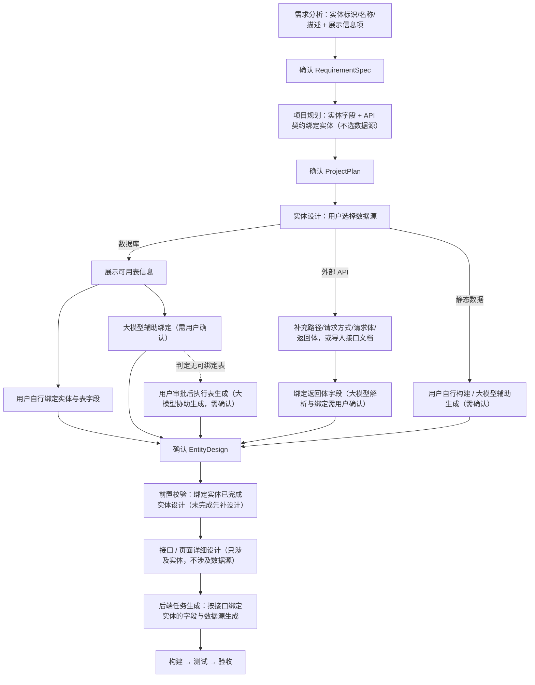

# 数据实体流程

## 一、应用初始化

### 1.1 需求分析

- 需求分析阶段，xcodeAgent会根据用户业务需求，初步设计数据实体内容，例如名称、描述，方便后续字段设计参考，不生成字段类型、不生成数据源、不生成契约。
- 用户在确认阶段，可以修改实体内的字段内容，也可以新增或删除整个实体。

### 1.2 项目规划

根据业务需求与需求分析中的数据实体内容，xcodeAgent需要生成如下内容：

- 数据实体：为每个实体生成统一规范的字段名、字段类型（文本 / 长文本 / 数字 / 小数 / 日期 / 日期时间 / 布尔）、是否必填。

- API 契约绑定实体：契约通过实体清单绑定（一个契约可绑定多个实体，如订单契约绑定订单、客户、商品）；契约所需字段由实体字段派生，并按接口需要裁剪。

- 数据源：新产出的project-plan不携带数据源属性，**应用级不设数据源属性，数据源归属于实体**，规划阶段不作任何数据源相关设定；实体与数据源的绑定统一在详细设计的实体设计阶段进行，由用户在该阶段选择数据源。

## 二、详细设计

### 2.1 实体设计

实体设计是人机协同：在详细设计阶段，**用户先选择当前实体的数据源**（数据库 / 外部 API / 静态数据），再按数据源类型进入对应的设计方案；模型负责提供建议与初稿，用户负责选择、导入、绑定与最终确认，所有产物最终以用户确认为准。

输入：

- 已确认 ProjectPlan：实体（标识 / 名称 / 描述 / 字段）与 API 契约（实体绑定）；
- 数据库真实上下文与可用表清单（当用户为实体选择数据库数据源且连接已配置时）；
- 用户可导入的接口文档（如 OpenAPI/Swagger）或手动补充的接口信息。

处理流程：

1. 数据源选择：用户选择当前实体的数据源（数据库 / 外部 API / 静态数据）；模型可结合实体业务含义与字段来源给出建议供参考，但选择权在用户。
2. 按所选数据源进入对应方案（见下），产出该实体的落地方案。
3. 实体设计产物（用户可编辑文档 + 结构化内部状态）确认门禁：确认前不得进入接口/页面详细设计、任务拆解或构建；修订后必须重新确认。

分方案设计：

- **数据库方案**
  - 展示当前数据库可用的表信息（表清单与表结构），供用户选择与绑定。
  - 字段绑定（两种方式可选）：
    - 用户自行绑定：用户在表清单中选择目标表，手动绑定实体字段与表字段；
    - 大模型辅助绑定：模型根据实体字段与表结构生成绑定建议（同名自动匹配、异名给出提示），生成结果需要用户确认。
  - 无对应表：
    - 用户明确当前没有与实体对应的数据库表时，可由大模型协助生成目标表结构及实体字段绑定方案，生成表与绑定字段都需要用户确认；
    - 若大模型辅助绑定时判定没有可绑定的表，必须经过用户审批后才能执行后续的表生成。
  - 目标表已存在且与实体存在差异时，产出结构化差异（已有字段 / 新增字段 / 类型差异）与数据库操作（建表 / 改表 / 加字段等），展示给用户确认。
  - 确定性校验：表名与字段必须落在实体定义内；校验失败打回修订，不允许静默改实体。
  - 实体相关表操作（建表 / 改表 / 加字段等）在实体设计阶段完成：经用户确认后即在此阶段落地执行，后端任务不再包含实体相关表操作。

- **外部 API 方案**
  - 用户补充外部 API 信息：路径、请求方式、请求体、返回体；
  - 数据实体绑定返回体的相关字段（用户手动绑定，或由模型生成绑定建议并确认）；
  - 用户也可以导入接口文档：由大模型协助解析 API 信息（路径、请求方式、请求/返回）并绑定实体字段，此处需要用户确认；
  - 外部 API 相关信息（路径、请求方式、请求体、返回体）随实体的数据源一并记录在实体设计中，不归属接口详情设计。

- **静态数据方案**
  - 用户自行构建：直接编辑字段取值、枚举与种子数据；
  - 或由大模型辅助生成初稿，生成结果需要用户确认。

### 2.2 页面与接口详细设计

- 前置门禁：页面或接口详细设计开始前，先校验其绑定的实体是否已完成实体设计并确认；若存在未完成设计的实体，须优先完成该实体的实体设计，不得进入对应的页面/接口详细设计阶段。
- 接口详细设计只涉及实体概念，不出现数据源概念：接口通过实体清单绑定实体，所需字段从实体字段派生并按接口需要裁剪；数据源是实体的属性，接口不单独设计、也不携带数据来源。
- 页面详情只引用接口详情；旧的数据源详情产物不再作为详细设计输入。

### 2.3 后端任务生成

- 生成后端任务时，依据接口绑定的实体信息生成：实体的字段决定任务涉及的数据读写范围，实体的数据源决定任务方案。
- 数据源为数据库的实体：实体相关表操作已在实体设计阶段完成并确认，后端任务不再包含表操作，只按已确认的实体字段生成数据读写相关任务。
- 数据源为外部 API 的实体：按实体设计已确认的字段映射与 API 信息生成调用任务。
- 数据源为静态数据的实体：使用实体设计已确认的种子/静态数据生成任务。

## 三. 流程总览

