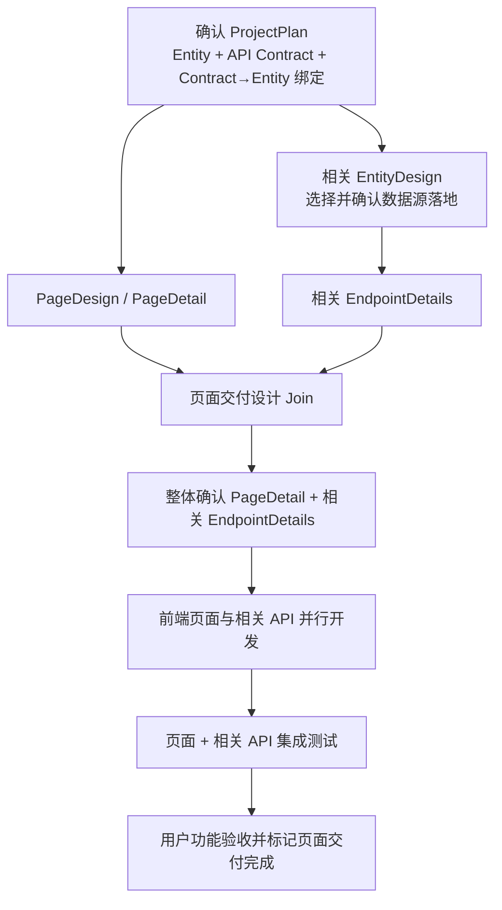

# Entity / Page / Endpoint 详细设计整合方案

> 状态：To-Be，仅记录当前已确认的整合结论。
>
> 事实优先级：Entity 的数据源与落地设计以 `ENTITY_DESIGN.md` 为准；Page/Endpoint 的审核、并行、输入裁剪和交付门禁参考 `PAGE_ENDPOINT_DETAIL_DESIGN_RECOMMENDED_IMPLEMENTATION.md`。
>
> 本轮不考虑静态数据方案。

## 1. 核心结论

1. ProjectPlan 负责定义 Entity、API Contract、Contract 与 Entity 的绑定关系，不选择数据源。
2. 数据源属于 Entity，由 EntityDesign 负责选择和确认；EndpointDetail 不重复设计数据源、物理字段映射或数据库操作。
3. PageDesign/PageDetail 只依赖页面范围、已确认 UI 和 API Contract，不依赖 EntityDesign，可以与 EntityDesign 并行。
4. EndpointDetail 的数据实现依赖相关 EntityDesign；一个 Endpoint 绑定多个 Entity 时，必须等待全部相关 EntityDesign 确认。
5. PageDetail 与相关 EndpointDetails 属于同一个页面交付范围：设计和开发可并行，最终必须 join 后整体完成集成测试与用户功能验收。
6. PageDetail 不读取 Endpoint 的后端实现决策，也不复制 EndpointDetail refs/hash；Batch 根据 ProjectPlan 的页面依赖校验相关 EndpointDetails 是否齐全。
7. 页面或接口详设不得修改 Entity、API Contract、Schema、权限、导航或 EntityDesign；缺失时返回拥有该产物的上游阶段修复。

## 2. 整体流程



这里的依赖关系是：

- PageDesign/PageDetail 与 EntityDesign 可以同时开始。
- EndpointDetail 必须等待其绑定的 EntityDesign 确认。
- PageDetail 不等待 EndpointDetail 才调用模型，但设计批次必须等待所有相关结果完成 join。
- 前端页面与相关 API 可以并行开发，但页面不能在相关 API 未完成时通过最终功能验收。

## 3. 各阶段职责

| 阶段 | 负责 | 不负责 |
| --- | --- | --- |
| RequirementSpec | Entity 的业务标识、名称和描述 | 字段类型、数据源、API Contract |
| ProjectPlan | Entity 字段；应用自身 API Contract；Contract→Entity、Page→Endpoint、导航和权限关系；ZA21 成功码/错误码约束 | 数据源选择、表绑定、外部 Provider API 绑定、物理字段映射 |
| EntityDesign | Entity 数据源选择；数据库表或外部 Provider API 绑定；Entity 与来源字段映射；数据库结构差异和操作方案 | 应用自身 API Contract、页面交互、Endpoint 的事务与查询行为 |
| PageDesign | 页面结构、组件、布局和视觉交互 | 数据源、表结构、后端实现 |
| PageDetail | UI 与 API Contract 字段绑定；操作触发和反馈；页面状态；纯前端输入约束 | Entity 数据源、Endpoint 后端实现、API Contract 修改 |
| EndpointDetail | 基于 API Contract、已确认 EntityDesign 和后端 Workspace Facts，决定接口实现策略、实体使用行为、selector、事务、基数、未命中和副作用 | 选择数据源、重新绑定表/Provider 字段、生成数据库结构操作、修改 Contract |
| Task/Build | 按已确认设计生成和执行前后端任务 | 重新解释或覆盖已确认设计 |
| Integration/Acceptance | 使用真实相关 API 验证页面完整业务行为 | 以开发 Mock 代替最终验收 |

## 4. ProjectPlan 边界

ProjectPlan 至少提供：

```jsonc
{
  "entities": [
    {
      "id": "<entity id>",
      "name": "<name>",
      "description": "<description>",
      "fields": []
    }
  ],
  "api_contracts": [
    {
      "id": "<application API contract id>",
      "entity_refs": ["<entity id>"],
      "endpoints": []
    }
  ],
  "frontend_pages": [
    {
      "pageId": "<page id>",
      "references": {
        "endpoint_dependencies": [],
        "navigation_targets": [],
        "permissions": []
      }
    }
  ]
}
```

ProjectPlan 不再提供：

- 应用级 `data_sources`。
- Contract/Endpoint 的 `data_source_id` 或 `data_source_type`。
- Entity 的数据库表、外部 Provider API 或字段映射。

API Contract 仍然是应用自身页面与后端之间的唯一对外契约，负责 method、path、request/response schema、认证、ZA21 成功码和错误码。EntityDesign 中的外部 API 是应用后端依赖的 Provider API，不能替代应用自身 API Contract。

## 5. EntityDesign

EntityDesign 对数据源和实体落地方案拥有唯一设计权。本轮支持：

- 数据库：选择或新建设计目标表，确认 Entity→column 映射、结构差异和数据库操作方案。
- 外部 API：确认 Provider 的路径、方法、请求/响应、认证信息以及 Entity→Provider field 映射。

每个被 Endpoint 使用的 EntityDesign 必须经过用户确认。EntityDesign 发现 Entity 字段、Contract schema 或 Contract→Entity 绑定不完整时，不得静默补充，应返回 ProjectPlan 修订并重新确认。

EntityDesign 的稳定 artifact id、文件结构和引用格式尚未确定，列入文末待确认问题。

## 6. PageDetail

PageDetail 输入只包含：

- 已确认 UI Design 与目标 UI 源码。
- 目标 Page 的 Endpoint、Navigation 和 Permission 引用。
- 页面实际使用的 API Contract 及 request/response schema 最小闭包。
- 目标相关的前端 Workspace Facts。
- revise 时的上一版 PageDecision 和用户修改要求。

PageDetail 不读取 EntityDesign、数据库事实、Provider API、后端源码或 EndpointDecision。模型输出保留：

- `implementation_strategy`
- `response_bindings`
- `operation_interactions`
- `state_feedback`
- `form_rules`
- `acceptance_criteria`

页面只根据 API Contract 实现调用和字段绑定，因此 EntityDesign 尚未完成时不阻塞 PageDetail 生成。

## 7. EndpointDetail

EndpointDetail 输入改为：

```jsonc
{
  "api_contract_id": "<contract id>",
  "endpoint_id": "<endpoint id>",
  "contract": "<目标 Endpoint 的最小只读 Contract>",
  "schemas": "<request/response 递归引用闭包>",
  "entity_design_refs": [
    {
      "entity_id": "<Contract 已绑定 Entity>",
      "entity_design_id": "<已确认 EntityDesign>"
    }
  ],
  "workspace_facts": "<相关 Controller/Service/Repository/DTO 等事实>",
  "previous_decision": "<仅 revise 时存在>",
  "user_feedback": "<仅 revise 时存在>"
}
```

EndpointDetail 不再输入或输出：

- `data_source_id`、`data_source_type`、`database_tables`。
- `data_origin.effective_source`。
- Entity 与表/Provider 的 `field_mappings`。
- `database_operations`。
- 静态数据或 `frontend_mock`。

EndpointDecision 保留：

```jsonc
{
  "implementation_strategy": {
    "mode": "<reuse|extend|create>",
    "reuse_targets": [],
    "planned_changes": []
  },
  "operation_semantics": {
    "operation_kind": "<read|create|update|delete|action>",
    "target_cardinality": "<exactly_one|zero_or_one|many|not_applicable>",
    "selector": {
      "source": "<path|query|request_body|contract|none>",
      "fields": []
    },
    "transaction_required": "<boolean>",
    "zero_match_behavior": "<behavior>",
    "multiple_match_behavior": "<behavior>",
    "side_effect": "<none|insert|update|delete|custom>"
  },
  "acceptance_criteria": []
}
```

多个 Entity 的物理来源和字段映射仍由各自 EntityDesign 决定；EndpointDetail 只决定这些已绑定 Entity 在当前 Endpoint 中的读取、校验、组合和事务行为。

## 8. 并行、Join 与交付门禁

### 8.1 设计阶段

- PageDecision 与 EntityDesign 可以并行。
- 不同 EntityDesign 可以并行，但同一 Entity 只有一个当前待确认设计。
- 每个 EndpointDecision 在其全部相关 EntityDesign 确认后独立生成；不同 Endpoint 可限流并行。
- PageDecision 不因 EndpointDecision 修改而重新调用；系统只重新校验 Batch 完整性。
- 页面交付范围内的 PageDetail 和相关 EndpointDetails 必须全部有效后，才能生成并整体确认 `DetailDesignBatch`。

### 8.2 开发阶段

- 前端 Page 任务与相关 API 任务可以并行执行。
- 单个前端或 API 任务可以独立保存进度、验证和提交代码。
- 页面交付单元不能仅因前端任务完成而标记为完成。

### 8.3 集成测试与验收

页面最终功能验收必须满足：

- 页面声明且属于本次交付范围的相关 Endpoint 均已实现。
- 页面实际请求符合 API Contract，且 response binding 通过真实响应验证。
- 首屏加载、查询、提交、修改、删除等本次验收行为可执行。
- loading、empty、error、success、权限和错误分支通过测试。
- 最终验收不依赖仅供开发使用的 Mock。

如果相关 API 尚未完成，页面只能进行 UI/布局或 Mock 演示，不能通过最终业务验收。

## 9. 审核、持久化与失败回流

- PageDetail 与相关 EndpointDetails 使用一个 `DetailDesignBatch` 整体确认。
- `revise`、`confirm`、`reject` 分离；修改后生成新草稿并重新确认。
- 使用现有 run/interaction id 关联 draft，使用 `draft_sha256` 绑定用户实际看到的 Batch。
- 确认前不污染正式 PageDetail、EndpointDetail 或 ProjectPlan refs。
- Confirm 时重新校验 Page→Endpoint、Contract→Entity 和 Endpoint→EntityDesign 引用。

失败回流：

| 问题 | 返回阶段 |
| --- | --- |
| Entity、Contract、Schema 或 Contract→Entity 绑定缺失 | ProjectPlan |
| UI 缺失或与目标 Page 不一致 | PageDesign/UI Design |
| Entity 数据源、表/Provider 绑定或字段映射问题 | EntityDesign |
| Endpoint 的事务、selector、基数或行为问题 | EndpointDetail |
| Page binding、交互或状态反馈问题 | PageDetail |
| Page 或 API 实现失败 | 对应前端/API 开发任务 |
| 页面与相关 API 集成失败 | Integration Test，并按证据回到对应实现任务 |

## 10. 待确认问题

以下问题尚未确定，实施前需要统一：

1. **EntityDesign artifact 结构**：稳定的 `entity_design_id`、文件路径、schema version、确认状态和 ProjectPlan/Endpoint 的引用格式是什么？
2. **数据库操作执行时机**：确认 EntityDesign 后立即执行 DDL，还是只确认操作方案并交给独立数据库执行节点再次授权后执行？
3. **外部 Provider API 边界**：Provider base URL、operation、认证、请求/响应 schema 和字段映射的最小结构是什么？敏感认证信息必须只存连接配置还是允许 artifact 保存脱敏引用？
4. **多 Entity Endpoint 语义**：是否需要在 EndpointDecision 中增加 `entity_usage`，明确 primary/lookup/validation/response composition 等角色？
5. **EntityDesign 的确认批次**：多个相关 Entity 是逐个确认，还是组成一个 EntityDesignBatch 整体确认？修改一个 Entity 时如何使相关 EndpointDetails 失效？
6. **数据库已执行后的修订**：如果 EntityDesign 对应的 DDL 已执行，用户再次修改 EntityDesign 时如何生成差异、审批、重试和恢复？
7. **页面交付范围**：非首屏、低频或暂不验收的 Endpoint 是否允许明确排除出本次交付 Batch；若允许，排除依据和用户确认载荷如何表达？

