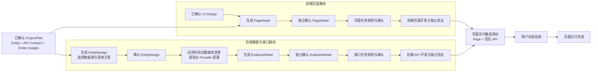

# Entity / Page / Endpoint 独立设计与页面交付方案

> 状态：To-Be。
>
> 本文定义 Entity、Page、Endpoint 的详细设计、确认、开发、持久化和页面交付边界。
>
> 本轮不考虑静态数据方案。

## 1. 设计结论

1. ProjectPlan 定义业务 Entity、应用自身 API Contract、Endpoint 对 Entity 的逻辑使用关系，以及 Page 对 Endpoint、导航和权限的引用。
2. PageDetail 只依赖已确认的 ProjectPlan、UI Design、API Contract 和前端 Workspace Facts，不依赖 EntityDesign 或 EndpointDetail。
3. PageDetail 可以独立生成、独立确认并进入前端开发，不等待 EntityDesign 或 EndpointDetail。
4. EntityDesign 独占数据源选择、数据库表或外部 Provider API 绑定、物理字段映射和数据库结构操作设计。
5. EndpointDetail 必须等待当前 Endpoint 实际使用的全部 EntityDesign 进入 `ready`，再决定接口实现策略、实体使用行为、selector、事务、一致性、基数、未命中和副作用。
6. PageDetail、EntityDesign 和 EndpointDetail 分别形成正式产物并分别确认，不再组成一个需要整体确认的详细设计文档。
7. 前端页面与后端 API 是两条独立开发路线；页面交付只在集成测试处汇合，并以真实 API 完成功能验收。
8. `PageDeliveryManifest` 是确定性生成的内部交付清单，只负责依赖 Join、完整性校验和失效检测，不引入新的设计内容，也不需要重复确认设计正文。
9. 所有正式产物使用规范化 JSON 的 SHA256 建立草稿确认、内容身份和依赖闭包校验。
10. 正式用户可见产物为 Markdown；JSON 是内部结构化状态。用户修改 Markdown 后必须同步回 JSON、重新校验并再次确认。

## 2. 两条独立路线与唯一汇合点



必须保持以下边界：

- PageDetail 确认和前端开发不等待后端路线。
- 后端路线内部遵循 `EntityDesign ready → EndpointDetail confirmed → API 开发`。
- 前端独立验证可以使用开发期契约桩，但开发期桩不属于正式数据源或正式设计产物，不能用于最终集成测试和功能验收。
- 前后端仅在 `Page + 真实 API` 集成测试处汇合。
- 页面交付完成不能由单个前端任务、单个 API 任务或单个详细设计产物单独决定。

## 3. 权威职责边界

| 产物或阶段 | 负责 | 不负责 |
| --- | --- | --- |
| RequirementSpec | Entity 的业务标识、名称和描述 | 字段类型、数据源、API Contract |
| ProjectPlan | Entity 逻辑字段；应用 API Contract；Endpoint Entity Usages；Page→Endpoint、导航和权限引用 | 数据源选择、物理表、Provider 字段映射、数据库操作 |
| UI Design | 页面结构、组件、布局和视觉交互 | 数据源、后端实现、API Contract 修改 |
| PageDetail | 页面实现策略；UI 与 Contract 响应绑定；操作触发；状态反馈；纯前端表单规则；页面验收标准 | EntityDesign、物理数据源、Endpoint 后端实现、Contract 修改 |
| EntityDesign | Entity 数据源；表或 Provider operation 绑定；物理字段映射；数据库差异与操作方案 | 页面交互、应用 API Contract、Endpoint 查询与事务语义 |
| EndpointDetail | 接口实现策略；Entity 使用行为；selector；基数；事务与一致性；副作用；接口验收标准 | 重新选择数据源、重做物理映射、生成 Entity DDL、修改 Contract |
| PageDeliveryManifest | 确定性聚合已确认产物、构建结果和依赖 hash；判断 blocked/ready/stale/completed | 生成设计决策或替代用户确认 |
| Integration/Acceptance | 使用真实 API 验证页面完整业务行为 | 以开发期桩替代最终验收 |

任何详细设计发现其上游正式事实缺失或冲突时，必须返回拥有该事实的阶段修订，不得静默补充或覆盖。

## 4. ProjectPlan 与 Entity Usages

### 4.1 ProjectPlan 最小边界

```jsonc
{
  "entities": [
    {
      "id": "order",
      "name": "订单",
      "description": "客户提交并履约的订单",
      "fields": [
        {
          "id": "id",
          "name": "订单标识",
          "type": "text",
          "required": true
        }
      ]
    }
  ],
  "api_contracts": [
    {
      "id": "orders-api",
      "resource": "orders",
      "base_path": "/orders",
      "endpoints": []
    }
  ],
  "frontend_pages": []
}
```

ProjectPlan 不保存：

- 应用级数据源。
- Contract 或 Endpoint 的 `data_source_id`、`data_source_type`。
- Entity 的数据库表、Provider operation 或物理字段映射。
- EntityDesign 的运行期当前指针。

### 4.2 Entity Usages 定义

`entity_usages` 描述单个 Endpoint 如何使用业务 Entity。它表达的是 API Schema 与 Entity 逻辑字段之间的关系，不表达 Entity 与表列或 Provider field 之间的物理关系。

每个 Endpoint 必须显式声明自身的 `entity_usages`：

```jsonc
{
  "id": "orders.get",
  "method": "GET",
  "path": "/orders/{id}",
  "request_schema_ref": null,
  "response_schema_ref": "OrderDetailResponse",
  "entity_usages": [
    {
      "entity_id": "order",
      "roles": ["primary", "response_composition"],
      "access": ["read"],
      "selector_bindings": [
        {
          "contract_path": "path.id",
          "entity_field": "id"
        }
      ],
      "request_bindings": [],
      "response_bindings": [
        {
          "entity_field": "amount",
          "contract_path": "response.data.amount"
        }
      ]
    },
    {
      "entity_id": "customer",
      "roles": ["lookup", "response_composition"],
      "access": ["read"],
      "selector_bindings": [],
      "request_bindings": [],
      "response_bindings": [
        {
          "entity_field": "name",
          "contract_path": "response.data.customerName"
        }
      ]
    }
  ]
}
```

字段约束：

| 字段 | 约束 |
| --- | --- |
| `entity_id` | 必须唯一指向 ProjectPlan 中的 Entity；同一 Endpoint 内每个 Entity 只出现一次 |
| `roles` | 可取 `primary`、`lookup`、`validation`、`response_composition`；至少一项 |
| `access` | 可取 `read`、`create`、`update`、`delete`；至少一项 |
| `selector_bindings` | Contract path/query/request 字段到 Entity 逻辑字段的定位关系 |
| `request_bindings` | Request Schema 字段到 Entity 逻辑字段的输入关系 |
| `response_bindings` | Entity 逻辑字段到 Response Schema 字段的输出关系 |

确定性校验：

- 所有 `entity_id` 和 `entity_field` 必须存在。
- 所有 `contract_path` 必须存在于当前 Endpoint 的参数或递归 Schema 闭包中。
- 写操作必须声明对应的 `create`、`update` 或 `delete` access。
- 需要定位单个业务对象的操作必须存在可闭合的 selector。
- Contract 级 Entity 集合只允许作为所有 Endpoint `entity_usages[].entity_id` 的派生并集，不作为 Endpoint 门禁依据。
- EndpointDetail 只等待当前 Endpoint 的 `entity_usages` 实际引用的 EntityDesign，不等待同 Contract 下无关 Entity。

## 5. PageDetail 路线

### 5.1 输入闭包

PageDetail 只读取：

- 已确认 ProjectPlan 中的目标 Page 身份、描述和固定引用。
- 已确认 UI Design 及目标页面 UI 源码。
- 页面实际依赖的 API Contract endpoint 和 request/response Schema 最小递归闭包。
- 目标页面、相关 API client/types、直接组件/hooks、route/menu 的前端 Workspace Facts。
- 修订时的上一版 PageDecision 和用户反馈。

PageDetail 不读取：

- EntityDesign。
- 数据库或 Provider Facts。
- 后端 Controller、Service、Repository 实现事实。
- EndpointDecision 或 EndpointDetail。
- 其他页面、无关 Contract、完整仓库和历史工具日志。

### 5.2 PageDecision

```jsonc
{
  "implementation_strategy": {
    "mode": "reuse|extend|create",
    "reuse_targets": [],
    "planned_changes": []
  },
  "response_bindings": [],
  "operation_interactions": [],
  "state_feedback": [],
  "form_rules": [],
  "acceptance_criteria": []
}
```

PageDecision 不得生成或修改页面身份、路由、Endpoint 引用、导航、权限、API Schema、状态码或后端实现决策。

### 5.3 PageDetail 确认与开发门禁

PageDetail 确认要求：

- ProjectPlan、UI Design 和 API Contract 引用仍有效。
- 所有 response binding 均落在已确认 UI 和 Response Schema 内。
- 所有 API 操作只使用页面声明的 Endpoint dependency。
- 所有导航和权限只使用 ProjectPlan 声明的引用。
- `basedOnRevision` 和 `draft_sha256` 与用户当前审核内容一致。

确认完成后：

- PageDetail 写入正式产物。
- 可以进入页面任务规划、任务确认、前端开发和独立验证。
- EntityDesign 或 EndpointDetail 未完成只会使页面交付状态保持 `blocked`，不会阻止 PageDetail 确认和前端开发。

PageDetail 只会因以下事实变化而失效：

- 目标 Page 范围或固定引用变化。
- UI Design 变化。
- 页面使用的 API Contract fragment 或 Schema 闭包变化。
- PageDetail 明确复用的前端 Workspace target 发生不兼容变化。

EntityDesign 或 EndpointDetail 的内容变化不会直接使 PageDetail 失效。

## 6. EntityDesign 路线

### 6.1 EntityDesign 职责

EntityDesign 是 Entity 数据来源和物理落地的唯一正式权威，支持：

- 数据库表选择或新表设计。
- Entity 逻辑字段与数据库列的映射。
- 数据库结构差异和前向操作计划。
- 外部 Provider operation、请求/响应 Schema 和 Entity 字段映射。
- 不含密钥的 Provider `connection_ref`。

任何凭据、连接字符串或 token 均不得进入 Artifact、Markdown、AG-UI State、日志或模型上下文。

### 6.2 EntityDesign Artifact

```jsonc
{
  "schema_version": "xcodeagent.entity-design.v1",
  "artifact_id": "entity-design:order",
  "entity_id": "order",
  "based_on": {
    "project_plan_sha256": "...",
    "entity_definition_sha256": "..."
  },
  "source": {
    "type": "database|external_api",
    "connection_ref": "database:primary"
  },
  "database_design": {},
  "provider_design": {},
  "field_mappings": [],
  "schema_change_plan": [],
  "status": "draft|awaiting_confirmation|confirmed_pending_apply|applying|ready|failed",
  "content_sha256": "..."
}
```

数据库和外部 API 的专属字段只在对应 source type 下存在。

### 6.3 确认和应用数据库操作

数据库 EntityDesign 使用两个明确动作：

1. `确认实体设计`：确认表选择、字段映射、结构差异和操作计划。
2. `应用数据库变更`：对已确认操作计划进行独立授权和实际执行。

状态流：

```text
draft
→ awaiting_confirmation
→ confirmed_pending_apply
→ applying
→ ready
```

无数据库结构操作时，确认并完成实时事实校验后可以直接进入 `ready`。

应用规则：

- 生成操作计划时保存 `before_schema_sha256`。
- 应用前重新读取真实数据库并校验 `before_schema_sha256`。
- 每个 operation 具有稳定 `operation_id` 和基于 EntityDesign hash 的幂等键。
- 可事务执行的操作尽量在事务内执行。
- 删除表、删除列、缩窄类型或其他破坏性操作需要额外明确审批。
- 执行完成后保存逐项 execution receipt 和 `after_schema_sha256`。
- 部分失败时保留已完成证据，并从未完成的幂等操作继续。
- 数据库操作不进入后续 Endpoint 或普通后端 Build 任务。

外部 API EntityDesign 在确认后必须完成 Provider operation、Schema 和连接可用性校验，校验通过后进入 `ready`。

### 6.4 已应用 EntityDesign 的修订

- 已确认或已应用的 Artifact 不原地覆盖。
- 新修订以旧 EntityDesign 和当前实时数据源事实为输入，生成新的内容 hash。
- 数据库修订只生成前向 migration，不自动执行破坏性回滚。
- 新版本进入 `ready` 后，引用旧 EntityDesign hash 的 EndpointDetail 自动变为 `stale`。
- PageDetail 不因 EntityDesign 修订而失效。

## 7. EndpointDetail 路线

### 7.1 进入门禁

EndpointDetail 生成前必须满足：

- ProjectPlan 和目标 API Contract 已确认。
- Endpoint 的参数和 request/response Schema 闭包完整。
- `entity_usages` 通过确定性校验。
- 每个 `entity_usages[].entity_id` 都存在一个当前 `ready` EntityDesign。
- 所有 EntityDesign 引用已固定为 `artifact_id + content_sha256`。
- 后端 Workspace Facts 可以按 method/path 定位到目标相关 Controller、Service、Repository、DTO、Entity、Mapper 或 migration；相关文件尚不存在不构成错误。

### 7.2 EndpointDecision

```jsonc
{
  "implementation_strategy": {
    "mode": "reuse|extend|create",
    "reuse_targets": [],
    "planned_changes": []
  },
  "entity_behaviors": [
    {
      "entity_id": "order",
      "read_behavior": "...",
      "validation_behavior": "...",
      "write_behavior": "...",
      "response_composition": "..."
    }
  ],
  "operation_semantics": {
    "operation_kind": "read|create|update|delete|action",
    "target_cardinality": "exactly_one|zero_or_one|many|not_applicable",
    "selector": {
      "source": "path|query|request_body|contract|none",
      "fields": []
    },
    "zero_match_behavior": "...",
    "multiple_match_behavior": "...",
    "side_effect": "none|insert|update|delete|custom"
  },
  "consistency_strategy": {
    "mode": "not_required|single_transaction|best_effort|saga",
    "idempotency": "...",
    "partial_failure_behavior": "...",
    "compensation_steps": []
  },
  "acceptance_criteria": []
}
```

`consistency_strategy` 用于表达数据库与 Provider、多 Provider 或多 Entity 写入，不使用单一布尔值代替跨资源一致性设计。

EndpointDecision 不得：

- 选择或改变 Entity 数据源。
- 修改表、Provider operation 或物理字段映射。
- 生成数据库结构操作。
- 修改 Endpoint method、path、Schema、认证、权限、成功码或错误码。
- 使用当前 Endpoint `entity_usages` 以外的 Entity。

### 7.3 EndpointDetail Artifact

正式 EndpointDetail 保存实现决策和其不可变依据：

```jsonc
{
  "schema_version": "xcodeagent.endpoint-detail.v1",
  "artifact_id": "endpoint-detail:orders-api:orders.get",
  "api_contract_id": "orders-api",
  "endpoint_id": "orders.get",
  "based_on": {
    "project_plan_sha256": "...",
    "api_contract_fragment_sha256": "...",
    "entity_design_refs": [
      {
        "entity_id": "order",
        "artifact_id": "entity-design:order",
        "content_sha256": "..."
      }
    ],
    "workspace_fact_refs": []
  },
  "implementation_strategy": {},
  "entity_behaviors": [],
  "operation_semantics": {},
  "consistency_strategy": {},
  "acceptance_criteria": [],
  "content_sha256": "..."
}
```

EntityDesign 物理正文不复制到 EndpointDetail；Build 时按已确认 ref 精确加载。

EndpointDetail 只会因以下事实变化而失效：

- API Contract fragment 或 Schema 闭包变化。
- 当前 Endpoint 的 `entity_usages` 变化。
- 任一引用的 EntityDesign content hash 变化。
- 明确复用的后端 Workspace target 发生不兼容变化。

## 8. SHA256 与失效模型

所有 hash 均基于规范化 JSON：

- UTF-8 编码。
- Object key 稳定排序。
- Array 保留有业务含义的顺序；引用集合在 hash 前按稳定 identity 排序。
- 排除 `draft_sha256`、`content_sha256`、展示状态、时间戳和运行期进度。
- Markdown 修改必须先同步回内部 JSON，再参与 hash。

### 8.1 `draft_sha256`

绑定用户实际看到并准备确认的完整草稿。

- 每次模型修订、结构化编辑或 Markdown 同步后重新计算。
- `confirm` 必须提交当前 `draft_sha256`。
- 不匹配时返回 `stale_artifact_review`，展示最新草稿并要求重新确认。

### 8.2 `content_sha256`

标识正式 Artifact 的不可变业务内容。

- PageDetail、EntityDesign、EndpointDetail 分别计算。
- 相同 Artifact identity 的不同内容使用不同 hash 目录保存。
- 正式引用使用 `artifact_id + content_sha256`，不能只引用可变文件路径。

### 8.3 `closure_sha256`

标识一个页面交付单元的完整依赖闭包，由以下稳定排序的内容计算：

- PageDetail content hash。
- 必需 EndpointDetail content hashes。
- EndpointDetail 引用的 EntityDesign content hashes。
- 页面相关 API Contract fragment hashes。
- 本轮交付范围定义 hash。

确认时校验 `draft_sha256`；提交、Build、集成测试和验收前校验 `content_sha256` 与 `closure_sha256`。任一依据变化都必须把对应下游状态改为 `stale`，不得继续使用旧确认。

## 9. PageDeliveryManifest

### 9.1 定位

`PageDeliveryManifest` 是内部确定性 Artifact：

- 不调用模型生成。
- 不包含新的设计决策。
- 不要求用户重复确认 PageDetail 或 EndpointDetail 正文。
- 只聚合当前页面交付范围、已确认详情引用、实现结果和 hash。
- 是进入页面级集成测试的唯一完整性依据。

### 9.2 结构

```jsonc
{
  "schema_version": "xcodeagent.page-delivery-manifest.v1",
  "page_id": "orders",
  "page_detail_ref": {
    "artifact_id": "page-detail:orders",
    "content_sha256": "..."
  },
  "required_endpoints": [
    {
      "api_contract_id": "orders-api",
      "endpoint_id": "orders.get",
      "endpoint_detail_ref": {
        "artifact_id": "endpoint-detail:orders-api:orders.get",
        "content_sha256": "..."
      },
      "entity_design_refs": [
        {
          "entity_id": "order",
          "artifact_id": "entity-design:order",
          "content_sha256": "..."
        }
      ]
    }
  ],
  "deferred_endpoints": [],
  "implementation_results": {
    "frontend": {},
    "backend": {}
  },
  "closure_sha256": "...",
  "status": "blocked|ready|stale|completed",
  "blocking_reasons": []
}
```

### 9.3 交付范围

页面声明的 Endpoint dependency 默认均为 `required`。允许暂缓时，必须在已确认 ProjectPlan 中明确：

```jsonc
{
  "api_contract_id": "orders-api",
  "endpoint_id": "orders.export",
  "delivery_requirement": "deferred",
  "defer_reason": "本轮不交付导出功能",
  "excluded_acceptance_behaviors": ["导出订单文件"]
}
```

详设、任务规划和构建阶段不得自行把 required Endpoint 改成 deferred。

### 9.4 共享 Endpoint

- EndpointDetail 按 `api_contract_id + endpoint_id` 全局唯一确认。
- 多个页面 Manifest 可以引用同一个 EndpointDetail content hash。
- EndpointDetail 更新后，引用旧 hash 的所有 Manifest 变为 `stale`。
- PageDetail 不因此失效，也不重新调用 Page 模型。
- 新 Manifest 重新完成确定性闭包校验即可。

## 10. 开发、集成测试与验收

### 10.1 前端开发路线

PageDetail 确认后可以独立执行：

- 页面任务规划与确认。
- 页面组件、状态、交互和 API client 开发。
- TypeScript、构建、路由和 UI 状态验证。
- 基于 API Contract 的开发期契约桩验证。

前端独立完成只表示 frontend implementation result 成功，不表示页面交付完成。

### 10.2 后端开发路线

EndpointDetail 确认后可以独立执行：

- 接口任务规划与确认。
- Controller、Service、Repository、DTO 和 Provider adapter 开发。
- 单元测试、API contract test 和数据访问验证。
- 对已应用 EntityDesign 的读取与写入验证。

后端独立完成只表示 backend implementation result 成功，不表示页面交付完成。

### 10.3 集成测试门禁

`PageDeliveryManifest.status` 进入 `ready` 必须满足：

- PageDetail confirmed 且 hash 有效。
- 所有 required EndpointDetail confirmed 且 hash 有效。
- 所有传递依赖的 EntityDesign 为 `ready` 且 hash 有效。
- 前端页面实现结果成功。
- 所有 required API 实现结果成功。
- 当前重新计算的 `closure_sha256` 与 Manifest 一致。

集成测试必须使用真实相关 API，至少验证：

- 页面实际请求满足 method、path、parameter、request Schema 和认证约束。
- response binding 通过真实响应验证。
- 首屏加载、查询、提交、修改、删除等本轮交付行为可执行。
- loading、empty、error、success、validation、confirm、权限和错误分支符合 PageDetail。
- selector、基数、未命中、事务、一致性和副作用符合 EndpointDetail。
- 最终验收不依赖开发期契约桩。

只有集成测试和用户功能验收通过后，Manifest 才能进入 `completed`。

## 11. Draft、正式产物与原子提交

### 11.1 文件布局

```text
.xcodeagent/
├── drafts/detail-design/<threadId>/<interactionId>/
├── transactions/<transactionId>/
└── plans/
    ├── project-plan.json
    ├── detail-index.json
    ├── entities/<encodedEntityId>/<contentSha256>/
    │   ├── entity-design.json
    │   └── entity-design.md
    ├── pages/<encodedPageId>/<contentSha256>/
    │   ├── page-detail.json
    │   └── page-detail.md
    ├── endpoints/<encodedContractId>/<encodedEndpointId>/<contentSha256>/
    │   ├── endpoint-detail.json
    │   └── endpoint-detail.md
    └── delivery/<encodedPageId>/<closureSha256>/manifest.json
```

文件系统路径中的 identity 必须使用无碰撞编码，或在可读安全名称后追加原始复合 identity 的短 hash。读取后必须再次校验文件正文 identity。

### 11.2 `detail-index.json`

`detail-index.json` 是正式详情当前指针和提交状态的唯一权威。消费者不得使用目录或文件是否存在判断“已设计”或“已确认”。

索引至少包含：

- 当前 confirmed PageDetail refs。
- 当前 ready EntityDesign refs。
- 当前 confirmed EndpointDetail refs。
- 当前 PageDeliveryManifest refs。
- `index_sha256`。

### 11.3 提交协议

1. 在 transaction/staging 目录写入 JSON 和 Markdown。
2. 回读并完成 schema、identity、内容 hash、上游引用和 Markdown 同步校验。
3. 获取工作区 Artifact 短提交锁。
4. 重新读取 ProjectPlan 和 `detail-index.json`。
5. 比对生成时记录的 ProjectPlan hash、目标当前 ref 和 `index_sha256`。
6. 将新 Artifact 移入不可变 content hash 目录。
7. 合并不冲突的其他目标最新索引项。
8. 通过同目录临时文件原子替换 `detail-index.json`；该替换是唯一提交点。
9. 释放锁并重新回读验证。

提交失败时，未被新索引引用的文件只是孤儿 generation，不构成正式状态，也不会解锁工作台；后续可以安全清理。

### 11.4 并发规则

- 模型生成和用户审核期间不持有提交锁。
- 不同目标可以并行生成，并在短提交窗口合并。
- 同一 Page、Entity 或 Endpoint 的当前 ref 已变化时，提交返回 `stale_artifact_commit`。
- 两个页面同时生成同一 EndpointDetail 时，只允许一个新内容成为当前 ref；另一运行重新读取后复用或基于新内容修订。
- ProjectPlan 或目标 API Contract hash 变化时，禁止提交基于旧事实的详情。
- `basedOnRevision` 只保护 AG-UI 交互状态；`index_sha256` 和目标 ref CAS 保护正式文件提交，两者不能互相替代。

## 12. Markdown 与用户确认

### 12.1 用户可见产物

以下正式产物必须生成 Markdown：

- PageDetail。
- EntityDesign。
- EndpointDetail。

`PageDeliveryManifest` 是确定性内部索引，不作为可编辑设计文档。

### 12.2 编辑方式

审核界面以 Markdown 为正式内容，同时为复杂字段提供结构化编辑器：

- Page response binding、operation、state 和 form rule。
- Entity 字段映射、数据库差异和操作计划。
- Endpoint entity behavior、selector、基数和一致性策略。

结构化编辑器更新内部 JSON 后必须重新渲染 Markdown。用户直接修改 Markdown 时，后端只解析允许编辑的稳定章节或表格，并执行：

1. 读取当前 draft JSON。
2. 将 Markdown 允许修改的内容同步进 JSON。
3. 保留 artifact identity、上游 hash、只读 refs 和其他隐藏结构。
4. 执行完整结构与上游边界校验。
5. 重新渲染规范 Markdown。
6. 重新计算 `draft_sha256`。
7. 展示最终规范内容并要求用户确认。

页面身份、路由、Entity、Endpoint、导航、权限、API Contract、EntityDesign refs、数据源 identity 和真实 Workspace/Database Facts 均为只读，不能通过 Markdown 或结构化编辑器修改。

### 12.3 审核动作

```jsonc
{
  "id": "<pending interaction id>",
  "action": "revise|confirm|reject",
  "basedOnRevision": 12,
  "artifact_type": "page_detail|entity_design|endpoint_detail",
  "artifact_id": "...",
  "draft_sha256": "...",
  "changes": {},
  "feedback": ""
}
```

- `revise`：根据结构化 changes 或自然语言 feedback 只修订受影响的 Decision，生成新草稿并重新确认。
- `confirm`：在 revision、hash 和上游引用复验通过后提交正式 Artifact。
- `reject`：结束当前草稿，不写正式 Artifact，不进入下游。
- revise、confirm、reject 必须分离，不能在一次提交中同时修改并确认。

## 13. AG-UI 与可观测性

Page、Entity、Endpoint 和页面交付使用彼此独立的 AG-UI 运行上下文和稳定 thread identity。每个产品动作均必须发出完整生命周期：

- run start。
- assistant message start/content/end。
- 结构化 progress/result/error custom event。
- state snapshot 或 delta。
- run finish；未处理异常使用 run error，不能同时发送 run finish。

建议业务事件：

```text
page_detail.context.started
page_detail.draft.completed
page_detail.review.required
page_detail.confirmed

entity_design.context.started
entity_design.draft.completed
entity_design.review.required
entity_design.apply.started
entity_design.apply.completed
entity_design.ready

endpoint_detail.waiting_for_entities
endpoint_detail.context.started
endpoint_detail.draft.completed
endpoint_detail.review.required
endpoint_detail.confirmed

page_delivery.blocked
page_delivery.ready
page_delivery.integration.started
page_delivery.integration.completed
page_delivery.acceptance.required
page_delivery.completed
page_delivery.stale
```

事件和 State 只传稳定 target identity、状态、hash、短证据摘要和 Artifact ref；数据库快照、源码、模型原始输出和完整日志保存在工作区受控文件中。

## 14. 失败与回流

| 问题 | 回流阶段 |
| --- | --- |
| Entity、Endpoint、Schema、Entity Usages、权限或导航缺失 | ProjectPlan |
| UI 缺失或与目标 Page 不一致 | UI Design |
| Page binding、交互、状态或纯前端规则问题 | PageDetail |
| 数据源、表/Provider 绑定、物理字段映射或数据库操作问题 | EntityDesign |
| selector、基数、事务、一致性、实体行为或副作用问题 | EndpointDetail |
| 前端实现失败 | 页面开发任务 |
| API 实现失败 | Endpoint 开发任务 |
| Page 与真实 API 集成失败 | Integration Test，并按证据回到对应实现任务或正式设计 |
| hash、revision 或 CAS 不匹配 | 返回最新 Artifact，重新审核或重新生成 |

模型、只读工具和网络的明确瞬时错误可以进行有界重试；Validation、上游事实缺失、权限失败、用户拒绝、hash 过期和提交冲突不得通过模型重试掩盖。

## 15. 必须保持的不变量

1. PageDetail 生成、确认和前端开发不等待 EntityDesign 或 EndpointDetail。
2. PageDetail 不读取 Endpoint 后端实现决策、EntityDesign、数据库或 Provider Facts。
3. EndpointDetail 必须等待其 `entity_usages` 引用的全部 EntityDesign 为 `ready`。
4. EndpointDetail 不拥有数据源、物理字段映射或 Entity DDL 的设计权。
5. PageDetail、EntityDesign、EndpointDetail 分别确认，任何修改都生成新草稿并重新确认。
6. `PageDeliveryManifest` 只做确定性 Join，不承载新的模型设计内容。
7. 前端与后端开发可以并行，但只在真实 API 集成测试处汇合。
8. 最终页面验收不得使用开发期契约桩替代真实 API。
9. 正式状态只由 `detail-index.json` 中的 committed refs 决定，不由文件存在性决定。
10. Build、Integration 和 Acceptance 前必须重新校验 Artifact 内容 hash 和页面交付 closure hash。
11. 同一 Entity、Page 或 Endpoint 的并发提交必须通过目标 ref 与索引 CAS 防止覆盖。
12. 用户可见正式 Artifact 是 Markdown；Markdown 修改同步并校验完成后才能确认内部 JSON。
