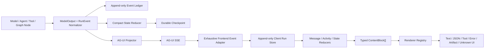

# 模型输出前后端通信与完整展示设计

> 状态：目标设计  
> 日期：2026-07-11  
> 适用范围：`/workflow/run` 及后续所有模型驱动产品流  
> 关联文档：[项目架构审计](./PROJECT_ARCHITECTURE_AUDIT.md)、[Agent Process Streaming](./PROCESS_STREAMING_DESIGN.md)

## 1. 目标

本设计解决一个明确问题：**模型的每一次返回，只要允许向用户展示，不论是普通文本、Markdown、JSON、工具调用、工具结果、结构化产物还是错误，都必须在前端有可见、可持久、可重放的表示。**

这里的“每一次返回”不是要求把私有 chain-of-thought 原样暴露，而是要求所有用户可见输出和可审计运行结果不被传输层、事件适配器、前端 reducer 或持久化层静默丢弃。内部推理只展示模型明确标记为可见的 reasoning，或后端生成的安全进度摘要。

成功标准：

- 任意 output type 都有确定事件映射；
- 未知类型进入 fallback block，不静默 drop；
- 标准 AG-UI 事件优先，自定义事件有 schemaVersion；
- UI 状态与机器状态分离；
- streaming、terminal result、session reload 和 event replay 得到同一内容；
- 大型内容有 artifact ref、截断标识和按需加载，不依靠无限 state payload。

## 2. 已验证的现状

### 2.1 后端当前生产链路

`build_workflow_ag_ui_stream` 从 LangGraph 同时消费：

- `updates`：节点状态更新；
- `messages`：模型消息 chunk 和工具消息；
- `custom`：Deep Agent callback 产生的 activity。

然后发出：

- `RUN_STARTED`、`TEXT_MESSAGE_START/CONTENT/END`、`RUN_FINISHED`；
- `TOOL_CALL_START/ARGS/END/RESULT`；
- `workflow-*`、`workflow-run`、`agent-process` CustomEvent；
- `STATE_SNAPSHOT`。

问题是 `messages` 分支只提取 reasoning 和 tool，不转发普通 `message_chunk.content`。最终 text message 是 Workflow summary。

### 2.2 前端当前消费链路

`agUiAgent.ts` 当前业务层订阅：

- `workflow-run` 和 `agent-process` CustomEvent；
- `STATE_SNAPSHOT` 中的 `snapshot.workflow`；
- `TEXT_MESSAGE_CONTENT/END`；
- `TOOL_CALL_*`。

没有业务消费：

- `RUN_ERROR`、`STEP_*`；
- `STATE_DELTA`、`MESSAGES_SNAPSHOT`；
- `ACTIVITY_SNAPSHOT/DELTA`；
- `REASONING_*`；
- `RAW` 和未知 CustomEvent；
- `RunFinished.result` 中除 `workflow` 外的任意结构化数据。

### 2.3 已确认缺口

最小 Fake Graph 发送普通文本和 JSON content 时：

```text
text_visible= False
json_visible= False
summary_visible= True
```

异常 Graph 的终态：

```text
run_error_event= False
run_finished_event= True
failure_visible= True
```

此外，当前 UI 在正常完成后隐藏 ProcessSteps、ToolCallCard 和 Workflow timeline；Electron session normalizer 不保存 `toolCalls/processSteps`。因此“运行时偶尔看到”也不等于“完整展示”。

### 2.4 当前覆盖矩阵

| 内容/事件 | 后端当前行为 | 前端当前行为 | 结论 |
| --- | --- | --- | --- |
| 普通模型 text chunk | `messages` stream 可收到，但适配器不发 text event | 无输入 | **丢失** |
| Workflow 最终摘要 | 发 `TEXT_MESSAGE_CONTENT` | 写入当前 assistant Markdown | 可见，但不是原模型正文 |
| 模型 JSON 文本 | 成功解析后可能进入 spec/plan/state；无统一 output event | 只识别 workflow 中少数已知字段 | 间接、不可保证 |
| 无效 JSON/raw model output | 可能进入不同 `agent_note/analysis_note` 或被截断 | 无统一 renderer | 可能丢失 |
| 显式 reasoning block | custom `agent-process` | 合并为 ProcessStep | 运行中部分可见，完成后隐藏 |
| Deep Agent 普通 token | callback 全部标成 reasoning activity | ProcessStep | 类型误标风险，完成后隐藏 |
| Tool call chunks | 标准 START/ARGS/END/RESULT | 聚合 ToolCallRecord | 简单任务运行中可见；完成后隐藏 |
| final-only `tool_calls` | 没有完整分支 | 无输入 | 可能丢失 |
| object/list tool result | 使用 `str(...)` 的路径可能产生 Python repr | 只接受 string | 可见但未必是合法 JSON |
| `workflow-run` CustomEvent | 每节点发完整累计 payload | 全量替换 workflow | 可见，但重复且昂贵 |
| 其他 workflow CustomEvent | 发出 | 除两个已知 name 外静默忽略 | 依赖全量 payload 兜底 |
| `STATE_SNAPSHOT` | 每节点发送完整 workflow | 只读 `snapshot.workflow` | 其他 state 静默忽略 |
| `STATE_DELTA` | 未使用 | 无业务订阅 | 不支持 |
| `ACTIVITY_*` / `REASONING_*` | 当前未使用标准事件 | 无业务订阅 | 不支持 |
| Fatal error | failed custom/state + error text + `RUN_FINISHED` | text 可能可见；无 ErrorBlock | 终态语义错误，异常不进 transcript |
| Code changes | workflow payload 中携带 | 完成后 CodeChangeCard | 已有专用展示 |
| Page planning JSON | 独立 endpoint 发 custom/state/result | Modal 读取 typed payload | 该独立流基本完整，但错误同样不用 `RUN_ERROR` |

Electron 正常持久化路径还会删除 `toolCalls/processSteps`，所以表中“运行中可见”的内容在应用重启后仍可能消失。

## 3. 设计原则

### 3.1 双轨输出

一次模型返回通常同时服务两类消费者：

```text
用户展示轨：ContentBlock / Message / Activity
机器状态轨：StateDelta / ArtifactRef / RunResult
```

用户展示轨保证可见性；机器状态轨保证 workflow 和业务逻辑可消费。不能只把 JSON 塞进 StateSnapshot，然后期待某个组件自行发现并显示。

### 3.2 标准事件优先

AG-UI 已有匹配语义时必须使用标准事件：

- 生命周期：`RUN_*`；
- 文本：`TEXT_MESSAGE_*`；
- 工具：`TOOL_CALL_*`；
- 阶段：`STEP_*`；
- 状态：`STATE_SNAPSHOT/DELTA`；
- 可见 reasoning：`REASONING_*`；
- 长寿命结构化活动：`ACTIVITY_SNAPSHOT/DELTA`。

只有没有标准对应的领域内容才使用 versioned CustomEvent。

### 3.3 完整但有界

“不丢失”不等于“把无限内容塞进 React state”。规则是：

- 小型内容内联；
- 大型内容保留摘要、大小、hash、truncated 与 artifact ref；
- UI 可以按需读取完整 artifact；
- event ledger 保留规范化事实；
- Graph State 和 terminal result 不复制完整日志。

### 3.4 事件可重放

事件必须有稳定 ID、严格递增 sequence 和幂等 reducer。断线重连、session reload 或重复帧不能产生重复卡片或内容覆盖。

### 3.5 未知类型可见

未知内容必须进入 `unknown` block，展示安全 stringify、source event type、大小和截断状态。生产环境可以默认折叠，但不能静默忽略。

### 3.6 推理安全

- 只发送模型明确标记为 user-visible 的 reasoning；
- 普通 output token 不得因为 callback 名称而统一标成 reasoning；
- 内部 chain-of-thought 不转发；
- 对用户显示的 Agent 过程应是 action/progress summary。

## 4. 目标通信架构



关键变化：subscriber callback 不再直接维护 `streamedContent/workflow/toolCalls/processSteps` 四组临时变量，而是把每个 AG-UI event 交给同一个 reducer。

## 5. 后端内部统一模型输出

所有直接 ChatModel 与 Deep Agent 调用必须产生同一内部结构。建议的 Pydantic/TypeScript 镜像概念如下：

```ts
type ModelOutput = {
  schemaVersion: 1
  eventId: string
  sequence: number
  threadId: string
  runId: string
  modelCallId: string
  nodeId: string
  phase: string
  agentId: string
  parentActivityId?: string
  status: 'started' | 'streaming' | 'completed' | 'failed'
  visibility: 'user' | 'process' | 'diagnostic'
  content: Array<
    | { kind: 'text'; mimeType: 'text/plain' | 'text/markdown'; text: string }
    | { kind: 'json'; mimeType: 'application/json'; value: unknown; raw?: string; schemaId?: string }
    | { kind: 'reasoning'; text: string; userVisible: true }
    | { kind: 'artifact'; artifact: ArtifactRef }
    | { kind: 'unknown'; value: unknown; providerType?: string }
  >
  toolCalls: ToolCallOutput[]
  finishReason?: string
  usage?: { inputTokens?: number; outputTokens?: number; totalTokens?: number }
  error?: { code?: string; type: string; message: string; retryable?: boolean }
}
```

### 5.1 规范化规则

1. `str` content：保留原文本，按 producer metadata 决定 plain/markdown。
2. object/array content：保留 JSON value，并用稳定 JSON serializer 生成 raw；禁止 Python repr。
3. content blocks：逐块识别 text、reasoning、tool、image/file 与 unknown。
4. fenced JSON：可以解析为 JSON block，但保留 raw 与 parse status。
5. JSON 解析失败：生成 text 或 unknown block，并附 parse error；不得直接丢弃。
6. `tool_call_chunks` 与 final-only `tool_calls` 都必须支持。
7. empty content + tool call 是合法输出，不能被当成空响应。
8. 每个 `modelCallId` 最终必须 completed 或 failed，不能永久 streaming。

## 6. 输出类型与 AG-UI 事件选择矩阵

| 输出/状态 | 首选事件 | 辅助事件 | 前端表示 | 持久化 |
| --- | --- | --- | --- | --- |
| Run 开始 | `RUN_STARTED` | 初始 `STATE_SNAPSHOT` | 运行状态 | run ledger |
| Workflow 阶段开始/结束 | `STEP_STARTED/STEP_FINISHED` | `STATE_DELTA` 更新 phase | 阶段轨道 | event ledger |
| 最终用户文本/Markdown | `TEXT_MESSAGE_START/CONTENT/END` | 无 | `text` block，Markdown renderer | transcript |
| 普通模型中间文本，需向用户展示 | 独立 `TEXT_MESSAGE_*`，按 messageId | 可关联 activity id | 流式 text block | transcript |
| 可见 reasoning 摘要 | `REASONING_START` + `REASONING_MESSAGE_*` + `REASONING_END` | 无 | 默认折叠 reasoning block | transcript/process |
| 任意 JSON object/array | `ACTIVITY_SNAPSHOT`，`activityType=xcodeagent.model-output.json.v1` | 业务字段用 `STATE_DELTA` | JSON tree + pretty/raw | transcript + artifact when large |
| RequirementSpec/ProjectPlan/TestReport 等领域产物 | `ACTIVITY_SNAPSHOT`，`activityType=xcodeagent.artifact.v1` | `STATE_DELTA` 只写 artifact ref | artifact card + preview | artifact store |
| Agent/SubAgent 长寿命进度 | `ACTIVITY_SNAPSHOT/DELTA` | phase 用 `STEP_*` | hierarchy/timeline | process projection |
| 工具调用参数 | `TOOL_CALL_START/ARGS/END` | 无 | tool card args | transcript/process |
| 工具结果 text | `TOOL_CALL_RESULT` | activity 状态完成 | tool result text | transcript/process |
| 工具结果 JSON | `TOOL_CALL_RESULT`，content 为稳定 JSON string | 可附 typed activity/artifact ref | tool result JSON viewer | transcript/process |
| 工具失败 | 收敛 `TOOL_CALL_END` + versioned error activity | 可恢复则 run 继续 | failed tool card | ledger |
| ask_user / 确认 | 标准 tool lifecycle；`RUN_FINISHED` interrupt outcome | `STATE_DELTA` waiting state | typed form/confirmation card | checkpoint + transcript |
| 可恢复节点失败 | failed activity + `STATE_DELTA` | 后续 step/repair | inline warning/error block | ledger |
| Fatal run failure | `RUN_ERROR` | 先关闭未结束 message/tool/activity | terminal error card | transcript + ledger |
| 成功完成 | `RUN_FINISHED` success outcome | 可选 terminal state snapshot | final status | checkpoint |
| 断线/重连 | `MESSAGES_SNAPSHOT` + `STATE_SNAPSHOT` | 后续 delta | 恢复现有 blocks | client projection |
| 图片/文件等未来多模态 | typed activity/artifact event | capability 声明 MIME | media/file block | artifact store |
| 未知事件/内容 | `RAW` 或 versioned `CUSTOM xcodeagent.content.v1` | 无 | UnknownBlock | diagnostic ledger |

### 6.1 为什么 JSON 不直接使用文本事件

把 JSON stringify 后塞进 `TEXT_MESSAGE_CONTENT` 虽然“能看到字符”，但会丢失类型、schema、展示提示、折叠、字段级错误和大型内容引用。JSON 应成为 typed activity/content block；必要时提供 text fallback，但不能让 text fallback 成为唯一事实源。

### 6.2 为什么 StateSnapshot 不能承担展示

State 是机器同步协议，不是消息协议。前端收到 state 不代表 UI 必须把每个字段显示出来。任何要求用户看见的结构化内容都要有 message/activity/content event；state 只保存业务投影和引用。

### 6.3 自定义事件的使用边界

在当前 Python/JS AG-UI 版本已经支持 Activity 的情况下，模型 JSON、Agent 进度和 artifact 应优先迁移到 `ACTIVITY_*`。兼容期可继续接收：

- `workflow-run`；
- `agent-process`；
- 每节点 `workflow-*` custom event。

但新 producer 不应继续扩大这些私有事件。只有无法用标准 event 表达的领域控制才使用：

```json
{
  "name": "xcodeagent.content.v1",
  "value": {
    "schemaVersion": 1,
    "eventId": "evt-...",
    "messageId": "msg-...",
    "contentType": "application/json",
    "kind": "domain-result",
    "value": {},
    "display": {
      "title": "模型结构化输出",
      "renderer": "json",
      "defaultExpanded": false
    }
  }
}
```

## 7. 事件生命周期与顺序不变量

### 7.1 Run

```text
RUN_STARTED
  -> zero or more message/tool/step/activity/state events
  -> exactly one terminal:
       RUN_FINISHED(success or interrupt)
       OR RUN_ERROR
```

### 7.2 Text message

```text
TEXT_MESSAGE_START(messageId)
  -> 0..N TEXT_MESSAGE_CONTENT(messageId, delta)
  -> TEXT_MESSAGE_END(messageId)
```

同一个 run 可有多个 assistant message；前端必须按 messageId 聚合，不能只有一个全局 `streamedContent`。

### 7.3 Tool call

```text
TOOL_CALL_START(toolCallId, name)
  -> 0..N TOOL_CALL_ARGS(toolCallId, delta)
  -> TOOL_CALL_END(toolCallId)
  -> TOOL_CALL_RESULT(toolCallId, content)
```

如果工具失败，也必须结束 running 状态。AG-UI 标准 `TOOL_CALL_RESULT.content` 是 string，因此 object/array 使用稳定 JSON serializer；失败细节由 failed activity/error block 补充。

### 7.4 Activity

```text
ACTIVITY_SNAPSHOT(messageId, activityType, initial content)
  -> 0..N ACTIVITY_DELTA(messageId, RFC 6902 patch)
  -> final patch: status completed | failed | blocked
```

Activity content 必须是可版本化结构；不能用 append 字符串和浅 merge 猜测状态。

### 7.5 Sequence 与 ID

每个内部 `RunEvent` 至少包含：

```text
schemaVersion, eventId, sequence, timestamp,
threadId, runId,
messageId | toolCallId | activityId | stepId,
source, phase, nodeId, agentId
```

规则：

- sequence 在一个 run 内严格递增；
- reducer 按 eventId 去重；
- 同 logical stream 使用稳定 ID；
- 收到 gap 时记录诊断并请求 snapshot/replay；
- terminal 后到达的非恢复事件拒绝或标记 late event。

## 8. 前端 canonical content model

建议把 `AgentChatMessage.content: string` 演进为 typed blocks，同时在迁移期保留 text projection：

```ts
type ContentBlock =
  | { id: string; kind: 'text'; format: 'plain' | 'markdown'; text: string; status: StreamStatus }
  | { id: string; kind: 'json'; value: unknown; raw: string; title?: string; schemaId?: string; truncated?: boolean; artifactRef?: ArtifactRef }
  | { id: string; kind: 'tool'; toolCallId: string; name: string; argsRaw: string; args?: unknown; resultRaw?: string; result?: unknown; status: ToolStatus }
  | { id: string; kind: 'activity'; activityType: string; content: Record<string, unknown>; status: ActivityStatus }
  | { id: string; kind: 'workflow'; runId: string; projection: WorkflowProjection }
  | { id: string; kind: 'artifact'; artifact: ArtifactRef; preview?: unknown }
  | { id: string; kind: 'error'; code?: string; message: string; details?: unknown; retryable?: boolean }
  | { id: string; kind: 'unknown'; sourceEventType: string; raw: unknown; truncated?: boolean }
```

### 8.1 Event adapter

`AgUiEventAdapter` 必须 exhaustive 处理当前 `@ag-ui/core` EventType：

- lifecycle；
- text；
- tool；
- state snapshot/delta；
- messages snapshot；
- activity snapshot/delta；
- reasoning；
- raw/custom。

默认分支生成 UnknownBlock 和 diagnostic，不允许 `return` 后静默消失。

### 8.2 Reducer

推荐数据结构：

```text
eventsById: Map<eventId, RunEvent>
messagesById: Map<messageId, MessageProjection>
toolCallsById: Map<toolCallId, ToolProjection>
activitiesById: Map<messageId, ActivityProjection>
orderedBlockIds: string[]
state: WorkflowProjection
lastSequence: number
terminal: success | interrupt | error | null
```

这样可避免每个 token clone 整个 message history，也能支持多 messageId 和乱序去重。

### 8.3 Renderer registry

| Block | Renderer | 必需状态 |
| --- | --- | --- |
| Text | Markdown/plain | streaming/completed/failed |
| JSON | tree + pretty code + raw/copy | parse error/truncated/loading |
| Tool | args/result tabs | running/completed/failed/missing result |
| Activity | activityType registry | running/completed/failed/blocked |
| Workflow | stage timeline | running/waiting/completed/failed |
| Artifact | title/summary/path/hash/open | available/missing/stale |
| Error | code/message/details/retry | recoverable/fatal |
| Unknown | safe preview/raw metadata | always renderable |

所有 renderer 要支持 light/dark、keyboard focus、copy、展开/折叠和超长内容。状态不能只靠颜色表达。

### 8.4 完成后仍然可见

`loading` 只能控制动画和输入禁用，不能控制组件是否存在。正常完成后：

- final text 默认展开；
- process/tool/reasoning/workflow/JSON 默认折叠但保留；
- failed block 默认展开；
- 用户确认表单在已提交后显示只读答案和状态。

## 9. 状态同步与传输预算

### 9.1 Snapshot/Delta 策略

推荐：

- run start：一个小型 `STATE_SNAPSHOT`；
- node/task/status 变化：`STATE_DELTA`；
- 断线恢复：`MESSAGES_SNAPSHOT + STATE_SNAPSHOT`；
- terminal：可选校验 snapshot，不复制全部 events/result。

停止每个 node 同时发送“单事件 + 全量 workflow custom + 全量 snapshot”。兼容期前端对重复 projection 需按 eventId/sequence 去重。

### 9.2 内容大小

建议初始阈值，后续用真实 telemetry 调整：

| 项目 | 内联软上限 | 超限策略 |
| --- | ---: | --- |
| text block | 64 KiB | artifact + tail preview |
| JSON block | 128 KiB 或 2000 nodes | artifact + summary/tree depth limit |
| tool args | 32 KiB | truncated + artifact ref |
| tool result | 64 KiB | truncated + artifact ref |
| activity detail | 24 KiB | bounded patches + artifact |
| state snapshot | 256 KiB | 只保留 refs/summaries |
| terminal result | 128 KiB | refs + terminal summary |

任何截断都必须包含 `truncated=true`、原始大小、保留范围和 artifact ref（若可用），不能静默 slice。

## 10. 错误、取消与等待用户

### 10.1 Fatal error

处理顺序：

1. 关闭已打开的 text/reasoning stream；
2. 将 running tool/activity 标记 failed 或 cancelled；
3. 写 durable error event；
4. 发 `RUN_ERROR(message, code)`；
5. 前端生成并持久化 ErrorBlock；
6. 释放 workspace lease。

不要再用 `RUN_FINISHED` 伪装 fatal failure。

### 10.2 Recoverable error

如果 workflow 会进入 repair/重试，发 failed step/activity + state delta，不终止 run。ErrorBlock 应说明：失败位置、可否重试、下一步和证据引用。

### 10.3 用户取消

取消不是普通成功：

- 已发送内容保留；
- running blocks 收敛到 cancelled；
- 写 terminal/cancelled record；
- session 重开可看到停止位置；
- 模型、工具和 Graph cancellation 向下传播并释放 lease。

### 10.4 Human-in-the-loop

`ask_user` 继续使用标准 tool lifecycle。目标版本采用 AG-UI interrupt outcome：

- tool args/typed activity 承载问题 schema；
- `RUN_FINISHED.outcome.type=interrupt`；
- checkpoint 保存等待点；
- resume 只传结构化答案与 interrupt/checkpoint id；
- 前端不回传可信业务 state，也不硬编码后端阶段。

## 11. Session schema v2 与恢复

建议 Electron 保存：

```json
{
  "schemaVersion": 2,
  "id": "session-id",
  "threadId": "thread-id",
  "workspaceRoot": "...",
  "editorMode": "frontend",
  "checkpointId": "checkpoint-id",
  "messages": [
    {
      "id": "message-id",
      "role": "assistant",
      "status": "completed",
      "blocks": []
    }
  ],
  "runSummaries": [],
  "createdAt": 0,
  "updatedAt": 0
}
```

要求：

- main/preload/renderer 共用 contract 和 runtime validation；
- save/read round-trip 保留所有 block 字段；
- 使用 temp file + atomic rename；
- schemaVersion migration 明确；
- terminal、cancel、error 都持久化；
- 大 event ledger 分文件/NDJSON，不无限嵌入 session JSON；
- 重开先 hydrate UI projection，再凭 checkpoint 从后端 replay gap。

## 12. 兼容迁移方案

### 阶段 A：只加测试与兼容 reducer

- 为现有 event 录制 fixtures；
- 前端引入 canonical reducer，但继续接收 `workflow-run/agent-process`；
- UnknownBlock 捕获尚未支持的事件；
- Electron normalizer 先保留 `toolCalls/processSteps`，修复现有数据丢失。

### 阶段 B：修后端事件正确性

- 普通 text content 发 `TEXT_MESSAGE_*`；
- fatal failure 发 `RUN_ERROR`；
- final-only tool calls 与 object result 正确序列化；
- node phase 改发 `STEP_*`；
- state 改 snapshot + delta。

### 阶段 C：结构化输出与 Activity

- 引入 `ModelOutput` 和 stable `modelCallId`；
- JSON/artifact/Agent process 改为 `ACTIVITY_*`；
- 兼容期双读但不双写 UI；
- 完成后仍展示所有 block。

### 阶段 D：持久化与恢复

- session schema v2；
- durable checkpoint/event ledger；
- messages/state snapshot replay；
- 移除前端完整 `resumeState`；
- 删除旧 custom 全量 payload。

## 13. 测试策略

### 13.1 后端单元与 golden SSE

覆盖：

- string、Markdown、JSON object/array、fenced JSON；
- list content blocks、混合 text/reasoning/tool；
- chunked 与 final-only tool calls；
- string/object/list/empty tool result；
- parse error、provider error、timeout、cancel；
- success/interrupt/error terminal；
- sequence、ID、tool/message/activity closure。

Golden test 必须断言事件顺序和内容，不能只断言流中存在某个 event type。

### 13.2 前端 reducer replay

每个 `EventType` 都有 fixture，覆盖：

- 重复事件；
- 乱序和 sequence gap；
- 缺 END、缺 RESULT；
- 多 assistant messageId；
- snapshot 后 delta；
- unknown/malformed payload；
- disconnect + replay；
- terminal 后 late event。

断言所有事件最终生成预期 block 或 diagnostic，不能无故消失。

### 13.3 Electron round trip

保存、读取、重启后断言：

- text/JSON/tool/activity/workflow/error/unknown block 不丢字段；
- schema migration 正确；
- 写入中断不会留下损坏主文件；
- 超大 ledger 不阻塞 session list。

### 13.4 组件与主题

- light/dark 截图；
- keyboard、focus、screen reader；
- streaming、empty、error、truncated、artifact missing；
- 深层/超大 JSON 不崩溃；
- completed 后过程可展开；
- ErrorBoundary 隔离单个坏 block。

### 13.5 性能预算

- 100/1000 events 总 wire bytes 近似 O(N)；
- 50ms 或 rAF 批处理 text delta；
- 单 token 不重渲染全部历史；
- activity tree 预建 parent map，不在每个节点重复 filter；
- 长 transcript 使用 memo、`content-visibility` 或虚拟化。

## 14. 协议验收清单

- [ ] 所有直接 ChatModel 与 Deep Agent 都生成 stable `modelCallId`。
- [ ] 普通 text chunk 不再被 `_message_process_frames` 丢弃。
- [ ] JSON 有 typed visible block，不依赖 StateSnapshot 被用户发现。
- [ ] final-only tool calls 和 JSON tool results 可用。
- [ ] 每个 message/tool/activity 都能收敛到 terminal 状态。
- [ ] fatal failure 使用 `RUN_ERROR`，并持久化 ErrorBlock。
- [ ] completed 后仍可查看过程、工具、JSON、workflow。
- [ ] Electron round-trip 不丢 blocks。
- [ ] `STATE_DELTA` 和 `MESSAGES_SNAPSHOT` 可恢复 UI。
- [ ] unknown event/content 有 fallback，不静默 drop。
- [ ] event sequence 可去重、检测 gap、支持 replay。
- [ ] raw reasoning、secret 和无限日志不会进入前端。

## 15. 依据

本设计使用当前安装版本已具备的标准能力：

- AG-UI 事件分类、message/tool/state/activity 与 snapshot-delta 模式：[AG-UI Events](https://docs.ag-ui.com/concepts/events)
- `TEXT_MESSAGE_*`、`TOOL_CALL_*`、`RUN_ERROR`、`STEP_*`、`STATE_*`、`MESSAGES_SNAPSHOT`、`ACTIVITY_*`、`REASONING_*` 的 JS core 定义：[AG-UI JS Events](https://docs.ag-ui.com/sdk/js/core/events)
- 工具生命周期与结果关联：[AG-UI Tools](https://docs.ag-ui.com/concepts/tools)
- 结构化输出、MIME、state、multi-agent、reasoning 与 human-in-the-loop capability：[AG-UI Capabilities](https://docs.ag-ui.com/concepts/capabilities)
- LangGraph `updates/messages/custom` stream mode 语义：[LangGraph Streaming](https://docs.langchain.com/oss/python/langgraph/streaming)

审计环境版本：

```text
@ag-ui/core       0.0.57
@ag-ui/client     0.0.57
ag-ui-protocol    0.1.19
langgraph         1.2.8
deepagents        0.6.12
langchain-openai  1.3.3
```

这些版本已经包含本文需要的标准事件；第一阶段不需要为事件类型额外引入通信依赖。
