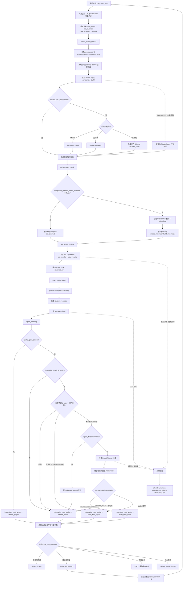

# `integration_test` 节点详细分析

## 1. 节点概览

- 节点名称：集成测试节点
- 主图 `node_id`：`integration_test`
- 主图注册位置：`Backend/app/graph/workflow.py:182`
- 外层节点实现：`Backend/app/graph/subgraphs/testing.py:412`
- 内部子图构建：`Backend/app/graph/subgraphs/testing.py:390`
- Graph State：`Backend/app/graph/state.py:5`
- 节点类型：**Testing Subgraph 包装节点**，不是单一的纯确定性节点
- 内部组成：3 个确定性节点、1 个 Test Deep Agent 审阅节点、1 个“确定性约束 + RepairPlanner Deep Agent”修复规划节点

该节点在主 Graph 中表现为一个节点，但内部固定串行执行：

```text
actual_project_checks
  -> api_contract_check
  -> test_agent_review
  -> main_quality_gate
  -> repair_planning
```

它承担四类职责：

1. 在目标工作区执行真实项目命令并保存日志；
2. 对已确认 `ProjectPlan` 做确定性 API 契约一致性检查；
3. 让只读 Test Agent 审阅证据，但不让模型决定门禁结果；
4. 由确定性质量门生成失败请求，并在需要时让只读 RepairPlanner 决定修复、确认或终止，再生成受限 SmallTask 任务。

## 2. 目标与非目标

### 2.1 目标

- 用真实命令退出码、超时、工具可用性和确定性契约校验决定质量门禁。
- 产生结构化 `test_results`、`test_report`、`revision_requests` 和修复任务计划。
- 把每项检查的运行状态通过 `integration_test.checks` custom stream 增量发送给前端。
- 在最多 `max_repair_iterations` 轮内，把可局部修复的问题路由到 `small_task_repair`，修复后重新进入本节点。
- 保留 Test Agent 和 RepairPlanner 的模型说明、模型名称、所选技能等审计信息。

### 2.2 非目标

- 不允许 Test Agent 凭模型判断覆盖真实命令结果。
- RepairPlanner 不直接改代码；真正改代码的是后续 `small_task_repair`。
- 修复失败后不返回 `build`。
- 不允许自动修改已确认的 RequirementSpec、PageDetail、ProjectPlan 或 API 契约。
- 当前实现不启动预览、不执行用户验收；通过后只路由到 `launch_project`。

## 3. 触发条件与主图位置

### 3.1 正常入口

正常主流程只有在 `build_summary.status == "completed"` 时，`route_build_result()` 才允许从 `build` 进入 `integration_test`：

```text
build -- build_summary.status == completed --> integration_test
```

来源：`Backend/app/graph/workflow.py:84-97, 247-255`。

### 3.2 复测入口

`small_task_repair` 成功时输出：

- `status = "in_progress"`
- `small_task_route = "integration_test"`
- `integration_next_action = "integration_test"`
- `repair_iteration = 上一轮 + 1`（只有实际派发过修复任务才增加）

随后 `route_small_task_result()` 将状态送回 `integration_test`。来源：

- `Backend/app/graph/nodes/small_task.py:212-230`
- `Backend/app/graph/workflow.py:63-81, 266-280`

### 3.3 显式恢复/调试入口

- `resume_from == "integration_test"` 可直接从主图 START 进入该节点。
- 显式节点调试会清空旧修复计划，并把 `repair_iteration` 重置为 `0`、`max_repair_iterations` 重置为 `3`。

来源：`Backend/app/graph/workflow.py:22-47`、`Backend/app/protocols/workflow/request.py:867-891`。

这意味着节点不能只依赖“正常上游一定正确”，仍需自行校验 `build_summary`、`project_plan` 和工作区。

### 3.4 快速修改流程复用

自由对话的直接修改流程也复用同一个 `integration_test()`，但强制设置：

- `integration_contract_check_enabled = False`
- `integration_repair_enabled = False`

因此它会跳过正式 ProjectPlan 契约校验，也不会在本子图内调用 RepairPlanner；直接修改流程使用自己的修复节点。来源：`Backend/app/graph/nodes/direct_modification.py:393-445`。

## 4. 外层节点输入

`integration_test(state)` 将整个 `ProjectState` 展开传入子图，但会在每一轮开始时强制重置：

- `test_results = []`
- `test_events = []`
- `code_changes = {}`
- `code_change_sets = []`
- `timeline = []`

因此每轮测试证据是全新计算的；修复次数、构建证据、正式计划和 SmallTask 历史仍从外层状态继承。

### 4.1 实际读取的输入字段

| 字段 | 子字段/类型 | 生产者或来源 | 消费位置 | 必要性判断 |
| --- | --- | --- | --- | --- |
| `workspace` / `workspace_path` | `str` | Workflow 请求边界 | 工作区定位、Agent backend、命令 cwd、产物路径 | **核心必要**；没有时会回退到 `project_id` 工作区 |
| `project_id` | `str` | Workflow 请求 | `workspace` 缺失时生成默认工作区路径 | 条件必要；正常显式工作区下不参与 |
| `build_summary` | `failed`, `pending`; 主图入口还使用 `status` | `build` | `api_contract_check` 的 `_build_is_clean()` | 正常路径上与 `status == completed` 重复，但对直接恢复/调试是必要的防御校验 |
| `build_results` | `list[dict]` | `build` | 原样写入 Test Agent 用户提示词 | 对确定性门禁**不必要**；仅增强模型审阅上下文 |
| `project_plan` | 见 10.2 | `project_planning`/详情确认 | API 契约一致性校验 | 正式主流程核心必要；快速修改模式显式跳过 |
| `integration_contract_check_enabled` | `bool` | 直接修改适配层 | `False` 时跳过契约检查 | 仅多流程复用需要；主流程缺省即启用 |
| `integration_repair_enabled` | `bool` | 直接修改适配层 | `False` 时失败直接终止本子图修复 | 仅多流程复用需要；主流程缺省即启用 |
| `selected_skill_names` | `list[str]` | Workflow 请求并在恢复时保持 | Test Agent、RepairPlanner 的 Agent bundle 与提示词注入 | 对确定性门禁不必要；对用户显式技能语义和 Agent 审阅必要 |
| `request` | `str` | 当前用户消息 | 解析已有修复范围计划的批准/拒绝 | 仅 `requires_user_confirmation` 恢复分支必要 |
| `test_report_path` | `str` | 旧状态/内部产物 | 决定报告覆盖路径 | 条件必要；缺失时使用标准路径 |
| `repair_task_plan` | `dict` | 上一轮 `repair_planning` | 恢复 `requires_user_confirmation` 计划 | 确认恢复分支核心必要 |
| `repair_task_plan_path` | `str` | 旧状态/内部产物 | 决定修复计划覆盖路径 | 条件必要；缺失时使用标准路径 |
| `repair_iteration` | `int` | 初始请求、`build` 修复或 `small_task_repair` | 预算判断、生成 attempt 唯一任务 ID | 核心必要；默认 `0` |
| `max_repair_iterations` | `int` | 初始请求/调试初始化 | 预算上限 | 核心必要；默认 `3` |
| `build_task_plan` | `dict` | `prepare_build_tasks`/`build` | 只进入 RepairPlanner 用户提示词 | 对确定性任务生成不必要；用于模型理解现有任务背景 |
| `build_execution_scope` | `type`, `targetId`/`target_id`, `apiContractId`/`api_contract_id` | `prepare_build_tasks`/`build` | 生成稳定修复范围和 `unit_id` | 修复规划核心必要；缺失时退化到 `application:root` |
| `build_execution_slice.tasks` | 每项读取 `owner`, `unit_id`, `allowed_paths`, `change_scope[].path`, `target_files` | `build` | 编译 SmallTask 的精确授权路径和 unit | **安全边界核心必要**；缺失会退化为命令级哨兵路径 |
| `small_task_results` | `list[dict]` | `small_task_repair` | 外层节点透传 | 对本轮检查不参与判断，仅用于历史展示 |
| `small_task_code_change_sets` | `list[dict]` | `small_task_repair` | 合并代码变更历史 | 对测试判定不必要；对变更审计必要 |
| `small_task_handoff` | `dict` | `small_task_repair` | 外层节点透传 | 当前测试逻辑不消费，仅保存恢复状态 |
| `small_task_handoff_submission` | `dict` | 用户确认恢复 | 外层节点透传 | 当前测试逻辑不消费，仅保存恢复状态 |

## 5. 节点提示词

确定性子节点没有 LLM 提示词。模型提示只存在于 `test_agent_review` 和失败分支的 `repair_planning`。

### 5.1 Test Agent system prompt

源码：`Backend/app/agents/test/agent.py:22-31`。

核心约束为：

```text
You are the Test Agent. Review deterministic evidence from install/build,
lint, typecheck, unit tests, API contract checks, and integration tests.
Do not replace command results with guesses. If any check fails,
use the supplied stdout/stderr summaries or virtual workspace log paths.
If those do not expose a cause, report insufficient evidence instead of guessing.
Explain the supported revision request for the Main Agent. Return a concise
validation report. Treat workspace filesystem write tools as unavailable
unless explicitly allowed by the harness.
```

运行时还会追加 `required_user_skills_prompt`。其中包含用户显式选择的每份完整 `SKILL.md`，但明确声明技能不能扩大文件权限、任务路径、已确认需求、API 契约、确认门或 Agent 角色边界。Agent 同时挂载只读 AGENTS.md memory。

### 5.2 Test Agent 动态 user prompt

源码：`Backend/app/agents/test/validator.py:10-25`。

模板结构：

```text
You are the Test Agent in an app-generation workflow.
Review deterministic test evidence and return a concise validation report.
Do not mark failed checks as passed. If any check fails, explain what should
be returned to the Main Agent as a revision request. Use stdout_tail and
stderr_tail first; virtual log paths are readable from the workspace root.
If neither summary nor readable log contains the cause, state that evidence
is insufficient and do not guess a root cause.

Deterministic test results:
<test_results 的完整 JSON>

Build results:
<build_results 的完整 JSON>
```

输入字段：

- `test_results[]`：本轮真实命令与 API 契约检查的完整结构；
- `build_results[]`：上游构建任务结果原样 JSON；
- `workspace`：只用于创建限定工作区的 Agent backend，不直接拼进 prompt；
- `selected_skill_names[]`：决定附加的技能 prompt 和 Agent bundle cache key。

模型文本不做 JSON 解析，直接成为 `agent_note`。

### 5.3 RepairPlanner system prompt

源码：`Backend/app/agents/repair_planner/agent.py:23-38`。

核心约束为：

```text
You are the RepairPlanner Agent for the app-generation workflow.
You are a planning-only DeepAgent node.
Analyze failed task attempts, test reports, failure logs, workspace snapshots,
allowed change scope, and acceptance criteria.
Return structured repair plans for scheduler consumption.
Do not edit files, do not run commands, do not mutate ProjectPlan,
RequirementSpec, BuildTaskPlan, test reports, DAG state, or scheduler state.
```

它还规定：

- `contract_mismatch` 应视为“让实现符合现有契约”的受限数据源实现修复；
- 扩大范围、改变已确认需求/API 契约、引入用户可见产品决策时返回 `requires_user_confirmation`；
- 证据不足或不可执行时返回 `terminal_failure`；
- 使用虚拟工作区路径读取日志；
- 同样追加完整的用户所选技能 prompt 和只读 AGENTS.md memory。

### 5.4 RepairPlanner 动态 user prompt

源码：`Backend/app/agents/repair_planner/planner.py:12-46`。

模型必须只返回一个 JSON 对象：

```json
{
  "decision": "repair | requires_user_confirmation | terminal_failure",
  "strategy": "short repair strategy",
  "reason": "required for confirmation or terminal failure",
  "failure_handling": "how the workflow should handle this failure"
}
```

动态正文包含：

- `TestReport`: `state.test_report` 完整 JSON；
- `RevisionRequests`: `state.revision_requests` 完整 JSON；
- `CurrentBuildTaskPlan`: `state.build_task_plan`，缺失时为 `{}`。

提示词特别要求：

- 不得把失败测试改判为通过；
- 不得静默修改已确认需求、PageDetail 或 API 契约；
- 优先依据 `stdout_tail`、`stderr_tail` 或虚拟日志；
- 证据不足时选择 `terminal_failure`；
- `contract_mismatch` 必须选择 `repair`，且不得要求修改 ProjectPlan。

注意：模型不直接输出最终 `tasks`。最终任务由 `create_repair_task_plan()` 根据确定性的 `revision_requests`、`build_execution_scope` 和 `build_execution_slice.tasks` 编译；模型主要决定路由和策略文本。

## 6. 内部子节点输入与输出

### 6.1 `actual_project_checks`

源码：`Backend/app/graph/subgraphs/testing.py:81-94`、`Backend/app/services/integration_test_runner.py:32-56`。

#### 输入

- `workspace` / `workspace_path` / `project_id`：解析工作区根目录；
- 工作区 `.xcodeagent/application.json.datasource.type`：决定是否执行后端检查；
- 工作区工程文件与宿主机工具，详见第 10 节；
- 瞬态 `RunnableConfig.configurable.integration_test_progress_reporter`：进度回调，不写入可持久化 State；
- `test_results`：外层已重置为空，子节点仍以追加方式合并。

#### 当前实际执行的检查

| 条件 | 检查 ID | required | 命令/行为 |
| --- | --- | ---: | --- |
| 找到前端 `package.json` | `frontend_install` | true | `<pnpm|yarn> install` |
| 找到 scripts.tsc | `frontend_typecheck` | false | `<pm> run tsc`；注意不是常见的 `scripts.typecheck` |
| 找到 scripts.build | `frontend_build` | true | `<pm> run build` |
| 未找到前端工程 | `frontend_install` | true | 结构化失败，不执行命令 |
| 数据源为 `static` | 所有后端检查 | - | 完全跳过，不生成后端 check |
| 找到 Maven 工程 | `backend_build` | true | `<mvnw|mvn> clean install` |
| Maven 工程但无 Maven | `backend_build` | true | 失败 |
| Maven 工程但无 Maven | `backend_static_check` | false | 跳过且视为通过 |
| Maven 工程但无 Maven | `backend_unit_tests` | true | 失败 |
| 根目录含 pytest 配置 | `backend_build` | false | 跳过且视为通过 |
| 根目录含 pytest 配置 | `backend_static_check` | false | 跳过且视为通过 |
| 根目录含 pytest 配置 | `backend_unit_tests` | true | `<python> -m pytest` |
| 无 Maven/pytest | `backend_build` | false | 跳过且视为通过 |

当前代码**没有执行** `frontend_lint`、`frontend_unit_tests`、`joint_integration` 或 E2E。虽然 Test Agent system prompt 和 `REQUIRED_TEST_CHECKS` 常量提到了这些类型，但它们不在当前 `run_integration_checks()` 实际路径中。

#### 单项 `test_results[]` 输出结构

```text
id: str
name: str
layer: "frontend" | "backend" | "contract"
language: "typescript" | "java" | "python" | null
passed: bool
skipped: bool
required: bool
command: str | null
evidence: str
failure_category: str | null
execution:
  tool: "subprocess" | "none" | "deterministic_validator"
  argv: list[str]
  cwd: str
  returncode: int | null
  timed_out: bool
  error?: str | null
  started_at?: ISO-8601 str
  finished_at?: ISO-8601 str
  stdout_log: str | null
  stderr_log: str | null
  stdout_log_virtual?: str
  stderr_log_virtual?: str
  stdout_tail?: str
  stderr_tail?: str
```

命令失败类别映射：

- `*_install` -> `dependency_install_failed`
- ID 含 `lint` -> `lint_failure`
- ID 含 `typecheck` -> `type_error`
- ID 含 `build` -> `compile_error`
- ID 含 `integration` -> `integration_test_failure`
- 其他 -> `test_failure`
- 必需工具/脚本缺失 -> `missing_test_tool`

#### 子节点返回

```text
test_results: 原 state.test_results + 本轮命令结果
test_events: 按执行顺序排列的 check id 列表
```

`test_events` 在 `ProjectState` 中使用 `Annotated[list[str], add]`，因此后续子节点的事件会累加而非覆盖。

### 6.2 `api_contract_check`

源码：`Backend/app/graph/subgraphs/testing.py:97-180`。

#### 输入

- `integration_contract_check_enabled`
- `project_plan`
- `build_summary.failed`
- `build_summary.pending`
- 上一子节点的 `test_results`
- 瞬态进度 reporter

#### 正式模式校验字段

`validate_api_contract_consistency(project_plan)` 实际读取：

- `project_plan.api_contracts[]`
  - `id`
  - `data_source_id`
  - `schemas.{schemaId}` 及递归 `$ref`
  - `endpoints[].id`
  - `endpoints[].method`
  - `endpoints[].path`
  - `endpoints[].parameters[].name`
  - `endpoints[].parameters[].in`
  - `endpoints[].request_schema_ref`
  - `endpoints[].response_schema_ref`
- `project_plan.data_sources[]`
  - `id`
  - `schema`（存在即视为重复契约字段）
  - `schema_refs[]`
- `project_plan.page_detail_plans[]`
  - `pageId`
  - `endpoint_dependencies[].endpoint_id`
  - `references.endpoint_dependencies[].endpoint_id`
  - `api_dependencies[].endpoint_id`
  - `response_bindings[].endpoint_id`
  - `response_bindings[].source_path`

data_sources	项目使用哪些业务数据源,

api_contracts	数据源对外提供什么 API、请求和响应是什么结构

page_detail_plans	页面使用哪些 API，以及如何把响应字段展示到页面上

下面是一个api契约校验通过的数据结构

 ```json
 {
  "data_sources": [
    {
      "id": "orders-db",
      "schema_refs": [
        "orders-api#/schemas/Order",
        "orders-api#/schemas/OrderListResponse",
        "orders-api#/schemas/CreateOrderRequest"
      ]
    }
  ],
  "api_contracts": [
    {
      "id": "orders-api",
      "data_source_id": "orders-db",
      "schemas": {
        "Order": {
          "type": "object",
          "properties": {
            "id": {
              "type": "string"
            },
            "status": {
              "type": "string"
            }
          }
        },
        "OrderListResponse": {
          "type": "object",
          "properties": {
            "items": {
              "type": "array",
              "items": {
                "$ref": "#/schemas/Order"
              }
            },
            "total": {
              "type": "integer"
            }
          }
        },
        "CreateOrderRequest": {
          "type": "object",
          "properties": {
            "status": {
              "type": "string"
            }
          }
        }
      },
      "endpoints": [
        {
          "id": "orders.list",
          "method": "GET",
          "path": "/api/orders",
          "response_schema_ref": "#/schemas/OrderListResponse"
        },
        {
          "id": "orders.detail",
          "method": "GET",
          "path": "/api/orders/{id}",
          "parameters": [
            {
              "name": "id",
              "in": "path"
            }
          ],
          "response_schema_ref": "Order"
        },
        {
          "id": "orders.create",
          "method": "POST",
          "path": "/api/orders",
          "request_schema_ref": "#/components/schemas/CreateOrderRequest",
          "response_schema_ref": "orders-api#/schemas/Order"
        }
      ]
    }
  ],
  "page_detail_plans": [
    {
      "pageId": "orders-page",
      "references": {
        "endpoint_dependencies": [
          {
            "endpoint_id": "orders.list"
          }
        ]
      },
      "response_bindings": [
        {
          "endpoint_id": "orders.list",
          "source_path": "$.items[].id",
          "page_field": "orderId"
        },
        {
          "endpoint_id": "orders.list",
          "source_path": "$.total.",
          "page_field": "total"
        }
      ]
    }
  ]
}
 ```

校验内容包括：契约/数据源引用、Schema `$ref`、Endpoint 唯一性、HTTP method、path 参数声明、读写接口 request/response Schema、页面 Endpoint 依赖和响应字段绑定。
校验器依次得到以下结论：
data_sources 不为空，同时 api_contracts 也不为空；
Contract orders-api 有 ID；
orders-api.data_source_id = orders-db 能找到数据源；
schemas 不为空；
OrderListResponse 中的 $ref 能找到 Order；
数据源的三个 schema_refs 都能找到对应 Schema；
三个 Endpoint ID 都存在且不重复；
三个 HTTP method 都合法；
三个 path 都以 / 开头；
orders.detail 的 {id} 有对应 path parameter；
orders.create 是 POST，并声明了请求 Schema；
三个非 DELETE Endpoint 都声明了响应 Schema；
所有 request/response Schema 引用都能解析；
页面依赖的 orders.list 存在；
页面绑定使用的 orders.list 已经被页面声明为依赖；
items[].id 能从 OrderListResponse -> Order.id 展开；
total 是 OrderListResponse 的真实字段；
数据源没有重复定义独立 schema。

#### 输出

追加一条 `id = "api_contract"` 的标准 check：

- 正式模式通过条件：`build_summary.failed == 0 && build_summary.pending == 0 && errors 为空`；
- 存在契约错误：`failure_category = "contract_mismatch"`；
- 无契约错误但构建不干净：`failure_category = "build_incomplete"`；
- 快速修改模式：`passed = true`、`skipped = true`、`required = false`。

子节点返回：

```text
test_results: 追加 api_contract check 后的列表
test_events: ["api_contract"] 或 ["api_contract:skipped"]
```

### 6.3 `test_agent_review`

源码：`Backend/app/graph/subgraphs/testing.py:183-199`。

#### 输入

- `test_results[]`
- `build_results[]`
- `workspace` / `workspace_path`
- `selected_skill_names[]`

#### 执行

1. 创建与本次工作区、技能快照、AGENTS.md memory 版本绑定的 Agent bundle；
2. 调用只读 Test Deep Agent；
3. 在调用前后快照工作区，理论上捕获意外文件变化；
4. Agent 没有额外业务工具，文件权限为全工作区只读、敏感路径拒绝。

#### 输出

```text
test_agent_review:
  agent_note: str
  reviewed_by:
    agent: "test-agent"
    mode: "live"
    model: str
    source: "test_deep_agent"
    requiredSkillsLoaded: list[str]
test_events: ["test_agent_review"]
code_changes?: dict
code_change_sets?: list[dict]
```

`agent_note` 只写入报告，不参与 `passed` 计算。`code_changes` 正常应为空，因为 Agent 是只读的；保留捕获逻辑属于防御和审计。

### 6.4 `main_quality_gate`

源码：`Backend/app/graph/subgraphs/testing.py:202-218`、`Backend/app/services/test_validation.py:70-140`。

#### 输入

- `test_results[]`
- `test_agent_review.agent_note`
- `test_agent_review.reviewed_by`
- `test_report_path` 或工作区产物根路径

#### 确定性规则

```text
passed = all(result["passed"] for result in test_results)
needs_revision = 存在 passed == false 的检查
```

Agent 不能修改这两个布尔值。

每个失败 check 转换为一个 `revision_requests[]` 项：

```text
id: "revision:<check-id>"
source: "integration_test"
target: "repair-planner-agent"
owner: str
owners: list[str]
reason: check.name
evidence: check.evidence
failed_check: 完整 check 对象
failed_attempt:
  source: "integration_test"
  check_id: str
  check_name: str
  status: "failed"
  failure_category: str
  command: str | null
  execution: 完整 execution 对象
  logs:
    stdout: stdout_log | null
    stderr: stderr_log | null
  agent_note: check.evidence
status: "pending"
```

owner 映射：

- `frontend_*` -> `owners = ["frontend"]`
- `backend_*` 或 `api_contract` -> `owners = ["data_source"]`
- 其他 -> `owners = ["frontend", "data_source"]`

注意：实现使用的 owner 名是 `data_source`，而 `create_repair_task_plan()` 汇总授权路径时建立的是 `frontend`、`backend`、`database` 三类。这会导致 `data_source` owner 无法从 `requested_paths_by_owner` 命中精确路径，进而退化为命令级哨兵路径；这是当前字段契约的不一致风险。

#### `test_report` 输出结构

```text
version: "0.1.0"
generated_at: ISO-8601 str
passed: bool
checks: test_results 完整列表
agent_note: str
reviewed_by: dict | null
summary:
  total: int
  passed: int
  failed: int
needs_revision: bool
revision_requests: list[dict]
quality_gate:
  passed: bool
  required_checks: list[str]
  evaluated_by: "deterministic-quality-gate"
```

报告写入 `test_report_path`；缺省路径为：

```text
<workspace>/.xcodeagent/reports/test-report.json
```

#### 子节点返回

```text
phase: "integration_test"
test_report: dict
test_report_path: str
quality_gate_passed: bool
needs_revision: bool
revision_requests: list[dict]
test_events: ["main_quality_gate"]
```

### 6.5 `repair_planning`

源码：`Backend/app/graph/subgraphs/testing.py:221-387`。

#### 输入

- `quality_gate_passed`
- `integration_repair_enabled`
- `repair_task_plan`
- `request`
- `repair_iteration`
- `max_repair_iterations`
- `test_report`
- `revision_requests`
- `build_task_plan`
- `build_execution_scope`
- `build_execution_slice.tasks`
- `workspace` / `workspace_path`
- `selected_skill_names`
- `repair_task_plan_path`

#### 分支输出

#### A. 门禁通过

```text
repair_task_plan: {}
repair_tasks: []
integration_next_action: "launch_project"
test_events: ["repair_planning:skipped"]
```

#### B. 禁止本子图自动修复

```text
repair_task_plan: {}
repair_tasks: []
integration_next_action: "handle_failure"
test_events: ["repair_planning:disabled"]
```

#### C. 已有待确认计划，用户拒绝

```text
repair_task_plan.status: "terminal_failure"
repair_task_plan.decision: "terminal_failure"
repair_task_plan.tasks: []
repair_tasks: []
integration_next_action: "handle_failure"
clarification: {}
test_events: ["repair_planning:scope_rejected"]
```

#### D. 已有待确认计划，用户批准

从 `existing_plan.candidateTasks[]` 恢复为 `tasks[]`：

```text
repair_task_plan.status: "ready" | "terminal_failure"
repair_task_plan.decision: "repair" | "terminal_failure"
repair_task_plan.approvedPlanId: existing planId
repair_tasks: candidateTasks
integration_next_action: "small_task_repair" | "handle_failure"
clarification: {}
test_events: ["repair_planning:scope_approved"]
```

批准动作本身不增加修复次数；只有 SmallTask 真正派发才增加。

#### E. 修复预算耗尽

当 `repair_iteration >= max_repair_iterations`：

```text
repair_task_plan:
  version: "0.1.0"
  status: "terminal_failure"
  decision: "terminal_failure"
  reason: "Integration repair iteration budget exhausted."
  tasks: []
repair_task_plan_path: str
repair_tasks: []
repair_iteration: int
max_repair_iterations: int
integration_next_action: "handle_failure"
test_events: ["repair_planning:budget_exhausted"]
```

#### F. 调用 RepairPlanner

RepairPlanner 决策经过确定性后处理：

- `contract_mismatch` 会强制覆盖为 `decision = "repair"`；
- `requires_user_confirmation` 或 `terminal_failure` 时，仍先编译 `candidateTasks`，但正式 `tasks = []`；
- `repair` 时生成正式 `tasks[]`；
- 计划写入 `<workspace>/.xcodeagent/plans/repair-task-plan.json`，或覆盖已有 `repair_task_plan_path`。

最终修复计划的主要字段：

```text
version: "0.1.0"
status: "ready" | "not_required" | "requires_user_confirmation" | "terminal_failure"
decision: "repair" | "requires_user_confirmation" | "terminal_failure"
generated_at: ISO-8601 str | test_report.generated_at
source: "integration_test"
planId: str
requestedPaths: list[str]
repair_scope:
  type: "application" | "page" | "data_source" | "endpoint"
  targetId: str
  unit_id: str
tasks: list[RepairTask]
candidateTasks?: list[RepairTask]
summary:
  total: int
  frontend: int
  backend: int
  database: int
agent_note: str
strategy?: str
reason?: str
failure_handling?: str
planner_decision?: dict
prepared_by:
  agent: "repair-planner-agent"
  mode: "live" | "deep_agent"
  source?: "repair_planner_test_repair_planning"
  model: str
  requiredSkillsLoaded: list[str]
```

单个 `RepairTask` 字段：

```text
id: "repair:<planId>:<attempt>:<failed-check-id>:<owner>"
kind: "repair"
repair_attempt: int
owner: str
unit_id: str
description: str
dependencies: []
status: "pending"
source_ref:
  type: "revision_request"
  id: revision request id
  failed_check_id: str
allowed_paths: list[str]
target_files: list[str]
change_scope:
  - operation: "modify"
    path: str
    description: str
repair_scope:
  type: str
  targetId: str
  unit_id: str
  planId: str
  requestedPaths: list[str]
  reason: str
can_run_in_parallel: false
parallel_reason: str
acceptance_criteria: list[str]
failure_evidence:
  evidence: str
  failed_attempt: dict
```

`integration_next_action` 的确定性映射：

- decision/status 为 `requires_user_confirmation` -> `await_user_input`
- decision/status 为 `terminal_failure` -> `handle_failure`
- `tasks` 非空 -> `small_task_repair`
- 其他 -> `handle_failure`

等待确认时还输出 `clarification`：

```text
mode: "repair_scope_confirmation"
status: "requires_user_input"
message: str
planId: str
requestedPaths: list[str]
requestedResources: list[dict]
reason: str
questions:
  - id: "repair_scope_confirmation"
    header: "修复范围"
    question: str
    type: "text"
    placeholder: str
```

当前 RepairPlanner 的集成测试 prompt/后处理没有产生 `requestedResources`，确认 payload 通常只能从计划中读取空列表。

## 7. 外层 `integration_test` 输出

外层包装节点返回以下字段：

| 字段 | 类型 | 含义 |
| --- | --- | --- |
| `phase` | `"integration_test"` | 当前阶段 |
| `test_results` | `list[dict]` | 本轮全量检查 |
| `test_events` | `list[str]` | 五个子节点累加的事件 |
| `test_agent_review` | `dict` | Test Agent 审阅 |
| `test_report` | `dict` | 确定性质量报告 |
| `test_report_path` | `str | None` | 报告路径 |
| `quality_gate_passed` | `bool` | 主图路由的第一优先判断字段 |
| `needs_revision` | `bool` | 是否存在失败检查 |
| `revision_requests` | `list[dict]` | 失败到修复规划的结构化桥接 |
| `repair_task_plan` | `dict` | 修复计划或终止计划 |
| `repair_task_plan_path` | `str | None` | 修复计划路径 |
| `repair_tasks` | `list[dict]` | 待执行修复任务 |
| `small_task_tasks` | `list[dict]` | 与 `repair_tasks` 相同，供 SmallTask 节点消费 |
| `small_task_results` | `list[dict]` | 从进入节点前状态透传 |
| `small_task_code_change_sets` | `list[dict]` | 旧 SmallTask 变更 + 子图内 Agent 变更 |
| `small_task_handoff` | `dict` | 透传 |
| `small_task_handoff_submission` | `dict` | 透传 |
| `small_task_route` | `str` | 有 repair tasks 时强制为 `small_task_repair`，否则跟随 next action |
| `repair_iteration` | `int` | 当前已消耗真实修复次数 |
| `max_repair_iterations` | `int` | 修复预算上限 |
| `integration_next_action` | `str` | `launch_project` / `small_task_repair` / `await_user_input` / `handle_failure` |
| `code_changes` | `dict` | 合并后的展示用变更集 |
| `code_change_sets` | `list[dict]` | SmallTask 历史与子图 Agent 变更集 |
| `timeline` | `["integration_test"]` | 主图时间线标记 |

`test_events`、`code_change_sets`、`timeline` 在外层 `ProjectState` 都是 `add` reducer。`test_results` 不是 reducer 字段，因此每轮会替换为本轮结果。

## 8. 成功、失败和确认后的主图路由

主图函数：`Backend/app/graph/workflow.py:50-60`。

| 条件 | 路由 | 后续结果 |
| --- | --- | --- |
| `quality_gate_passed is truthy` | `launch_project` | 启动项目预览，随后等待用户验收 |
| 门禁失败且 `integration_next_action == "small_task_repair"` | `small_task_repair` | 执行局部代码修复；成功后回到 `integration_test` 复测 |
| 门禁失败且 `integration_next_action == "await_user_input"` | `END` | 当前运行停止，等待用户批准/拒绝修复范围；恢复时再次进入 `integration_test` |
| 其他门禁失败 | `handle_failure` | 输出 `phase = "failed"`, `status = "failed"` 后 END |

路由优先级上，`quality_gate_passed` 高于 `integration_next_action`。即使 next action 异常残留，只要门禁为真仍进入 `launch_project`。

业务失败和技术异常必须区分：

- **业务失败**：检查返回 `passed = false`，节点仍正常完成并生成报告/修复计划，再按上表路由；
- **技术异常**：Python 异常从子图抛出，通常不会进入 `handle_failure`，而由 Workflow AG-UI runtime 产生 `workflow.run.failed` 和 `RunErrorEvent(code = WORKFLOW_RUN_FAILED)`。

## 9. 错误处理

### 9.1 已转为结构化检查结果的错误

- `subprocess.TimeoutExpired`：不抛出；记录 stdout/stderr、`timed_out = true`、`passed = false`。
- `OSError`：不抛出；写入 `execution.error`、`passed = false`。
- 非零退出码：不抛出；保存退出码和最多 4000 字符的 stdout/stderr 尾部。
- 缺少包管理器、Maven 或 Python：返回 `missing_test_tool` 失败或可选跳过项。
- 可选检查缺少 script：`skipped = true` 且 `passed = true`。
- 进度 callback 自身异常：`report_check_progress()` 吞掉异常，不影响测试。
- LangGraph stream writer 不可用：退化为空函数，不影响测试。

### 9.2 确定性业务错误

- API 契约错误：转为 `contract_mismatch` check，不抛异常。
- 构建计数不干净：转为 `build_incomplete` check。
- 修复预算耗尽：持久化 `terminal_failure` 修复计划，再路由 `handle_failure`。
- 用户拒绝修复范围：把已有计划改成 `terminal_failure`。
- RepairPlanner 明确返回 `terminal_failure`：保留 candidate tasks 但不执行，路由失败。

### 9.3 会向上抛出的技术异常

当前节点没有统一的内部 `try/except`。以下错误会中断子图：

- `.xcodeagent/application.json` 存在但 JSON/`datasource.type` 非法；
- 创建日志目录或写 stdout/stderr 日志失败；
- 读取/解析部分工程文件之外的未捕获文件系统异常；
- Test Agent 创建、模型调用或结果提取失败；
- RepairPlanner Agent 创建或模型调用失败；
- `test-report.json` 或 `repair-task-plan.json` 写入失败；
- 状态字段类型不符合代码假设，例如 `build_summary.failed` 不能转成 `int`。

这些异常最终由 `Backend/app/protocols/workflow/runtime.py:979-1035` 捕获并输出 AG-UI `RunErrorEvent`，但不会得到与业务失败相同的 `revision_requests` 或 `repair_task_plan`。

### 9.4 模型输出异常处理

- Test Agent 输出无需 JSON，只要能提取最后文本即可；空文本仍可成为 `agent_note`。
- RepairPlanner 输出无法解析为 JSON 时，集成测试修复路径当前回退为：

  ```text
  decision = "repair"
  strategy = 原始 agent_note
  ```

  这与提示词中“证据不足应 terminal_failure”的保守要求不一致；随后系统仍可能确定性生成修复任务。
- `contract_mismatch` 无论模型返回什么，都被确定性改成 `repair`，这是有意的契约保护。

### 9.5 确认恢复边界

当已有计划等待确认，但本次 `request` 既未识别为批准也未识别为拒绝时，代码不会继续保持原确认状态，而会继续执行预算判断并再次调用 RepairPlanner。这可能导致计划被重新生成，是当前确认错误处理的边界风险。

## 10. 依赖分析

### 10.1 对其他节点产出的依赖

| 上游节点/边界 | 依赖字段 | 是否必要 | 分析 |
| --- | --- | --- | --- |
| Workflow 请求/恢复层 | `workspace`, `workspace_path`, `project_id` | 必要 | 确定所有命令、Agent 文件读取和产物写入边界 |
| `project_planning` + 详情确认 | `project_plan` 及第 6.2 节字段 | 正式模式必要 | API 契约检查的唯一正式输入；不应由生成代码反推替代 |
| `prepare_build_tasks` / `build` | `build_summary.failed`, `pending` | 防御性必要 | 正常路由已要求 `status=completed`，但直接恢复可绕过正常入口 |
| `build` | `build_results` | 非门禁必要 | 只给 Test Agent 阅读；去掉不会改变确定性 pass/fail |
| `prepare_build_tasks` / `build` | `build_task_plan` | 辅助 | 只影响 RepairPlanner 语义判断，不参与最终路径授权 |
| `prepare_build_tasks` / `build` | `build_execution_scope` | 修复路径必要 | 生成稳定 repair scope/unit；缺失会扩大为 application root 语义 |
| `build` | `build_execution_slice.tasks[].owner/unit_id/allowed_paths/change_scope/target_files` | **安全必要** | 最终 RepairTask 的授权路径来源；不应由模型自行生成 |
| `build` / `small_task_repair` | `repair_iteration`, `max_repair_iterations` | 必要 | 阻止无限修复循环，并区分 attempt ID |
| 前一轮 `integration_test` | `repair_task_plan`, `repair_task_plan_path` | 确认恢复必要 | 保持稳定 `planId` 和 candidate tasks |
| `small_task_repair` | `small_task_code_change_sets` | 审计必要 | 不参与测试结果，但用于最终代码变更展示 |
| Workflow 请求 | `selected_skill_names` | Agent 语义必要 | 用户显式选择的技能必须在 Test/RepairPlanner 中保持一致 |

#### 依赖合理性结论

- `project_plan`、工作区、修复预算和执行切片授权是不可删除的核心依赖。
- `build_results` 和 `build_task_plan` 只服务模型上下文，不应成为确定性门禁的硬依赖；当前实现符合这一点。
- `build_summary.failed/pending` 在正常主路由中重复，但保留有助于直接恢复和节点调试，不建议简单删除。
- `small_task_results`、handoff 字段在节点内只是透传，属于恢复/展示依赖，不属于测试逻辑依赖。

### 10.2 对工作区文件的依赖

| 文件/目录 | 读取字段或用途 | 必要性 |
| --- | --- | --- |
| `.xcodeagent/application.json` | `datasource.type` | 正式应用必要；决定 static 是否跳过所有后端检查 |
| `frontend/package.json`, `Frontend/package.json`, `app/frontend/package.json`, 根 `package.json` | `scripts`, 工程 cwd | 前端检查必要；按固定优先级只取第一个合法文件 |
| `pnpm-lock.yaml` | 选择 `pnpm` | 条件必要 |
| `yarn.lock` | 选择 `yarn` | 条件必要 |
| `pom.xml`（根、`backend`、`Backend`） | 识别 Maven 工程 | Java 后端条件必要 |
| `mvnw` / `mvnw.cmd` | 优先于全局 `mvn` | Maven 条件必要 |
| `pytest.ini`, `pyproject.toml`, `setup.cfg`（仅根目录） | 任一存在即识别 pytest 项目 | Python 后端条件必要，但识别较宽，文件存在不等于一定配置 pytest |
| `.xcodeagent/runtime/tests/<check-id>/stdout.log` | 命令 stdout 完整日志 | 输出产物；Agent 证据不足时读取 |
| `.xcodeagent/runtime/tests/<check-id>/stderr.log` | 命令 stderr 完整日志 | 输出产物；Agent 证据不足时读取 |
| `.xcodeagent/reports/test-report.json` | 持久化 `test_report` | 审计/恢复必要，不参与本轮 pass 计算 |
| `.xcodeagent/plans/repair-task-plan.json` | 持久化修复计划 | 修复确认/恢复必要 |
| 用户技能目录中的所选 `SKILL.md` | 完整注入两个 Agent system prompt | 用户显式选择技能时必要 |
| AGENTS.md memory 快照 | 两个 Agent 的只读 memory | Agent 行为约束必要；不参与确定性门禁 |

#### 文件依赖中的冗余与偏差

- `run_integration_checks()` 读取了根目录 `package.json` 到局部变量 `workspace_package`，但后续完全未使用；这是当前不必要读取。
- `PackageProject.package_json_path` 当前不被测试执行逻辑消费。
- `_first_script()`、`_first_package_with_script()` 当前未被任何执行路径调用，像是尚未接入 lint/unit/integration 脚本发现的遗留辅助函数。
- `package.json.packageManager` 字段未读取；没有 lockfile 时默认 `pnpm`。
- `scripts.typecheck`、`scripts.lint`、`scripts.test` 当前不读取；类型检查只查 `scripts.tsc`。
- `pnpm install`/`yarn install` 会写 lockfile、`node_modules` 或生命周期脚本产物，因此节点具有工作区副作用；这些命令变化也没有被 `capture_agent_file_changes()` 捕获，因为捕获只包围两个 Agent 调用。

### 10.3 对宿主环境和工程模块的依赖

#### 外部命令

- `pnpm` 或 `yarn`
- Maven wrapper 或全局 `mvn`
- 当前 Python 解释器，冻结环境下回退 `python3`、`python` 或 Windows `py -3`
- 每条命令超时上限固定为 180 秒

缺少命令会被转为结构化检查，不会直接崩溃。

#### 核心代码模块

| 模块 | 作用 | 必要性 |
| --- | --- | --- |
| `services/integration_test_runner.py` | 工程发现、命令执行、日志和 check 结构 | 核心必要 |
| `services/api_contract_validation.py` | ProjectPlan 契约闭合校验 | 正式流程核心必要 |
| `agents/test/validator.py` + `agents/test/agent.py` | 证据审阅和说明文本 | 设计要求必要，但不是布尔门禁必要 |
| `services/test_validation.py` | 质量门、revision request、RepairTask 编译 | 核心必要 |
| `agents/repair_planner/*` | 失败处理决策和策略 | 自动修复分支必要；contract mismatch 的路由由确定性逻辑兜底 |
| `workspace/test_documents.py` | 报告持久化 | 审计/恢复必要 |
| `workspace/task_documents.py` | 修复计划持久化 | 确认/恢复必要 |
| `workspace/code_changes.py` | Agent 调用前后变更审计与合并 | 防御性必要；两个 Agent 理论上只读 |
| `protocols/workflow/runtime.py` | 进度转 AG-UI、异常转 RunError | 对外协议必要 |

## 11. 当前实现风险与设计偏差

以下均是基于当前源码的分析结论，不代表本次文档任务已经修改代码：

1. **检查覆盖与命名不一致**：设计文档、Test Agent prompt 和 `REQUIRED_TEST_CHECKS` 提到 lint、前端单测、联合集成测试，但 runner 实际不执行。
2. **现有测试与实现已经发生漂移**：`Backend/tests/test_integration_test_runner.py` 仍断言产生 `frontend_lint`、`frontend_unit_tests`，而当前 `_frontend_checks()` 只生成 install、`scripts.tsc` 和 build；无 Maven/pytest 工程时，测试还期望存在 skipped `backend_unit_tests`，当前实现只返回 skipped `backend_build`。第 15 节的聚焦测试已经复现这两项不一致。
3. **owner 字段不一致**：revision request 把后端/API 契约失败 owner 映射成 `data_source`，RepairTask 授权索引却只建立 `backend`/`database`，可能丢失精确路径授权。
4. **模型解析失败默认继续修复**：RepairPlanner 非 JSON 输出会被视为 `repair`，不符合“证据不足终止”的提示词原则。
5. **确认回答无法识别时会重规划**：没有稳定保持原 `requires_user_confirmation` 状态。
6. **安装命令有副作用且无变更审计**：依赖安装可能改 lockfile，但 outer `code_change_sets` 不记录实际命令造成的变更。
7. **Test Agent 是可用性硬依赖**：虽然模型不决定门禁，但模型调用异常会让整个节点技术失败，导致已有确定性证据也无法形成最终报告。
8. **所有 check 都参与 `all()`**：`evaluate_quality_gate()` 不按 `required` 过滤；当前可选缺失检查因为被标为 `passed=true` 所以没问题，但未来若出现 `required=false, passed=false` 的检查，也会阻断门禁。
9. **技术异常不生成节点级失败工件**：模型/磁盘/配置异常直接走 Workflow `RunError`，不会持久化统一的技术失败 TestReport。

## 12. 内部流程图



## 13. 结论

`integration_test` 的核心架构方向是清晰的：真实命令和契约校验负责事实，Test Agent 负责解释，确定性质量门负责 pass/fail，RepairPlanner 只决定失败处理策略，最终修复任务再由确定性代码限制到当前 build slice 的授权范围。

但按当前代码，它应准确描述为“**有限检查覆盖的测试/质量/修复规划子图**”，而不是完整意义上的全量集成测试节点。最需要后续确认或修正的部分是：实际检查覆盖、`data_source` owner 与授权 owner 的字段契约、RepairPlanner 非 JSON 回退策略，以及确认恢复的稳定性。

## 14. 主要源码索引

- `Backend/app/graph/subgraphs/testing.py`
- `Backend/app/graph/workflow.py`
- `Backend/app/graph/state.py`
- `Backend/app/services/integration_test_runner.py`
- `Backend/app/services/api_contract_validation.py`
- `Backend/app/services/test_validation.py`
- `Backend/app/agents/test/agent.py`
- `Backend/app/agents/test/validator.py`
- `Backend/app/agents/repair_planner/agent.py`
- `Backend/app/agents/repair_planner/planner.py`
- `Backend/app/graph/nodes/small_task.py`
- `Backend/app/workspace/test_documents.py`
- `Backend/app/workspace/task_documents.py`
- `Backend/app/protocols/workflow/runtime.py`
- `Backend/tests/test_testing_subgraph_events.py`
- `Backend/tests/test_integration_repair_flow.py`
- `Backend/tests/test_integration_test_runner.py`
- `Backend/tests/test_workflow_routing.py`

## 14. 优化点

1. **去掉test_review_agent子节点**

它目前的价值只有：
测试结果自然语言总结
模型和技能审计信息
给 RepairPlanner 增加一段预分析文本

代价却包括：
每次集成测试多一次模型调用
增加延迟和 Token 成本
与 RepairPlanner 重复分析
前端不可见
模型失败会阻断确定性质量门禁
综合来看，当前实现中它的收益明显小于复杂度和可靠性成本


2. **actual_project_check节点内前后端并行执行，减少用户等待时间**
注意内部串行


3. **API契约的检查应该移动到detail_confirmation节点内**
这个节点在pending_plan = _generate_all_detail_plans(...)生成了如下数据结构
{
  "api_contracts": [],
  "data_sources": [],
  "page_detail_plans": [],
  "endpoint_detail_plans": []
}
因此在这里执行api契约校验：validation_errors = validate_api_contract_consistency(pending_plan)


如果报错：需要区分错误属于 ProjectPlan 基础契约还是 PageDetail。
1. PageDetail 错误
例如：
Page product-list binds unknown response field data.productName.
或者：
Page product-list binds undeclared endpoint list-products.
这种错误仍留在 detail_confirmation：
{
  "phase": "detail_confirmation",
  "status": "requires_user_input",
  "pending_project_plan": {},
  "clarification": {
    "mode": "detail_contract_validation_error",
    "message": "页面详细设计与 API 契约不一致，需要重新生成并确认。",
    "errors": []
  }
}
节点可以根据错误定位重新生成受影响的 PageDetail，然后再次展示确认。
路由：
detail_confirmation
→ 重新生成受影响详情
→ 用户重新确认
→ 再次校验
2. ProjectPlan 基础契约错误
例如：
Endpoint list-products references unknown schema ProductListResponse.
或者：
API contract inventory-api references unknown data source inventory.
这类错误不能由 PageDetail 修复，需要返回 project_planning。
不需要新增节点，只要扩展现有路由：
def route_detail_confirmation(state):
    if state.get("detail_next_action") == "project_planning":
        return "project_planning"

    if state.get("status") == "requires_user_input":
        return "await_user_input"

    return "inspect_workspace"
校验失败输出：
{
  "phase": "detail_confirmation",
  "status": "completed",
  "detail_next_action": "project_planning",
  "plan_revision_request": {
    "reasonCode": "plan_contract_invalid",
    "errors": []
  }
}
主图增加一条已有节点之间的边：
detail_confirmation → project_planning
这只是增加路由，不是新增节点。
