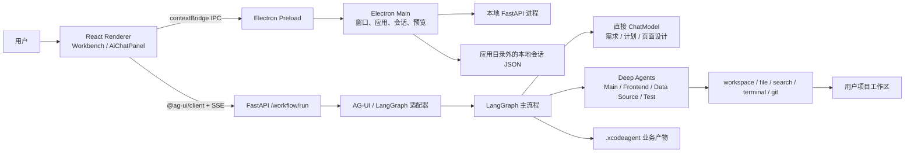
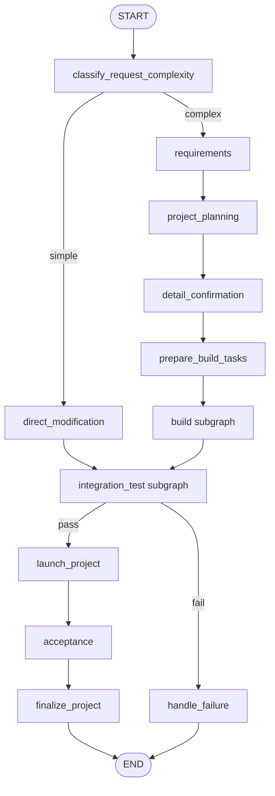
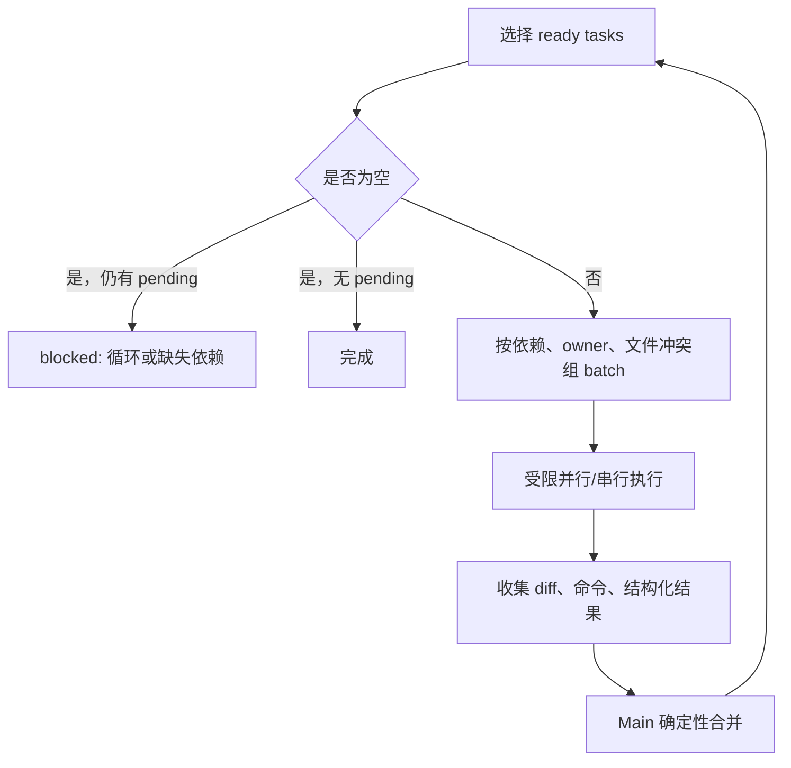
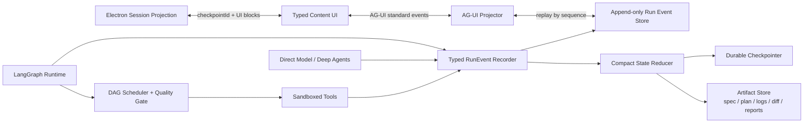

# XCodeAgent 项目架构审计与优化方案

> 审计日期：2026-07-11  
> 审计对象：当前工作区源码（包含审计时尚未提交的在途改动）  
> 关联文档：[前后端模型输出通信设计](./MODEL_OUTPUT_COMMUNICATION_DESIGN.md)、[Workflow 设计](./WORKFLOW.md)、[代码库索引](./CODEBASE_INDEX.md)

## 1. 结论摘要

XCodeAgent 已经形成了合理的桌面端编码 Agent 骨架：Electron 负责本地应用生命周期和持久化，React 负责工作台，FastAPI 暴露 AG-UI 与受控工作区工具，LangGraph 负责确定性阶段流转，Deep Agents 负责需要文件与工具的自主执行。需求、计划、API 契约、页面细化、任务拆分、构建和测试也已经有明确的领域边界。

当前最需要优化的不是继续增加 Agent 或新抽象，而是把已有链路闭环。优先级最高的五项是：

1. 建立统一的模型输出与运行事件契约，确保普通文本、JSON、工具结果和错误均可见、可持久化、可重放。
2. 把“任务完成”和“测试通过”建立在真实 diff、命令退出码和验收证据上，移除当前演示式假阳性。
3. 把任务 `change_scope` 从 prompt 约束落实为工具层文件权限，并让规划/侦察阶段真正只读。
4. 将 Graph State 缩减为小型状态和产物引用，接入持久 checkpointer 与 append-only run event store。
5. 让 Build Subgraph 真正循环执行任务 DAG，并只在失败时进入修复规划。

如果按本文路线实施，XCodeAgent 会从“功能边界已经成形的本地原型”演进为“可恢复、可审计、传输稳定、执行结果可信的桌面编码 Agent”。

## 2. 审计范围与方法

本次审计覆盖：

- Electron main/preload、窗口与后端进程生命周期、应用和会话存储；
- React 工作台、AiChatPanel、AG-UI client、消息与 Workflow 渲染；
- FastAPI 路由、AG-UI 协议适配、工作区工具和审批；
- LangGraph 主流程、Build/Testing Subgraph、Graph State 与恢复；
- 直接 ChatModel、Main/Frontend/Data Source/RepairPlanner Deep Agent；
- workspace 沙箱、代码变更捕获、业务产物、run persistence 与 observability；
- 依赖版本、现有测试和文档一致性。

证据主要来自以下入口：

- `Frontend/src/main/index.ts`、`Frontend/src/main/backendService.ts`；
- `Frontend/src/renderer/src/service/agUiAgent.ts`、`service/chatSessions.ts`；
- `Frontend/src/renderer/src/components/AiChatPanel/`；
- `Backend/app/main.py`、`protocols/workflow_request.py`、`protocols/workflow_visualization.py`；
- `Backend/app/graph/workflow.py`、`graph/state.py`、`graph/subgraphs/`；
- `Backend/app/agents/`、`services/`、`workspace/`、`observability/`、`persistence/`；
- `Backend/tests/` 与前端 package scripts。

审计没有调用真实模型，也没有对用户工作区运行会修改文件的 Workflow。通信判断通过 Fake Graph 和已有单测验证。

## 3. 当前总体架构



### 3.1 桌面层

Electron main 当前承担：

- 打包后端进程的定位、随机本地端口、健康轮询与退出清理；
- 登录窗口、主窗口、预览窗口、Tray 和外部链接；
- application、workspace、session、auth、browser IPC；
- 应用配置和会话 JSON 的本地文件读写。

preload 通过 `window.xcodeAgent` 暴露最小 IPC API，并把本地后端地址注入 renderer。renderer 的 AG-UI 请求不经过 IPC，而是直接使用 `HttpAgent` 访问 FastAPI；这减少了一层手写流式代理，是合理选择。

### 3.2 前端应用层

前端入口大致为：

```text
main.tsx
  -> WorkbenchProvider
  -> AppEntryPage
     -> WelcomePage
     -> WorkbenchPage
        -> LeftPanel
           -> AiChatPanel
```

AiChatPanel 已按职责拆分：

- `useChatSessions` 管本地会话列表和读写；
- `useSessionRuntimeStore` 管 session-keyed draft、message、AG-UI client；
- `useWorkflowConversation` 管发送、停止、澄清续跑与运行状态；
- `agUiAgent.ts` 把 AG-UI subscriber 回调投影成 workflow/tool/process 数据；
- `MessageList`、`WorkflowRunCard`、`ProcessSteps`、`ToolCallCard` 负责展示。

### 3.3 后端与 Agent 层

后端职责划分总体正确：

| 层 | 当前责任 | 评价 |
| --- | --- | --- |
| `main.py` | FastAPI composition root 与路由注册 | 入口明确，但可进一步拆 router |
| `protocols/` | 请求解析、AG-UI 编码和前端投影 | 正确边界，但主适配器过重 |
| `graph/` | 生命周期、路由、节点和 Subgraph | 方向正确，部分执行逻辑仍是演示实现 |
| `agents/` | 模型构建、四个 Agent、workspace scope | Agent 边界清楚，调用输出契约不统一 |
| `services/` | 归一化、计划、契约、调度、质量门禁 | 确定性规则集中，是当前优势 |
| `workspace/` | 文件、命令、Git、产物与 diff | 能力完整，但文件过大且 task 权限未落实 |
| `observability/` | Agent token/tool/SubAgent 活动 | 已有可视化基础，尚未成为统一事件源 |
| `persistence/` | run event/artifact 草案 | 主流程未接入 |

### 3.4 Workflow 主流程



需求确认、计划确认和细节确认已经有硬闸口；API contract 作为前后端字段唯一事实源，并在任务拆分前和 integration test 中做确定性校验。这些都是应继续保留的设计。

## 4. 当前架构的优势

### 4.1 生命周期与自主执行分离

外层 Graph 决定阶段、确认和质量门禁；Deep Agent 只在阶段允许的范围内执行。这比让一个通用 Agent 自己决定需求、写代码、跳过确认和宣布完成更容易审计。

### 4.2 纯推理边界没有不必要的文件权限

需求、项目规划、页面设计主要使用直接 ChatModel；只有需要检查或修改 workspace 时才创建 Deep Agent。这符合渐进披露和最小权限方向，也能减少上下文污染。

### 4.3 API 契约有确定性事实源

`ProjectPlan.api_contracts` 统一 schema、endpoint 和页面字段绑定，`api_contract_validation.py` 负责验证引用。这能避免前端、后端和数据源各自发明字段。

### 4.4 工作区基础安全能力已经存在

当前已有：

- workspace root 解析与 virtual path；
- 敏感文件拒绝；
- RepairPlanner Agent 全局只读；
- workspace 级并发 lease；
- 高风险工具审批；
- Agent 前后 workspace diff 捕获。

缺口主要在“任务级最小权限”和“本地 HTTP capability”，不需要推倒重做。

### 4.5 业务产物已经文件化

RequirementSpec、ProjectPlan、BuildTaskPlan、TestReport 等写入 `.xcodeagent/`，Graph State 不必成为唯一事实源。这为后续恢复、审计和 context compression 提供了基础。

### 4.6 AG-UI 基础能力覆盖较全

项目已经使用标准客户端和核心事件，不是手写 SSE parser。当前安装版本支持 `RUN_ERROR`、`STEP_*`、`STATE_DELTA`、`MESSAGES_SNAPSHOT`、`ACTIVITY_*` 和 `REASONING_*`，可在不新增传输框架的前提下完成协议升级。

## 5. 风险与优化项

优先级定义：

- **P0**：会直接造成结果不可信、越权或用户要求无法满足；
- **P1**：会造成恢复、性能、演进或安全风险，应在主链路稳定前完成；
- **P2**：维护性和工程质量优化，可随模块变更逐步处理。

### 5.1 P0：模型输出没有端到端完整性保证

`workflow_visualization.py::_message_process_frames` 处理 reasoning、tool call chunk 和 tool result，但不处理普通 `message_chunk.content: str`。最终 `TEXT_MESSAGE_CONTENT` 主要是 Workflow summary，而不是模型正文。JSON 成功归一化时可能藏在 state/result 中，失败或未落到已知字段时可能完全丢失。

前端进一步只消费部分事件，并在正常完成后隐藏 process/tool/workflow 过程卡。Electron 主进程保存 session 时还会丢弃 renderer 已有的 `toolCalls` 与 `processSteps`。

这项问题的完整修复方案见 [MODEL_OUTPUT_COMMUNICATION_DESIGN.md](./MODEL_OUTPUT_COMMUNICATION_DESIGN.md)。

### 5.2 P0：质量门禁和验收存在假阳性

`graph/subgraphs/testing.py::_check` 并未执行它记录的 install/build/lint/typecheck/unit/integration/E2E 命令，而是用 `build_summary` 中没有 failed/pending 推断所有检查通过。当前固定命令还假定前端用 npm、后端用 Java/Maven，与 XCodeAgent 自身约定及生成目标的真实技术栈都可能不符。

同时：

- `create_agent_task_result` 无条件返回 `status=completed`，且 `changed_files=[]`、`commands=[]`；
- `launch_project` 固定返回 `http://127.0.0.1:3000`；
- `acceptance` 固定 `accepted=True`；
- Testing Subgraph 无条件进入 `main_repair_planning`，即使质量门禁通过也会生成修复计划。

目标状态应为：

```text
task completed
  = Agent 结构化结果有效
  + 实际 workspace diff 符合 change_scope
  + 必需命令真实执行且 exit code 可接受
  + acceptance evidence 齐全

quality gate passed
  = 所有必需检查真实执行
  + API contract 校验通过
  + 无未完成/失败任务
  + 无阻断性 revision request
```

### 5.3 P0：task allowlist 只存在于 prompt

Frontend/Data Source/Main Agent 的 filesystem permission 对非 Test 模式允许 `read/write /**`。任务的 `change_scope`、`allowed_paths` 和“规划阶段只读”目前主要依靠提示词；diff 捕获只能事后发现，不能事前阻止。

建议为每次 invocation 构造权限：

| 场景 | Read | Write | Terminal |
| --- | --- | --- | --- |
| 需求/计划直接模型 | 无 workspace | 无 | 无 |
| task preparation/scout | task 所需上下文或全项目 | 拒绝 | 只读安全命令 |
| Frontend/Data Source task | 依赖上下文 + workspace | 仅 `change_scope` allowlist | 仅验证命令 allowlist |
| RepairPlanner Agent | 失败相关上下文 | 拒绝 | 拒绝 |
| repair task | 缺陷相关上下文 | 修复任务 allowlist | 必需验证命令 |

工具层必须再次校验，不能只让 Agent 自觉遵守。

### 5.4 P0：Graph State、传输与恢复过重

`ProjectState` 保存完整 spec、plan、tasks、build/test results、agent notes 与 code diff。每个 workflow event 又同时触发：

1. 单个 workflow 自定义事件；
2. 包含累计 events、state、完整 result 的 `workflow-run` 自定义事件；
3. 同一完整 payload 的 `STATE_SNAPSHOT`。

随着事件和 state 增长，总传输量接近 O(N²)，最终 `RunFinished.result` 还会再复制一次。恢复依赖前端把完整 `resumeState` 回传，服务端 `MemorySaver` 在进程重启后丢失。

建议：

- Graph State 只保留 phase、status、稳定 ID、artifact ref、任务摘要和质量门禁摘要；
- 大型 spec/plan/model raw output/log/diff 落 artifact store；
- 初始和恢复时用 snapshot，中间使用 JSON Patch `STATE_DELTA`；
- 服务端持久化 checkpoint，前端只提交 `threadId + checkpointId + user answer`；
- `RunFinished.result` 只返回 terminal summary 和引用。

### 5.5 P0：fatal failure 使用成功终态

当前 fatal exception 会发送 failed workflow payload 和错误文本，随后仍发送 `RUN_FINISHED`。这使标准 AG-UI client 可能把失败 run 当作成功结束。

不变量应为：

- fatal failure：仅 `RUN_ERROR` 作为 terminal event；
- completed：`RUN_FINISHED`，`outcome.type=success`；
- 等待用户：`RUN_FINISHED`，使用 interrupt outcome 或明确的 `requires_user_input` 兼容结果；
- 一个 run 只能有一个 terminal event。

### 5.6 P1：Build Subgraph 不是完整 DAG executor

当前 Build Subgraph 固定执行一次 data source，再执行一次 frontend。它不会重复选择 ready tasks，也没有真正采用 `task_scheduler.py` 的 batch/parallel 结果。两层以上的同 owner 依赖可能留在 pending。

目标循环：



### 5.7 P1：协议适配器职责过重并复制路由知识

`workflow_visualization.py` 约 1400 行，同时处理 Graph stream、node route projection、tool assembler、agent activity、summary、state projection、code changes、AG-UI encoding 与异常收敛。它还维护一份“下一节点”判断，可能与真实 Graph 路由漂移。

建议拆为：

```text
protocols/run_event_models.py       # 内部 typed event
protocols/langgraph_collector.py    # updates/messages/custom -> RunEvent
protocols/tool_call_assembler.py    # provider 差异与 tool 生命周期
protocols/workflow_projection.py    # compact state/summary/artifact refs
protocols/ag_ui_projector.py        # RunEvent -> AG-UI
```

Graph 应显式发 node started/completed/failed，协议层不预测业务路由。

### 5.8 P1：观测与持久化有多条平行链路

当前存在：

- 活跃的 `agent_activity.py -> LangGraph custom stream`；
- 未接入主流程的 `agent_events.py + run_store.py -> JSONL`；
- 可打印完整模型内容的 console logger。

建议用一个 append-only `RunEvent` 作为事实源：

```text
Model / Agent / Tool / Node
        -> RunEvent recorder
           -> durable event store
           -> AG-UI projector
           -> metrics/log projector
           -> compact Graph/UI reducer
```

日志默认只记录 id、类型、耗时、token usage、大小和 hash；raw prompt/output 需显式启用并脱敏。

### 5.9 P1：前端会话有双重事实源和字段丢失

UI 历史保存在 Electron session JSON，Agent 的上下文保存在 `HttpAgent` 内存和后端 `MemorySaver`。重开会话时只按 threadId 新建 `AgUiChatSession`，没有把已持久消息/state 重新注入；后端重启后 checkpoint 也消失。

另外，Electron `normalizeSessionMessage` 没有复制 `toolCalls`、`processSteps`，导致它们在正常 Electron 持久化路径中丢失，而 localStorage fallback 反而可能保留。

建议建立 session schema v2，并明确唯一恢复策略：

- 推荐服务端 checkpoint/event ledger 为运行事实源；
- Electron 存 UI projection、artifact refs 和 checkpointId；
- 重开先恢复 projection，再与服务端做 checkpoint handshake；
- 主进程 save/read round trip 必须保留全部 typed content blocks；
- session 文件用临时文件 + atomic rename，包含 `schemaVersion` 和 migration。

### 5.10 P1：本地 HTTP capability 边界不足

FastAPI workspace 写入、terminal、approval 和 workflow 接口没有 Electron 进程级 capability token；CORS 允许 localhost 任意端口与 `null`。对于可以修改本地文件和执行命令的桌面 Agent，仅依赖 CORS 不够。

建议 Electron 启动后端时生成高熵短期 token，通过子进程环境和 preload 注入；backend 对 mutation endpoint 和 `/workflow/run` 校验 token，并将权限绑定到 workspace/session/run。不要把 token 写入 session、日志或模型上下文。

### 5.11 P1：依赖与协议版本可复现性不足

后端 `requirements.txt` 对 `langgraph>=0.2.0`、`deepagents>=0.5.3` 使用宽范围；审计环境实际为 LangGraph 1.2.8、Deep Agents 0.6.12、AG-UI Python 0.1.19。跨越如此大的版本范围可能改变 stream、checkpoint、middleware 或 Agent 行为。

建议：

- 使用 lock/constraints 固定生产构建版本；
- capability endpoint 返回实际协议与 schema version；
- CI 同时验证 Python 与前端 AG-UI 的兼容矩阵；
- 升级依赖时先跑 event golden/replay 与 workspace permission tests。

### 5.12 P1：前端缺少 reducer、持久化和组件测试

Backend 已有较多 unittest，但前端 `package.json` 没有 Vitest/Playwright test script，也没有 AG-UI reducer fixture、Electron session round-trip 或组件错误态测试。通信逻辑目前主要靠 TypeScript 编译和人工观察，无法防止“事件存在但 UI 不显示”或“运行时有、重启后丢失”。

### 5.13 P2：超大文件和职责混合

超过仓库约 350 行指导的活跃文件包括：

- `Backend/app/protocols/workflow_visualization.py`；
- `Backend/app/workspace/workspace.py`；
- `Backend/app/graph/nodes/planning.py`；
- `Backend/app/services/project_plan.py`；
- `Frontend/src/main/index.ts`；
- `WorkflowRunCard/index.tsx` 与相关 LESS；
- `MarkdownContent.tsx`。

拆分应跟随真实职责，不按行数机械切割。优先拆会频繁变更且已有多责任的 protocol、workspace 和 Electron main。

### 5.14 P2：无效或重复 API 表面

- `/chat` 的 `system_prompt`、`temperature`、`max_tokens` 字段没有传入 workflow；
- `services/llm_client.py` 的 provider abstraction 只被 deprecated 路径和测试使用，活跃模型调用走 `create_chat_model`；
- Backend README 仍描述已弃用的 planner/orchestrator 入口；
- `run_store` 声明 retention，但没有清理实现。

建议删除无效字段/死路径，或明确兼容期和 deprecation deadline。

### 5.15 P2：Electron 与渲染细节

- main/login window 使用 `sandbox:false`，应评估改为 `true`；
- preload 类型在多个 `.d.ts` 重复维护，应共享一份 IPC contract；
- session JSON 当前非原子覆盖且无 schema version；
- streaming 每个 token 都 clone/update 整个 message array 并重解析 Markdown；
- workflow activity 多处重复 filter，长 run 下可能退化；
- `aria-live` 包住整个流式列表，可能让读屏器重复播报。

这些问题可以在通信 reducer 和 session v2 改造时一并解决。

## 6. 推荐目标架构



### 6.1 目标模块边界

| 模块 | 只负责 | 不负责 |
| --- | --- | --- |
| Graph | 阶段、路由、interrupt、质量门禁 | SSE 编码、React 展示结构 |
| Agent boundary | 构造 context、调用模型/工具、返回 typed result | 直接修改 Graph 路由 |
| RunEvent recorder | 规范化所有模型/工具/节点事件 | 业务状态推断 |
| State reducer | 从事件生成小型可恢复状态 | 保存大日志/完整代码 |
| Artifact store | 大型和耐久产物 | 作为实时 UI 状态 |
| AG-UI projector | 内部事件映射标准协议 | 猜测下一业务节点 |
| Frontend reducer | exhaustive 事件消费与去重 | 在 callback 中直接拼临时对象 |
| Renderer registry | 按 block type 展示 | 解析后端私有任意结构 |

### 6.2 Graph State 建议

Graph State 推荐保留：

```json
{
  "thread_id": "...",
  "run_id": "...",
  "project_id": "...",
  "workspace_id": "...",
  "phase": "build",
  "status": "running",
  "checkpoint_id": "...",
  "requirement_spec_ref": { "id": "...", "path": "...", "sha256": "..." },
  "project_plan_ref": { "id": "...", "path": "...", "sha256": "..." },
  "task_summary": { "total": 8, "completed": 3, "failed": 0, "blocked": 0 },
  "quality_gate": { "status": "pending", "report_ref": null },
  "waiting_for": null,
  "last_event_sequence": 124
}
```

不应在 Graph State 长期保存完整源码、完整命令输出、全量模型消息、累计 SSE events 或大型 diff。

### 6.3 上下文预算

以 128k context window 为上限，建议保留至少 25% 给模型输出与工具回传，不把“可用上限”当“常态输入”。一个单 Agent invocation 的建议软预算：

| 内容 | 建议软上限 | 策略 |
| --- | ---: | --- |
| 系统指令、skills、权限 | 8k-12k | 稳定、去重、按 Agent 加载 |
| 用户需求与确认决策 | 4k-8k | 结构化摘要 + 原始最新请求 |
| 当前计划/任务契约 | 8k-16k | 只给相关 slice 和引用 |
| 代码上下文 | 24k-48k | search/read 渐进披露，不扫全仓 |
| 工具历史与验证证据 | 8k-16k | 摘要 + artifact refs |
| 输出/修复余量 | 至少 32k | 防止中途无空间收敛 |

达到软上限时先压缩旧工具结果和已完成步骤，再按 artifact ref 重新读取需要的事实；不要压缩用户约束、已接受计划、未解决风险和变更文件清单。

Deep Agents 官方 context engineering 采用“接近窗口阈值时摘要”和“大型工具结果自动落 filesystem、在消息中保留 preview + path”的方式。XCodeAgent 应吸收这个原则，但阈值应由实际模型窗口、中文 token 密度和 telemetry 配置，不要把某个依赖版本的默认值硬编码成产品契约。可从约 70% 开始主动减载，80%-85% 强制 offload/summary，并始终为输出和工具回传保留空间。

## 7. 参考架构映射

### 7.1 learn-coding-agent

该仓库当前主要是基于公开资料整理的 Claude Code 研究文档和机制清单，不是可运行的 coding-agent 实现，因此适合校验概念与最小闭环，不应被描述为已验证的源码实现依据。可借鉴的核心是 `messages -> model stream -> tool_use -> permission -> execute -> tool_result -> messages`：侦察相关文件、执行最小改动、运行真实验证、根据证据继续。XCodeAgent 的改进重点是让 Build/Testing 真正执行这个循环，而不是仅记录应执行的命令。

参考：[YYYWYF/learn-coding-agent README](https://github.com/YYYWYF/learn-coding-agent/blob/main/README.md)

### 7.2 OpenCode

应借鉴：稳定 session/message/part/tool id、append-oriented event、显式 tool state、权限在工具层、可检查的会话和 provider abstraction。不要照搬其全部 TUI/server/provider 复杂度；XCodeAgent 是单机 Electron 产品，应保持单一 AG-UI transport 和更小的部署面。

参考：[anomalyco/opencode](https://github.com/anomalyco/opencode)

### 7.3 Deep Agents / LangGraph

应采用：planning、filesystem-backed artifacts、subagent 隔离、human-in-the-loop、durable checkpoint、context compression。子代理的主要价值是 fresh context 和高输出工作的隔离，不是无条件并发；只应返回有 schema 和长度上限的精炼报告。LangGraph `messages` 适合模型 token，`updates` 适合小型状态变更，`custom` 适合框架外进度；三者应先规范化为内部 typed events，再投影到 AG-UI。

参考：[Deep Agents overview](https://docs.langchain.com/oss/python/deepagents/overview)、[Deep Agents context engineering](https://docs.langchain.com/oss/python/deepagents/context-engineering)、[LangGraph streaming](https://docs.langchain.com/oss/python/langgraph/streaming)

### 7.4 XCodeAgent 的有意差异

- 继续使用 LangGraph 管项目生命周期，不让 Deep Agent 自己决定确认闸口；
- 继续将页面规划作为独立 AG-UI flow，避免所有业务都塞入主 Graph；
- Electron session 只保存 UI projection 和恢复引用，不复制完整服务端运行状态；
- 对外只保留 AG-UI 产品通信，不新增第二套 WebSocket/自定义 SSE 协议。

## 8. 分阶段实施路线

### 阶段 0：冻结契约与补特征测试

预计范围：小，优先立即完成。

- 定义内部 `RunEvent`、`ModelOutput`、`ToolExecution`、`ArtifactRef`；
- 建立模型输出到 AG-UI 的完整事件矩阵；
- 添加当前缺陷的 failing tests：普通文本、JSON、final-only tool calls、RUN_ERROR、Electron round trip、completed 后可见；
- 给事件 sequence、terminal event、tool lifecycle、visible output 建立不变量测试。

### 阶段 1：通信完整性与前端 reducer

- 后端统一记录所有直接模型和 Deep Agent 输出；
- 正确发送 text/JSON/activity/tool/error 事件；
- 前端改为 exhaustive event reducer + typed content blocks；
- completed 后保留可折叠过程；
- session schema v2 保留全部 blocks；
- fatal error 进入 transcript 并持久化。

详细方案见 [MODEL_OUTPUT_COMMUNICATION_DESIGN.md](./MODEL_OUTPUT_COMMUNICATION_DESIGN.md)。

### 阶段 2：执行证据和 task 权限

- task result 绑定实际 diff、命令和验收证据；
- 实现 task-scoped filesystem permission；
- planner/scout 强制只读；
- 测试命令根据目标项目 stack 检测，不固定 npm/Maven；
- quality pass 时跳过 repair planning；
- launch/acceptance 改为真实运行与用户确认。

### 阶段 3：持久恢复与状态减重

- 接入 SQLite 或等价本地持久 checkpointer；
- 合流 `run_store`/observability 为 append-only event store；
- Graph State 改为 refs + summaries；
- snapshot/delta 取代每步全量 payload；
- 断线、重启和等待确认后可恢复。

### 阶段 4：DAG scheduler、模块拆分与安全加固

- Build 循环调度直到 completed/failed/blocked；
- 文件冲突感知并行；
- 拆 protocol/workspace/Electron main；
- 引入本地 capability token；
- 原子 session persistence、schema migration、retention；
- payload latency/size、tool failure、checkpoint/replay metrics。

## 9. 验收标准

架构改造完成至少应满足：

1. 任意模型调用产生的用户可见 text/JSON 都可在 UI 找到，未知类型有 fallback，不静默丢弃。
2. 每个 run 只有一个 terminal event；fatal failure 使用 `RUN_ERROR`。
3. 每个 `TOOL_CALL_START` 最终都有 END，并有 RESULT 或明确 error。
4. 正常完成后仍可展开查看 tool、activity、structured output 和 workflow timeline。
5. Electron save/read/restart 后 content blocks 无字段丢失。
6. backend restart 后可从 checkpoint 恢复等待确认或运行状态，不接受客户端覆盖服务端正式计划。
7. task 越界写入在工具层被拒绝；planning/scout 写入被拒绝。
8. quality gate 只能由真实执行的命令、contract validation 与验收证据通过。
9. 多层任务 DAG 能执行到收敛；循环/缺依赖会显式 blocked。
10. 1000 个事件的总传输量近似线性增长，单事件、单快照和最终 result 有大小上限。
11. light/dark 下 text、JSON、tool、error、unknown、empty/loading 状态均可读且键盘可操作。
12. raw chain-of-thought、`.env`、token、完整敏感 prompt 不进入前端事件和默认日志。

## 10. 本次验证结果

已执行：

```text
cd Backend
.venv/bin/python3.12 -m unittest \
  tests.test_workflow_ag_ui \
  tests.test_workflow_request \
  tests.test_workspace_run_lease
```

结果：18 个测试通过。

```text
cd Frontend
pnpm typecheck:web
```

结果：通过。

最小 Fake Graph 事件探针结果：

```text
text_visible= False
json_visible= False
summary_visible= True
```

异常终态探针结果：

```text
run_error_event= False
run_finished_event= True
failure_visible= True
```

这些结果说明现有测试能证明基础 AG-UI、请求恢复和 workspace lease 正常，但尚不能证明普通模型正文/JSON 可见、错误终态正确、真实命令被执行或前端持久化无丢失。
