# XCodeAgent 当前完整 Workflow 与数据流说明

> 更新时间：2026-08-09（按当前工作区源码核对）
> 事实来源：当前工作区代码，而不是历史设计稿。
> 事实冲突时，以 Graph 声明与路由、协议适配器、前端实际调用链的顺序裁决；其他设计文档只作交叉参考。
> 本文不逐帧展开 AG-UI 传输、事件投影、消息流和前端进度卡，但会保留入口、恢复边界和用户可达流程。

## 1. 文档范围与图例

本文中的“节点”包含三类：

1. 在 `StateGraph.add_node(...)` 中注册的真实 LangGraph 节点。
2. Testing Subgraph 中注册的真实子图节点，以及 Build 节点内部可独立识别的调度/Agent 执行阶段。
3. 虽然不是 LangGraph 节点，但位于“新建应用 → 进入工作台 → 开发完成”主链路上的确定性业务动作，例如模板拉取、模板文件生成和应用开发任务规划。

`START`、`END`、`await_user_input`、`ready_for_workbench`、分支菱形和纯 UI 选择框只作为控制标记，不作为需要单独 Prompt/输入输出卡片的业务节点。每个 LLM 节点的“当前提示词”字段记录当前 Prompt 的完整语义约束、准确源码函数和动态注入数据；Prompt 本身由运行时拼接，本文不复制会迅速失真的整段源代码字面量。

本文不逐项展开以下内容：

- AG-UI 的 `RUN_STARTED`、消息、状态快照、自定义事件、`RUN_FINISHED` 等传输节点和边。
- React 组件内部状态、IPC 实现细节、工具调用逐帧展示和生命周期事件投影；第 2.1 节只说明用户真正可达的前端旅程。
- `/health`、文档查询、技能管理、Agent 文件管理和底层 `/tools/*` 基础设施接口。
- 每个 Agent 内部的单次 `read_file`、`edit_file`、`execute` 等工具调用循环。

图中节点统一使用 `英文节点名 / 中文节点名`。实线表示业务控制流，边上的文字表示流转条件或主要数据；虚线表示持久化产物或引用关系。

## 2. 新建应用到首次交付主链

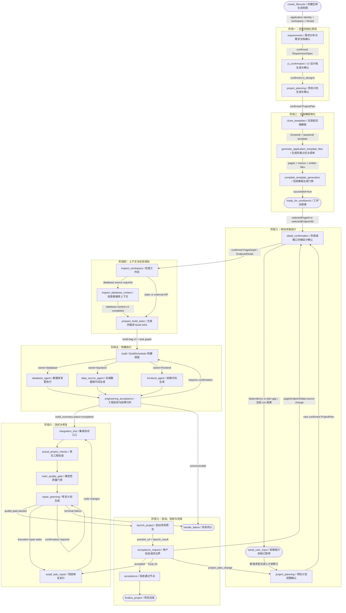

### 2.1 当前前端用户旅程

1. 欢迎页最多同时保留 3 个独立的新应用规划。每个应用拥有自己的 application、thread、lifecycle、Workflow 快照、停止处理器和模板任务；切换可见规划或返回首页只是隐藏界面，不会卸载仍在运行的规划或工作台。重启后可从应用索引和 lifecycle 恢复未完成初始化。
2. 初始化依次经过 RequirementSpec、逐页 UI 设计和 ProjectPlan 三个确认门。RequirementSpec 支持结构化编辑和“保存草稿”，但保存不等于确认；ProjectPlan 当前通过反馈重新生成或显式确认，没有同等的前端结构化直改入口。
3. ProjectPlan 确认后，前端拉取前后端模板、写页面占位和 `BIZ_MENUS`，再提交模板生成 lifecycle。当前可见规划完成后自动打开工作台；后台规划完成只提示用户从最近项目进入，并写入 `planningConfirmedAt` 作为永久工作台准入标记。
4. 工作台进入时会先通过 `/api/projects/launch` 异步尝试启动“当前模板工程预览”。这是工作台预览初始化，不是主 Workflow 测试通过后的 `launch_project`，两次启动的时机和失败语义不同。
5. 正式开发前先从 ProjectPlan 选择页面或具体 endpoint。页面设计可选 `commonTable`、`multiForm`、`tabsTable` 三种参考模板并预览，选择结果以 `pageTemplate={id,name,sourcePath}` 送入 `/workflow/run`；endpoint 使用 `detailTargetType=endpoint + selectedApiContractId + selectedEndpointId`。
6. 页面和 endpoint 各自拥有会话、thread 和历史。目标输入默认走“设计修改”模式的 `/workflow/run`；已设计目标可切到“自由协作”模式的 `/conversation/run`。每条消息可选择当前启用的用户 Skill，选中列表随消息和会话快照传递。
7. 正式运行期间只用 `PlanExecutionDock` 替换底部输入区，消息、流程步骤、侧栏和预览仍保留。Build Run 卡嵌在对应 Build 步骤内，展示 scope、任务状态、依赖、文件范围、验收项和失败证据；运行中任务可展示非持久化工具活动。
8. Workflow `launch_project` 返回正式 `preview_url` 后打开右侧预览。用户可以验收通过，或提交 `local_fix/page_design_change/endpoint_change/data_source_change/project_plan_change`；调整请求在协议边界直接选择恢复节点，通常不先执行 `acceptance` 节点。

### 2.2 业务入口与 AG-UI 边界

| 入口                                    | 当前职责                                                                                              | 是否进入主开发 Graph                           |
| --------------------------------------- | ----------------------------------------------------------------------------------------------------- | ---------------------------------------------- |
| `/application-page-planning/run`        | RequirementSpec、UI 设计、ProjectPlan 三阶段初始化规划；也承载只读恢复和 RequirementSpec 草稿保存动作 | 否，使用独立 application-planning Graph/thread |
| `/application-lifecycle/run`            | 创建、读取 lifecycle，完成模板生成门禁                                                                | 否，独立确定性 AG-UI action                    |
| `/application-development-planning/run` | 为 `selectedPageKey` 生成并确认编号任务清单                                                           | 否；当前前端未挂载，见第 5 节                  |
| `/workflow/run`                         | 页面/endpoint 详细设计、Build、Testing、修复、正式预览和验收                                          | 是                                             |
| `/conversation/run`                     | 无目标对话、工作区问答、自由协作和局部修改                                                            | 否，使用独立 conversation Graph/thread         |

业务动作和正常 Workflow 轮次都投影完整 AG-UI run 生命周期。等待确认采用“当前 Graph 运行到 `END`，以 `requires_user_input` 完成本轮”，不是 LangGraph interrupt；用户提交新 HTTP run 后，服务端再合并同 thread checkpoint、磁盘 artifacts、受校验的客户端恢复值和显式恢复节点。未捕获的 Graph/模型异常发送 `RunErrorEvent`，不能与业务失败的 `RUN_FINISHED(status=failed)` 混为一谈。

## 3. 阶段一：新建应用规划 Graph

真实 Graph 定义：`Backend/app/graph/application_planning_workflow.py`。

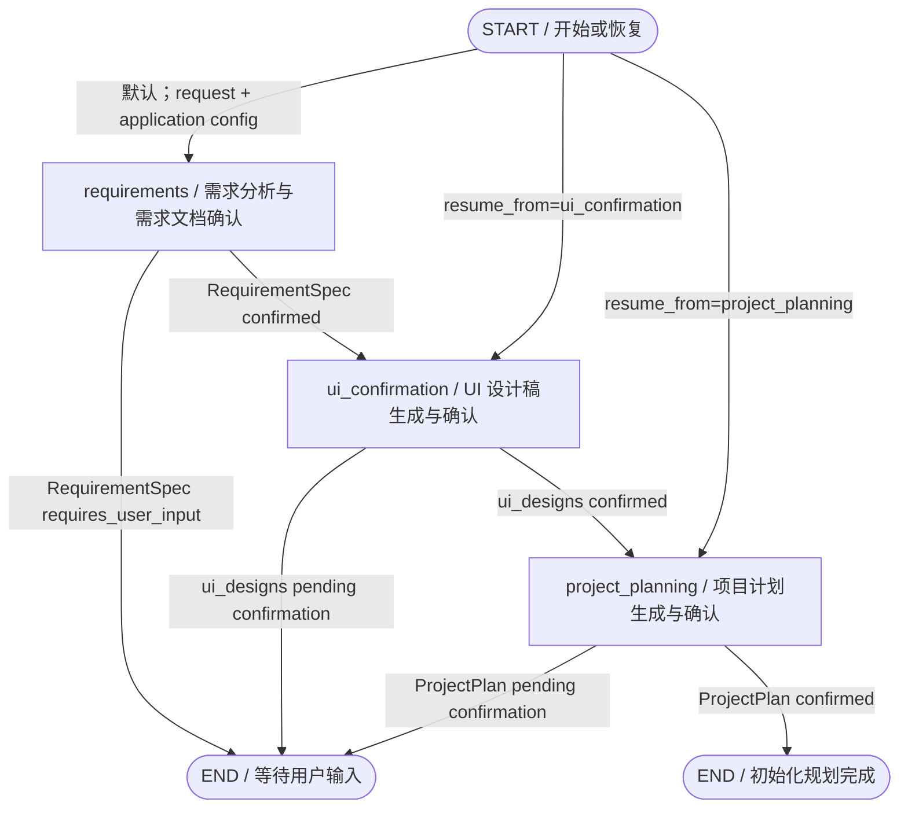

### 3.0 `create_lifecycle / 创建应用生命周期`

- **类型**：初始化 Graph 之前的确定性生命周期创建动作；无 LLM 提示词。
- **输入**：`workspaceRoot`、`application.id`、`application.appName`、初始化 `threadId/runId`。
- **输出**：`.xcodeagent/application-lifecycle.json`，初始状态为 `collecting_requirement/pending`，并保存应用身份与初始化线程引用。
- **校验规则**：Pydantic 拒绝额外字段和空应用身份；已有同一工作区状态时幂等读取/补齐；文件使用锁、临时文件、fsync 和原子替换；未知或损坏 schema 显式失败。
- **依赖文件**：`protocols/application_lifecycle.py`、`services/application_lifecycle.py`、`domain/application_lifecycle.py`、`.xcodeagent/application-lifecycle.json`。
- **依赖节点**：无业务上游；下游 `requirements`。

### 3.1 `requirements / 需求分析与需求文档确认`

- **类型**：直接 ChatModel + 确定性文档同步/确认门禁。
- **当前提示词**：`Backend/app/agents/main/requirements_analyzer.py::_requirements_prompt`。核心要求是只做需求分析；仅允许 `ask_user`；一次集中询问 1–4 个会实质改变设计的问题；覆盖应用信息、角色、模块、页面、数据源、业务流程和验收标准；所有对象使用稳定 ID；只允许一个 `/` 首页；数据源类型必须服从 `.xcodeagent/application.json` 的权威类型；返回完整 JSON 而不是 patch。
- **输入**：`request`、已有 `requirement_spec`、`.xcodeagent/application.json` 中的数据源类型、菜单 `rootPath`/`enable`、本轮澄清答案或文档修改意见。
- **输出**：`requirement_spec`、`requirement_spec_path`、`requirement_spec_json_path`、`clarification`、`status`、`timeline`。
- **校验规则**：需求缺口进入 `pending_user_input`；澄清答案不能视作需求文档确认；确认必须是本轮显式交互；Markdown 编辑需同步回 JSON；页面路由去重并应用菜单根路径；数据源类型强制覆盖为权威类型。
- **依赖文件**：`graph/nodes/requirements.py`、`agents/main/requirements_analyzer.py`、`services/requirement_spec.py`、`services/data_source_policy.py`、`workspace/spec_documents.py`、`.xcodeagent/application.json`、`.xcodeagent/specs/requirement-spec.md|json`。
- **依赖节点**：上游 `create_lifecycle`；下游 `ui_confirmation`；未确认时本轮结束。

### 3.2 `ui_confirmation / UI 设计稿生成与确认`

- **类型**：每页直接 ChatModel 生成 TSX + 确定性代码校验 + 用户确认门禁。
- **当前提示词**：`Backend/app/services/ui_design_generator.py::_build_ui_design_prompt`；失败时使用 `_build_repair_prompt`。提示词要求生成纯视觉 React + antd5 + `@ant-design/pro-components` 页面，使用静态 Mock 数据，不调用 API，不改变需求；输出单个完整 TSX 文件；组件名必须与 `page_key` 一致。
- **输入**：已确认 `requirement_spec.pages`、页面 `pageId/name/path/description`、内置 `antd-ui-design` 技能全文、工作区 `.xcodeagent/ui-design` 落盘目录、可复用的已有页面设计代码。
- **输出**：`.xcodeagent/ui-design/pages/<PageKey>/index.tsx`、内联源码 `ui_designs.pages[].code`、`code_path/page_key/menu_path/route_path/status`、`.xcodeagent/specs/ui-designs.json` 和确认状态；当前不生成独立设计稿菜单，也不再提供 `preview_origin`。
- **生成预算**：每次单页生成或修复调用先执行 `ChatOpenAI.bind(max_tokens=settings.ui_design_max_tokens)`；`UI_DESIGN_MAX_TOKENS` 默认 `8192`。校验失败最多执行 `UI_DESIGN_MAX_RETRIES` 次定向修复，默认 `2`，即“首次生成 + 最多 2 次修复”共 3 次模型调用。它与底层请求重试 `MODEL_MAX_RETRIES` 是两个不同预算。
- **校验规则**：代码必须非空、包含默认导出、没有未定义 JSX 组件、import 只能来自白名单，并通过从主 `Frontend/node_modules/.pnpm` 定位的 esbuild 做 TSX 语法校验；esbuild 缺失时仅跳过语法校验；其他校验失败按上述独立预算自动修复，耗尽后该页记录 `generation_failed`，不会把未通过校验的代码落成可用设计稿。页面最多 3 个并发生成，每页完成即经 `ui_confirmation.progress` 推送含内联代码的快照；所有页面必须显式确认后才能继续。
- **渲染事实**：不再 clone UI 模板、执行 `pnpm install`、启动独立 Vite server 或注册 `BIZ_MENUS`。前端 `DesignRenderer` 用 Sucrase 把内联 TSX 转为 CJS，重写白名单模块引用，再把产物通过 `postMessage` 交给同源 `design-frame.html` iframe；iframe 使用随应用发布的 antd5/React/Pro Components IIFE runtime 挂载组件。生成中页面和最终确认页面复用同一渲染器，并支持全屏预览。
- **依赖文件**：`Backend/app/config.py`、`Backend/.env.example`、`graph/nodes/ui_confirmation.py`、`services/ui_design_generator.py`、`services/ui_design_project_setup.py`、`Frontend/src/renderer/src/components/DesignRenderer/*`、`Frontend/src/renderer/src/components/Welcome/UiDesignStreamingPreview.tsx`、`UiDesignConfirmationPanel.tsx`、`Frontend/src/renderer/public/design-runtime/*`、`Frontend/scripts/build-design-runtime.mjs`、`.xcodeagent/specs/ui-designs.json`。
- **依赖节点**：上游 `requirements`；下游 `project_planning`；生成或确认失败时停在本节点。

### 3.3 `project_planning / 项目计划生成与确认`

- **类型**：直接 ChatModel + 确定性策略修复/契约校验 + 用户确认门禁。
- **当前提示词**：`Backend/app/agents/main/planner.py::_planning_prompt`。核心要求是只规划不改代码；输出完整 ProjectPlan JSON；数据库应用固定 Java 8 + Spring Boot + MySQL 8 + Redis，Static 应用固定前端内存数据层；严格生成绝对页面/菜单路由；`api_contracts` 是字段和接口契约事实源；schema 引用必须位于同一 contract；输出页面树、数据源、权限、流程、架构和项目验收标准。
- **输入**：已确认 `RequirementSpec`、已有 ProjectPlan（修订时）、权威数据源类型、用户计划反馈、菜单路由策略。
- **输出**：`project_plan`、`frontend_pages`、`project_plan_path`、`project_plan_json_path`、`clarification`、`application_planning_confirmation`。
- **校验规则**：应用数据源策略、页面依赖、API contract、schema 引用、页面和菜单路径、确认状态；用户修改 Markdown 时同步回 JSON；未确认不得进入模板生成或 Build。
- **依赖文件**：`graph/nodes/planning.py`、`agents/main/planner.py`、`agents/main/document_sync.py`、`services/project_plan.py`、`services/api_contract_validation.py`、`services/page_dependencies.py`、`workspace/plan_documents.py`、`.xcodeagent/plans/project-plan.md|json`。
- **依赖节点**：初始化 Graph 中依赖 `ui_confirmation`；主 Graph 中作为验收调整或 SmallTask 升级后的计划修订入口，并回到 `detail_confirmation`。

## 4. 阶段二：模板物化与工作台门禁

这些动作不是 LangGraph `add_node` 节点，但属于初始化主链路。

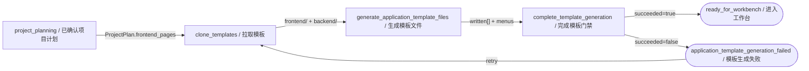

### 4.1 `clone_templates / 拉取前后端模板`

- **类型**：前端确定性动作，通过 Electron 主进程执行 Git clone；无 LLM 提示词。
- **输入**：`workspaceRoot`、`appName`、前端模板仓库、后端模板仓库。
- **输出**：目标工作区下 `frontend/`、`backend/`；前端函数返回模板版本和时间。
- **校验规则**：只校验应用名和项目路径非空；Electron 主进程会对前端、后端各自最多尝试 3 次 shallow clone，并在成功后删除模板仓库的 `.git`。但 renderer 的 `fetchTemplateCode` 仍会吞掉最终 clone 异常并返回成功，因此重试并没有消除模板门禁假成功风险。
- **依赖文件**：`Frontend/src/renderer/src/service/templateApi.ts`、Electron `workspace.cloneTemplate` 实现、两个模板 Git 仓库。
- **依赖节点**：上游 `project_planning`；下游 `generate_application_template_files`。

### 4.2 `generate_application_template_files / 生成页面占位与菜单`

- **类型**：前端确定性动作；无 LLM 提示词。
- **输入**：确认后的 `ProjectPlan.frontend_pages` 菜单树、`route_root_path`、页面 `pageId/path/name`、模板工作区。
- **输出**：`frontend/src/pages/<PageKey>/index.tsx` 占位页、`frontend/src/constants/menus.ts` 中被整体替换的 `BIZ_MENUS` 菜单树、`written[]`。
- **校验规则**：PageKey 唯一；保留 ProjectPlan 菜单层级并把子路径相对化；动态路由设置 `hideInMenu`；叶子路径若因菜单/页面路由重合变为空，则回退 root-relative path。`menu_enabled=true` 时 ProjectPlan 生成/修复还会阻止首页型业务页占用裸 `/` 或裸 `route_root_path`。当前在缺少页面、IPC 或写入结果为空时返回 `written: []` 而不是失败。
- **依赖文件**：`Frontend/src/renderer/src/service/templateApi.ts`、Electron `workspace.writeTemplatePages`、ProjectPlan JSON、前端模板目录。
- **依赖节点**：上游 `clone_templates`；下游 `complete_template_generation`。

### 4.3 `complete_template_generation / 完成模板生成门禁`

- **类型**：后端确定性生命周期动作；无 LLM 提示词。
- **输入**：`workspaceRoot`、`succeeded`、可选 `errorMessage`、当前 lifecycle。
- **输出**：`.xcodeagent/application-lifecycle.json` 的 `ready_for_workbench/completed` 或 `application_template_generation_failed/failed`。
- **校验规则**：要求当前阶段允许完成模板；成功时复核 RequirementSpec 和 ProjectPlan JSON 的 `confirmation_status=confirmed`；当前不复核模板目录和实际写入文件。
- **依赖文件**：`services/application_lifecycle.py`、`domain/application_lifecycle.py`、`.xcodeagent/application-lifecycle.json`、RequirementSpec JSON、ProjectPlan JSON。
- **依赖节点**：上游 `generate_application_template_files`；成功进入工作台，失败回到模板重试。

## 5. 已实现但当前前端未挂载的应用开发任务规划动作

该流程通过 `/application-development-planning/run` 使用独立 AG-UI 业务动作，不进入主 LangGraph，也不是 BuildScheduler 实际执行的 Build DAG。当前 `ApplicationDevelopmentPlanningGate` 组件没有被 `Frontend/src` 的任何页面导入或挂载，因此它不是现行用户主链：工作台详情确认会直接续入 `inspect_workspace → prepare_build_tasks → build`。本节记录已经存在但暂不可达的实现契约，避免把它误画成正式 Workflow 的必经门禁。

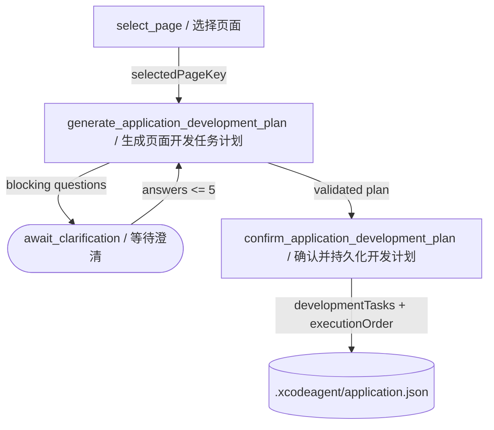

### 5.1 `generate_application_development_plan / 生成页面开发任务计划`

- **类型**：一次直接 ChatModel；必要时第二次携带澄清答案。
- **当前提示词**：`services/application_development_planning.py::_SYSTEM_PROMPT` 与 `generate_application_development_plan` 内动态 Human Prompt。要求只生成所选页面业务任务；不重建路由、请求层、导航和布局；`sharedModules=[]`；每个任务有 2–6 条可观察验收标准；输出唯一 JSON。
- **输入**：`.xcodeagent/application.json` 的应用、菜单、API、数据源和认证摘要；`selectedPageKey`；最多 5 个回答。
- **输出**：`questions` 或 `ApplicationDevelopmentPlan`，包括 `menuPlans/tasks/dependsOn/executionOrder`。
- **校验规则**：Pydantic 字段限制；只能返回问题或计划之一；页面必须存在；每个菜单最多 20 个任务；任务 ID 唯一；依赖必须存在且无环；`blocks` 由后端根据 `dependsOn` 反向推导；执行顺序必须覆盖全部任务并满足拓扑；功能必须被任务覆盖；每项含 2–6 条可观察验收标准；任务初始状态为 `todo`，持久化 schema 后续允许 `in_progress/completed`；禁止 shared task/module。
- **依赖文件**：`services/application_development_planning.py`、`protocols/application_development_planning.py`、`.xcodeagent/application.json`、ProjectPlan 投影。
- **依赖节点**：当前无可达前端上游；若未来挂载，则从独立 `selectedPageKey` 页面选择进入，下游为 `confirm_application_development_plan`。不要与主 Workflow 的 `selectedPageId` 混用。

### 5.2 `confirm_application_development_plan / 确认并持久化开发计划`

- **类型**：确定性确认动作；无 LLM 提示词。
- **输入**：用户确认的 `ApplicationDevelopmentPlan`、`selectedPageKey`、当前 `application.json`。
- **输出**：菜单项 `developmentTasks`、`menus.developmentPlan.executionOrder`、SHA-256、确认时间。
- **校验规则**：重新读取当前文件；重新执行任务覆盖、唯一性、依赖和拓扑校验；保留其他页面计划；临时文件替换实现原子写入。
- **依赖文件**：`services/application_development_planning.py`、`.xcodeagent/application.json`。
- **依赖节点**：上游 `generate_application_development_plan`；当前没有被 `prepare_build_tasks` 直接消费。

## 6. 阶段三至七：主开发 Graph

真实 Graph 定义：`Backend/app/graph/workflow.py`。

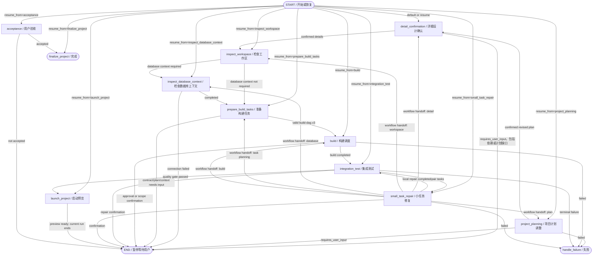

### 6.1 `detail_confirmation / 页面或接口详细设计确认`

- **类型**：页面/接口直接 ChatModel + 确定性详情组装、外置文档持久化和用户审核门禁。
- **当前提示词**：页面使用 `agents/main/page_designer.py::_page_design_prompt`，要求只设计当前页面，不改 ProjectPlan 依赖和 API contract，输出布局、状态反馈、交互、导航、API 依赖和 response binding；接口使用 `_endpoint_decision_prompt`，要求只为一个 endpoint 决定 `data_origin`、字段映射、结构差异、数据库操作和操作语义，并严格匹配正式 schema。
- **输入**：已确认 ProjectPlan、`selectedPageId` 或 `selectedApiContractId + selectedEndpointId`、已有 PageDetail/EndpointDetail、详情审核提交、用户反馈、数据库摘要（接口设计时可选）、验收调整。
- **输出**：`pending_project_plan`、外置 PageDetail/EndpointDetail Markdown + JSON、`detail_plans`、`detail_selection`、确认后更新的 `project_plan`；ProjectPlan JSON 只保留详情引用与 hash，不内联完整可编辑详情正文。
- **校验规则**：必须指定页面或 endpoint；页面/endpoint 必须存在且唯一；详情中的依赖只能来自 ProjectPlan；response binding 必须指向契约响应字段；数据库差异必须结构化；每次新生成或修订详情都重新进入确认门禁；确认提交按目标应用。依赖或计划缺口只返回 `requires_user_input/project_plan_revision_required` 并结束当前 run，`route_detail_confirmation` 不会自动跳到 `project_planning`；需要由下一次请求显式选择计划修订入口。
- **依赖文件**：`graph/nodes/planning.py`、`agents/main/page_designer.py`、`services/page_detail_plan.py`、`services/detail_review.py`、`workspace/detail_design_documents.py`、`.xcodeagent/plans/pages/page--<pageId>.md|json`、`.xcodeagent/plans/endpoints/endpoint--<contractId>--<endpointId>.md|json`。
- **依赖节点**：上游工作台选择、显式 `project_planning` 恢复、验收调整或 `small_task_repair`；只有确认成功才进入 `inspect_workspace`。

### 6.2 `inspect_workspace / 检查工作区`

- **类型**：确定性扫描和代码图索引；无 LLM 提示词。
- **输入**：`workspace`、ProjectPlan、工作区文件树和缓存 revision。
- **输出**：`workspace_snapshot_summary`、`workspace_snapshot_path`、`workspace_snapshot_hash`、`workspace_revision`、代码图摘要。
- **校验规则**：工作区路径限制；按 workspace revision 使用缓存；代码图失败可降级；主流程首次进入还会尝试执行前端 scaffold，异常只记录日志。
- **依赖文件**：`graph/nodes/workspace_inspection.py`、`services/workspace_inspector.py`、`services/code_graph/*`、`services/frontend_scaffold.py`、`.xcodeagent/cache/`、真实工作区源码。
- **依赖节点**：上游 `detail_confirmation`；下游由数据来源决定 `inspect_database_context` 或 `prepare_build_tasks`。

### 6.3 `inspect_database_context / 检查数据库上下文`

- **类型**：确定性数据库连接、schema 摘要和 schema diff；无 LLM 提示词。
- **输入**：已确认 ProjectPlan、Build target、EndpointDetail 的 `data_origin`、WorkspaceSnapshot、MySQL 配置和真实 schema。
- **输出**：`database_planning_context`（`database-context.v1`）、`actual_schema`、`required_schema`、`gaps`、`task_intents`、更新后的 `build_context`。
- **校验规则**：只有 database 来源才要求检查；连接失败必须阻断；上下文必须是 v1 且 `status=completed` 才允许数据库来源任务规划；结构差异本身不阻断，而是编译成任务意图。
- **依赖文件**：`graph/nodes/database_context.py`、`services/database_planning_context.py`、`services/database_schema_summary.py`、`services/database_schema_diff.py`、数据库连接配置。
- **依赖节点**：上游 `inspect_workspace`；下游 `prepare_build_tasks`。

### 6.4 `prepare_build_tasks / 生成并编译 Build DAG`

- **类型**：直接 ChatModel 生成候选任务 + 多阶段确定性编译器。
- **当前提示词**：`agents/main/task_preparer.py::_task_preparation_prompt` 或 `_static_task_preparation_prompt`。数据库应用 Prompt 内联 Spring Boot/MyBatis 技能并严格限制目录、Unit、change scope、API 字段、数据库 gap 和模板修改边界；任务生成顺序固定为数据库 → 后端 → 前端。每个后端 endpoint/table 模块必须拆成对象类、Repository、ApplicationService、Controller 四个串行 stage task，各 stage 只拥有自己的文件，并把上一阶段的预期文件、职责和契约写入下一阶段描述。带 `api_dependencies` 的页面必须规划或复用 `src/apis/<biz>Api.ts`，页面只能通过该服务访问共享 axios 实例。Static 应用只允许前端内存数据模块和页面任务；模型不得生成验证任务，`acceptance_criteria=[]` 且 `acceptance_checks=[]`，工程验收由后端编译。
- **输入**：确认后的 ProjectPlan、当前目标范围、PageDetail/EndpointDetail、WorkspaceSnapshot、DatabasePlanningContext、已有 Build DAG、可复用 Unit。
- **输出**：`build-dag.v3`、`build_units`、`unit_graph`、`task_registry`、`task_graph`、`tasks`、`build_context`、`.xcodeagent/plans/build-task-plan.json`、`BUILD_TASK_DAG.md`。
- **校验规则**：ProjectPlan 必须 confirmed；Unit skeleton 合法；目标详情必须存在；数据库来源必须已有 completed v1 context；页面/API 契约按范围校验；模型任务不能越过 required Unit；任务 ID、依赖、DAG、路径和 owner 必须合法；工程 acceptance checks 确定性编译；无效计划阻断 Build。页面任务声明的 PageKey 若与实时唯一同义目录不同，会先纠正为真实目录；模型漏报页面入口时，编译器优先复用唯一实时入口，否则把 `target.page_key` 推导的标准入口补进已有前端页面任务，再确定性补齐或规范化顶层 `BIZ_MENUS` 登记。
- **依赖文件**：`graph/nodes/tasks.py`、`agents/main/task_preparer.py`、`services/build_unit_skeleton.py`、`services/build_context_resolver.py`、`services/build_task_planner.py`、`services/engineering_acceptance.py`、`services/build_task_menu.py`、`workspace/task_documents.py`。
- **依赖节点**：上游 `inspect_workspace`/`inspect_database_context`；下游 `build`。

## 7. Build 节点内部流程

外层主 Graph 只注册一个 `build` 节点；其实现位于 `graph/subgraphs/build.py`，内部由确定性 BuildScheduler 驱动循环调度，并没有再次编译一个独立 StateGraph。

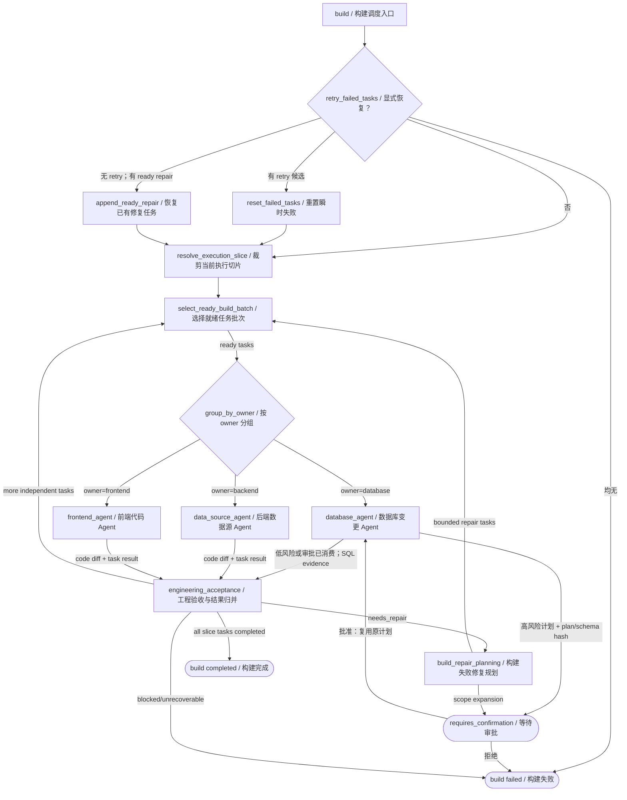

### 7.1 `build / BuildScheduler 构建调度`

- **类型**：确定性循环调度器；自身无 LLM 提示词。
- **输入**：`build_task_plan`、`tasks`、`build_execution_scope`、已有结果、`retry_failed_tasks`、repair 状态、用户数据库或修复范围审批。
- **输出**：更新后的 task 状态、`build_results`、带失败分类和恢复元数据的 `build_summary`、`build_execution_slice`、`code_changes`、repair plan、ProjectPlan/Build DAG 持久化路径。
- **校验规则**：切片 DAG 必须合法；只调度依赖满足且文件范围不冲突的任务；最大循环 `len(tasks)*2`；结果必须与任务数量和 ID 对齐；真实文件 diff 必须落在授权路径并满足 acceptance checks。runner/tool/network 等瞬时失败只在显式 `retry_failed_tasks` 时恢复为 `pending` 并增加审计计数；若没有瞬时候选但已有无需确认的 RepairPlanner 任务，则重置并执行该修复集合；二者都没有时返回明确的无候选提示。旧 checkpoint 缺失失败 result 时先从 task 失败字段补齐，不把旧结果误判为当前失败。
- **数据库审批恢复**：Database Agent 返回高危计划时，调度器把当前批次恢复为 `pending`，将同一份计划写入任务的 `approved_database_change_plan` 并返回 `agent_approval`；批准后重入 `build` 时复用该计划，避免重新生成导致 plan hash 改变。用户明确拒绝时，相应数据库任务以 `database_approval_rejected` 失败并结束本轮构建。
- **依赖文件**：`graph/subgraphs/build.py`、`services/build_scheduler.py`、`services/build_result_coordinator.py`、`services/engineering_acceptance_verifier.py`、`workspace/code_changes.py`。
- **依赖节点**：上游 `prepare_build_tasks`；内部派发三个 owner Agent；成功进入 `integration_test`。

### 7.2 `database_agent / 数据库变更 Agent`

- **类型**：只读 Deep Agent 生成 SQL 计划 + 确定性风险审批、SQL 执行和执行后复查。
- **当前提示词**：System Prompt 位于 `agents/database/agent.py`，执行 Prompt 位于 `agents/database/generator.py::_database_generation_prompt`。要求以真实数据库为准、不编辑文件、不切换数据库、不直接执行 SQL，只返回 `database_change_plan`。
- **输入**：database owner tasks、真实 database summary、required schema/gaps、ProjectPlan API contracts、BuildTaskPlan 摘要。
- **输出**：SQL statements、risk、绑定 plan/schema hash 的 approval、execution evidence、post verification、逐任务结果。
- **校验规则**：先扫描真实数据库；无 gap 直接 `already_satisfied`；低风险计划直接执行，高危计划先审批；审批恢复必须复用原 `database_change_plan`；SQL 由确定性 harness 在应用配置指定的数据库上执行，配置数据库与扫描上下文不一致时拒绝执行；执行后再次 diff；禁止跨数据库和未授权 DDL。
- **依赖文件**：`agents/database/agent.py`、`agents/database/generator.py`、`services/database_execution.py`、`services/database_schema_diff.py`、MySQL 工具。
- **依赖节点**：上游 `build` 的 owner 分组；下游 `engineering_acceptance`。

### 7.3 `data_source_agent / 后端数据源代码生成 Agent`

- **类型**：Agent registry 中的 Data Source Deep Agent；Build task owner 仍使用 `backend`，该 Agent 拥有后端文件和受限命令工具。
- **当前提示词**：System Prompt 位于 `agents/data_source/agent.py`；执行 Prompt 位于 `agents/data_source/generator.py::_data_source_generation_prompt`。要求只执行批准任务和 allowed paths，严格服从 API contract，Spring Boot/MyBatis 模块必须使用内置技能，代码兼容 Java 8，不在本阶段运行项目级构建/测试。
- **输入**：backend owner tasks、BuildTaskPlan 摘要、ProjectPlan API/data context、工作区和选定技能。
- **输出**：每个 task 的结构化状态、摘要、changed files、failure/change request、真实 diff。
- **校验规则**：结构化 JSON 结果必须覆盖全部任务；文件变更按 task scope 过滤；禁止静默改 contract；独立 acceptance verifier 检查文件、范围和契约绑定。
- **依赖文件**：`agents/data_source/agent.py`、`agents/data_source/generator.py`、`middleware/direct_modification.py`、`agents/workspace_scope.py`、内置 Spring Boot/MyBatis skill。
- **依赖节点**：上游 `build`；下游 `engineering_acceptance`。

### 7.4 `frontend_agent / 前端代码生成 Agent`

- **类型**：Frontend Deep Agent，拥有前端文件和受限命令工具。
- **当前提示词**：System Prompt 位于 `agents/frontend/agent.py`；执行 Prompt 位于 `agents/frontend/generator.py::_frontend_generation_prompt`。要求只执行批准任务；API 字段只能来自 contract；先读取模板修改边界和 code-block-template 技能；页面通过 `ui_designs.pages[].page_key` 读取用户确认的 `/.xcodeagent/ui-design/pages/<PageKey>/index.tsx` 作为视觉结构参考，再把静态 Mock/空交互替换为正式 API 或数据层；Static 数据源使用前端内存 API 模块；禁止在本阶段运行项目级构建/测试。
- **输入**：frontend owner tasks、BuildTaskPlan、ProjectPlan、PageTemplate、`ui_designs` 映射、工作区和选定技能。
- **输出**：结构化任务结果、页面/API 代码、菜单变更、真实 diff。
- **校验规则**：结果必须覆盖全部任务；只允许 authorized paths；模板骨架大部分只读；菜单修改受限；独立 acceptance verifier 检查 diff、页面文件、菜单注册和契约绑定。
- **依赖文件**：`agents/frontend/agent.py`、`agents/frontend/generator.py`、内置 `frontend-template-modification-boundary`、`code-block-template`、UI 设计稿文件。
- **依赖节点**：上游 `build`；下游 `engineering_acceptance`。

### 7.5 `engineering_acceptance / 工程验收与结果归并`

- **类型**：确定性 verifier；无 LLM 提示词。
- **输入**：批准任务、Agent 结果、任务前后 WorkspaceSnapshot/diff、acceptance checks、API contract。
- **输出**：规范化 task results、任务 completed/failed 状态、failure category/reason、Build summary、更新后的 DAG 和 ProjectPlan 实施状态。
- **校验规则**：实际变更类型必须匹配 add/modify/delete；不得越界；endpoint 任务检查 contract binding；菜单任务检查指定 path/name/key；数据库任务必须有执行证据；Agent 自然语言不能作为验收依据。
- **依赖文件**：`services/engineering_acceptance.py`、`services/engineering_acceptance_verifier.py`、`services/build_result_coordinator.py`、`workspace/code_changes.py`。
- **依赖节点**：依赖三个 owner Agent；结果回到 `build` 调度循环。

### 7.6 `build_repair_planning / 构建失败修复规划`

- **类型**：只读 RepairPlanner Deep Agent + 确定性修复任务编译。
- **当前提示词**：`agents/repair_planner/planner.py::_build_failure_repair_prompt`。要求只分析失败，不改文件、不运行命令、不改 DAG；修复必须留在父任务授权范围；扩大文件或业务资源范围、改变确认产物时返回 `requires_user_confirmation`；证据不足返回 terminal failure。
- **输入**：失败 task/result、change scope、allowed paths、WorkspaceSnapshot、acceptance checks、修复预算。
- **输出**：`repair_task_plan`、repair tasks、requested paths/resources、decision。
- **校验规则**：修复任务不得越过父任务授权；修复 acceptance 重新编译并继承父任务结果检查；范围扩大必须用户批准；无证据或预算耗尽终止。
- **依赖文件**：`agents/repair_planner/*`、`services/build_repair_planner.py`、`services/engineering_acceptance.py`、`workspace/task_documents.py`。
- **依赖节点**：上游 `engineering_acceptance` 失败；批准后回到 `build` 调度。

## 8. Testing Subgraph 与修复闭环

真实子图定义：`Backend/app/graph/subgraphs/testing.py`。

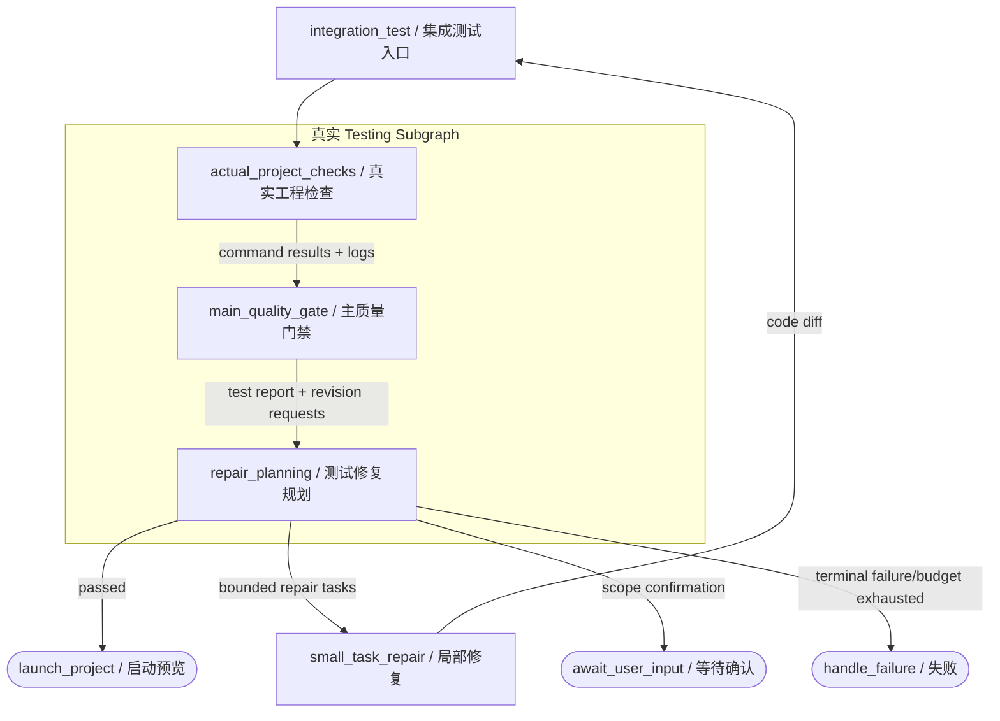

`small_task_repair` 是主 Graph 节点，不属于 Testing Subgraph。子图只产生 `integration_next_action` 和 repair tasks；外层路由进入 SmallTask，修复成功后再重新调用整个 Testing Subgraph。正式测试失败没有 `integration_test → build` 直连边。

### 8.1 `integration_test / 集成测试入口`

- **类型**：Testing Subgraph 包装节点；自身无 LLM 提示词。
- **输入**：工作区、修复迭代和 repair 开关。
- **输出**：`test_results`、`test_report`、`quality_gate_passed`、`revision_requests`、repair plan/tasks、`integration_next_action`。
- **校验规则**：每次进入清空本轮 test results；保留此前 SmallTask diff；Testing Subgraph 的结果决定主图路由。
- **依赖文件**：`graph/subgraphs/testing.py`、`workspace/test_documents.py`、`workspace/task_documents.py`。
- **依赖节点**：上游 `build` 或 `small_task_repair`；内部依次执行以下三个子图节点。

### 8.2 `actual_project_checks / 真实工程检查`

- **类型**：确定性命令执行；无 LLM 提示词。
- **输入**：工作区、`.xcodeagent/application.json` 数据源类型、前端 package 和后端 Maven 项目结构。
- **输出**：逐项 `test_results`、stdout/stderr 日志和 command evidence。
- **校验规则**：前端执行包管理器 `install`、可选 `tsc` script、必需 `build`；非 Static 应用执行后端检查；Maven 当前运行 `clean install`；每个命令 180 秒超时；required 缺失视为失败。
- **依赖文件**：`services/integration_test_runner.py`、项目 `package.json`/lockfile、`pom.xml`/Maven wrapper、`.xcodeagent/runtime/tests/`。
- **依赖节点**：上游 `integration_test`；下游 `main_quality_gate`。

### 8.3 `main_quality_gate / 主质量门禁`

- **类型**：确定性 gate；无 LLM 提示词。
- **输入**：全部确定性 test results。
- **输出**：`.xcodeagent/reports/test-report.json`、`quality_gate_passed`、`needs_revision`、`revision_requests`。
- **校验规则**：当前实现使用 `all(result["passed"] for result in test_results)`；所有失败 check 编译为 revision request；required check ID 仅记录在报告中，没有反向校验是否完整出现。
- **依赖文件**：`services/test_validation.py`、`workspace/test_documents.py`。
- **依赖节点**：上游 `actual_project_checks`；下游 `repair_planning`。

### 8.4 `repair_planning / 测试修复规划`

- **类型**：只读 RepairPlanner Deep Agent + 确定性 repair task 编译。
- **当前提示词**：`agents/repair_planner/planner.py::_test_repair_planning_prompt`。要求基于真实命令证据选择 `repair`、`requires_user_confirmation` 或 `terminal_failure`；不得改变已确认需求、详情和 API contract。
- **输入**：TestReport、revision requests、当前 BuildTaskPlan、执行切片、修复轮次。
- **输出**：`repair_task_plan`、`repair_tasks`、requested paths/resources、`integration_next_action`。
- **校验规则**：最多默认 3 轮；候选路径从当前执行切片继承；范围扩大需要确认；证据不足、拒绝或预算耗尽终止。
- **依赖文件**：`agents/repair_planner/*`、`services/test_validation.py`、`workspace/task_documents.py`。
- **依赖节点**：上游 `main_quality_gate`；通过进入 `launch_project`，可修复进入 `small_task_repair`。

### 8.5 `small_task_repair / SmallTask 局部修复`

- **类型**：SmallTask Deep Agent 批量执行器 + 确定性 scope/handoff 路由。
- **当前提示词**：System Prompt 位于 `agents/small_task/agent.py`；任务 Prompt 位于 `agents/small_task/runner.py::build_small_task_prompt`。要求一次只执行一个 bounded packet；按 `candidateFiles -> 最窄源码根 -> 必要配置元数据` 顺序读取；禁止读取安装依赖、缓存和构建产物；只修改 `allowedPaths`；禁止正式工作流产物、数据库 DDL 和新产品范围；返回固定 JSON；超出范围返回 confirmation 或 workflow handoff。
- **输入**：repair tasks、allowed paths、acceptance criteria、failure evidence、确认的扩大范围、最大并发（默认 2，硬边界由服务限制）。
- **输出**：`small_task_results`、code change sets、更新后的 repair tasks、handoff 或回测路由。
- **校验规则**：preflight 禁止正式产物和复杂范围；精确路径授权；实际 diff 归属；依赖和并发边界；最多 20 个批次；完成后必须回到 Integration Test；需要新页面/接口/数据源/计划时必须确认后升级正式节点。
- **依赖文件**：`graph/nodes/small_task.py`、`agents/small_task/*`、`services/small_task.py`、`services/small_task_scope.py`、`workspace/code_changes.py`。
- **依赖节点**：上游 `repair_planning` 或验收 local fix；下游通常 `integration_test`，也可经确认跳到 `detail_confirmation/project_planning/inspect_workspace/inspect_database_context/prepare_build_tasks/build`。

## 9. 启动、验收、调整和终态

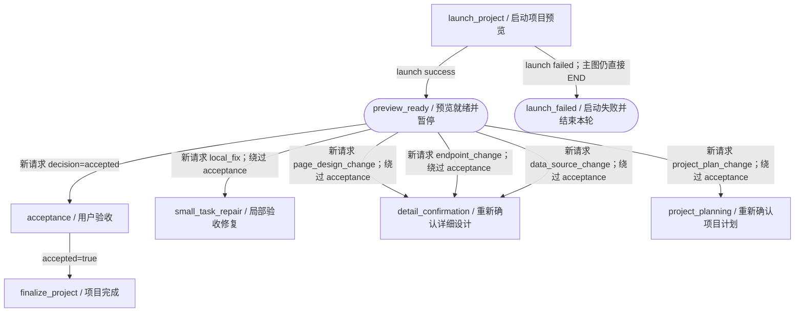

### 9.1 `launch_project / 启动项目预览`

- **类型**：确定性进程启动；无 LLM 提示词。
- **输入**：工作区、数据源类型、前后端项目结构和启动配置。
- **输出**：`launch_result`、`preview_url`、`acceptance_request`。
- **校验规则**：后端应用先启动并等待就绪，再启动前端；Static 可跳过后端；任一阶段失败返回 failed；成功后状态是 `requires_user_input`，不是项目完成。主 Graph 对 `launch_project` 使用无条件 `add_edge("launch_project", END)`，所以启动成功与失败都结束本轮，失败不会进入 `handle_failure`。
- **依赖文件**：`graph/nodes/lifecycle.py`、`services/project_launcher.py`、`services/backend_project_launcher.py`、`services/frontend_project_launcher.py`、进程 registry。
- **依赖节点**：上游质量门禁通过；下游在新一轮从 `acceptance` 或调整目标恢复。

### 9.2 `acceptance / 用户验收`

- **类型**：确定性结构化决策节点；无 LLM 提示词。
- **输入**：`acceptance_decision`；验收调整由请求边界规范化为 `acceptance_adjustment`。
- **输出**：当前节点的主要有效输出是 `accepted=true`。
- **校验规则**：只有结构化 `decision=accepted` 放行；普通文本不能冒充验收。`changes_requested` 在 `protocols/workflow/request.py` 先被规范化为 `acceptance_adjustment`，并直接恢复到 SmallTask、详情设计或项目规划，通常不会执行 `acceptance` 节点；调整类型只允许 `local_fix/page_design_change/endpoint_change/data_source_change/project_plan_change`，feedback 1–4000 字符。
- **依赖文件**：`graph/nodes/lifecycle.py`、`domain/acceptance_adjustment.py`、`protocols/workflow/request.py`。
- **依赖节点**：上游是预览后的新验收请求；accepted 进入 `finalize_project`。调整请求由协议适配器直接路由到 SmallTask、详细设计或项目规划。

### 9.3 `finalize_project / 项目完成`

- **类型**：确定性终态节点；无 LLM 提示词。
- **输入**：`accepted=true` 和当前 execution/lifecycle。
- **输出**：`phase=completed`、`status=completed`；外围生命周期清理 execution/resource metadata。
- **校验规则**：主 Graph 只从 `acceptance` 的 accepted 分支进入。
- **依赖文件**：`graph/nodes/lifecycle.py`、`services/application_lifecycle.py`。
- **依赖节点**：上游 `acceptance`；下游 END。

### 9.4 `handle_failure / 失败终止`

- **类型**：确定性失败终态；无 LLM 提示词。
- **输入**：被主 Graph 显式路由到本节点的 Build、Testing、SmallTask 或计划调整业务失败及其已保存 evidence。
- **输出**：`phase=failed`、`status=failed`。
- **校验规则**：不执行补偿或回滚；调用方依赖此前节点保存的失败原因、日志、DAG 和 diff。
- **依赖文件**：`graph/nodes/lifecycle.py`、各阶段产物。
- **依赖节点**：Build、Testing、SmallTask 或计划调整的显式失败边；下游 END。未捕获异常由 Workflow runtime 发出 `RunErrorEvent` 并更新 lifecycle，`launch_project` 失败直接 END，二者都绕过本节点。

## 10. 自由对话与快速修改 Graph

真实 Graph 定义：`Backend/app/graph/direct_modification_workflow.py`。

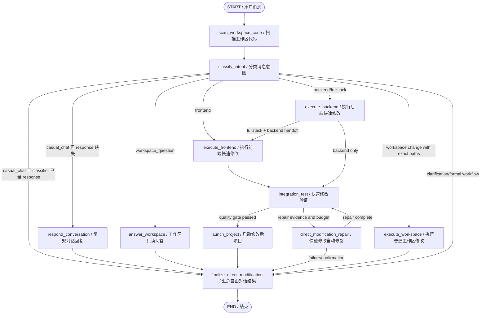

### 10.1 `classify_intent / 分类消息意图`

- **类型**：直接 ChatModel 路由器。
- **当前提示词**：System Prompt 和 `agents/direct_modification.py::_direct_modification_classifier_prompt`。要求基于前置扫描事实按结果分类 `casual_chat/workspace_question/workspace_change/formal_workflow/needs_clarification`，识别 owner，输出唯一 JSON；已存在页面/组件且结果明确的局部修改必须直接分类为 workspace change。局部修改需要默认源码根之外的任意现有文件时仍保留对应 owner，并输出精确文件路径作为本次授权候选，不受配置文件类型白名单限制，置信度不足时才保守澄清。
- **输入**：当前消息、最多 4000 字符会话摘要、最多 16000 字符的页面/组件/入口/高价值配置/API 路由/共享契约/代码图扫描上下文、已有 handoff 决策。
- **输出**：intent、owner、scope、confidence、reason、target paths、可选 casual response 或 clarification。
- **校验规则**：confidence 必须不低于 0.65；workspace owner 必须有窄且可验证的相对路径范围；前后端额外文件候选不检查文件类型，只在当前请求是修改意图、路径属于 owner、位于 workspace 内且文件真实存在时动态并入本次 `approvedPaths`；拒绝宽目录范围、lockfile、`.env`/凭据文件、依赖/生成目录、schema/migration、`.xcodeagent` 和 `..`；正式 Workflow 需要用户确认后 handoff。classifier 若已为 `casual_chat` 返回自然语言 `response`，分类节点会直接完成并进入 finalize；只有缺少 response 时才调用 `respond_conversation` 兜底。
- **依赖文件**：`agents/direct_modification.py`、`graph/nodes/direct_modification.py`、`services/direct_modification.py`。
- **依赖节点**：上游 `scan_workspace_code`；下游对话、问答、frontend/backend/workspace 修改或 finalize。

### 10.2 `respond_conversation / 常规对话回复`

- **类型**：无工具直接 ChatModel。
- **当前提示词**：`answer_casual_conversation` 内 System/Human messages。要求以 XCodeAgent 身份自然回复，不声称读取或修改工作区。
- **输入**：用户消息和有界摘要。
- **输出**：`conversation_response`。
- **校验规则**：非空回复为 completed，否则 failed。
- **依赖文件**：`agents/direct_modification.py`、`graph/nodes/direct_modification.py`。
- **依赖节点**：上游 `classify_intent`；下游 `finalize_direct_modification`。

### 10.3 `answer_workspace / 工作区只读问答`

- **类型**：只读 Workspace Assistant Deep Agent。
- **当前提示词**：System Prompt 位于 `agents/workspace_assistant/agent.py`，Human Prompt 为 `workspace_assistant_prompt`。要求渐进读取必要文件，禁止写入、删除、执行命令和 subagent，区分事实与推断。
- **输入**：问题、摘要、workspace、选定技能。
- **输出**：基于工程证据的自然语言回答。
- **校验规则**：只读权限；空结果失败。
- **依赖文件**：`agents/workspace_assistant/agent.py`、`agents/workspace_scope.py`。
- **依赖节点**：上游 `classify_intent`；下游 `finalize_direct_modification`。

### 10.4 `scan_workspace_code / 扫描工作区代码`

- **类型**：与主流程共享的确定性 WorkspaceSnapshot/代码图扫描。
- **输入**：workspace 和代码文件。
- **输出**：snapshot summary/path/hash/revision。
- **校验规则**：与 `inspect_workspace` 相同，但不执行前端 scaffold。
- **依赖文件**：`graph/nodes/workspace_inspection.py`、`services/workspace_inspector.py`、代码图服务。
- **依赖节点**：上游 START；下游固定进入 `classify_intent`，扫描失败才 finalize。

### 10.5 `execute_backend / 执行后端快速修改`

- **类型**：共享 SmallTask Agent，后端限定 packet。
- **当前提示词**：SmallTask System/packet Prompt，packet 内附 `_data_source_direct_modification_prompt` legacy instructions。要求不依赖正式计划，只做最小局部修改，默认限定前后端的 `app/src/tests` 源码根，执行聚焦检查，并为 fullstack 生成 backend handoff。
- **输入**：用户请求、摘要、已批准路径、workspace、选定技能。
- **输出**：backend stage result、真实 code diff、backend handoff。
- **校验规则**：路径 owner 校验；扫描得到的后端路由/模型源码优先；配置文件只有通过本轮确定性动态授权才能写入；安装依赖和生成目录不可读写；真实 diff 与结果交叉验证；局部失败但已有真实 diff 可继续独立测试。
- **依赖文件**：`agents/direct_modification.py`、`agents/small_task/*`、`graph/nodes/direct_modification.py`、`services/direct_modification.py`。
- **依赖节点**：上游 `classify_intent`；backend-only 进入 test，fullstack 进入 frontend。

### 10.6 `execute_frontend / 执行前端快速修改`

- **类型**：共享 SmallTask Agent，前端限定 packet。
- **当前提示词**：SmallTask Prompt + `_frontend_direct_modification_prompt` legacy instructions。要求读取前端必选技能、限定 `Frontend/**|frontend/**`、使用 backend handoff、最小修改并执行聚焦检查。
- **输入**：请求、摘要、backend handoff、扫描得到的页面/组件/API client 源码候选、本轮确定性校验通过的动态文件路径、技能。
- **输出**：frontend stage result 和真实 diff。
- **校验规则**：默认写入范围仅为 `Frontend/src/**|frontend/src/**`；源码根之外的任意文件类型均可在通过精确路径、存在性、owner 和安全目录校验后临时追加，并排在读取候选最前；随后读取扫描命中的源码候选；`node_modules/dist/build/target/.next/.turbo` 等目录不可读写；路径 owner、技能边界、diff 和结果一致性；超范围走 handoff。
- **依赖文件**：`agents/direct_modification.py`、`agents/small_task/*`、内置前端技能。
- **依赖节点**：上游 `classify_intent` 或 backend；下游 `integration_test`。

### 10.7 `execute_workspace / 执行普通工作区修改`

- **类型**：共享 SmallTask Agent，精确路径限定。
- **当前提示词**：SmallTask Prompt + `_workspace_direct_modification_prompt`。只允许普通文档、测试、脚本和配置；禁止产品代码、`.env`、迁移和正式 `.xcodeagent` 工件。
- **输入**：分类器给出的精确 target paths、用户请求、摘要。
- **输出**：workspace stage result 和 diff。
- **校验规则**：无精确路径不执行；path guard；结果和 diff 校验。
- **依赖文件**：`agents/direct_modification.py`、`agents/small_task/*`。
- **依赖节点**：上游 `classify_intent`；下游直接 finalize，目前不进入 Integration Test。

### 10.8 `integration_test / 快速修改验证`

- **类型**：复用 Testing Subgraph，关闭正式 API contract check 和 Testing RepairPlanner 自动路由。
- **输入**：快速修改 diff、Build-like results、repair iteration。
- **输出**：TestReport、quality gate、revision requests、下一步 launch/repair/finalize。
- **校验规则**：当前 contract check 标记 skipped；失败且有 evidence 且未超 3 轮才进入 direct repair。
- **依赖文件**：`graph/nodes/direct_modification.py`、`graph/subgraphs/testing.py`。
- **依赖节点**：上游 frontend/backend；下游 launch 或 direct repair。

### 10.9 `direct_modification_repair / 快速修改自动修复`

- **类型**：RepairPlanner + SmallTask 批量修复。
- **当前提示词**：复用 Testing RepairPlanner Prompt 与 SmallTask Prompt。
- **输入**：revision requests、原快速修改产生的授权路径、TestReport、repair iteration。
- **输出**：repair plan/tasks、SmallTask results、追加 diff、回测或确认状态。
- **校验规则**：最多 3 轮；只允许原修改真实 diff 路径；RepairPlanner 必须只读；无证据/路径终止；超范围必须确认；每轮最多 20 个批次。
- **依赖文件**：`graph/nodes/direct_repair.py`、`services/direct_repair.py`、RepairPlanner/SmallTask 实现。
- **依赖节点**：上游快速修改 Integration Test；成功回到 Integration Test。

### 10.10 `launch_project / 启动修改后项目`

- **类型**：复用主流程确定性启动节点。
- **输入/输出/校验**：与主流程 `launch_project` 相同。
- **依赖节点**：上游快速修改质量门禁；下游 finalize，不进入主流程用户验收节点。

### 10.11 `finalize_direct_modification / 汇总自由对话结果`

- **类型**：确定性汇总节点；无 LLM 提示词。
- **输入**：intent、owner、各 stage result、test/launch/repair 结果、所有 code change sets、会话摘要。
- **输出**：`direct_modification_result`、公开 status/message、合并 diff、最多 4000 字符的新会话摘要。
- **校验规则**：对话/问答直接完成；启动成功视为修改完成；partial change 只有通过最终验证后才公开为 completed；确认/失败状态保留对应 clarification/evidence。
- **依赖文件**：`graph/nodes/direct_modification.py`、`services/direct_modification.py`、`workspace/code_changes.py`。
- **依赖节点**：所有自由对话分支的统一终点；下游 END。

## 11. 核心数据与持久化流

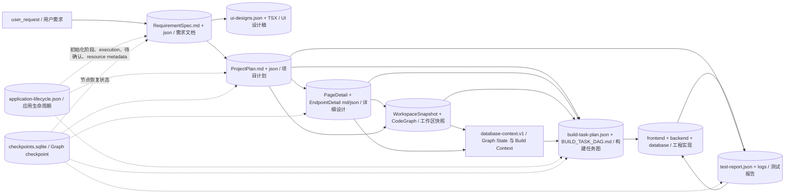

### 当前事实源边界

| 数据                              | 当前权威来源                                                                                                                             | 主要消费者                             |
| --------------------------------- | ---------------------------------------------------------------------------------------------------------------------------------------- | -------------------------------------- | ---------------------- |
| 初始化和工作台 execution 生命周期 | `.xcodeagent/application-lifecycle.json`                                                                                                 | 首页、工作台运行状态、恢复校验         |
| 需求正文                          | `.xcodeagent/specs/requirement-spec.md`；JSON 为内部结构状态                                                                             | ProjectPlan 生成、创建规划恢复         |
| UI 视觉参考                       | `.xcodeagent/specs/ui-designs.json` + `.xcodeagent/ui-design/pages/<PageKey>/index.tsx`；确认/生成 UI 直接消费 `ui_designs.pages[].code` | `DesignRenderer`、Frontend Agent       |
| 项目语义和 API contract           | `.xcodeagent/plans/project-plan.md                                                                                                       | json`                                  | Detail、Build、Testing |
| 页面/接口可执行设计               | `.xcodeagent/plans/pages/*.md` + `*.json`、`plans/endpoints/*.md` + `*.json`；ProjectPlan JSON 只保留引用和 hash                         | 用户确认、Build Context、Task Preparer |
| 工作区事实                        | `.xcodeagent/cache/` 下 WorkspaceSnapshot/代码图缓存 + 真实源码                                                                          | Task Preparer、Agent 导航              |
| 数据库事实                        | Graph/checkpoint 中的 `database-context.v1`、嵌入 Build Context 的摘要 + 实时 MySQL 复查；当前没有独立 database-context artifact 文件    | Task Preparer、Database Agent          |
| 构建 DAG                          | `.xcodeagent/plans/build-task-plan.json`、`BUILD_TASK_DAG.md`                                                                            | BuildScheduler、RepairPlanner          |
| 构建和测试结果                    | Build results、`.xcodeagent/reports/test-report.json`、runtime logs                                                                      | Quality Gate、RepairPlanner、UI        |
| 技术恢复状态                      | `.xcodeagent/checkpoints/checkpoints.sqlite`                                                                                             | LangGraph resume                       |

### 11.1 生命周期、确认与恢复边界

- `.xcodeagent/application-lifecycle.json` 当前 `schemaVersion=1.2.0`，每次写入单调增加 `revision`。`initialization` 与 `activeExecutions` 是两套并列状态：前者描述新建应用，后者按 runId 描述工作台执行，不能互相覆盖。
- `initialization.threadId` 只用于定位初始化 checkpoint；应用进入 `ready_for_workbench` 后清空。前端应用索引中的 `planningConfirmedAt` 一旦写入，就永久允许该应用进入工作台，后续页面设计状态不会撤销它。
- 需要用户处理的工作台交互写入 `pendingInteraction={id,type,basedOnRevision,...}`。提交时协议层校验 interaction id 和 lifecycle revision，避免旧确认覆盖新状态。
- `resourceLocks` 与 execution `resourceKeys` 当前只是可观测的资源声明，不执行跨 run 互斥；重叠资源允许并发，最新 writer 成为界面显示的 owner。单次 Build 内部的文件调度约束不能替代跨 run 隔离。
- 对存在 lifecycle 的正式应用，主 Workflow 会校验 `ready_for_workbench` 并登记 execution；但为兼容旧工作区，生命周期文件完全缺失时 `begin_workflow_lifecycle()` 返回 `None`，Graph 仍可继续。因此 `ready_for_workbench` 是新应用前端主链门禁，不是当前后端的绝对拒绝条件。
- `resumeExecutionRunId`/旧 runId 只作为同 thread、scope、target 的恢复令牌；真实 Graph State 仍来自当前 thread checkpoint。`stop/end` 可在不执行 Graph 的情况下停止或结束 execution，`cancelRunId` 用于取消当前运行任务；finalize 或显式 end 才清理该 run 拥有的资源登记。

## 12. 当前不合理之处与改进建议

### P0：模板生成门禁可能假成功

`fetchTemplateCode` 吞掉 clone 异常，`generateApplicationTemplateFiles` 在无页面、无 IPC 或未写文件时返回空数组，前端仍可能用 `succeeded=true` 完成生命周期；后端只复核两个规划文档，没有复核 `frontend/`、`backend/` 和页面文件。

**建议**：把模板完整性验证放到后端：模板目录、package/pom、入口文件、菜单和全部页面占位文件必须存在且数量匹配，才允许 `ready_for_workbench`。前端只提交实际写入 manifest，不直接决定成功。

### P0：资源锁是展示元数据，不是真正互斥

同一 workspace 的多个 Run 可以同时修改同一页面、API、数据源、菜单和报告，最新 Run 仅覆盖显示 owner，不能阻止竞态。BuildScheduler 的 task file lock 只解决单 Run 内部并发，不能隔离跨 Run 写入。

**建议**：先实现“一工作区一个写执行”的简单门禁；只读对话并行。需要真正并行时再引入 Git worktree/事务隔离，而不是只扩展 `resourceLocks` 展示字段。

### P0：UI 设计在 ProjectPlan 之前确认，依赖顺序倒置

UI 设计依赖页面树、API contract、权限和数据来源，但当前初始化 Graph 是 `RequirementSpec → UI → ProjectPlan`。之后 Workbench 又生成 PageDetail，形成两套设计事实源，ProjectPlan 修订也不会自动使旧 UI 失效。

**建议**：调整为 `RequirementSpec → ProjectPlan → UI Design → Template`。UI Design 保存 `basedOnProjectPlanRevision/hash`；ProjectPlan 变化时显式失效并重新确认。

### P1：设计稿运行时产物没有接入标准构建脚本

`build-design-runtime.mjs` 能生成 `public/design-runtime/antd5-runtime.js`，但当前 `package.json` 的 `build:*` 和 `postinstall` 都不会调用它；应用构建直接依赖仓库中已提交的 bundle。依赖、alias 或 runtime 入口变化后，如果维护者忘记手工重建，源码编译器与已发布 runtime 可能漂移。

**建议**：为 runtime bundle 增加独立校验 hash，并在依赖或入口变更时由标准构建前置步骤确定性重建；普通无关前端构建不重复生成大文件。

### P1：存在两套“开发计划”

独立组件一旦挂载，用户确认的 `application.json.menus.developmentTasks` 仍不会被主流程 `prepare_build_tasks` 消费；真正执行的是 Main Task Preparer 重新生成的 Build DAG。当前组件尚未挂载，所以现状是“一套不可达 checklist 实现 + 一套真实 Build DAG”，挂载后则会变成“用户确认 A、系统执行 B”。

**建议**：把用户确认计划定义为高层 Unit Plan，并确定性编译为 Build DAG；或把现有开发计划降级为非权威 checklist，取消“确认后执行”的语义。

### P1：数据库路由 fail-open

`route_workspace_inspection` 在解析 ProjectPlan、详情或数据库需求时捕获所有异常并直接进入 `prepare_build_tasks`。这会把“判断失败”误当成“不需要数据库”。

**建议**：改为 fail-closed：异常进入明确的 context error/用户处理状态。`prepare_build_tasks` 的后置保护继续保留，形成双重门禁。

### P1：前端 scaffold 有两个 owner，并会重复重写菜单

初始化模板动作已经写页面和菜单，主流程 `inspect_workspace` 又调用 `frontend_scaffold`；后者拍平菜单树并重写整个 `menus.ts`，可能覆盖模板阶段生成的层级或后续人工修改；异常仅日志记录。

**建议**：初始化模板动作成为唯一 owner。后续只做带版本/hash 的 reconcile：补缺不覆盖，任何重写都产生显式 diff 和失败状态。

### P1：当前 Integration Test 名称强于真实能力

当前主要执行依赖安装、typecheck、build、Maven install 和静态 contract check，没有启动前后端、HTTP smoke、浏览器页面访问、登录/关键业务路径 E2E。系统在启动前就宣称“集成测试通过”。

**建议**：把当前阶段重命名为 `build_verification`，然后在 launch 后增加 `runtime_smoke_test`：后端 health、一个契约样例请求、前端页面加载和关键交互 smoke；通过后再进入用户验收。

### P1：质量门禁没有验证“必需检查是否齐全”

`evaluate_quality_gate` 对现有结果做 `all(...)`，但不验证 stack 对应的 required check manifest 是否全部出现；空列表理论上会通过。当前测试定义和 runner 也已漂移：测试期待 lint/unit check，但实现不再产生它们。

**建议**：先根据数据源类型和项目结构编译 expected checks，要求每个 required ID 都存在、执行且通过；区分 passed、skipped_optional、missing_required。

### P1：验证阶段会修改工作区并重复做高成本安装

每次 Integration Test 都执行 `pnpm install`，Maven 每次执行 `clean install`；修复循环每轮重复。测试可能修改 lockfile/node_modules、依赖网络，且 180 秒统一超时容易产生假失败。

**建议**：安装属于 setup/build 阶段并按 lock hash 缓存。验证使用 frozen lockfile/offline 选项；Maven 拆分 compile/test，按改动范围选择；不同命令使用不同超时。

### P1：恢复状态存在多个可写事实源

正常恢复同时接受 checkpoint、客户端 `resumeState`、磁盘 artifacts 和显式内部节点跳转。旧客户端快照可能覆盖服务端 checkpoint，直接跳到 Build/Test/Finalize 依赖每个节点自行补齐前置校验。

**建议**：客户端只提交 `threadId/executionId/interactionId/basedOnRevision/decision`；服务端从 checkpoint 和磁盘读取状态。任意节点跳转仅保留开发模式并由服务器配置开启。

### P1：详情依赖缺口不会自动进入计划修订

`detail_confirmation` 会把依赖或计划缺口投影为 `project_plan_revision_required`，但真实路由只有 `requires_user_input → END`，没有到 `project_planning` 的边。如果前端没有把后续交互明确转换成计划修订请求，用户可能在原详情节点反复重试。

**建议**：把该确认载荷改为结构化 action，用户批准后由协议适配器确定性设置 `resume_from=project_planning`，并记录来源详情目标与 based-on revision。

### P1：启动失败绕过统一失败节点

主 Graph 对 `launch_project` 无条件连到 `END`；启动失败不会进入 `handle_failure`。未捕获异常也由 runtime 直接发 `RunErrorEvent`。这使业务失败、启动失败和异常失败分别由不同边界收尾。

**建议**：保留 `RunErrorEvent` 作为协议异常语义，但为 launch 结果增加显式 `launch_failed` 路由或统一失败投影，确保 lifecycle、恢复按钮和失败证据一致。

### P2：SmallTask 成为通用阶段路由器

`small_task_repair` 可以跳到 detail、project planning、workspace、database、task planning 和 build。节点同时承担局部修复、范围审批、正式流程升级和验收调整，容易形成不可预测的状态组合。

**建议**：SmallTask 只返回 typed outcome：`retest / scope_confirmation / workflow_handoff / failed`。中央 deterministic router 根据 `workflowIntent` 和前置条件决定实际节点，SmallTask 不直接写内部节点名。

### P2：`ProjectState` 过大且跨 Graph 复用

同一个 TypedDict 同时承载初始化规划、主开发、Build、Testing、验收、自由对话和修复状态，导致 checkpoint 体积、字段泄漏和恢复组合复杂度不断增长。

**建议**：拆成共享 `WorkflowEnvelope`，以及 `ApplicationPlanningState`、`DevelopmentState`、`DirectModificationState`、`TestingState`；跨图只传稳定 artifact refs 和小型 typed handoff。

### P2：文档、生命周期和前端阶段显示存在漂移

当前代码已有 UI 确认阶段，但部分文档仍称“两阶段/两节点”；生命周期文档状态图遗漏 UI 阶段；部分前端状态仍使用“阶段 1/2、2/2”。这会误导恢复 UI 和维护者。

**建议**：从 Graph definition 和 lifecycle enum 生成单一节点/阶段 manifest，文档 Mermaid、后端 capabilities 和前端阶段标签都从 manifest 投影，减少手工同步。

### P2：UI 确认恢复入口的事件投影仍有遗漏

application-planning Graph 已支持 `resume_from=ui_confirmation`，请求校验也接受该值，但 `protocols/workflow/projection.py` 与兼容 `workflow_visualization.py` 的 `_workflow_start_node()` 只把 `requirements/project_planning` 识别为初始化展示入口。UI 确认恢复 run 的首个展示节点可能被错误投影成 requirements。

**建议**：让 Graph definition、请求校验和两套可视化投影共用同一组 application-planning 节点常量，并为 UI resume 添加投影测试。

## 13. 节点优化设计建议

后续优化围绕权威产物、人工确认、确定性路由、有界并行、资源隔离和可恢复执行展开。节点是否拆分或并行，不按角色数量决定，而由输入依赖、写入范围、副作用和汇合条件决定。

| 主题 | 推荐设计 | 设计约束 |
| --- | --- | --- |
| 正式产物确认 | RequirementSpec、UI Design、ProjectPlan、PageDetail/EndpointDetail 生成或修订后均进入显式确认门禁 | 保存草稿、回答澄清均不等于确认；下游只消费已确认 revision/hash。模板完成是确定性完整性门禁，不冒充用户确认。 |
| 人工暂停与验收请求 | `await_user_input`、`acceptance_request` 保持为控制边界，不注册为普通 Agent 节点 | `await_user_input` 结束当前 Graph run；`acceptance_request` 是 `launch_project` 的结构化输出。两者不需要 Prompt，也不拥有独立业务产物。 |
| UI 与详细设计 | 先确认 ProjectPlan，再按 artifact 依赖调度 UI、页面详情和接口详情 | 接口详情可按 endpoint 并行；页面详情若消费已确认 UI 结构则排在 UI 后。独立任务只能写各自 artifact，最终通过确定性 join/reconcile 汇合。 |
| 工作区与数据库上下文 | `inspect_workspace` 先生成稳定 WorkspaceSnapshot，再推导是否需要 `inspect_database_context` | 只有不依赖工作区的纯数据库 schema scan 可以提前并行；DatabasePlanningContext 和 WorkspaceSnapshot 必须在 `prepare_build_tasks` 前汇合并校验版本。 |
| Build DAG 并行 | BuildScheduler 只并行调度依赖满足、授权路径不冲突的 ready tasks | 不同 owner 可以并发；同一 owner 可批量处理。并发结果必须经过真实 diff 归属、工程验收和确定性合并。 |
| 跨 Run 资源隔离 | 默认实行“一 workspace 一个写 execution”，只读会话保持并行 | 数据库 schema 变更和共享预览环境使用独占锁；代码任务需要跨 Run 并行时使用独立 Git worktree/分支，合并阶段串行。 |
| Testing 拓扑 | 工程检查完成后直接执行确定性质量门禁，失败时才进入 RepairPlanner | API 契约在任务准备前校验；Testing 不重复校验，也不引入模型审阅硬依赖。 |
| 局部修复回测 | 根据 changed files、owner、contract 和失败 check ID 编译 affected-check manifest，只重跑受影响检查 | 局部检查通过后，进入 launch 前仍执行一次完整 required-check 门禁，避免增量回测漏掉跨模块回归。 |
| 失败分类与终态 | 在上游节点或统一 deterministic failure classifier 中完成错误分类与恢复路由，`handle_failure` 只负责失败终态 | 分类至少覆盖缺少输入、可重试基础设施错误、代码/契约错误、正式流程升级、用户拒绝和不可恢复错误；路由结果只能是暂停、重试、修复、typed handoff 或终止。 |
| 多角色协同 | 产品提出业务目标并确认业务产物，Orchestrator 根据已确认 artifact 调度 UI、技术、构建和测试角色 | 设计负责人确认视觉产物，技术负责人确认 ProjectPlan/API/高风险数据库变更，测试负责人维护质量门禁；产品不手工选择内部 Graph 节点。 |
| 节点责任 | 每个节点设置一名直接负责人（DRI）、一名审核人和必要的业务/技术批准人 | 阶段可以多人协作，但节点不能用多个并列负责人替代最终责任。 |

### 13.1 推荐的并行与资源隔离规则

| 资源或任务                                              | 默认策略         | 放行条件                                                             |
| ------------------------------------------------------- | ---------------- | -------------------------------------------------------------------- |
| WorkspaceSnapshot、代码图、ProjectPlan/API 契约只读校验 | 可并行           | 固定读取同一 revision/hash，不写工作区。                             |
| 同一 Build ready batch 的不同 owner                     | 可并行           | DAG 依赖满足，授权路径不冲突；沿用当前 scheduler 校验。              |
| 同一 workspace 的多个正式写 Run                         | 串行             | 在引入独立 worktree/分支和确定性合并门禁前，只允许一个写 execution。 |
| 数据库 schema 变更                                      | 独占             | 绑定 database、schema hash、plan hash 和审批；执行后复查并释放锁。   |
| 项目依赖安装、构建缓存、预览端口和运行进程              | 串行或按环境隔离 | 使用明确的 environment key、端口分配和清理/超时策略。                |
| 用户确认                                                | 乐观并发控制     | 提交 `interactionId + basedOnRevision`；旧版本确认必须拒绝。         |

### 13.2 推荐的角色协同主链

```text
产品提出业务目标
→ requirements 生成并确认 RequirementSpec
→ project_planning 生成并由技术负责人/产品确认 ProjectPlan
→ Orchestrator 按 artifact 依赖调度 UI 与页面/接口详细设计
→ 设计或技术负责人确认相应正式产物
→ 确定性编译 Build DAG
→ 专业 Agent 在授权范围内执行
→ 确定性检查汇合后由 TestAgent 审阅
→ 质量门禁、预览和产品验收
```

Product、UI、Frontend、Backend、Database、Test 等角色是专业能力与审批责任，不应各自拥有一套可互相覆盖的 Graph State。跨角色只传 versioned artifact refs、结构化结果、失败证据和 typed handoff；实际节点选择由中央确定性路由完成。

### 13.3 后续节点审计统一模板

本文现有节点卡片已经覆盖类型、提示词、输入、输出、校验和依赖。后续逐节点优化时，统一补齐以下字段，避免只审 Prompt 而漏掉恢复、并发和副作用：

```text
节点名称 / node_id / 版本：
节点类型：LLM / Deep Agent / 确定性逻辑 / 工具动作 / 人工确认 / 终态
直接负责人（DRI）/ 审核人 / 批准人：

目标与非目标：
触发条件 / 前置条件：
当前提示词及源码位置：

输入：
- artifact 文件 + 字段/JSON Pointer + 来源节点 + revision/hash
- Graph State 字段 + schema 版本

输出：
- artifact 文件 + 字段 + schema 版本 + revision/hash
- Graph State delta
- AG-UI 自定义事件、状态快照和结构化 result/error

成功与校验规则：
硬依赖 / 可选依赖：
可并行条件 / 冲突资源 / join 条件：
副作用 / 授权范围 / 幂等键 / checkpoint：

错误分类：
- 缺少用户输入或正式产物
- 可重试模型、工具、网络或进程错误
- 代码、契约或质量错误
- 需要扩大范围或升级正式 Workflow
- 用户拒绝或不可恢复错误

最大重试次数 / 退避 / 超时：
成功路由 / 失败路由 / 修复后回测路由：
用户确认载荷 / basedOnRevision：
可观测 evidence / 日志和持久化路径：
```

## 14. 推荐的未实现目标流程

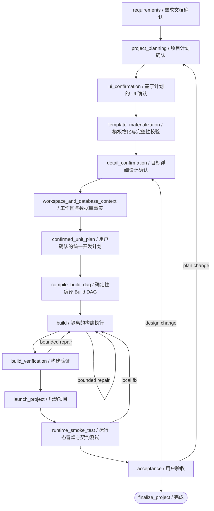

目标流程的核心约束：

1. 一个阶段只拥有一个权威产物。
2. 每个正式产物都携带 `revision/hash`，下游记录 `basedOnRevision`。
3. 一个 workspace 同时只有一个写 execution，除非使用隔离工作树。
4. 用户确认的计划就是 Build DAG 的输入，不再让第二个模型重新定义范围。
5. 构建成功、运行成功、业务验收是三个不同门禁。
6. 客户端不提交可覆盖服务端的完整恢复状态。
7. `inspect_workspace` 先产出稳定 WorkspaceSnapshot；数据库上下文仅在不依赖该快照的扫描部分允许并行，最终在任务规划前汇合。
8. Build 只并行调度依赖满足且写入范围不冲突的任务；跨 Run 写并行必须先具备 worktree/分支隔离和确定性合并门禁。
9. 工程检查与契约检查可在消除共享写副作用后并行；TestAgent 和质量门禁位于检查结果的 join 之后。
10. 局部修复优先执行 affected checks，但进入启动和验收前必须满足完整 required-check manifest。
11. 产品发起业务目标并确认业务产物，Orchestrator 负责内部角色调度；每个节点只设一名 DRI。

## 15. 主要代码索引

| 领域                                  | 入口文件                                                                                                                                                                                                                     |
| ------------------------------------- | ---------------------------------------------------------------------------------------------------------------------------------------------------------------------------------------------------------------------------- |
| 新建应用规划 Graph                    | `Backend/app/graph/application_planning_workflow.py`                                                                                                                                                                         |
| 主开发 Graph                          | `Backend/app/graph/workflow.py`                                                                                                                                                                                              |
| 自由对话 Graph                        | `Backend/app/graph/direct_modification_workflow.py`                                                                                                                                                                          |
| 主状态                                | `Backend/app/graph/state.py`                                                                                                                                                                                                 |
| RequirementSpec                       | `Backend/app/graph/nodes/requirements.py`、`Backend/app/agents/main/requirements_analyzer.py`                                                                                                                                |
| UI 设计确认与直出渲染                 | `Backend/app/config.py`、`Backend/app/graph/nodes/ui_confirmation.py`、`Backend/app/services/ui_design_generator.py`、`Frontend/src/renderer/src/components/DesignRenderer/`、`Frontend/src/renderer/public/design-runtime/` |
| ProjectPlan/PageDetail/EndpointDetail | `Backend/app/graph/nodes/planning.py`、`Backend/app/agents/main/planner.py`、`page_designer.py`                                                                                                                              |
| Workspace/Database Context            | `Backend/app/graph/nodes/workspace_inspection.py`、`database_context.py`                                                                                                                                                     |
| Build DAG                             | `Backend/app/graph/nodes/tasks.py`、`Backend/app/agents/main/task_preparer.py`                                                                                                                                               |
| BuildScheduler                        | `Backend/app/graph/subgraphs/build.py`、`Backend/app/services/build_scheduler.py`                                                                                                                                            |
| Testing Subgraph                      | `Backend/app/graph/subgraphs/testing.py`                                                                                                                                                                                     |
| Integration checks/quality gate       | `Backend/app/services/integration_test_runner.py`、`test_validation.py`                                                                                                                                                      |
| SmallTask/Repair                      | `Backend/app/graph/nodes/small_task.py`、`direct_repair.py`、`Backend/app/agents/small_task/`、`repair_planner/`                                                                                                             |
| Launch/Acceptance                     | `Backend/app/graph/nodes/lifecycle.py`、`Backend/app/domain/acceptance_adjustment.py`、`Backend/app/protocols/workflow/request.py`                                                                                           |
| Application lifecycle / recovery      | `Backend/app/services/application_lifecycle.py`、`Backend/app/domain/application_lifecycle.py`、`Backend/app/protocols/workflow/lifecycle.py`、`Backend/app/protocols/workflow/run_control.py`                               |
| 模板物化                              | `Frontend/src/renderer/src/hooks/useApplicationTemplateGeneration.ts`、`Frontend/src/renderer/src/service/templateApi.ts`                                                                                                    |
| 工作台目标选择与参考模板              | `Frontend/src/renderer/src/components/DetailConfirmationPageSelector/`、`Frontend/src/renderer/src/service/templateService.ts`、`Frontend/src/renderer/src/components/AiChatPanel/hooks/useWorkflowConversation.ts`          |
| 独立开发任务规划（当前未挂载）        | `Backend/app/services/application_development_planning.py`、`Frontend/src/renderer/src/components/ApplicationDevelopmentPlanningGate/`                                                                                       |

## 16. LLM Prompt 注册表

下表用于快速定位“当前真正执行的 Prompt”。一个节点同时存在 System Prompt 和运行时 Human/Task Prompt 时，两者都必须一起阅读；用户选择的技能说明只会在六个 Deep Agent（frontend、data_source、database、repair_planner、small_task、workspace_assistant）的 bundle 创建时额外注入，直接 ChatModel 节点不加载这套用户 Skill。

| 业务节点/执行阶段                           | System Prompt 来源                                                                              | Human/Task Prompt 来源                                                                        | 主要动态注入                                                                                                                                                                                   |
| ------------------------------------------- | ----------------------------------------------------------------------------------------------- | --------------------------------------------------------------------------------------------- | ---------------------------------------------------------------------------------------------------------------------------------------------------------------------------------------------- |
| `requirements`                              | 无独立 SystemMessage；直接使用单 Prompt                                                         | `agents/main/requirements_analyzer.py::_requirements_prompt`                                  | request、existing RequirementSpec、datasource type                                                                                                                                             |
| `ui_confirmation`                           | 无独立 SystemMessage                                                                            | `services/ui_design_generator.py::_build_ui_design_prompt`；失败用 `_build_repair_prompt`     | page brief、PageKey、UI skill、可复用旧代码、校验错误；`UI_DESIGN_MAX_TOKENS` 默认 8192，`UI_DESIGN_MAX_RETRIES` 默认 2；输出代码内联到 `ui_designs.pages[].code` 供 `DesignRenderer` 直出渲染 |
| `project_planning`                          | 无独立 SystemMessage                                                                            | `agents/main/planner.py::_planning_prompt`                                                    | RequirementSpec、existing plan、datasource type、route/menu policy                                                                                                                             |
| `detail_confirmation` 页面                  | 无独立 SystemMessage                                                                            | `agents/main/page_designer.py::_page_design_prompt`                                           | ProjectPlan page context、用户反馈                                                                                                                                                             |
| `detail_confirmation` endpoint              | 无独立 SystemMessage                                                                            | `agents/main/page_designer.py::_endpoint_decision_prompt`                                     | endpoint contract/context、database context、用户反馈、固定输出 schema                                                                                                                         |
| `prepare_build_tasks`                       | 无独立 SystemMessage                                                                            | `agents/main/task_preparer.py::_task_preparation_prompt` 或 `_static_task_preparation_prompt` | bounded WorkspaceSnapshot、TargetBuildContext、TaskPreparationContext、内联 backend skill                                                                                                      |
| `generate_application_development_plan`     | `services/application_development_planning.py::_SYSTEM_PROMPT`                                  | 同文件 `generate_application_development_plan` 内动态 `prompt`                                | application.json 摘要、selected page、澄清回答                                                                                                                                                 |
| `database_agent`                            | `agents/database/agent.py::create_database_agent` 内 `base_system_prompt`                       | `agents/database/generator.py::_database_generation_prompt`                                   | database tasks、真实 schema/gaps、ProjectPlan contracts                                                                                                                                        |
| `data_source_agent`（task owner=`backend`） | `agents/data_source/agent.py::create_data_source_agent` 内 `base_system_prompt`                 | `agents/data_source/generator.py::_data_source_generation_prompt`                             | approved tasks、BuildTaskPlan、ProjectPlan、skills                                                                                                                                             |
| `frontend_agent`                            | `agents/frontend/agent.py::create_frontend_agent` 内 `base_system_prompt`                       | `agents/frontend/generator.py::_frontend_generation_prompt`                                   | approved tasks、ProjectPlan、PageTemplate、UI designs、skills                                                                                                                                  |
| `build_repair_planning`                     | `agents/repair_planner/agent.py::create_repair_planner_agent` 内 `base_system_prompt`           | `agents/repair_planner/planner.py::_build_failure_repair_prompt`                              | failed task、scope、acceptance、evidence、budget                                                                                                                                               |
| `repair_planning`                           | 同上                                                                                            | `agents/repair_planner/planner.py::_test_repair_planning_prompt`                              | TestReport、revision requests、BuildTaskPlan                                                                                                                                                   |
| `small_task_repair`                         | `agents/small_task/agent.py::create_small_task_agent` 内 `base_system_prompt`                   | `agents/small_task/runner.py::build_small_task_prompt`                                        | bounded TaskPacket、allowedPaths、acceptance、failure evidence                                                                                                                                 |
| `classify_intent`                           | `agents/direct_modification.py::classify_direct_modification_intent` 内 SystemMessage           | 同文件 `_direct_modification_classifier_prompt`                                               | message、bounded conversation summary、bounded workspace scan context                                                                                                                          |
| `respond_conversation`                      | `agents/direct_modification.py::answer_casual_conversation` 内 SystemMessage                    | 同函数 HumanMessage                                                                           | message、bounded summary                                                                                                                                                                       |
| `answer_workspace`                          | `agents/workspace_assistant/agent.py::create_workspace_assistant_agent` 内 `base_system_prompt` | 同文件 `workspace_assistant_prompt`                                                           | question、bounded summary、workspace                                                                                                                                                           |
| `execute_backend`                           | SmallTask System Prompt                                                                         | SmallTask packet + `_data_source_direct_modification_prompt` legacy instructions              | request、summary、approved backend paths                                                                                                                                                       |
| `execute_frontend`                          | SmallTask System Prompt                                                                         | SmallTask packet + `_frontend_direct_modification_prompt` legacy instructions                 | request、summary、backend handoff、approved frontend paths                                                                                                                                     |
| `execute_workspace`                         | SmallTask System Prompt                                                                         | SmallTask packet + `_workspace_direct_modification_prompt` legacy instructions                | request、summary、precise target paths                                                                                                                                                         |
| `direct_modification_repair`                | RepairPlanner + SmallTask System Prompts                                                        | Testing repair Prompt + SmallTask packet Prompt                                               | TestReport、revision requests、original diff paths、iteration                                                                                                                                  |
