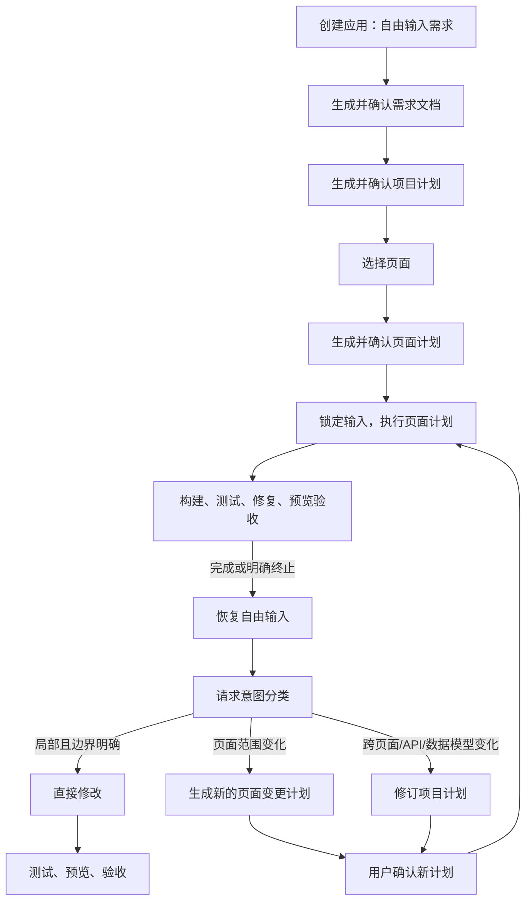

```mermaid
flowchart TD
    A["创建应用：自由输入需求"] --> B["生成并确认需求文档"]
    B --> C["生成并确认项目计划"]
    C --> D["选择页面"]
    D --> E["生成并确认页面计划"]
    E --> F["锁定输入，执行页面计划"]
    F --> G["构建、测试、修复、预览验收"]
    G -->|完成或明确终止| H["恢复自由输入"]
    H --> I["请求意图分类"]
    I -->|局部且边界明确| J["直接修改"]
    I -->|页面范围变化| K["生成新的页面变更计划"]
    I -->|跨页面/API/数据模型变化| L["修订项目计划"]
    J --> M["测试、预览、验收"]
    K --> N["用户确认新计划"]
    L --> N
    N --> F
```
