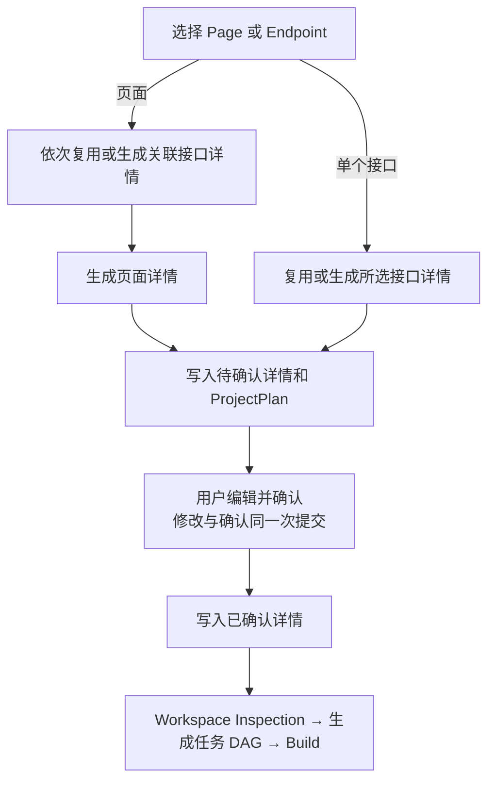
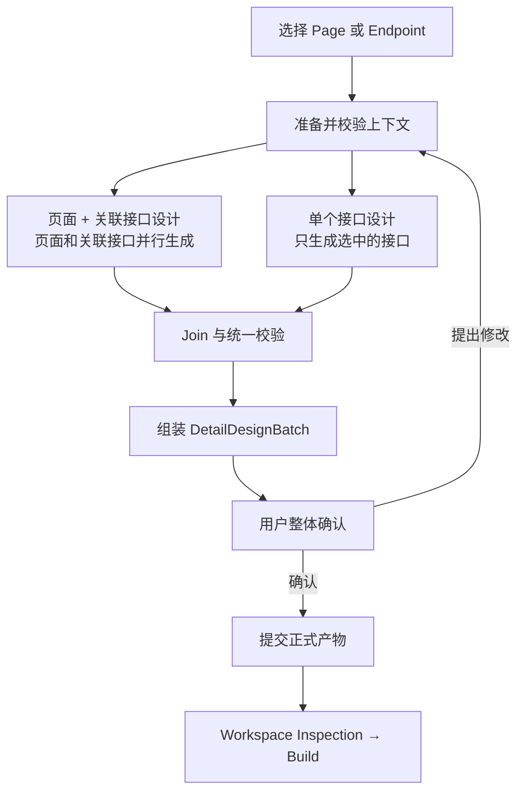

# Page/Endpoint 详细设计

> 流程前置边界：
>
> - 本节点不得新增或修改 Page、Endpoint、schema、permission、navigation、data source 或 API Contract；发现问题必须返回拥有该产物的上游阶段修复。
> - 缺少正式输入或工程事实时必须停止并给出修复路径，不得让模型补猜。

## 当前流程（现状）



当前单次页面设计中，关联接口按顺序处理，全部完成后才生成页面详情；没有独立的 revise 再确认动作。

## 优化后流程



页面 + 关联接口模式中，页面设计与关联接口设计可以同时生成；仅接口模式只生成用户选中的接口。最终 PageDetail 不依赖 Endpoint 的后端实现决策，但 DetailDesignBatch 仍需等待 join，确保 ProjectPlan 声明的关联详情全部齐全。

## 待优化项

| 优先级 | 模块               | 当前实现                                                                                                                                                               | 优化后                                                                                                                                                | 提升点                                           | 主要入口                                                      |
| ------ | ------------------ | ---------------------------------------------------------------------------------------------------------------------------------------------------------------------- | ----------------------------------------------------------------------------------------------------------------------------------------------------- | ------------------------------------------------ | ------------------------------------------------------------- |
| P0     | ZA21/API Contract  | Endpoint 模型生成成功码，但 `interface_design.response_format.status_code` 固定为 `200`；上游没有稳定 policy ref/hash                                                  | 上游生成结构化 ZA21 facts，在 Contract 中确认 policy ref/hash、成功码和错误码；详设只读并确定性投影                                                   | 消除同一 EndpointDetail 内的状态码冲突           | `planner.py`、`project_plan.py`、`api_contract_validation.py` |
| P0     | 输入事实           | Page 不读取 UI/源码；Endpoint 不读取源码；数据库上下文可跳过且可能截断                                                                                                 | 实现 `prepare_detail_context`，读取目标 UI、Workspace Baseline、候选表完整 Database Facts 和最小引用闭包                                              | 设计基于真实 UI、代码和数据库，而不是模型猜测    | `planning.py`、`page_detail_plan.py`、`database_context.py`   |
| P0     | LLM 输入边界       | Page 输入包含 EndpointDetail 的后端实现摘要；Endpoint 输入包含消费页面和完整 Contract 等非必要内容，且未按决策职责裁剪                                                 | Page 只接收 UI、前端事实和相关 Contract 字段；Endpoint 只接收目标 Contract、后端事实及必要 Database Facts；控制字段、凭据和可确定性派生字段不进入 LLM | 缩小上下文，避免模型读取与其职责无关的事实       | `page_detail_plan.py`、`page_designer.py`                     |
| P0     | Prompt 与 Decision | Prompt 要求的部分字段最终会被硬编码覆盖，模型输出与组装器存在重复语义源                                                                                                | 定义 PageDecision/EndpointDecision schema；模型只输出实现决策，只读事实与派生字段由组装器注入                                                         | 减少无效模型输出和详情内部冲突                   | `page_designer.py`、`page_detail_plan.py`                     |
| P0     | 正式输出结构       | PageDetail/EndpointDetail 混有 Contract 投影、模型元数据、审核状态及可确定性重算内容，正式产物存在重复字段                                                             | 用精简 PageDetail、EndpointDetail 组成 `DetailDesignBatch`；只保留后续实现需要的决策，Contract、权限和运行控制信息不重复持久化                        | 缩小正式产物并明确每个字段的权威来源             | `page_detail_plan.py`、`detail_design_documents.py`           |
| P0     | 并行编排           | `detail_confirmation` 用同步 `for` 循环逐个生成 Endpoint，全部完成后才生成 Page，并立即修改共享 `updated_plan`                                                         | Page 与关联 Endpoint workers 并行；Endpoint 限流；join 后统一校验并单线程合并                                                                         | 降低多 Endpoint 页面耗时，避免并发修改共享计划   | `planning.py`                                                 |
| P0     | 确定性校验与 Join  | 已有 Endpoint dependency 唯一解析和 EndpointDecision 部分结构校验；Navigation、Permission、Schema、Workspace/Database 引用未形成统一前置校验，且没有跨 worker 冲突检查 | 模型调用前闭合并校验全部只读引用；Decision 分别校验；join 检查结果齐全以及 database operation、reuse target 冲突，可合并项确定性去重                  | 事实错误在生成前暴露，并避免合并出相互冲突的详情 | `planning.py`、`page_detail_plan.py`                          |
| P0     | 用户修改           | 修改字段和 `overall_note` 与 `confirmed` 在同一次提交中处理；备注不会触发重生成                                                                                        | 拆分 `revise`、`confirm`、`reject`；下发 `editable_paths`，feedback 触发修订后重新确认                                                                | 用户确认的是修改后的最终设计                     | `detail_review.py`、`DetailReview.tsx`                        |
| P0     | 持久化             | pending 草稿写入正式详情路径，Endpoint/Page/ProjectPlan 顺序提交                                                                                                       | 隔离 draft/confirmed；用现有 run/interaction id 关联文件，用 `draft_sha256` 绑定审核内容，整体确认后原子提升                                          | 未确认内容不污染正式产物，避免部分提交           | `detail_design_documents.py`、`plan_documents.py`             |
| P1     | 重试与可观测性     | Page/Endpoint 节点级重试策略不一致；Page 模型失败可生成降级草稿；Page/review 进度事件不完整                                                                            | 统一 bounded retry、错误恢复路由和 AG-UI progress/evidence；失败不生成可确认草稿                                                                      | 两类设计具有一致、可定位的失败终态               | `page_designer.py`、workflow protocols                        |

## 1. 节点职责与边界

`detail_confirmation` 负责消除代码生成前仍然存在的实现歧义：

- Page 侧连接已确认 UI、API Contract 和已有前端工程事实。
- Endpoint 侧连接 API Contract、数据源、数据库事实和已有后端工程事实。
- 系统确定性校验两侧决策，并组装一个可整体审核的设计批次。
- 用户确认最终实现行为后，才允许进入 Workspace Inspection 和 Build。

本节点不负责：

- 重画 UI、修改业务代码或执行数据库变更。
- 扫描整个仓库或把数据库连接凭据传给模型。

## 2. 目标模式

| 模式          | 唯一目标                                                         | 本轮产出                                                                      |
| ------------- | ---------------------------------------------------------------- | ----------------------------------------------------------------------------- |
| Page          | `selectedPageId` 唯一解析到一个 `frontend_pages` 叶子页面        | 一个 PageDetail，以及本轮缺少或明确要求重建的关联 EndpointDetails；整体确认。 |
| Endpoint only | `api_contract_id + endpoint_id` 唯一解析到一个 Contract Endpoint | 一个 EndpointDetail；不读取 UI，也不生成 PageDetail。                         |

目标只能来自已确认 ProjectPlan，不使用名称模糊匹配。页面缺少 Endpoint、Navigation、Permission 或 Schema 定义时，返回拥有该事实的上游阶段修复，而不是让模型新增定义。

## 3. 权威输入与最小闭包

### 3.1 最小输入结构

目标选择直接复用 Graph State 的 `selectedPageId` 或 `api_contract_id + endpoint_id`，不再包装新的 `control` 对象。Page 和 Endpoint worker 使用不同输入，互不携带对方的实现事实；现有 AG-UI `runId` 和 lifecycle `pendingInteraction.id` 负责关联草稿。

```jsonc
{
  "page_input": {
    // 仅 Page 模式存在，只发送给 Page LLM
    "page": {
      "path": "<string>", // 已确认页面路由
      "description": "<string>", // 已确认页面目标
      "endpoint_dependencies": [
        {
          "api_contract_id": "<string>", // 预处理后补齐，避免 endpoint id 跨 Contract 歧义
          "endpoint_id": "<string>", // 必须唯一解析到 Contract Endpoint
          "usage": "<string>", // 该接口在页面中的用途
          "trigger": "<string>", // 进入页面、点击或提交等触发点
          "required_for_initial_load": "<boolean>", // 是否阻塞首屏 ready
        },
      ],
      "navigation_targets": [
        {
          "targetPageId": "<string>", // 必须唯一解析到 ProjectPlan Page
          "path": "<target route>", // 目标页面已确认路由
          "trigger": "<string>", // 页面跳转触发点
        },
      ],
      "ui": {
        "path": "<target page TSX path>",
        "source": "<target page TSX>", // 已确认 UI 结构；仅 Page 模式发送
      },
      "workspace_facts": [
        {
          "path": "<workspace-relative path>",
          "role": "<api_client|component|hook|route|permission|related_page>",
          "symbols": [],
          "fact": "<relevant fact>",
        },
      ],
    },
    "endpoint_contracts": [
      // 只包含页面实现会使用的接口和字段，不含后端/数据库事实
      {
        "api_contract_id": "<string>", // 所属 Contract id
        "endpoint_id": "<string>",
        "contract": {
          "method": "<HTTP method>",
          "path": "<path>",
          "summary": "<string>",
          "parameters": [],
          "error_codes": [], // 影响异常分支实现；模型不得修改
          "authentication": {}, // 影响认证/授权实现；模型不得修改
        },
        "schemas": {
          "request": "<resolved schema|null>",
          "response": "<resolved schema|null>",
          "referenced": {}, // request/response 嵌套 $ref 的递归最小闭包
        },
      },
    ],
    "previous_decision": {}, // 仅 revise Page 时存在
    "user_feedback": "<latest feedback>", // 仅 revise Page 时存在
  },
  "endpoint_inputs": [
    // 构造单独的endpoint_inputs对象发送给一个 Endpoint LLM worker
    {
      "api_contract_id": "<string>",
      "endpoint_id": "<string>",
      "contract": {
        "method": "<HTTP method>",
        "path": "<path>",
        "summary": "<string>",
        "parameters": [],
        "error_codes": [],
        "authentication": {},
      },
      "schemas": {
        "request": "<resolved schema|null>",
        "response": "<resolved schema|null>",
        "referenced": {},
      },
      "data_source_type": "<database|static>",
      "workspace_facts": [
        {
          "path": "<workspace-relative path>",
          "role": "<controller|service|repository|dto|entity|mapper|migration|static_module>",
          "symbols": [],
          "fact": "<relevant fact>",
        },
      ],
      "database_tables": [
        // 仅 database Endpoint 存在；static Endpoint 省略
        {
          "name": "<candidate table>",
          "columns": [],
          "primary_key": [],
          "indexes": [],
          "foreign_keys": [],
          "unique_constraints": [],
        },
      ],
      "previous_decision": {}, // 仅 revise 当前 Endpoint 时存在
      "user_feedback": "<latest feedback>", // 仅 revise 当前 Endpoint 时存在
    },
  ],
}
```

不传给任何 LLM：Graph State 控制字段、run/interaction id、hash、ProjectPlan 原始 role ids、ZA21 policy ref/facts、`success_status_code`、数据源 `entities`、Endpoint 的其他消费页面和数据库凭据。Page LLM 不接收后端 Workspace/Database Facts；Endpoint LLM 不接收 UI、导航或页面源码。ZA21 已由上游落实为 API Contract；成功码由下游按 Contract 读取，权限和候选表选择由确定性预处理完成。

### 3.2 ProjectPlan 引用闭包

| 引用                | 来源字段                                                                                    | 必须唯一解析到                                         | 失败处理                                                                           |
| ------------------- | ------------------------------------------------------------------------------------------- | ------------------------------------------------------ | ---------------------------------------------------------------------------------- |
| Endpoint dependency | `/frontend_pages/**/references/endpoint_dependencies/*/endpoint_id`                         | `/api_contracts/*/endpoints/*/id`                      | 返回 ProjectPlan 修订；当前缺少 `api_contract_id` 时要求 Endpoint id 全局唯一。    |
| Navigation target   | `/frontend_pages/**/references/navigation_targets/*/targetPageId`                           | `/frontend_pages/**/pageId`                            | 返回 ProjectPlan 修订。                                                            |
| Permission role     | 页面 `references.permissions`、`page_access.allowed_roles`、`operation_permissions.role_id` | `/permission_model/roles/*/id`                         | 返回 ProjectPlan 修订。                                                            |
| Schema ref          | Endpoint request/response ref 及其嵌套 `$ref`                                               | 同一 Contract 的 `/schemas/<name>`                     | 返回 ProjectPlan 修订；禁止跨 Contract 引用。                                      |
| ZA21 policy ref     | Contract `policy_ref`                                                                       | 上游已按 ZA21 生成且通过 ProjectPlan/API Contract 校验 | 返回 ProjectPlan/API Contract 修订；详设节点不再读取或保存独立 `api_policy_hash`。 |

`usage`、`trigger`、`required_for_initial_load` 是页面如何消费 Endpoint 的语义信息，不参与 Endpoint 身份解析：

- `usage`：说明接口用于查询、提交、删除等什么用途。
- `trigger`：决定接口由进入页面、点击按钮或提交表单等哪个事件触发。
- `required_for_initial_load`：决定该请求是否阻塞首屏 ready 状态，以及 loading/error 的作用范围。

## 4. 并行、校验与组装

### 4.1 并行规则

- `prepare_detail_context` 先生成稳定的共享事实快照和每个 worker 的只读切片。
- PageDecision 与全部 EndpointDecisions 可同时开始。
- Endpoint workers 使用有上限的并发；每个 worker 只返回 Decision，不修改 `updated_plan`、ProjectPlan 或文件。
- 相同数据库候选表和相同 Workspace fact 只读取一次，多个 worker 共享只读结果。
- 单个 worker 的模型或临时工具错误只重试该 worker，不重复其他 worker。

### 4.2 独立校验

- EndpointDecision 必须通过：结构 schema、Contract identity/schema、source type、Workspace symbol、Database mapping/difference/operation 引用校验；ZA21 是否已正确落实由上游 API Contract 校验负责。
- PageDecision 必须通过：结构 schema、UI target、Endpoint/request/response schema、Navigation/Permission 只读边界和 Workspace symbol 校验。
- 模型输出若与事实冲突，应拒绝 Decision 并重试或返回修复路径，不静默改写模型负责的语义。

### 4.3 Join 与最终组装

join 必须确认：

- 本轮所有 target 结果齐全且各自为 `valid`。
- target id 唯一，所有结果都属于当前 Graph State 选择范围。
- 多个 Endpoint 没有不可合并的 database operations 或 reuse target 冲突。
- 可合并的重复数据库操作被确定性去重；不可合并冲突只退回受影响 Endpoint。

join 成功后：

1. 确定性组装每个 EndpointDetail；Contract 字段不复制进详情，验收条件只能引用已确认 Contract。
2. 使用已经验证的 PageDecision 组装 PageDetail。
3. 按 ProjectPlan 的 endpoint dependencies 检查所需 EndpointDetails 全部存在；PageDetail 不复制依赖或绑定 EndpointDetail hash。
4. 完成 Page/Endpoint 批次完整性校验后，才生成待确认草稿。

## 5. 输出与一致性

最终输出是一个可整体确认的 DetailDesignBatch，不是 LLM 原始 JSON。

```jsonc
{
  "schema_version": "xcodeagent.detail-design-batch.v1", // 【新增】当前真实产物没有结构版本
  "draft_sha256": "<sha256>", // 【新增】绑定用户实际看到的完整批次草稿
  "endpoint_details": [
    // 【新增】当前 PageDetail 只保存 Endpoint 文件引用；推荐 Batch 聚合本轮待确认的 EndpointDetails
    {
      "schema_version": "xcodeagent.endpoint-detail.v1", // 【新增】当前 EndpointDetail 没有结构版本
      "api_contract_id": "<string>",
      "endpoint_id": "<string>",
      "implementation_strategy": {
        // 【新增】当前 EndpointDetail 没有显式记录 reuse/extend/create 决策
        "mode": "<reuse|extend|create>",
        "reuse_targets": [],
        "planned_changes": [],
      },
      "data_origin": {
        "effective_source": {
          "kind": "<mysql_existing|mysql_new_table|frontend_mock>",
          "database": "<database name>", // 仅 mysql 来源存在
          "tables": [], // 仅 mysql 来源存在
          "module_path": "<workspace-relative path>", // 仅 frontend_mock 来源存在；必须来自 Workspace Facts 或明确的新建目标
        },
        "field_mappings": [
          {
            "target_field": "<request.field|response.field>",
            "source": "<table.column|module.field>",
            "rule": "<mapping rule>",
          },
        ],
        "database_operations": [
          // 仅确有数据库结构差异时存在
          {
            "operation": "<create_table|add_column|alter_column_type|alter_column_nullable|alter_column_default>",
            "table": "<table name or create-table definition>",
            "column": "<column|null>",
            "from": "<current definition|null>",
            "to": "<target definition>",
            "reason": "<contract-based reason>",
          },
        ],
      },
      "operation_semantics": {
        // 【调整】当前字段位于 endpoint_decision 内；推荐提升为正式详情的一等字段
        "operation_kind": "<read|create|update|delete|action>",
        "target_cardinality": "<exactly_one|zero_or_one|many|not_applicable>",
        "selector": {
          "source": "<path|query|request_body|contract|none>",
          "fields": [],
        },
        "transaction_required": "<boolean>",
        "zero_match_behavior": "<behavior>",
        "multiple_match_behavior": "<behavior>",
        "side_effect": "<none|insert|update|delete|custom>",
      },
      "acceptance_criteria": [], // 用户确认、任务准备和验收阶段都需要的可验证业务行为
    },
  ],
  "page_detail": {
    // 【调整】Page 模式存在；Endpoint-only 模式省略
    "schema_version": "xcodeagent.page-detail.v1", // 【新增】当前 PageDetail 没有结构版本
    "pageId": "<string>",
    "implementation_strategy": {
      // 【新增】当前 PageDetail 没有显式记录 reuse/extend/create 决策
      "mode": "<reuse|extend|create>",
      "reuse_targets": [],
      "planned_changes": [],
    },
    "response_bindings": [
      // 【调整】保留当前字段名，仅新增 UI 落点
      {
        "ui_target": "<UI component or region>",
        "api_contract_id": "<API Contract id>",
        "endpoint_id": "<endpoint id>",
        "source_path": "<response field path>",
        "page_field": "<binding purpose>",
      },
    ],
    "operation_interactions": [
      {
        "trigger": "<user or lifecycle trigger>",
        "action": "<page behavior>",
        "api_contract_id": "<API Contract id|null>",
        "endpoint_id": "<endpoint id|null>",
        "target_page_id": "<navigation target page id|null>", // 【新增】仅导航行为填写
        "success_behavior": "<success feedback>",
        "failure_behavior": "<failure feedback>",
      },
    ],
    "state_feedback": [
      {
        "state": "<loading|empty|error|ready|success|validation|confirm>", // 【调整】在当前四种基础状态上增加 success/validation/confirm
        "trigger": "<state trigger>",
        "behavior": "<visible behavior>",
        "scope": "<UI scope>",
      },
    ],
    "form_rules": [
      // 【新增】仅存在表单且 request schema 不能完整表达 UI 校验行为时填写
      {
        "field": "<request field path>",
        "rule": "<UI validation behavior>",
        "message": "<validation message>",
      },
    ],
    "acceptance_criteria": [],
  },
}
```

字段来源只有四类：

| 来源               | 内容                                                                                                           |
| ------------------ | -------------------------------------------------------------------------------------------------------------- |
| 上游事实           | `pageId`、Endpoint identity、UI path 和 data source type；模型不可修改。                                       |
| 模型决策（校验后） | implementation strategy、binding、interaction、mapping、operation semantics 和 acceptance criteria。           |
| 确定性派生         | operation visibility 在任务准备/代码生成时根据 Page 操作和 ProjectPlan permission model 重算，不持久化副本。   |
| 系统控制           | schema version 和 `draft_sha256`；run/interaction id 与 `basedOnRevision` 由现有运行上下文提供，不写入 Batch。 |

一致性策略：

- 修改直接覆盖当前 draft 并重算 `draft_sha256`。
- 上游正式产物在本阶段只读；确认时重新执行 target、引用和事实校验，不为输入再建设一套稳定序列化/hash 协议。
- PageDecision 不依赖 EndpointDecision；EndpointDetail 修改后只需重新校验 Batch，不重复调用 Page 模型。

持久化边界：

```text
确认前（草稿）：.xcodeagent/drafts/detail-design/<runId>/<interactionId>/...
确认后：.xcodeagent/plans/pages/*
        .xcodeagent/plans/endpoints/*
        .xcodeagent/plans/project-plan.json refs
```

整体提交前先完成全部临时文件；任何写入失败都保持确认前正式状态。

## 6. 用户审核与可编辑范围

审核提供三个互斥动作：

| action    | 行为                                                                                               |
| --------- | -------------------------------------------------------------------------------------------------- |
| `revise`  | 提交结构化 changes 或自然语言 feedback；只更新 draft，重新校验后再次展示，不确认、不进入 Build。   |
| `confirm` | 在无待应用修改、`basedOnRevision` 与 `draft_sha256` 匹配且引用复验通过时整体确认；不允许部分确认。 |
| `reject`  | 结束本轮并保留必要恢复证据，不写正式产物。                                                         |

现有“整体补充说明”应改为“修改要求”。feedback 必须进入对应 PageDecision/EndpointDecision 的修订输入，不能只保存为备注。`editable_paths` 由服务端随 AG-UI 审核载荷下发给界面，不属于 `DetailDesignBatch` 正文。

可编辑范围：

| PageDetail                                       | EndpointDetail                                                                         |
| ------------------------------------------------ | -------------------------------------------------------------------------------------- |
| 已有 UI 组件与 Contract 字段的 binding           | 已知 Contract/source 字段的 mapping/transform                                          |
| 已有 Endpoint 下的操作顺序、触发和反馈           | 事实允许范围内的 reuse/extend/create 选择                                              |
| loading/empty/error/success 状态和文案           | 与 Database Facts 一致的 database operations                                           |
| 不改变 Request Schema 的纯前端输入约束与交互提示 | 在 API Contract 约束内确认事务边界、单/多目标处理、未命中/异常多命中行为及已声明副作用 |
| 验收条件                                         | 验收条件                                                                               |

## 7. 成功条件与恢复路径

| 阶段           | 成功条件                                                                                    | 失败后的解决方案                                                                                                                |
| -------------- | ------------------------------------------------------------------------------------------- | ------------------------------------------------------------------------------------------------------------------------------- |
| 目标与输入准备 | target 唯一；ProjectPlan/API Contract/UI/Workspace/Database 条件依赖完整；引用闭合          | 展示具体 JSON Pointer 或 artifact；返回 ProjectPlan、UI、Workspace 扫描或 Database Facts 采集阶段，修复后重新执行 preparation。 |
| Decision 生成  | Page/Endpoint 输出符合结构 schema，且所有引用都来自只读事实                                 | 结构或临时模型错误只重试受影响 worker；事实缺失返回相应上游，不生成降级可确认草稿。                                             |
| Join           | 全部目标 valid；跨 Endpoint 数据库操作和复用目标无不可合并冲突                              | 可合并项确定性去重；不可合并项列出冲突 target，只重试相关 Endpoint；上游冲突返回上游修复。                                      |
| Batch 组装     | ProjectPlan 声明的 EndpointDetails 完整；Page/Endpoint target 无重复；`draft_sha256` 已计算 | 回到对应 Decision 或 assemble；Endpoint 变化不重复调用 Page 模型。                                                              |
| Revise         | 修改只涉及 editable paths；新草稿重新通过独立校验与 join                                    | 不可编辑内容指向所属上游阶段；修订失败保留当前待确认草稿和用户反馈。                                                            |
| Confirm        | 无待应用修改；`basedOnRevision` 与 `draft_sha256` 匹配；上游引用和全批次重新校验通过        | 显示过期交互、变化草稿或失效引用，修复后让用户再次确认。                                                                        |
| Commit         | PageDetail、EndpointDetails 和 ProjectPlan refs 全部写入并从磁盘回读校验成功                | 使用同一有效草稿重试原子提交；若输入已变化，重新 preparation、生成和确认。                                                      |

只对明确的模型、只读工具、网络等临时错误做有限重试。Validation、Contract 冲突、缺少正式事实、认证失败和用户拒绝不自动重试。Page/Endpoint 使用相同的节点级重试和失败终态，不以模型调用失败后的默认草稿冒充正常设计。
