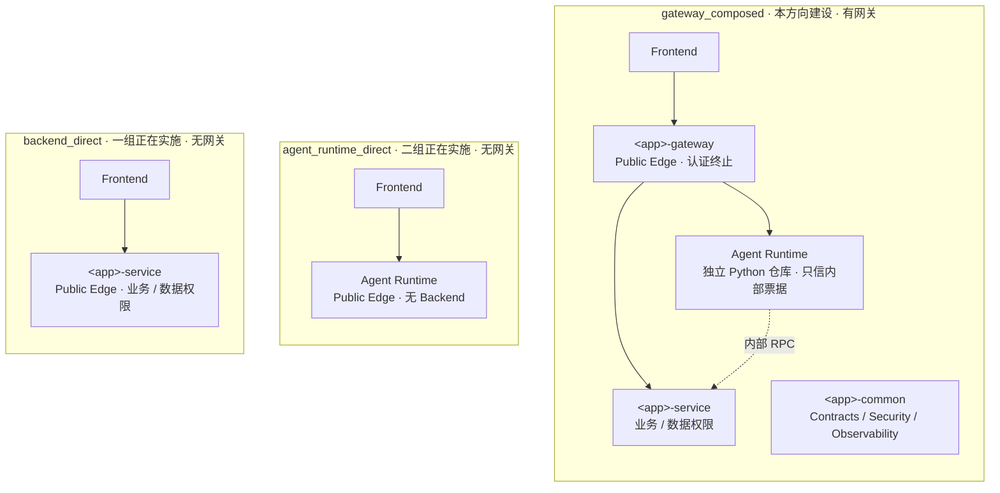
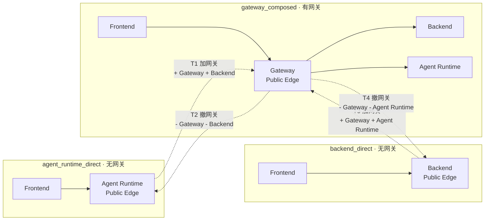
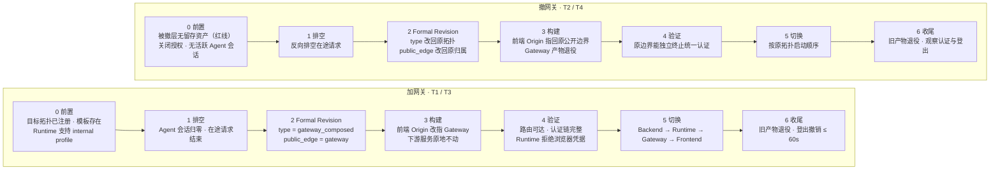
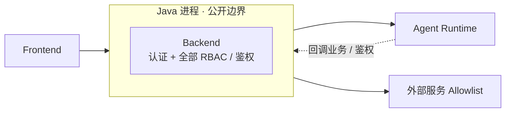
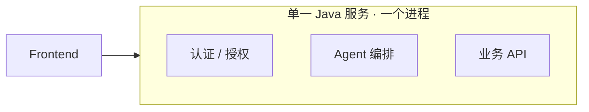

# 生成应用架构方案选择：有网关 / 无网关 / 全 Java

> 评审讨论材料，非规范性。每个方向给出：组成 → 结构图 → 请求链路 → 认证授权 → **实施主流程** → 演进（加网关 / 撤网关） → 优缺点。  
> 主流程讲完整，内部合同不展开；详细 Runbook 见 `GATEWAY_TOPOLOGY_UPGRADE_PLAN.md`。

---

## 方向一：有网关（内部评审推荐的统一拓扑框架）

**组成**：本方向要建设的是 `gateway_composed` 一套拓扑——**Frontend + Gateway + Backend + Agent Runtime，四模块缺一不可**，公开边界与认证终止点恒定在 Gateway。它**不替换**另外两套：**三套拓扑长期并存**，分别服务不同规模的应用。

- **定位与归属**：`backend_direct`（Frontend + Backend）由**一组**正在实施；`agent_runtime_direct`（Frontend + Agent Runtime）由**二组**正在实施；`gateway_composed` 是本方向要建设的**后续升级**形态。三套都作为长期可选项存在，跨应用可以同时采用不同拓扑；单个应用在三套之间的迁移路径见 §1.2。
- **本方向内部仍只有一种形态**：gateway 这条路上的四模块缺任一，该候选整体无效，只能落到另两套拓扑（缺 Agent → `backend_direct`；缺 Backend → `agent_runtime_direct`）。
- **不支持半组合**：`Frontend + Gateway + Backend` 与 `Frontend + Gateway + Agent Runtime` **都不存在**（`APPLICATION_TOPOLOGY_DESIGN.md §2`）。Gateway 是完整组合拓扑的统一公开边界，**不是为单一 upstream 独立开启的通用代理**。
- Gateway 不是可开关模块：没有 `gateway.enabled`，存在与否完全由 `topology.type` 决定。
- **工程结构**：`<app>-gateway`、`<app>-service`、`<app>-common` 同属一个 Backend 父工程，Gateway 以**独立进程**运行——`gateway_composed` 共 4 个进程，另两套各 2 个。

**请求链路**：`Frontend → Gateway →（Backend / Agent Runtime）`；Runtime 不被 Gateway 二次跳转，需要业务能力时**直接内部 RPC 回 Backend**。

**认证与授权**

- 统一认证 JWT 在 Gateway **本地验签**，换签内部票据 `Xcode-User-Info` 向内传递；公开 JWT 不转发。
- **Agent RBAC**（原规范已定）：`authorization.enabled=true` 时必须 `auth.enable=true`，在 Gateway 生成。
- **业务 RBAC**（本次评审结论）：与 Agent RBAC **统一收敛在网关层**，Backend 只保留资源级 / 数据级校验。
- **分期落地**：设计上定死"授权判定归网关层"，**实现排在后期**——首个版本只做认证终止 + 内部票据。分期内须先定两件事：策略来源（Backend 只读查询接口 / 统一授权中心）、过渡期兜底（Backend 暂代 / 对需授权 Endpoint fail-closed）。
- 外部服务与第三方凭据一律由 Backend Adapter 出站，Gateway 不连外部、不持凭据。

### 1.1 实施主流程

| 步骤 | 做什么     | 关键点                                                                         |
| -- | ------- | --------------------------------------------------------------------------- |
| 1  | 技术计划定形态 | `topology.type = gateway_composed`、`public_edge = gateway`                  |
| 2  | 编译服务图   | **四模块齐备才成立**，缺 Backend 或 Agent Runtime 即候选无效                                |
| 3  | 生成确定性产物 | Gateway 只读路由表 + 统一认证绑定 + 内部票据配置 + Backend Adapter（声明外部服务时）；**网关层授权绑定为后期增量** |
| 4  | 构建      | Gateway 内**不生成业务代码**，协议 / 字段转换只进 Backend Adapter                            |
| 5  | 启动      | 固定顺序：Backend → Agent Runtime → Gateway → Frontend                           |
| 6  | 验收      | 路由通、认证链完整、**Runtime 拒绝浏览器凭据**；（授权落地后）判定确由 Gateway 作出                        |

### 1.2 演进：加网关 / 撤网关

三套拓扑长期并存，但对**单个应用**而言，"**小 → 大 / 大 → 小**"是**跨拓扑**迁移，改动方向只有两种：**给无网关拓扑加一层 Gateway**、**把 Gateway 撤掉**。三种形态各自的架构，以及它们之间的 4 条转换路径：

- **公开边界 / 认证终止点跟着 Public Edge 一起迁移**：无网关时落在 Agent Runtime 或 Backend，加网关后统一收敛到 Gateway，撤网关则原路返回。这是"加 / 撤网关"真正昂贵的一步。
- **T1 / T3 的四项硬前提**：目标拓扑已注册、模板存在、Runtime 支持 internal profile、`migratedFrom` 可用（**当前四项全为假**）。
- **T2 / T4 是红线所在**：只有被撤掉的那一层**还是空壳**时才能撤网关；一旦承载业务，撤网关窗口关闭，正确做法是**保留网关**。
- **T2 额外约束**：`agent_runtime_direct` 要求 `authorization.enabled=false`（见拓扑选择矩阵），撤网关必须先关闭授权。
- 四条路径共用 `topology.migratedFrom`，**不新增字段**；**公开 path 全程不变**。

加 / 撤是同一套六步流水线的两个方向：

**工作量**：九项改动里只有两项涉及代码（Runtime 切 internal profile + Gateway 认证绑定），其余由平台重生成或改运维配置。完整 Runbook 与验收清单见 `GATEWAY_TOPOLOGY_UPGRADE_PLAN.md`。

### 1.3 优点 / 代价 / 风险

- 优点：单一公开入口、认证单点、**授权判定单点**、跨服务身份委托清晰、外部凭据收敛；未来可加独立的限流 / 灰度 / 审计。
- 代价：**四模块强耦合**，多一个进程、多一套模板、多一次 Runtime 改造。
- 风险：过度设计——"只想加一层代理"的场景会被直接拒绝（**有意为之**，需让相关方知晓）；**RBAC 分期意味着存在一段"授权尚未上移"的过渡期**，兜底口径必须先定，否则会出现"谁都不判"或"两边都判"。

**现状**：`gateway_composed` 只有设计，**未注册、无模板、未验证**；全部转换路径不可执行；网关层 RBAC 为分2期完成，尚未进入实现。

---

## 方向二：无网关，Java 集中认证授权

**组成**：Frontend + Backend + Agent Runtime（不引入 Gateway 进程）。

**结构图**（公开边界与内部服务）

**请求链路**：`Frontend → Backend`；Backend 内部路由调用 Agent Runtime，Runtime 需要业务能力或鉴权结论时回调 Backend。

**认证与授权**

- Backend 即公开边界与认证终止点，沿用行内统一认证。
- **所有 RBAC 与鉴权逻辑收敛在 Java 服务内**；Runtime 只消费已判定的上下文，不自己维护权限模型。

### 2.1 实施主流程

| 步骤 | 做什么   | 关键点                                                                                                                                                      |
| -- | ----- | -------------------------------------------------------------------------------------------------------------------------------------------------------- |
| 1  | 定义新拓扑 | 新增一套"Frontend + Backend + Runtime、无 Gateway"的拓扑（**暂名 `backend_with_agent`，正式名待定**）→ 枚举 + 三阶段 Definition。`backend_direct` 定义为"不生成 Agent Runtime"，**不能复用** |
| 2  | 正名    | 现有 `gatewayEndpointId` 就是本方向的 Agent 入口位置，改名为"**Backend Agent 入口 Endpoint**"，消除与 Gateway 的同名不同义                                                           |
| 3  | 内部调用  | Backend → Runtime 走内部路由，注入可信上下文（用户 / 租户 / 权限 / trace）；浏览器始终不直连 Runtime                                                                                   |
| 4  | 回调契约  | Runtime 需要业务能力或鉴权结论时，调用 Backend 声明的内部 API；Runtime 不自建权限模型                                                                                                |
| 5  | 启动    | 固定顺序：Backend → Agent Runtime → Frontend                                                                                                                  |
| 6  | 验收    | 浏览器不直连 Runtime、Runtime 不接受浏览器凭据、授权结论只来自 Backend                                                                                                          |

### 2.2 演进

- **与现状**：现有主流程（`Frontend → Backend 内的 Agent 入口 → Python runtime`）的形态**就是本方向**——等于"**现状 + 正名 + 补拓扑定义**"，主流程已跑通大半。
- **与方向一的关系**：本方向与方向一是**并列的两个方向（二选一或按场景并存）**，**当前不进入方向一的转换路径**——本方向的拓扑尚未定义，与方向一之间的互转规则同样没有定义。若要长期并存，需另行设计两者之间的转换，本次不预设。
- 工作量：≈ 现状，主要是固定口径 + 正名 + 补 Definition；**不新增进程与模板**。

### 2.3 优点 / 代价 / 风险

- 优点：改动最小，复用现有 Java 认证体系，落地最快。
- 代价：Backend 同时承担业务、认证、Agent 入口、授权，职责持续膨胀；没有独立的 Agent 流量治理位。
- 风险：单点臃肿；未来若需要治理能力，还是要回到"加 Gateway"，等于补做升级。

---

## 方向三：全 Java（Agent Runtime 重写）

**组成**：Frontend + Java 服务（内含 Agent）。没有 Python sidecar，也没有 Gateway。

**结构图**（单一进程内含全部能力）

**请求链路**：`Frontend → Java 服务`，一体到底，不存在跨服务调用。

**认证与授权**：在同一进程内完成，不存在"身份怎么跨服务传"的问题。

### 3.1 实施主流程（分阶段重写）

| 阶段 | 做什么     | 关键点                                                      |
| -- | ------- | -------------------------------------------------------- |
| 1  | 选型与骨架   | 确定 Java 侧 Agent 框架（**当前未选型——最大不确定性**）；搭 Spring Boot 服务骨架 |
| 2  | 编排移植    | 重写现基于 DeepAgents / LangGraph 的编排语义                       |
| 3  | 流式与生命周期 | 重写 AG-UI SSE 生命周期、thread / run 隔离、澄清交互恢复                 |
| 4  | 状态      | 重写 checkpoint 与恢复语义                                      |
| 5  | 模型与工具   | 重写模型工厂、Tool Adapter 契约                                   |
| 6  | 对齐验收    | 对同一批用例，事件流与 Python runtime 行为一致                          |

### 3.2 演进

- **与其他方向不互通**：单体服务里既没有 Gateway，也没有跨服务身份传递，**升级 / 降级机制对它不适用**。
- **代价的另一面**：Agent 不再是独立服务后，拓扑框架中"含 Agent 服务图"的那套编译逻辑对它不再生效，需要另立定义。

### 3.3 优点 / 代价 / 风险

- 优点：单一技术栈、单一制品、部署最简单；无跨语言内部调用、无 sidecar 生命周期。
- 代价：Agent Runtime 现为平台拥有的独立 Python 仓库（Python 3.12 + DeepAgents + FastAPI + AG-UI SSE + checkpoint），重写等于重做一整套；**放弃 Python Agent 生态，并长期维护两套技术栈**。
- **三个方向里成本数量级最大，且不可逆。**

---

## 对比

|               | **方向一 · 有网关**                                           | **方向二 · 无网关**                | **方向三 · 全 Java**          |
| ------------- | ------------------------------------------------------- | ---------------------------- | ------------------------- |
| **为什么要 / 不要这一层** | **认证 + 授权收敛到单层**；Backend / Runtime 都不暴露公网；留出独立的 Agent 流量治理位 | 现有 Backend 已能终止认证，再套一层代理**不新增能力**，只多一跳 | 单体内部不存在跨服务身份问题，**这一层没有作用对象** |
| 组成            | Frontend + Gateway + Backend + Agent Runtime（**四模块固定**） | Frontend + Backend + Runtime | Frontend + Java（内含 Agent） |
| 公开边界 / 认证终止   | Gateway                                                 | Backend                      | Java 服务                   |
| RBAC / 授权判定   | **Gateway（业务 + Agent 统一）**，分期实现                         | Java 服务                      | Java 服务                   |
| Agent Runtime | Python，需 internal profile                               | Python，被 Backend 内部调用        | **Java 重写，不再存在**          |
| 进程数           | 4                                                       | 3                            | 2                         |
| 主流程成熟度        | 设计完整，未注册未验证                                             | **现状即形态**，缺正名与拓扑定义           | 需从零重写                     |
| RBAC 落地节奏     | 归属已定网关层，**实现排在后期**                                      | 随拓扑落地即可实现                    | 随重写一并实现                   |
| 升级 / 降级       | 支持：加 / 撤网关                                              | **未定义**（拓扑尚不存在）              | **不支持**（单体，无多拓扑）          |
| 与现状距离         | 远                                                       | **最近**                       | 很远                        |
| 最大成本          | Gateway 模板 + Runtime 改造                                 | Backend 职责膨胀                 | **重写 Agent Runtime**      |
| 主要风险          | 过度设计、四模块强耦合                                             | 单点臃肿、缺治理层                    | 生态丢失、双栈维护                 |

**为什么单独设网关这一层（对齐行内架构规范）**

| 架构规范要求 | 不设网关时的差距 | 网关这一层如何满足 |
| --- | --- | --- |
| **统一接入**：外部流量只经统一接入层，内部服务不直接对外 | Agent Runtime / Backend 各自成为公开边界，暴露面随服务数增长 | Gateway 是 `gateway_composed` 的**唯一 Public Edge**，Backend / Runtime 都不暴露公网 |
| **认证集中**：认证集中实现，业务服务不各自做鉴权 | 每个上游都要重复接一遍统一认证，实现口径容易漂移 | 统一认证 JWT 只在 Gateway **本地验签**，下游不重复实现 |
| **凭据不落地**：外部凭据不在内网横向传递 | 公开 JWT 会随调用链一路进入内网服务 | 换签 `Xcode-User-Info` 内部票据，**公开 JWT 不外传** |
| **授权集中**：授权判定有唯一责任主体 | 业务 / Agent 两套 RBAC 分散在 Backend，易出现"都判"或"都不判" | 业务 RBAC 与 Agent RBAC **统一在 Gateway 判定**（分期实现） |
| **横切能力与业务解耦**：限流 / 熔断 / 灰度 / 审计 / 留痕集中在治理层 | 这些能力要么缺失，要么被写进业务代码 | 治理能力挂在 Gateway，**改动不触及 Backend / Runtime 业务代码** |
| **分层演进**：分层清晰，能力可独立演进 | 每加一项治理能力就要改一次业务服务 | 治理能力演进只动 Gateway 一层 |

> 对标口径按分层架构通用规范整理；正式评审引用时，以行内架构规范文本的具体条款为准。

---

## 需要讨论的

1. **三方向是三选一，还是按场景并存？** 若要按场景并存，方向二 / 三应作为**新拓扑**被定义，而不是方向一的替代品。这个前提不澄清，三个方向不在同一个问题上比较。
2. **公开边界与认证终止点是否允许分开？** 方向一整套票据与 internal profile 设计都建立在"可分离"之上。
3. **Python Agent Runtime 是否长期保留？** 若保留，方向三基本不值得做。
4. **选方向二 / 三 = 新增一套拓扑 + 三阶段 Definition。** 注意 `backend_direct`（Frontend + Backend，无 Runtime）不能复用；方向二是"两个服务都全、只缺网关"的第四种形态，现有三套拓扑都不覆盖。
5. **降级要不要支持？** 若支持，须先立一条红线：**被撤掉的那一层承载业务后禁止撤网关**。若连加网关都不打算做，撤网关更无意义。
6. **业务 RBAC 是否真的从 Backend 上移到 Gateway？** 本次评审结论为"统一归网关层"，但现行规范文档写的是业务 RBAC 由 Backend 负责、仅 Agent RBAC 条件式在 Gateway。二者冲突，需定稿并回写文档。
7. **规范对标的依据要落到行内架构规范的具体条款。** 上文"为什么单独设网关这一层"是按通用分层架构规范口径整理的，评审前应逐条对应到行内规范文本，避免论证悬空。

> **已澄清（对齐原设计）**：方向一只有 `gateway_composed` **一种形态，不支持半组合**（`APPLICATION_TOPOLOGY_DESIGN.md §2`）。此前讨论中的"网关 + Runtime""网关 + Backend"若要做，是**新增两套拓扑**（拓扑集合 3 → 5），不是在方向一内部加组合。
>
> **已定（本次评审）**：① 方向一的 RBAC（业务 + Agent）**统一归网关层**，分期实现；② 方向一支持**加 / 撤网关**的双向转换（T1–T4）。v2 评审文档的 **G14** 按原设计应回答"**不支持半组合**"（与其 §0 结论及 G2 一致），待回写。

> 无论选哪个方向，方向二、三在现有拓扑框架里**都还不存在**；方向一的转换路径也**都不可执行**——这本身就是一次决策，不是"去掉某个模块"这么简单。

