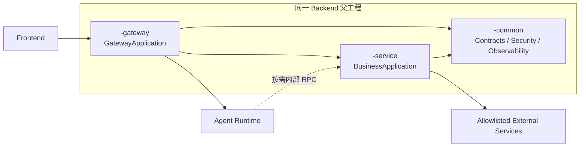
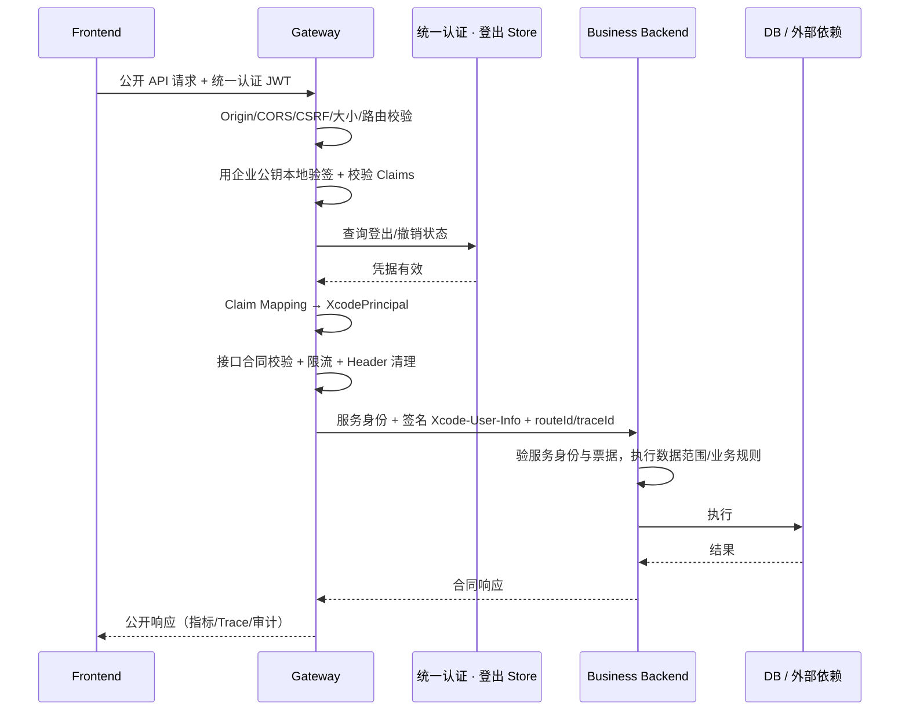
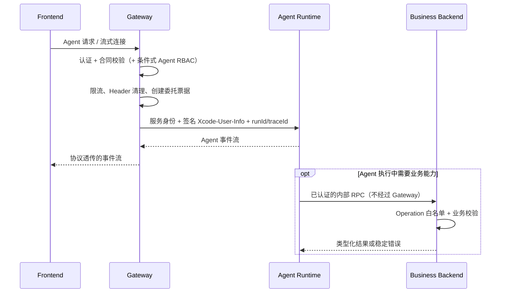

# 生成应用 Gateway 设计 · 组内评审版

> **文档性质**：评审汇报材料，**非规范性文档**。任何实现口径以 `docs/gateway/` 五篇规范文档与 `docs/topology/` 框架为准。
> **存放说明**：独立新文件，不进入 `docs/topology/README.md` 导航与 `docs/CODEBASE_INDEX.md`，避免与规范性文档混用；评审形成结论后再决定归档或吸收。
> **覆盖范围**：`gateway_composed` 拓扑，即 Frontend + Gateway + Backend + Agent Runtime 的完整组合。
> **一句话结论**：Gateway 不是一个开关，而是 `gateway_composed` 拓扑的**固定组成服务**；只要 Backend 与 Agent Runtime 同时存在，Gateway 就必然存在；不存在"半组合"的中间形态。
> **与拓扑评审的关系**：拓扑层面的决策（D1–D6）见 `../topology/TOPOLOGY_REFACTOR_REVIEW.md`。本文只讲 Gateway 这一块怎么设计、边界在哪、现状到哪。
> **版本**：v2（2026-09-20）。在 v1 基础上新增 §1「需求分析」（1.1 原始需求 + 1.2 现状分析），原 §1–§14 顺延为 §2–§15；决策点已改为"只抛问题、不预设结论"，并在 §0 / §13 增补核心争议问题 **G12–G15**。

---

## 0. 一页纸：本次评审要讨论的问题

> 本文**只列出需要讨论的问题，不预设结论**。结论由评审讨论后确定，再回写设计文档。

| # | 议题 | 待回答的问题 | 为什么需要先讨论 |
| --- | --- | --- | --- |
| **G1** | Gateway 的身份 | Gateway 是一套**独立拓扑**，还是"**Backend 拓扑下的一种运行模式**"？ | 决定 Gateway 有无独立 Definition 与注册表条目 |
| **G2** | 四模块是否缺一不可 | 是否接受"Frontend / Gateway / Backend / Agent Runtime 缺任一即候选无效"？被它拒绝的"只加一层代理"场景是否真的不存在？ | 决定 Gateway 的能力边界与是否被滥用为单跳代理 |
| **G3** | 身份模型是否统一 | 是否统一为"**行内统一认证 JWT 在 Gateway 本地验签** → 换签内部 `Xcode-User-Info`"、不引入第二套登录 / Session？行内统一认证 Profile 与模板能力是否对得上？ | 决定认证归属与 Backend / Runtime 的信任模型 |
| **G4** | Agent 授权租约参数 | 票据 **6h**、到期前 **10min** 可重新授权、宽限 **30min**、活跃流每 **60s** 复查登出——这组取值是否可接受？6h 暴露窗口安全侧能否接受？ | 决定长跑 Agent 会话的安全-可用性平衡 |
| **G5** | 外部服务访问边界 | 是否接受"Gateway **不连外部、不持第三方凭据**，外部一律由 Backend Adapter 出站"？ | 决定 SSRF / 凭据泄露面与 Adapter 归属 |
| **G6** | 页面聚合归属（GW-CORE-06） | 页面聚合默认由 Backend 页面服务承担，还是需要独立 Backend BFF？ | 这是**唯一**写入 `gateway.decisions` 的决策项 |
| **G7** | 旧命名 `gatewayEndpointId` | 是否改名（如"Backend Agent 入口 Endpoint"）以消除与本文 Gateway 的同名不同义？何时改？ | 决定文档与代码是否消除同名不同义 |

> **G1 / G2 / G3 影响面最大，宜优先讨论**。这三条不达成一致，后面的路由、DAG、启动顺序都没有落脚点。
> 另有拓扑升级相关的 **G8–G11**（不阻塞本次设计定稿，但决定"已生成应用如何演进"）：主流程见 §12，待讨论问题见 §13。

**本次评审核心聚焦（G12–G15）**

以下四条是本次评审最需要达成一致的争议点——它们都问的是"**该不该做**"，属于前提性问题，一旦结论与现设计不同，会反向改变上面若干条的前提（展开见 §13）：

| # | 议题 | 核心问题 |
| --- | --- | --- |
| **G12** | Gateway 的职责边界 | 哪些**必须做**、哪些**坚决不做**？职责之外的能力诉求（限流 / 灰度 / 缓存 / 审计聚合 / 是否替 Runtime 做 RBAC）是支持还是拒绝？ |
| **G13** | Agent 授权租约是否必要 | 需要"独立授权租约"这一整套，还是 Gateway 认证后**内部路由直连** Runtime 即可？要不要**分多期**——前期先简单直连、后期按 RBAC 需求再补租约？ |
| **G14** | 是否保留"半组合" | 是否允许 **Gateway+Backend**、**Gateway+Runtime** 两种半组合？支持方认为组合本身合理、可用 auth 开关覆盖差异，前后端能**少做两套模板**。 |
| **G15** | Gateway 要不要做 RBAC | 做**业务 RBAC**、**Agent RBAC**，还是只做**入口治理**（认证 + 粗粒度授权）？若都不做，RBAC 落在哪一层？ |

> 两处需要特别注意的牵制关系：
> - **G14 与 G2 直接冲突**——G2 主张"四模块缺任一即候选无效"，而 G14 恰恰要给两种半组合正名，两条必须放在一起谈，不能各拍各的。
> - **G13 与 G4 强耦合**——G4 讨论的是租约参数（6h / 10min / 30min / 60s）；如果 G13 结论是"走内部直连、不发租约"，则 G4 整条问题自动消解，无需再议。

---

## 1. 需求分析

> 本章回答两件事：**为什么要有 Gateway**（1.1），以及**它落在什么现状之上**（1.2）。后文的设计结论都从这两点推出来。

### 1.1 原始需求

**业务诉求**：当生成的应用从"纯 Agent 对话"走向"Agent + 自建业务后端"时，需要一个统一公开入口：

- 浏览器只访问**一个 Origin**，页面 API 与 Agent 流式交互走同一条公开链路；
- 用户身份只在**一个地方**被验证和终止，不出现第二个公开认证点；
- Agent 与业务后端之间需要安全的**跨服务身份委托**（谁代表谁、能调用什么）；
- 外部服务访问与第三方凭据必须**收敛在一层**，不散落在多个进程。

**平台诉求**（对生成器、模板与 CI 可执行性的要求）：

- 该入口的存在性必须由**拓扑**决定，而不是布尔开关——否则"要不要网关"会退化成一组补丁规则；
- 路由表、认证配置、启动顺序必须是**确定性编译产物**，模型不参与，减少行为漂移；
- 设计、Planning、Build、Launch 四个边界要能对同一组不变量做校验，任一不满足即 fail-closed。

**本次评审要讨论的问题**（详见 §13）：

- 设计层：G1 拓扑身份、G2 四模块缺一不可、G3 身份模型、G4 授权租约参数、G5 外部边界、G6 页面聚合归属、G7 命名统一（见 §13）；
- 演进层：G8–G11，即"已生成的 Agent 直连应用如何升级到该拓扑"（见 §12 与 §13）。

### 1.2 现状分析（含 auth 与 RBAC 背景）

**（1）应用级能力开关**

`auth.enable` 与 `authorization.enabled` 写在 `.xcodeagent/application.json`，是**应用能力事实**，**不决定任何拓扑**：

| 开关 | 含义 |
| --- | --- |
| `auth.enable` | 是否启用认证（是否出现公开认证终止点） |
| `authorization.enabled` | 是否启用 RBAC 授权 |

三套拓扑对它们的约束不同：

| 拓扑 | `auth.enable` | `authorization.enabled` | 公开认证终止点 |
| --- | --- | --- | --- |
| `agent_runtime_direct` | 可选 true / false | **必须 false** | Agent Runtime |
| `backend_direct` | 由 Backend 承担 | 业务 RBAC 归 Backend | Backend |
| `gateway_composed` | `authorization.enabled=true` 时**必须 true** | 可 true（生成 Agent RBAC） | Gateway |

> **易错点**：这两个开关是"应用有什么能力"，不是"要不要某个服务"。把 `auth.enable` 当成拓扑开关，就会问出"能不能只开认证、不开 Gateway"——不能，认证终止点由拓扑决定。

**（2）认证（auth）背景设计**

- **唯一权威**：行内统一认证系统是账号、登录、公开 JWT 签发与登出状态的唯一权威；平台不建账号、不存密码、不自签登录 Token。
- **公开 JWT 不转发**：公开统一认证 JWT 只在公开边界使用，不传给 Backend、Agent Runtime 或外部服务。
- **两段式身份**（理解本设计的钥匙）：
  - **服务身份**：证明"哪个内部服务在调用"；
  - **`Xcode-User-Info`**：把验证过的最小用户上下文签成的内部票据，表达"代表哪个 Principal、当前 actor、可调用哪些 Endpoint"；
  - 二者**不可互相替代**；客户端伪造的 `Xcode-User-Info` / `Claw-User-Info` / `X-User-Id` 等内部 Header 一律先删除。
- **不同拓扑的认证形态**：
  - `agent_runtime_direct`：`auth.enable=true` 时 Runtime 是公开认证终止点，复用应用 `login` capability 的会话语义；`auth.enable=false` 时由 Runtime 签发匿名会话，且不允许客户端自选 subject；
  - `gateway_composed`：认证终止点迁移到 Gateway，Runtime 只验内部票据、拒绝浏览器凭据（这正是 §12 拓扑升级要改的地方）。

**（3）授权（RBAC）背景设计**

- **普通业务 RBAC / 数据权限归 Backend**：角色、页面、动作、资源授权与数据范围由 Backend 在自身边界执行；Gateway 不感知、不参与。
- **Agent RBAC 是条件式的**：仅当 `auth.enable=true` **且** `authorization.enabled=true` 时生成并执行，固定覆盖"当前 Principal 是否允许访问目标 Agent""用户 / Agent 冻结状态""身份相关准入策略"。
- **Agent RBAC ≠ 入口治理**：Agent 是否部署可用、协议、请求大小、限流、并发、连接治理属于**非 RBAC 入口治理**，只要存在 Agent route 就独立执行。
- **能力白名单 ≠ RBAC**：`allowedRpcOperationIds` 表达"可调用哪些 Internal RPC Operation"，是能力白名单，不是授权模型。
- **`authorization.enabled=false` 只关 RBAC**：不关闭认证、ownership、Tool allowlist、写操作确认、速率限制与审计。

**（4）这些背景为什么要写在这里**

Gateway 的两项核心职责恰好建立在其上：

| Gateway 职责 | 依赖的背景 | 常见误读 |
| --- | --- | --- |
| 认证终止 | `auth.enable` + 行内统一认证 | "能不能只关认证、不关 Gateway"——不能，终止点由拓扑决定 |
| 条件式 Agent RBAC | `authorization.enabled` | "Gateway 自带 RBAC"——不是；两开关任一为 false 就不生成 RBAC，但其余入口治理照常 |

后文 **§7 身份与安全模型** 是这张现状图在 `gateway_composed` 下的完整展开，**§4** 给出三拓扑的横向对照。

---

## 2. 先讲清楚：Gateway 是什么、不是什么

**一句话定位**：Gateway 是生成应用的**唯一公开入口 + 流量治理层**。

它做三件事，且只做这三件事：

1. **挡在公开边界上**——浏览器只能看到一个 Origin，就是 Gateway；
2. **把外部身份换成内部身份**——验证统一认证 JWT，换签内部可信任票据，代代相传；
3. **把请求送到正确的地方**——按正式路由表分流到 Backend 或 Agent Runtime，并施加速率、超时、熔断、观测等治理。

它**不**做的事，同样要说死：

- 不承载领域业务、数据访问、业务幂等事实；
- 不做 Agent 推理（Prompt / 模型 / Memory / Knowledge / Skill 一概不碰）；
- 不连接外部服务、不持有第三方凭据；
- 不提供任意 URL 代理、动态脚本、用户可编辑路由。

> 边界感是这份设计最值钱的部分。Gateway 一旦开始"顺手做点业务"，它就从治理层退化成了一个难以测试、难以扩容的巨型中间件。

---

## 3. 为什么 Gateway 必须挂在拓扑上，而不是做成开关

这一节是上一版设计的主要修正点，也是本次评审需要确认的世界观。

### 3.1 旧模型：一个开关，外加一大段补丁

旧设计用 `.xcodeagent/application.json` 的 `gateway.enabled` 决定一切。但"要不要网关"背后其实是一组**结构性事实**：

- 这个应用有没有 Java 业务后端？
- 浏览器请求的公开入口是谁？
- 用户身份在哪一层被验证和终止？
- Agent Runtime 在不在公开链路上？

一个 `true / false` 表达不了这组差异。于是旧文档只能靠"**关闭模式的补充规则**"去回补：只允许唯一公开 Backend、`path == upstream_path`、禁止改写与聚合、禁止多后端……这些规则本身没错，但它们本质上是**用约束去弥补一个表达力不足的模型**。

### 3.2 新模型：拓扑是设计事实

新模型下，Gateway 的存在性只有一句话：

> `TechnicalPlan.topology.type = gateway_composed` → 必然生成 Frontend + Gateway + Backend + Agent Runtime，一个不多一个不少。

推论有三条，都是硬约束：

| 约束 | 含义 |
| --- | --- |
| **不含 Agent → 永不生成 Gateway** | 纯后端应用走 `backend_direct` |
| **不含 Backend → 也不生成 Gateway** | 纯 Agent 应用走 `agent_runtime_direct` |
| **半组合 → 不存在** | 「Frontend + Gateway + Backend」和「Frontend + Gateway + Runtime」都不是可注册拓扑，不允许用 optional service 或空壳模块伪装 |

### 3.3 具体到用户视角：改拓扑，而不是关开关

> 某应用最初只有 Agent 对话。后来业务要加"订单管理"这个 Java 后端模块。
>
> - **旧模型**：原本含 Agent，`gateway.enabled` 被强制为 `true`；现在要加后端，只能去走"关闭 Gateway"的 Formal Revision——但关闭态又要求先删掉 Agent。**"加一个后端"被迫表达成"先关网关、删掉 Agent"。**
> - **新模型**：服务图从「Frontend + Runtime」变为「Frontend + Gateway + Backend + Runtime」，拓扑从 `agent_runtime_direct` 切到 `gateway_composed`，重新确认 `TechnicalPlan` 即可。**这是一次拓扑升级，不是一个开关动作。**

---

## 4. 它在三套拓扑里的位置

| 拓扑 | 服务组成 | 公开入口 | 认证终止点 | 什么时候用它 | 硬约束 |
| --- | --- | --- | --- | --- | --- |
| `agent_runtime_direct` | Frontend + Agent Runtime | Agent Runtime | Agent Runtime | 能力基本由 Agent 对话完成，不需要 Java 后端、实体 CRUD、业务库事务 | `authorization.enabled` **必须为 false** |
| `backend_direct` | Frontend + Backend | Backend | Backend | 纯业务系统，没有 Agent 能力 | 不生成 Agent Runtime 与 Gateway；业务 RBAC / 数据权限归 Backend |
| **`gateway_composed`** | Frontend + **Gateway** + Backend + Agent Runtime | **Gateway** | **Gateway** | 既需要公开业务后端，又需要 Agent 能力，需要统一入口与跨服务身份委托 | 四模块**缺一不可**；`authorization.enabled=true` 时 `auth.enable` 必须为 true |

**为什么四模块缺一不可？**

Gateway 的价值来自"统一入口 + 跨服务身份治理"——它要把公开请求分流到 Backend 或 Agent Runtime，并把外部身份换签成内部票据。

如果只有一个 upstream，Gateway 就退化成一次纯粹的"多一跳代理"，没有任何收益，反而多了一个进程、一套配置和一条故障链。所以本设计的立场是：

> **不为单一 upstream 独立开启 Gateway。** 旧模型里的"关闭态"，在新模型里就是另一个拓扑，而不是同一个拓扑的开关状态。

---

## 5. 系统全景

### 5.1 源码归属与进程边界（两个维度，别混）



| 维度 | 结论 |
| --- | --- |
| **源码归属** | Gateway 是 Backend 父工程下的一个子模块（`<app>-gateway`），不建第四套工程、不建独立模板仓库 |
| **运行进程** | 始终**独立进程**运行，可独立打包、部署、扩缩容；不存在"嵌入 Backend 进程"的模式 |
| **依赖方向** | Gateway → common / security / observability；**业务模块不得依赖 Gateway 实现** |
| **禁止项** | Gateway 模块内不得出现领域实体、Repository、核心业务 Service |

### 5.2 公开业务请求链路



四条固定安全语义：

1. 行内统一认证系统是账号、登录、公开 JWT 签发、登出状态的**唯一权威**；Gateway 不存密码、不建账号、不自签登录 Token。
2. 公开统一认证 JWT **只在公开边界使用，不转发**给 Backend / Agent Runtime / 外部服务。
3. Gateway 把已验证的最小用户上下文签成内部票据，通过 `Xcode-User-Info` 传递。
4. 客户端伪造的 `Xcode-User-Info`、`Claw-User-Info`、`X-User-Id` 等内部身份 Header **一律先删除**。

### 5.3 Agent 公开链路



两条最容易被追问的边界：

- **Backend 不在 Agent 主链路上**，也不存在 "Backend Agent Facade" 这种组件；
- **Backend 不能反向调用 Agent Runtime**，不能创建/取消 run，调用方向不可反转。

### 5.4 启动顺序（`gateway_composed` 固定）

```text
读取并校验配置
  → 启动业务 Backend      → 等基础 health
  → 启动 Agent Runtime    → 等 Runtime health
  → 启动 Gateway          → 校验路由表 / 统一认证 binding / Xcode-User-Info 签发验签
  → readiness 探测
  → 启动并展示 Frontend
```

关键点：**Gateway 是唯一公开探测入口**，Backend 与 Runtime 只接受内部身份。已确认服务图缺 Backend 或 Runtime 时，Launcher 必须拒绝启动，不允许 Gateway 单服务代理。

---

## 6. 职责边界一览（评审速查）

| 关注点 | Gateway | Backend | Agent Runtime |
| --- | --- | --- | --- |
| 公开 Origin | ✅ 唯一 | ❌ | ❌ |
| 公开认证（统一认证 JWT 验签 / 登出校验） | ✅ 终止点 | ❌（只验内部票据） | ❌（只验内部票据） |
| 内部身份票据签发 | ✅ 唯一签发者 | 验签 | 验签 + 原样转发 |
| 普通业务 RBAC / 数据权限 | ❌ | ✅ | ❌ |
| Agent RBAC（条件式） | ✅ 仅两开关同开时 | ❌ | ❌ |
| 领域业务逻辑 / 事务 / 幂等结果 | ❌ | ✅ 唯一权威 | 经 RPC 访问 |
| Agent 推理 / Prompt / Memory / 模型 | ❌ | ❌ | ✅ 唯一权威 |
| Agent 状态（thread/run/checkpoint） | ❌（仅连接期临时状态） | ❌ | ✅ 唯一权威 |
| 外部服务访问 | ❌ 不连外部、不持凭据 | ✅ 经 Adapter | ❌ |
| 路由与协议治理（限流/超时/熔断/透传） | ✅ | ❌ | ❌ |

Endpoint 所有权同样固定：

| Endpoint / Operation | 唯一 owner | Gateway 行为 |
| --- | --- | --- |
| 公开业务 Endpoint | `business_backend` | 按 Route Contract 转发，不做业务转换 |
| 公开 Agent Endpoint | `agent_runtime` | 转发 stream/control，不解释 Agent 业务事件 |
| Agent Tool 对应的内部 RPC Operation | `business_backend` | **不进入路由表**，由 Runtime 单向 RPC 调用 |
| 外部服务 Operation | `business_backend` Adapter | Gateway 不连接外部、不持第三方凭据 |

> **Gateway 永远不是 Endpoint owner。** 它只消费 owner 信息，生成路由和入口治理配置。

---

## 7. 身份与安全模型（本次评审重点）

### 7.1 两段式身份，不可互相替代

| 层次 | 凭据 | 证明什么 | 谁签发 / 谁验证 |
| --- | --- | --- | --- |
| **公开层** | 行内统一认证 JWT | 用户是谁、是否已登出 | 统一认证中心签发；Gateway 本地验签 |
| **内部层** | 服务身份 + `Xcode-User-Info` | ①哪个服务在调用 ②代表哪个 Principal、可调用哪些 Endpoint/Operation | Gateway 签发内部票据；Backend/Runtime 验签 |

- 服务身份**不能**替代用户票据（"是 Gateway 在调用"≠"代表谁在调用"）；
- 用户票据**不能**替代服务身份；
- 票据是带 `kid` 的 **compact JWS**，不是 Base64 JSON，更不是公开 JWT；
- 签名私钥只注入 Gateway；Backend 与 Runtime 只拿到验签公钥，支持 `kid` 新旧重叠轮换。

### 7.2 统一认证校验链（固定 7 步，顺序不可换）

1. 删除客户端传入的所有内部身份 Header；
2. 从适配器允许的唯一位置读取统一认证 JWT，拒绝缺失 / 多值 / 格式歧义；
3. 用认证中心公钥 + 白名单算法**本地验签**；
4. 校验 `exp` / `nbf` / `iat` / `issuer` / `audience` 与必需 Claims；
5. 用规范化 Token 摘要做**常量时间比较**，查询登出 / 撤销状态；
6. 按固定 Claim Mapping 生成最小化 `XcodePrincipal`；
7. 执行接口合同校验，然后签发内部 `Xcode-User-Info`。

失败语义固定：凭据无效或已登出 → **401**；认证基础设施不可用 → **503 fail-closed**；**任何情况下不得降级为匿名放行**。

### 7.3 `Xcode-User-Info` 内部票据

| 字段类 | 内容 |
| --- | --- |
| 基本 | `version`、`iss`、`aud`、`applicationId`、`principalType`(user/anonymous)、`iat`/`exp`、`jti`/`traceId` |
| 身份 | `userId` / `employeeId` / `sapId`（最小化投影）、`enterpriseId`/`organizationId`（业务确需时） |
| 来源绑定 | `sourceAuth.provider` / `subject` / `tokenDigest`（SHA-256 摘要，**不可逆、不含原 JWT**）/ `logoutSubject` |
| 能力白名单 | 普通请求：`allowedEndpointIds[]`；Agent 委托：`allowedRpcOperationIds[]`（两类**互斥**） |
| Agent 委托 | `agentId` / `threadId` / `runId` / `grantVersion`（从 1 单调递增） |

- 普通 Gateway→Backend 请求：TTL 默认 **60s**、硬上限 **120s**；
- Agent 委托：TTL 默认与硬上限均为 **6h**；
- 白名单只能由正式合同确定性编译，**Frontend / Runtime / 模型都不能提交或扩大**；
- `tokenDigest` 只用于把内部身份绑定到登出记录，不得用于还原或转发原 Token。

### 7.4 Agent 授权租约（长会话安全的关键）

| 参数 | 值 | 说明 |
| --- | --- | --- |
| 票据 TTL | **6 小时**（默认 = 硬上限） | 是"对某个 run 的限时用户委托"，**不是**登录 Session，也**不是**可刷新的 Refresh Token |
| 重新授权窗口 | 到期前 **10 分钟** 起，或已过期后 | 只有窗口内 Frontend 才能经 Gateway 为同一 `runId` 申请换票 |
| 换票动作 | Gateway 重新验 JWT、登出、线程权限与当前 Tool/RPC binding，签发 `grantVersion + 1` | Runtime **只能原子替换为更高版本**，不能自行续期 |
| 到期状态 | `authorization_paused` | 停止模型执行、停止新 RPC，发出 `reauthorization_required` |
| 宽限期 | **30 分钟** | 换票成功从 checkpoint 恢复；超时转 `authorization_expired` 并释放资源 |
| 登出复查 | 活跃流每 **60 秒**；Backend RPC 缓存最长 **60 秒** | 发现登出或依赖不可用一律 fail-closed |

固定授权生命周期事件：`reauthorization_required` / `run_resumed` / `authorization_expired` / `authorization_revoked`。

### 7.5 Agent RBAC 是条件式的（这一条极易读错）

Agent RBAC **只**在 `auth.enable = true` **且** `authorization.enabled = true` 时生成和运行：

- 两开关同开：Gateway 消费 **Agent Authorization Manifest 切片**，对公开 Agent Endpoint 执行"用户-Agent 访问、冻结状态、固定准入"校验；
- 任一关闭：**不生成** Agent 资源键、权限 Filter、策略客户端、授权缓存，也不得保留空壳或运行时关闭分支；
- `authorization.enabled = true` 时必须同时满足 `auth.enable = true`，否则 TechnicalPlan 确认、GatewayPlan 编译、Build Planning、Launch **全部 fail-closed**。

边界要说清：Gateway 的 Agent RBAC **不替代** Backend 的业务授权；`allowedRpcOperationIds` 是**能力白名单**，不是 RBAC。

### 7.6 外部服务边界（GW-CORE-05）

- Gateway **不连接外部服务**、不生成第三方 Client、不持有 API Key / OAuth Secret / 第三方签名密钥；
- 使用外部数据的公开 Endpoint，owner 仍是 `business_backend`，Gateway 只当普通 `business_http` 路由转发；
- Base URL 来自 Backend 运行配置；method/path/body 映射来自已确认 Endpoint Design snapshot；
- 重定向默认关闭，开启后校验目标域名；DNS/IP/URL 校验阻止 SSRF；
- 第三方错误由 Backend 转成稳定业务错误，Gateway 不识别也不重写第三方语义。

---

## 8. 路由与"模型不许乱写"的确定性边界

### 8.1 Route Contract 要点

| 项 | 规则 |
| --- | --- |
| `routeId` | 固定 `<apiContractId>:<endpointId>` |
| 唯一性 | method + public path 在应用内唯一 |
| public path | 来自 Endpoint `path`，不维护第二份 |
| upstream path | 必须**显式**存在，禁止从公开路径隐式补全 |
| owner 规则 | `business_http` / `streaming_sse` / `websocket` / `file_transfer` → `business_backend`；`agent_stream` / `agent_control` → `agent_runtime` |
| 保留字段 | `Authorization`、`Xcode-User-Info`、`Claw-User-Info`、`X-User-Id` 等身份 Header 不得声明透传或覆盖 |
| 转换 | Gateway **不改变业务 Schema**；聚合与协议转换只能在 Backend Adapter / BFF |

计划确认前必须拒绝的典型情形：同 method/path 指向不同 Endpoint；路径改写丢必需参数；前端依赖的 Endpoint 没有公开 route；route 指向不存在的 service；route kind 与 owner kind 不匹配；写操作套只读重试/缓存；流式 route 使用普通响应缓冲；`internal_rpc_contracts` 被生成为公开 route；`external_service` 成为公开 owner 或 Gateway upstream。

### 8.2 平台 vs 模型的职责切割

| 平台 / 模板负责（确定性） | 模型只允许 |
| --- | --- |
| GatewayPlan、ExecutionSlice、Route Contract、Internal RPC Contract、Tool/RPC Binding | 只在 **Backend 扩展点**实现已确认 Adapter/BFF |
| route identity、method/path/upstream、认证要求、策略引用 | 在 Agent Runtime 允许写入路径内实现已确认协议逻辑 |
| Route Registry | 连接模板提供的认证/安全/观测接口 |
| 配置 Schema、错误码、环境变量名、Hash、允许写入路径、required checks | 生成 focused tests、最小修改 |
| 统一认证验签、登出校验、Claim Mapping、`Xcode-User-Info` 签发验签、Header、Trace、CSRF、限流 | — |

模型**不得**：创建未确认的 route/upstream；在 Gateway 内实现外部 Client、协议转换、字段转换、聚合；改变认证/接口合同/策略语义；引入动态 URL、通用代理、未批准依赖；修改 Application Config / TechnicalPlan / Endpoint Design / Build DAG；修改模板拥有的安全 Filter。

> 一句话：**Gateway 的执行器是固定的，路由配置是平台编译的只读产物。** 生成式模型只写业务代码，不碰治理逻辑。

### 8.3 命名冲突（必须处理）

现在"Gateway"有两个含义：

- 旧代码里的 `gatewayEndpointId`：指 **Backend 内部的 Agent 入口 Endpoint**，散落在 `project_plan.py`、`planner.py`、`agent_ui_build_contract.py`、`build_unit_skeleton.py`、`project_launcher.py` 等约 20+ 处；
- 本设计的 Gateway：指**独立运行的流量治理进程**。

两者同名不同义，比术语陈旧更容易致错；命名如何处理见 G7（待评审讨论）。

---

## 9. 从设计到运行：编译链路

### 9.1 单向依赖（不可逆）

```text
正式产物（Application Config / TechnicalPlan / Endpoint Design）
  + TemplateState
      → GatewayPlan                      （应用级只读运行合同）
          → GatewayExecutionSlice        （当前 Build Scope 的只读切片）
              → Build Planning           （Unit Skeleton / Candidate / Assembly / Validation）
                  → Build / Test / Launch
```

固定纪律：

- Build Plan **不能**成为 GatewayPlan 的输入；
- 模型与客户端**不能**修改 GatewayPlan 或 ExecutionSlice；
- 输入变化后旧 GatewayPlan 不能启动新的 PlanningRun，必须重编译并产生新的 `planSha256`。

### 9.2 两个只读投影是什么

| 产物 | 定位 | 关键点 |
| --- | --- | --- |
| **GatewayPlan** | 完整应用级 Gateway 运行合同 | 含 routes / upstreams / authentication / internalIdentity / agentAuthorization / hashes；**不含**公钥、Redis 地址、原 JWT、私钥、真实 Claims |
| **GatewayExecutionSlice** | 当前 Build Scope 的只读切片 | 只缩小本轮生成范围，**不能改变**完整公开合同；不持久化为正式产物 |

### 9.3 精确失效（避免"改一行全量重建"）

| 变化 | 失效范围 |
| --- | --- |
| `topology.type` 进出 `gateway_composed` | 整个拓扑：managed roots、GatewayPlan、全部 Gateway Unit、public-origin、集成测试、launch graph |
| 单个 `routeHash` | 对应 Route、registry、相关测试；Schema/path 变化时再连带 API client |
| `rpcContractHash` | Backend RPC service、Runtime typed client、白名单投影、RPC 集成测试；**不生成 Gateway route** |
| `agentAuthorizationHash` | Agent RBAC binding、受保护 Agent Route、策略客户端/缓存、授权测试；**不失效普通业务 Route** |
| `backendAdapterHash` | Backend Adapter 与外部集成测试；仅当公开 Schema/path 同时变才连带 Gateway route |
| Secret / Origin **运行值**轮换 | **不失效代码**，只做配置校验 + 受管重启 + 健康验证 |

> 这条设计直接对应成本：Agent 授权策略变化只重建 Agent 相关 Unit，不动普通业务路由。

---

## 10. 运行时要点（评审若时间紧可跳过）

- **请求处理链固定**：公共前置链（Origin/CORS/CSRF → 大小限制 → 精确路由 → 公开认证 → 合同校验 → 限流 → Header 清理）→ 按 `routeKind` 进入专用执行器（JSON / SSE / WebSocket / File / Agent Control）。
- **禁止缓冲流**：SSE、WebSocket、文件流不得复用 JSON Filter 而缓冲。
- **限流存储按部署画像切换**（GW-CORE-03）：单实例本地预览用进程内限流；多实例或生产必须用 Redis 等共享存储，部署画像**不得允许**多实例选内存模式。
- **重试规则**：GET/HEAD/OPTIONS 可有限退避；PUT/DELETE 仅明确幂等时允许；POST/PATCH 默认不重试；流已开始或结果未知不重试。
- **幂等**：Gateway 只做格式校验与透传，**不持久化业务成功结果**；提交结果与幂等记录的权威始终是 Backend。
- **健康语义**：Liveness 不探测全部 upstream；Readiness 必须同时验证 Gateway、全部 required Backend upstream 与 Agent Runtime upstream；服务图缺项、Frontend Origin 绕过 Gateway、内部 listener 对浏览器暴露，任一命中都**不得**标记 ready。
- **错误合同**：统一 `{code, message, traceId, retryable, retryAfter, details}`；公开错误不含异常栈、内部 URL/端口、SQL、凭据、宿主路径。

---

## 11. 落地现状（截至评审当日，诚实版）

| 能力 | 状态 | 证据 |
| --- | --- | --- |
| 拓扑框架（枚举 / 三阶段蓝图 / Definition 协议 / Registry / Compiler） | ✅ 已建成 | `Backend/app/topologies/` |
| `agent_runtime_direct` 拓扑 | ✅ 已注册 + 已接入工作树，待聚焦验证 | `TopologyType` 有枚举；Registry 精确注册 1 个；主流程与测试已接入 |
| `backend_direct` 拓扑 | ⚪ 目标形态确定，**未注册** | 无枚举、无 Definition、无独立设计文档 |
| **`gateway_composed` 拓扑** | ⚪ **只有设计，未注册** | 五篇设计文档齐全；`TopologyType` **无该枚举**；代码中 `gateway_composed` **零引用** |
| Gateway 模板 / 生成器 / 运行时实现 | ⚪ 未开始 | `Backend` 下无任何 gateway 模块或生成器 |
| 旧概念 `gatewayEndpointId` | ⚠️ 仍散落 | `project_plan.py`(10)、`planner.py`(12)、`agent_ui_build_contract.py`(9)、`build_unit_skeleton.py`(3)、`project_launcher.py` 等 |

**可以对外说的准确表述是：**

> Gateway 的组合拓扑**设计已固定**（五篇文档 + 框架对齐），但**尚未注册为实现**——没有枚举、没有 Definition、没有模板模块。它排在 `backend_direct` 之后，是第三套要落地的拓扑。

**不能说的表述：** ~~"Gateway 开关已经废弃、功能已实现"~~、~~"gateway_composed 已经能用"~~。

---

## 12. 拓扑升级主流程（概览）

> 本节只讲**主流程与关键约束**。逐步操作、升级前后 JSON 对比、逐项改动清单、可勾选验收清单等完整内容，见 [《拓扑升级方案：Agent 直连 → 网关组合》](./GATEWAY_TOPOLOGY_UPGRADE_PLAN.md)，本节不重复。

### 12.1 要解决什么问题

一个已经按 `agent_runtime_direct` 生成并运行的应用，后期要加一套自己的业务后端、同时保留 Agent 能力——此时它必须成为 `gateway_composed`。这**不是**"把 Gateway 开关打开"，而是**同一应用换一套运行拓扑**：应用身份不变、公开地址不变、Agent 会话状态不迁移，只把"谁站在公开边界上、谁终止认证"这两件事易主。

> **与 current-contract-only 的关系**（评审易被追问）：不兼容的是**旧产物格式**（历史合同不做迁移读取、不做双写）；支持的是**同一应用的正向演进**（拓扑升级）。两者不矛盾。

### 12.2 升级到底变了什么

只有两件事易主：

| 维度 | 升级前（`agent_runtime_direct`） | 升级后（`gateway_composed`） |
| --- | --- | --- |
| 公开边界 | Agent Runtime | **Gateway** |
| 认证终止点 | Agent Runtime | **Gateway** |

其余保持不变：**公开路径不变**（原 Runtime 路径原样继承，只新增内部 `upstream_path`，不强制套 `/api` 前缀）、**Agent 的 thread / run / checkpoint 原地延续**、**前端 Origin 由平台重生成**。

由此推出三条约束：① 不做历史兼容读取；② 不做灰度双栈（避免同时存在两个公开边界）；③ 不做自动回滚（以"构建与验证通过前不切换"作为安全网）。

### 12.3 主流程六步

| 步骤 | 做的事 | 关键点 |
| --- | --- | --- |
| **Step 0 前置检查** | 确认四个前置条件 | `gateway_composed` 已注册、Gateway 模板存在、Runtime 支持 internal profile、技术计划有 `migratedFrom`。**当前四项均不满足** |
| **Step 1 排空** | 停止新会话，等活跃 Agent run 跑完 | 票据形态变化，跑到一半的 run 无法无缝接续，必须排空 |
| **Step 2 修订** | 走 Formal Revision 改技术计划：`topology.type → gateway_composed`、新增 Backend、Runtime 公开路径保持不变 | 需重新确认技术计划；`migratedFrom` 让门禁识别"这是一次拓扑变更" |
| **Step 3 构建** | 平台重生成路由表 / 认证配置 / 前端 Origin；Runtime 状态原地不动 | Runtime 源码仅一处改动：只信 `Xcode-User-Info`，拒绝浏览器凭据 |
| **Step 4 验证** | 路由通、认证链完整、**Runtime 拒绝浏览器凭据** | 验证不过不得进入切换 |
| **Step 5 切换** | 启动顺序改为 Backend → Runtime → Gateway → Frontend | 切换即新的公开边界生效 |
| **Step 6 收尾** | 观察登出撤销 ≤ 60s，确认旧产物退役 | — |

### 12.4 工作量：九项改动里只有两项是代码

| 类别 | 项目 | 说明 |
| --- | --- | --- |
| **代码改造（2 项）** | Runtime 改 internal profile | 不再自验浏览器凭据，只验 Gateway 服务身份与 `Xcode-User-Info`——**唯一的硬骨头** |
| | Gateway 认证配置 | 由平台按统一认证 Profile 确定生成 |
| **平台自动重生成** | 前端 Origin、Route upstream、票据 profile、启动顺序 | 确定性编译产物，模型不参与 |
| **运维值重绑（不改代码）** | CORS 白名单、SSO 回调 URI、Cookie domain、证书 | 合同值与运行值分离，只改部署配置 |

### 12.5 现在能不能做

**不能。** Step 0 的四个前置当前全部为假：`gateway_composed` 无枚举、无 Definition；Gateway 模板不存在；Runtime internal profile 未验证；技术计划无 `migratedFrom` 字段。因此本节当前的正确用途是**评审确认方向**，不是排期执行。

与之相关的 4 个待讨论问题 **G8–G11** 见 §13。

---

## 13. 待讨论问题（展开）

> 本节**只列问题与影响面，不预设结论**。结论由评审讨论后确定，再回写设计文档。

### G1 Gateway 的身份
- **问题**：Gateway 是一套**独立拓扑**，还是"Backend 拓扑下的一种运行模式"？
- **影响面**：决定 Gateway 有无独立 Definition 与注册表条目；也决定"关闭 Gateway"是**换拓扑**还是**关开关**。

### G2 四模块是否缺一不可
- **问题**：是否接受"Frontend / Gateway / Backend / Agent Runtime 缺任一即候选无效、改选其他拓扑"？
- **影响面**："只想加一层代理"的场景会被拒绝。需确认这类场景是否真实存在，若存在应归到哪套拓扑、还是需要新拓扑。

### G3 身份模型是否统一
- **问题**：是否统一为"行内统一认证 JWT 在 Gateway 本地验签 → 换签内部 `Xcode-User-Info`"，不引入第二套登录 / Session / Token Exchange？
- **待澄清**：行内统一认证 Profile（验签方式、Claims、登出 Store）是否与模板能力对齐；若 TemplateState 不支持，`auth.enable=true` 的方案无法确认。

### G4 Agent 授权租约参数
- **问题**：票据 **6h**、到期前 **10min** 可重新授权、宽限 **30min**、活跃流每 **60s** 复查登出——这组取值是否可接受？
- **影响面**：6h 暴露窗口靠"活跃流 60s 登出复查 + 到期暂停"约束；若安全侧要求更短，需重新评估长跑 Agent 的可用性。

### G5 外部服务访问边界
- **问题**：是否接受"Gateway 不连外部、不持第三方凭据，外部一律由 Backend Adapter 出站"？
- **影响面**：SSRF 与第三方凭据风险收敛到 Backend 一层；Gateway 配置中不出现第三方 Client。

### G6 页面聚合归属（GW-CORE-06）
- **问题**：页面聚合由 Backend 页面服务承担，还是需要独立 Backend BFF？
- **影响面**：这是**唯一**会写入 `gateway.decisions` 的决策项；`GW-CORE-01~05`、`07` 是平台固定不变量，不需要逐项选择。

### G7 旧命名 `gatewayEndpointId`
- **问题**：是否改名（如"Backend Agent 入口 Endpoint"）并在文档中给旧概念加限定语？何时改？
- **影响面**：不改则文档与代码中的"Gateway"持续同名不同义；若要改，宜与 `backend_direct` 删除旧结构推断的批次一起做，避免改一半。

### G8 拓扑升级是否是一等公民
- **问题**：`agent_runtime_direct` 应用后期要加 Backend，走"拓扑升级"还是"另建应用"？
- **影响面**：若不承认升级是一等公民，每次演进都只能另建应用，丢应用身份、Runtime 历史与前端积累。

### G9 升级形态：停机窗口 vs 灰度双栈
- **问题**：升级采用停机窗口整批替换，还是灰度双栈？
- **影响面**：双栈会在升级期同时存在两个公开边界，与"单一公开入口""无 active/candidate、无原子切换"存在冲突，需要一并确认。

### G10 升级是否顺带开启 Agent RBAC
- **问题**：拓扑升级时是否同时开启 Agent RBAC？
- **影响面**：RBAC 是否生成只取决于 `auth.enable && authorization.enabled`；若与升级绑在一次变更里，出问题不易定位。

### G11 升级是否允许调整公开路径
- **问题**：拓扑升级时是否允许调整公开路径（例如统一加 `/api` 前缀）？
- **影响面**：改写路径会让升级变成一次 API 破坏性变更，与"公开契约保持稳定"存在冲突。

> **以下 G12–G15 是本次评审的核心争议点**，问的都是"该不该做"。它们不是细节补充，而是可能反过来修正 G1–G4 前提的问题。

### G12 Gateway 的职责边界：哪些该做、哪些不该做
- **问题**：Gateway 的职责范围定在哪？
  - **必须做**（现设计）：认证终止与本地验签、换签内部票据、路由、外部访问边界、可选页面聚合。
  - **明确不做**（现设计）：业务逻辑、协议 / 字段转换、连外部服务、持有第三方凭据。
  - **边界外的诉求**：限流、灰度、缓存、审计聚合、以及"要不要替 Runtime 做 RBAC"——这些是该纳入、还是该明确拒绝？
- **影响面**：边界直接决定 Gateway 的**最小职责集合**，也决定它会不会被持续"加功能"而重新长成一个通用中间件；"要不要替 Runtime 做 RBAC"这一问是 G15 的前置。

### G13 是否需要 Agent 授权租约，内部路由直连是否可行
- **问题**：Agent 侧是否需要"独立授权租约"（票据 6h + 到期重新授权 + 活跃流登出复查）这一整套？还是 Gateway 认证完成后，**通过内部路由直接调用 Runtime**（内部信任、不额外签发中间凭证）就够？若需要，是否**分多期**——前期先做简单直连，后期按 RBAC 需求再补上租约？
- **影响面**：
  - **直连**：实现简单、落地快，并免去 Runtime 改造；但没有"可过期、可撤销"的中间凭证，登出即时失效、按会话授权、到期暂停这些能力都无从实现。
  - **租约**：安全性更强（支持登出撤销、到期暂停、按会话授权），代价是引入票据生命周期管理，并要求 Runtime 增加 internal profile（拒绝浏览器凭据、只信内部票据）——这是现方案里**唯一的代码级硬骨头**。
  - **分期**：需明确三件事——前期直连是否留下不可接受的安全缺口；后期加租约是否构成一次破坏性变更；分期期间对外承诺的口径怎么站稳。
  - **联动**：本问决定 G4 是否还需讨论（走直连则 G4 消解），也是 G15"RBAC 落在哪一层"的重要输入。

### G14 是否有必要保留"半组合"（Gateway+Backend / Gateway+Runtime）
- **问题**：是否只保留"四模块完整组合"，还是也承认两种**半组合**？
  - **Gateway + Backend**（无 Agent Runtime）
  - **Gateway + Runtime**（无 Backend）

  支持保留的理由：这两种组合本身是合理的形态；两者差异可以靠 `auth.enable` / `authorization.enabled` 开关覆盖；由此**前后端可以少做两套模板**。
- **影响面**：
  - 与 **G2 直接冲突**——G2 主张"缺任一模块即候选整体无效"，承认半组合就必须重写 G2 与 §4 的候选判定。
  - **模板 / 拓扑数量上升**：每承认一种组合，就多一套 Definition + 模板 + 编译与验收路径，"少做两套模板"是否真成立，需要把拓扑/模板的**总量**算清楚再判断。
  - **"用 auth 开关兜底"与"拓扑不是开关"存在张力**（§3、G1）：一旦靠开关区分形态，能力开关就会重新承担拓扑判定职责，正是本次重构想消除的东西。
  - **需先确认性质**：这两种半组合是**长期存在的一等形态**，还是只是完整组合的"降级运行"？答案不同，做法完全不同。

### G15 Gateway 要不要做 RBAC
- **问题**：Gateway 这一层要不要承担 RBAC？如果要，做哪一种——
  - **业务 RBAC**：页面 / 接口级别的权限判定（现设计归属 Backend）；
  - **Agent RBAC**：谁能调用哪些 Agent / 工具 / Runtime 能力（现设计为**条件式**：仅当 `auth.enable && authorization.enabled` 时生成）；
  - **仅入口治理**：只做认证 + 粗粒度授权，不实现完整 RBAC。
- **影响面**：
  - 若在 Gateway 做 RBAC，Gateway 就需要**读取权限模型**（角色 / 资源 / 策略来源），从"无状态流量治理"变成"依赖业务数据的策略执行点"，与 §5.1 的进程边界、§7.6 的外部边界以及 `GW-CORE` 系列"Gateway 不持有业务数据"的定位都需要重新对齐。
  - 若不做，则要明确 Agent RBAC 落在哪一层：Runtime 自判、还是内部调用 Backend 判定？这直接决定 G13 租约里"携带哪些授权声明"。
  - 本问与 G12（职责边界）、G13（租约内容）互相牵制，建议三条连在一起讨论，避免结论彼此打架。

---

## 14. 风险与未决问题

| # | 风险 / 未决 | 说明 | 待处理方向 |
| --- | --- | --- | --- |
| **RG1** | 设计已就绪、实现未注册 | `gateway_composed` 无枚举、无 Definition，容易被误读为"已实现" | 在 STATUS / CODEBASE_INDEX 中保持"只有设计"的准确表述；注册前不对外承诺可用 |
| **RG2** | 半组合被悄悄放行 | 缺少 Backend 或 Runtime 时，若下游只删 Route 不切拓扑，会产出"空壳 Gateway" | Definition 在 design/planning/build/launch 四边界同时校验，任一不满足 fail-closed |
| **RG3** | `gatewayEndpointId` 同名不同义 | 旧概念与新 Gateway 混淆，最容易在联调时踩坑 | 按 G7 改名；文档先行加限定语 |
| **RG4** | GatewayPlan 字段冗余 | `topologyType` / `exposureMode` / `sourceLayout` / `runtimeTopology` 四字段表达同一件事 | 收敛为一个字段（可随注册实现一起改） |
| **RG5** | `agentCompatibility.enabled=false` 语义可疑 | 在"固定含 Agent Runtime"的拓扑里，该可选子块含义不清，易被读成"Agent 可关" | 明确其仅指 Backend Agent Facade 兼容；或删除该字段 |
| **RG6** | 行内统一认证 Profile 未验证 | Claim Mapping、登出 Store、公钥轮换依赖企业模板真实能力 | 作为 `gateway_composed` 注册前的独立验收项，不以设计替代验证 |
| **RG7** | 迁移期两套判据并存 | `project_plan.py` 里旧的 `_agent_runtime_direct_candidate()` 与 `resolve_registered_topology()` 并存；下游还存在字符串硬编码判拓扑 | 与拓扑迁移 Phase 4 一并对齐、收敛为 `topology_type_from_plan()` |
| **RG8** | 升级路径被误读为可执行 | 拓扑升级方案（§12）方向已定，但四个前置全不满足 | 对外只讲"方向"，不讲"可排期"；`gateway_composed` 注册完成后再启动升级改造 |

---

## 15. 术语表

| 术语 | 含义 |
| --- | --- |
| **Gateway** | `gateway_composed` 拓扑中**独立运行的流量治理进程**，唯一公开入口与认证终止点 |
| **`gateway_composed`** | Frontend + Gateway + Backend + Agent Runtime 的完整组合拓扑，四模块缺一不可 |
| **Public Edge** | 浏览器唯一可达的公开入口。三拓扑分别是 Gateway / Backend / Agent Runtime |
| **`Xcode-User-Info`** | Gateway 签发的内部身份票据（compact JWS），承载 Principal、来源绑定与能力白名单 |
| **授权租约** | Agent 委托票据的 6 小时有效期，可重新授权，不可自动续期；**不是** Session |
| **Agent RBAC** | 条件式能力，仅 `auth.enable && authorization.enabled` 时在 Gateway 执行 |
| **GatewayPlan** | 应用级 Gateway 只读运行合同（平台确定性编译，非用户可编辑） |
| **GatewayExecutionSlice** | 当前 Build Scope 对 GatewayPlan 的只读投影，只缩小范围、不改合同 |
| **半组合拓扑** | 缺少四模块中任一模块的 Gateway 形态。**不支持** |
| **`gatewayEndpointId`** | **历史概念**，指 Backend 内的 Agent 入口 Endpoint，与本设计的 Gateway 不是一回事 |
| **Backend Agent Facade** | 被明确排除的架构：由 Backend 承载 Agent 入口。**不存在** |

---

## 评审常见追问（预答）

| 追问 | 回答要点 |
| --- | --- |
| "能不能只给 Backend 加一层代理，不要 Agent？" | 那是 `backend_direct`，不是 `gateway_composed`。不为单一 upstream 开 Gateway。 |
| "Agent 票据 6 小时太长了吧？" | 票据是"对单个 run 的限时委托"；登出后活跃流 60s 内复查、Backend RPC 同样 60s 内失效，到期即暂停。若要更短需重新评估长跑可用性。 |
| "为什么 Gateway 不做 RBAC？" | 它只做 **Agent** RBAC（且条件式）；普通业务 RBAC 与数据权限归 Backend，Gateway 不感知、不参与。 |
| "认证为什么不在 Backend 做？" | 因为公开入口只有 Gateway 一个；让 Backend 也接受公开凭据就等于开了第二个公开边界。 |
| "模型会不会把网关写歪？" | 不会——执行器固定，路由配置由平台编译成只读产物；模型的写入路径被限制在 Backend 扩展点内。 |
| "现在能用了吗？" | 不能。设计已定，注册与实现未开始，排在 `backend_direct` 之后。 |
| "存量已生成的应用怎么办？" | 按 current-contract-only：不迁移、不兼容，只保证新合同唯一。 |
| "已有的 Agent 应用，以后想加后端怎么办？" | 走**拓扑升级**（§12），不是另建应用：一次 Formal Revision 切到 `gateway_composed`，公开路径不变、Agent 会话状态不迁移。注意升级需先排空，且四个前置当前均不满足。 |

---

## 附：一页纸速记（评审开场用）

1. **Gateway 不是开关**，是 `gateway_composed` 拓扑的固定组成服务。
2. **四模块缺一不可**：Frontend + Gateway + Backend + Agent Runtime。
3. **不为单一 upstream 开代理**——那是另一个拓扑，不是同一个拓扑的关闭态。
4. **身份两段式**：统一认证 JWT 在 Gateway 终止，换签 `Xcode-User-Info`，公开 JWT 不转发。
5. **Agent 是条件式的**：只有 `auth.enable` 与 `authorization.enabled` 同开才有 Agent RBAC。
6. **外部服务一律 Backend Adapter**：Gateway 不连外部、不持凭据。
7. **确定性优先**：执行器固定、路由平台编译、模型只写业务扩展点。
8. **现状**：设计已固定，尚未注册为实现；`agent_runtime_direct` 才是当前唯一已注册拓扑。
