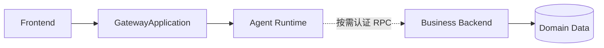
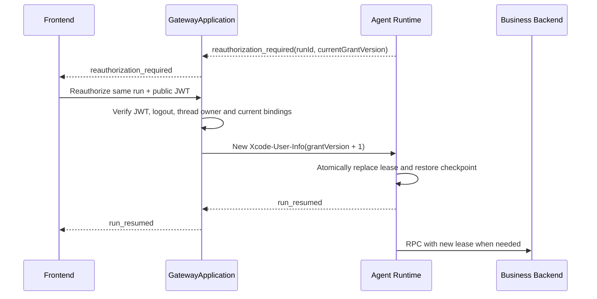
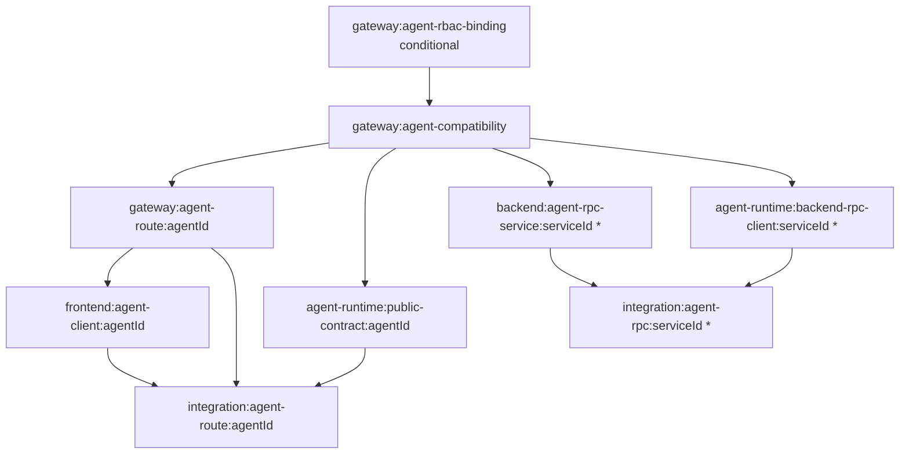

# 生成应用 Gateway：Agent 场景附录

> 本附录只适用于 Frontend + Gateway + Backend + Agent Runtime 的 `gateway_composed` 拓扑；Runtime 直连设计见 [`../topology/agent-runtime-direct/AGENT_RUNTIME_DIRECT_DESIGN.md`](../topology/agent-runtime-direct/AGENT_RUNTIME_DIRECT_DESIGN.md)。

> 状态：主设计的必需附录  
> 适用范围：`gateway_composed` 拓扑。该拓扑固定包含 Agent Runtime，因此本附录对拓扑内应用始终适用，不是可选分支  
> 主文档：[`GENERATED_APPLICATION_GATEWAY_DESIGN.md`](./GENERATED_APPLICATION_GATEWAY_DESIGN.md)

## 1. 固定边界

Gateway 将 Agent Runtime 视为特殊 upstream。它复用公开 Origin、认证、限流、Trace、健康和部署治理，但不承担 Prompt、模型、Memory、Knowledge、Skill 或推理逻辑。

- 前端不能发现或访问 Agent Runtime 内部地址；
- ProductPlan 不决定拓扑；用户选择 `gateway_composed` 后，TechnicalPlan Core 必须能够编译出完整 Business Backend 与 Agent Runtime 服务图；
- TechnicalPlan 服务图选择 `gateway_composed` 时必须同时确认 Backend 和 Agent Runtime；切换拓扑必须重新确认正式技术计划；
- 可信 user/tenant 等身份字段只能由 Gateway 对行内统一认证 JWT 验签、登出校验和 Claim Mapping 后产生；仅当 `auth.enable=true && authorization.enabled=true` 时，Gateway 使用 Agent Authorization Manifest 切片执行固定 Agent RBAC；
- Agent Runtime 不得绕过 `allowedRpcOperationIds`、Backend 数据范围或业务规则；
- Agent 故障不能无条件拖垮普通业务 API；
- 缺少 Agent 时 `gateway_composed` 选择无效；系统必须返回校验错误，不得自动切换到 `backend_direct`，也不得只删除 Agent route 后保留 Gateway；
- 模型不能提供目标 URL，也不能直接访问数据库；
- Backend Agent Facade 不属于支持的架构，任何模板、合同或生成任务都不得创建该组件；
- Backend 不能调用 Agent Runtime，Agent Runtime 只在执行中按需调用 Backend 内部 RPC。
- `agent_stream` 和 `agent_control` 公开 Endpoint 的 owner 必须是 `agent_runtime`；普通业务 Endpoint 和内部 RPC Operation 的 owner 必须是 `business_backend`；Gateway 永远不是 owner。

本附录中的“授权租约/重新授权”表示 Frontend 对同一 Agent run 的限时用户委托，与 Agent RBAC 是两个合同。Gateway 仅在 `auth.enable=true && authorization.enabled=true` 时消费 Authorization Manifest 的 Agent 切片，执行当前用户是否允许访问目标 Agent、用户/Agent 冻结状态和固定准入策略；`allowedRpcOperationIds` 只限制 Runtime 的 RPC 能力边界。普通业务 RBAC 和 Backend 数据权限仍由 Backend 独立处理。

## 2. 总体拓扑



公开 Agent 请求始终从 Gateway 直接进入 Agent Runtime。Backend 只是 Runtime 按需调用的业务能力提供方，不在公开 Agent 调用链中，也不存在从 Backend 指向 Runtime 的调用方向。

若已确认 `gateway_composed` 但正式服务图缺少 Backend 或 Agent Runtime，TechnicalPlan 确认、GatewayPlan 编译、Build Planning 和 Project Launch 全部拒绝继续。系统不得临时改为 Frontend 直连 Runtime、Backend Agent Facade 或 Mock 回退；需要直连时必须通过 Formal Revision 更改拓扑。

## 3. 公开调用契约

- Frontend 只能访问 Gateway 公共 Origin，不能获得 Agent Runtime 的内部地址；
- Gateway 根据正式 Route Contract 将 Agent 路由映射到固定、受信的 Runtime upstream；
- Gateway 本地验证行内统一认证 JWT、查询登出状态，然后完成 Agent Route Contract、请求大小、并发、连接治理和敏感 Header 清理校验；
- 两个授权前置开关同时开启时，Gateway 必须在创建、恢复和控制 run 前按 `agentId + principal` 执行 Agent RBAC，策略依赖不可用时 fail-closed；任一开关关闭时不得调用 Agent RBAC 策略或保留其资源投影；
- Gateway 不向 Runtime 转发统一认证 JWT；它使用部署画像规定的服务身份，为当前 run 首次签发 `XcodeUserInfoToken`，并只在 Frontend 重新授权成功后为同一 run 签发更高 `grantVersion` 的新票据；
- Runtime 自行验证 Gateway 服务身份、`Xcode-User-Info`、Agent binding 和 thread/run owner；
- Backend 不能创建、继续、取消或查询 Agent run，所有这些操作都必须由 Frontend 经 Gateway 调用 Runtime；
- Gateway 和 Runtime 之间的地址、凭据、证书和超时属于运行配置，不进入生成代码或公开前端配置。

## 4. 流式协议处理

- Agent Runtime 是 Agent 协议和事件状态机的唯一 owner；
- Gateway 保持协议透传，不修改事件含义、不重排事件、不合并事件，也不缓存完整响应；
- Gateway 只执行传输层控制，包括 Content-Type 校验、首事件超时、空闲超时、总时长、单事件大小、总字节数、背压和断线处理；
- Runtime 必须输出正式合同声明的 AG-UI/SSE/WebSocket 协议，不能把模型供应商原始事件直接暴露给 Frontend；
- Frontend 断开后，Gateway 按 Route Contract 取消或释放上游连接；需要继续执行的后台 run 必须由 Runtime 明确声明；
- 首事件前失败返回稳定错误模型；流开始后的失败使用协议内错误事件并正常结束，无法编码事件时才关闭连接。

## 5. Agent 场景的 `Xcode-User-Info`

普通 Backend 请求和 Agent 委托共用 `xcode_user_info_jws.v1`；Agent 只在同一 Token 中增加受约束的委托字段，不建立第二套认证协议、RunGrant、Token Exchange 或 Delegation Service。

- Gateway 必须先删除浏览器传入的 `Xcode-User-Info`、`Claw-User-Info`、`X-User-Id`、`user`、`tenant`、`role`、`scope` 和服务身份 Header；
- Gateway 完成统一认证 JWT 本地验签、登出校验、Claim Mapping、Agent Route Contract 和 thread owner 校验后，为每个 run 一次签发 Token；
- Token 使用独立内部非对称签名密钥，不能复用行内统一认证密钥、Runtime 服务 Token 或 mTLS 私钥；
- Gateway 只向 `Xcode-User-Info` 写入 compact JWS；不允许 Base64 JSON，不转发行内统一认证 JWT；
- Runtime 获得 Token 后只能原样转发，不能签发、修改、扩大白名单或续期；
- Runtime 和 Backend 只获得验签公钥，并验证 `kid`、签名、issuer、audience、有效期、application、actor、agentId 和 runId；
- Token 的统一 audience 为当前应用内部服务域，例如 `application-internal-services`；
- Backend 还必须验证源 Token 登出绑定，并确认当前请求实际解析出的 RPC Operation ID 位于 `allowedRpcOperationIds`；不能信任 Runtime 自报的 Operation Header；
- 密钥、证书、Redis 凭据和服务令牌通过 Secret Store 注入，并支持 `kid` 新旧公钥重叠轮换；不得写入 GatewayPlan、Hash、Diff 或日志。

票据示例：

```json
{
  "version": "xcode-user-info.v1",
  "iss": "xcode-generated-gateway",
  "aud": "application-internal-services",
  "applicationId": "app-1",
  "principalType": "user",
  "sub": "user-1",
  "employeeId": "employee-1",
  "sapId": "sap-1",
  "sourceAuth": {
    "provider": "enterprise-unified-auth",
    "subject": "employee-1",
    "tokenDigest": "sha256:...",
    "logoutSubject": "employee-1"
  },
  "actor": "agent-runtime",
  "agentId": "recheck-assistant",
  "threadId": "thread-1",
  "runId": "run-1",
  "grantVersion": 1,
  "allowedRpcOperationIds": ["order.lookup_for_recheck"],
  "iat": 0,
  "exp": 0,
  "jti": "..."
}
```

`sourceAuth.tokenDigest` 是规范化源 JWT 的不可逆 SHA-256 摘要，不包含原 JWT。`allowedRpcOperationIds` 只能由正式 `agent_contracts[].tool_rpc_bindings[]` 和 `internal_rpc_contracts[]` 确定性生成。Frontend、Runtime 和模型都不能提交或扩大该集合。

默认 TTL 和模板硬上限均为 6 小时。该票据是用户委托当前 run 的授权租约，不是登录 Session 或 Refresh Token。Runtime 不能自动续期，也不能主动向 Gateway 换票。

重新授权流程固定为：



规则：

- 首次票据 `grantVersion=1`；后续票据必须绑定同一 `applicationId + agentId + threadId + runId` 并单调递增；
- 只有进入到期前 10 分钟窗口或已经过期后，Frontend 才能经 Gateway 发起重新授权；
- Gateway 必须重新校验统一认证 JWT、登出状态、线程 owner、Agent Route Contract 和当前正式 Tool/RPC binding；
- 新票据重新计算 `allowedRpcOperationIds`，不得沿用已从正式合同移除的 Operation；
- Runtime 只接受同一 run 的更高版本票据并原子替换；不能接受 Frontend 直接提供 Token claims、白名单或版本；
- 票据到期后 Runtime 将 run 切换为 `authorization_paused`，停止模型执行、事件正文输出和新 Backend RPC，只允许取消与重新授权控制；
- 30 分钟宽限期内换票成功则从 checkpoint 恢复；超时则转为 `authorization_expired` 并释放执行资源；
- 用户取消、登出或 run 终止后 Runtime 必须停止使用当前和历史票据。

活跃 Agent 流由 Gateway 每 60 秒复查统一登出状态；Backend RPC 对源登出状态的安全缓存最长 60 秒。发现已登出或检查依赖不可用时均 fail-closed。没有活跃前端连接的 run 仍会在下一次 Backend RPC 被阻止；纯计算结果只能在重新连接并通过 Gateway 身份校验后读取。

授权生命周期事件固定为：

| 事件 | 必需字段 | 语义 |
| --- | --- | --- |
| `reauthorization_required` | `threadId`、`runId`、`currentGrantVersion`、`expiresAt`、`graceExpiresAt` | Runtime 已暂停执行，等待 Frontend 经 Gateway 重新授权 |
| `run_resumed` | `threadId`、`runId`、`grantVersion`、`resumedFromCheckpoint` | 新票据已原子生效，原 run 从 checkpoint 恢复 |
| `authorization_expired` | `threadId`、`runId`、`lastGrantVersion` | 宽限期结束，run 终止并释放资源 |
| `authorization_revoked` | `threadId`、`runId`、`reason` | 检测到登出或身份依赖不可用，run 被取消 |

重新授权 control 请求必须携带 `threadId`、`runId` 和 `expectedGrantVersion`，不得携带内部 Token、claims 或白名单。Gateway 以 `runId + expectedGrantVersion` 作为幂等边界；Runtime 使用 compare-and-set 接受下一版本。重复请求只返回当前授权状态，不再次推进版本。

无登录应用仍使用同一结构，设置 `principalType=anonymous`，省略 `sub`、tenant、session 和 `sourceAuth`。匿名票据只能调用正式标记为匿名且列入 `allowedRpcOperationIds` 的内部 RPC Operation；重新授权时 Gateway 不校验公开 JWT，但必须重新校验匿名 Agent/Operation 资格、thread owner token 和当前正式 binding。

## 6. Agent Runtime 到 Backend RPC

只有 Agent Runtime 执行已声明的 Tool 或业务操作时，才允许直接调用 Backend 内部 RPC。该链路不经过 Gateway，且调用方向不可反转。

- TechnicalPlan 必须通过 `internal_rpc_contracts[]` 逐项声明允许调用的 RPC service、operation、请求/响应 Schema、超时、幂等和错误语义；
- `agent_contracts[].tool_rpc_bindings[]` 是 Tool 到 RPC Operation 的唯一正式映射；内部 RPC 不生成公开 Gateway Route；
- Runtime 只能使用生成的类型化 RPC client 调用 allowlist 中的方法，模型输出不得决定目标地址、service 或 method；
- Runtime 调用时必须携带 Runtime 服务身份、Gateway 一次签发的 `Xcode-User-Info`、`toolCallId`、`traceId` 和 deadline；
- Backend 公共 `XcodeUserInfoAuthenticationFilter` 必须验证 Runtime 服务身份、Token 和源登出绑定，确认当前 Operation ID 在 `allowedRpcOperationIds` 后恢复 Principal，并执行数据范围、普通业务 RBAC和业务规则校验；Gateway 的 Agent RBAC 不能替代 Backend 对具体数据与 RPC 的授权；
- Backend 返回类型化结果或稳定 RPC 错误，Runtime 负责将其转换为 Agent 协议事件；Backend 不得通过回调调用 Runtime；
- 写 RPC 必须携带幂等键，幂等结果由 Backend 持久化；超时或连接中断后的结果未知不得由 Runtime 自动重试非幂等写操作；
- Backend RPC 不得暴露任意数据库查询、脚本执行、任意 URL 访问或通用反射调用能力；
- 未声明 Backend 能力的 Agent 应用不得生成 RPC client、RPC endpoint、凭据或相关依赖。

写 RPC 的业务校验和幂等仍由 Backend 负责。`Xcode-User-Info` 只证明 Runtime 可以代表当前 Principal 尝试调用白名单 RPC Operation，不代表具体业务写入已获批准。

## 7. 状态与恢复归属

| 状态 | 唯一权威 | 约束 |
| --- | --- | --- |
| thread 元数据、Agent 消息 | Agent Runtime | Backend 和 Gateway 不保存可竞争写入的副本 |
| run 状态、checkpoint、pending interaction | Agent Runtime | 取消、恢复和重放均由 Runtime 实现 |
| grantVersion、authorization 状态和到期时间 | Agent Runtime | 只接受 Gateway 为同一 run 签发的更高版本票据；不拥有签发权 |
| Agent 事件日志与恢复游标 | Agent Runtime | Gateway 只透传游标，不持久化事件正文 |
| 领域数据和业务事务 | Backend | Runtime 只能通过已声明 RPC 访问 |
| 业务 RPC 幂等结果 | Backend | 以 `toolCallId` 或正式幂等键去重 |
| 连接句柄、背压和瞬时计数 | Gateway | 只属于当前连接生命周期，不作为业务恢复依据 |
| Agent RBAC 开关与资源策略 | Application Config `authorization.enabled` + Authorization Manifest Agent 切片 | Gateway 只持有确定性投影和有界缓存，不成为角色或策略事实源 |
| 页面展示缓存 | Frontend | 不得作为 thread、run 或业务结果权威 |

Frontend 恢复连接时仍走 Gateway，由 Gateway 把 `threadId`、`runId` 和恢复游标转发给 Runtime。Gateway 重启不得导致 Runtime 中已持久化的 run 丢失。

## 8. 健康与降级

- Gateway 只把 Agent Runtime 作为 Agent route 的直接 upstream 健康依赖；
- required Agent route 的 Runtime 不可用时，Gateway `readiness` 失败；optional Agent route 不可用时，普通业务 API 继续服务，Agent route 返回稳定的不可用错误；
- Runtime 可把 required Backend RPC 依赖纳入自身 readiness，但这不改变 RPC 的单向调用关系；
- 单个可选 Backend RPC 不可用时，只允许对应 Tool 失败或降级，不能伪造业务结果；
- 禁止 Runtime 不可用时回退到 Frontend Mock、Backend 代答或缓存伪造回复；
- 健康检查不得触发 Agent run、模型调用或业务写操作。

## 9. 条件式 Build DAG



星号 Unit 只在已确认 TechnicalPlan 声明 Agent Runtime 需要 Backend RPC 时生成。任何情况下都不得生成 Backend Agent Facade、Backend 到 Runtime client 或 Backend 发起 Agent run 的任务。

`gateway:agent-rbac-binding` 只在 `auth.enable=true && authorization.enabled=true` 时生成；任一开关关闭时该 Unit、Agent 资源键、策略客户端、授权缓存和授权测试全部消失，不能生成空壳或运行时关闭分支。

## 10. Agent Route 测试

- Agent 故障不影响普通业务 API；
- user、tenant、scope 和服务身份不可伪造；
- 两个授权前置开关同时开启时，未授权用户、冻结用户或冻结 Agent 必须在 Gateway 被拒绝；任一开关关闭时构建产物中不得存在 Agent RBAC 资源、策略依赖或缓存；
- 统一认证 JWT 验签、登出校验、Claim Mapping 以及 `Xcode-User-Info` 的 `kid`、签名、issuer、audience、TTL、actor、Agent/run 绑定和 RPC Operation 白名单不可绕过；
- Runtime 修改 Token、扩大 RPC Operation 集合、使用过期 Token 或访问未声明 Operation 时必须失败；
- 客户端伪造 `Xcode-User-Info`、用户登出后新建/恢复 run 或 Runtime 继续调用 Backend 时必须失败；
- 6 小时租约到期后 run 进入 `authorization_paused`，停止模型、事件正文和新 RPC；
- 只有到期前 10 分钟或到期后允许重新授权，同一 run 的 `grantVersion` 必须单调递增；
- 重新授权成功后从 checkpoint 恢复，30 分钟宽限期超时后进入 `authorization_expired`；
- 活跃流和 Backend RPC 的登出撤销延迟不得超过 60 秒；
- 无登录应用只能使用 anonymous `Xcode-User-Info` 调用正式匿名 Endpoint；
- 首事件、空闲、总时长、取消和断线策略；
- 非法或超大事件；
- Runtime 重启与会话恢复；
- Runtime 调用 Backend RPC 时重新授权、超时和幂等；
- Backend 无法调用 Runtime，构建产物中不存在 Backend 到 Runtime client；
- required/optional readiness 和降级；
- 缺少 Agent Runtime 时 `gateway_composed` 拓扑校验失败，不生成或启动 Gateway。
