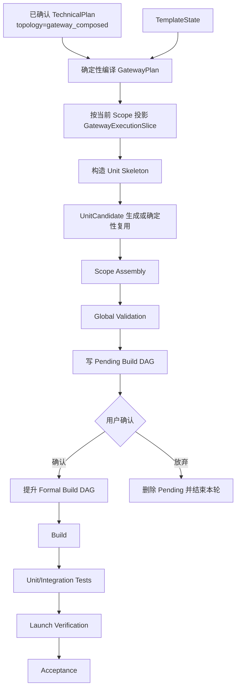
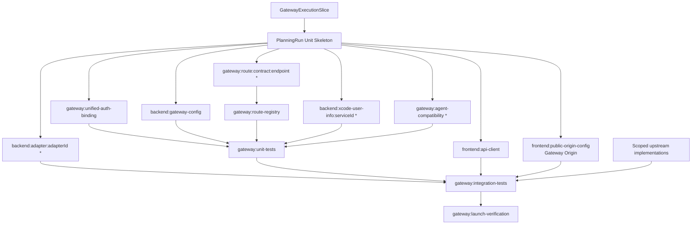

# 生成应用 Gateway 模板、规划与构建

> 本文只适用于 `gateway_composed` 拓扑；统一拓扑框架见 [`../topology/APPLICATION_TOPOLOGY_DESIGN.md`](../topology/APPLICATION_TOPOLOGY_DESIGN.md)。

> 状态：主设计的规范性附录  
> 适用范围：Backend 模板、TemplateState、Bootstrap、GatewayPlan 编译、UnitCandidate、Build DAG、启动门禁  
> 主文档：[`GENERATED_APPLICATION_GATEWAY_DESIGN.md`](./GENERATED_APPLICATION_GATEWAY_DESIGN.md)

## 1. Backend 模块合同

Gateway 源码固定属于 `gateway_composed` 的 Backend 父工程，不存在独立模板仓库或顶层 managed root：

```text
backend/
  pom.xml
  <app>-gateway/
    pom.xml
    src/main/java/<base-package>/gateway/
      GatewayApplication.java
      config/
      routes/
      filters/
      security/
      resilience/
      observability/
      health/
    src/main/resources/
      application.yml
      application-local.yml
    src/test/
  <app>-service/
  <app>-common/
```

规则：

- 目录名和 package 由稳定 application artifactId 确定性派生；
- `GatewayApplication` 是唯一独立启动入口并生成可执行包；
- 子模块版本由 Backend 父工程统一管理；
- Gateway 可以依赖公共合同、安全和观测模块；业务服务不得依赖 Gateway 实现类；
- Gateway 模块不得包含领域实体、Repository 或核心业务 Service；
- Route Registry 只消费平台编译的 Route Contract，不扫描 Controller 自动暴露；
- 地址和密钥只由运行环境注入。

## 2. TemplateState Gateway capability

Gateway 子模块只在用户选择并确认 `gateway_composed` 后的 Backend 模板组合中交付。RequestedConfig 由 PlanningTopologyPolicy 根据已确认拓扑要求 Gateway capability；其他拓扑不请求、不物化该模块。

Template Engine 必须在唯一 OpenAPI/Core/Package Schema 中扩展：

```json
{
  "effective": {
    "capabilities": {
      "gateway": {
        "available": true,
        "modulePath": "backend/<app>-gateway",
        "applicationClass": "<base-package>.gateway.GatewayApplication",
        "protocols": ["http_json", "sse", "file_transfer"],
        "authenticationAdapters": ["enterprise_unified_jwt_v1"],
        "authenticationProfile": {
          "verification": "local_public_key",
          "algorithmProfile": "enterprise_sm2_sm3",
          "logoutCheck": "enterprise_logout_store",
          "claimMapping": "xcode_enterprise_principal_v1"
        },
        "internalIdentityProfile": {
          "format": "xcode_user_info_jws_v1",
          "headerName": "Xcode-User-Info",
          "supportsKeyRotation": true,
          "sourceLogoutBinding": "token_digest",
          "agentLeaseTtlSeconds": 21600,
          "supportsAgentReauthorization": true,
          "agentReauthorizationMode": "frontend_via_gateway",
          "activeStreamLogoutRecheckSeconds": 60
        },
        "policyProfiles": ["standard", "standard_read", "standard_write", "streaming"],
        "features": ["enterprise_unified_auth", "xcode_user_info_jws_v1", "agent_rbac_v1", "rate_limit", "circuit_breaker", "trace_context"]
      }
    }
  }
}
```

该变更必须同步覆盖：

- Template Engine OpenAPI；
- Core TemplateState；
- PackageBuilder；
- ZIP fixture；
- Engine/XCodeAgent contract tests。

XCodeAgent 只校验、读取和冻结能力，不在缺字段时补全。

## 3. Bootstrap readiness

Bootstrap 仍只物化 `frontend/`、`backend/` 和 `.xcodeagent/template-state.json`。Gateway 位于 `backend/` managed root 内，不增加顶层 root。

readiness 检查：

- Gateway capability 存在；
- module path 位于 `backend/` 且对应普通目录；
- Application class、协议和 Profile 合法且无重复；
- `auth.enable=true` 时统一认证验签、登出检查、Claim Mapping 和 `Xcode-User-Info` Profile 完整；
- `authorization.enabled=true` 时 `auth.enable` 必须为 `true`，模板必须声明 `agent_rbac_v1` 和 Agent Authorization Manifest 投影能力；
- `TechnicalPlan.topology.type` 必须为 `gateway_composed`，且正式服务图同时包含 `business_backend` 和 `agent_runtime`；
- TechnicalPlan 选择的协议、认证适配器、Feature 和 Profile 全部被 effective capability 覆盖；
- 直连拓扑不允许物化 Gateway 模块或 Gateway capability slice；
- Build 启动时将 Gateway capability 和 TemplateState revision 冻结进 `template_context`；
- revision 或消费的 capability slice 漂移时阻止 PlanningRun。

## 4. 规划与构建总流程



GatewayPlan 编译和 GatewayExecutionSlice 投影发生在 PlanningRun 之前，不是可执行 Build Task，也不调用模型。

PlanningRun 创建前再次校验用户已确认的拓扑、服务图和 TemplateState capability 一致。该校验失败属于正式产物不一致，不能自动切换拓扑，也不能生成删减 Route 或空壳服务的 Pending Build DAG。

## 5. 模式化生成结果

```text
topology.type = gateway_composed:
  生成 Gateway 应用配置和 policy bindings
  绑定企业统一认证和登出校验 Profile
  绑定 Xcode-User-Info 签发器和验签器
  生成 per-route declaration；业务 Adapter/BFF 只生成在 Backend
  确定性生成 Route Registry
  生成业务 Backend internal-auth adapter
  生成 Gateway tests
  frontend public Origin 指向 Gateway

auth.enable = true AND authorization.enabled = true AND hasAgent:
  生成 Agent RBAC binding、Agent resourceKey、响应式策略客户端和有界授权缓存
  Agent RBAC 只绑定 agent_stream/agent_control route
  策略依赖不可用时 fail-closed

auth.enable = false OR authorization.enabled = false:
  不生成 Agent RBAC Unit、资源键、策略客户端、授权缓存或调试授权配置
  Agent route 仅保留协议、限流、可用性和连接治理

始终:
  同时生成 Backend 和 Agent Runtime 的受信 upstream binding
  复用 frontend:api-client
  生成 launch configuration、integration tests 和 reports
```

行内统一认证 JWT 验签、登出校验、Claim Mapping、`Xcode-User-Info` 签发/验签、Header 清理、Trace、CSRF 和通用限流由企业模板提供固定实现。代码生成器只能连接配置和扩展点，不能重新实现安全 Filter。

## 6. Build DAG



Route Unit 只能写自己的独立 route declaration；共享 registry 由平台串行确定性生成。任何业务 Adapter/BFF 文件都属于 Backend Unit。

## 7. UnitCandidate 合同

| Unit | 类型 | owner 与写入边界 | 冻结输入与复用条件 |
| --- | --- | --- | --- |
| `backend:gateway-config` | deterministic | 平台；Gateway generated config | topology/public-origin/policy hashes、Template capability |
| `gateway:unified-auth-binding` | deterministic | Gateway 统一认证和内部身份配置扩展点 | authenticationProfileHash、internalIdentityProfileHash、auth.enable、Template capability；只写配置引用，不写 Secret 值 |
| `gateway:route:<contractId>:<endpointId>` | deterministic | 当前复合 route 的独立 declaration | Route Contract、Endpoint owner kind、authentication requirement、routeHash；不得包含业务 Adapter/BFF |
| `gateway:route-registry` | deterministic | 平台；唯一 generated registry | Route Contract 集合和 routeHashes |
| `backend:xcode-user-info:<serviceId>` | deterministic | 目标 service 服务身份、`Xcode-User-Info` 验签和可信 Principal 恢复扩展点 | serviceIdentityHash、internalIdentityProfileHash、auth mode、adapter capability |
| `gateway:agent-compatibility` | deterministic | Gateway 到 Agent Runtime 的 route、身份和连接治理 binding | 已确认 Agent Contract、协议、`Xcode-User-Info` Profile、6 小时授权租约、grantVersion、重新授权窗口、源登出绑定、RPC Operation 白名单、session、criticality |
| `gateway:agent-rbac-binding` | deterministic, conditional | Gateway Agent RBAC Filter、资源映射、策略客户端与缓存扩展点 | auth.enable、authorization.enabled、Authorization Manifest Agent 切片、Agent Route/ID、agentAuthorizationHash；仅两个开关同时开启时存在 |
| `backend:adapter:<adapterId>` | deterministic skeleton + model implementation | 对应 `business_backend` Adapter 路径；不得写 Gateway | backend_adapters、已确认 external Operation snapshot、Backend owner、Schema、凭据引用和错误合同 |
| `frontend:api-client` | 复用现有 Unit | 现有 API client owner | API Contract 和复合 Endpoint 身份；不读取 upstream 地址 |
| `frontend:public-origin-config` | deterministic | 唯一前端 public-origin 扩展点 | topology.type、publicOriginHash、部署变量名 |
| `gateway:unit-tests` | model/模板扩展 | Gateway test 目录 | route/config/internal-auth 证据和 required checks |
| `gateway:integration-tests` | model/模板扩展 | Integration test 目录；不得改生产代码 | upstream、公开合同、运行配置 Schema |
| `gateway:launch-verification` | runtime gate | Project Launcher；不写源码 | 构建产物、进程、端口、health/readiness |

所有新 Unit 必须进入现有 Unit Skeleton、UnitGenerationContext、Pending/Formal DAG、Scope Assembly 和 Global Validation。共享 Unit 只贡献本轮增量，不删除其他 Scope 已确认 Task。

普通 Gateway Unit 不读取页面、动作或业务 Endpoint 授权投影。条件式 `gateway:agent-rbac-binding` 是唯一消费 `authorization.enabled` 和 Authorization Manifest Agent 切片的 Gateway Unit；它不拥有角色事实，也不生成普通业务权限 Filter。开关或 Agent 授权切片变化只失效该 Unit、受保护 Agent Route 和对应测试。

GatewayExecutionSlice 为每个 Unit 注入：

- 最小正式 `source_refs`；
- 当前 Unit 的 source slice hashes；
- read/modify/add/test paths；
- required checks；
- owner、dependsOn、reuse/modify/add/skip 条件。

模型不得读取其他 UnitCandidate；跨 Unit 依赖由平台在 Scope Assembly 时编译。所有 Scope 继续共用 application 级 PlanningRun/PendingPlan 互斥域。

## 8. 确定性平台与模型边界

平台或模板负责：

- GatewayPlan、GatewayExecutionSlice、Route Contract、Internal RPC Contract 和 Tool/RPC Binding；
- route identity、method/path/upstream、认证要求和策略引用；
- Route Registry；
- 配置 Schema、错误码、环境变量名、Hash、allowed paths、依赖和 required checks；
- 行内统一认证 JWT 验签、登出校验、Claim Mapping、`Xcode-User-Info` 签发/验签、Header、Trace、CSRF 和限流实现；
- public API 类型来源。
- `gateway_composed` 的四模块完整性、唯一 Gateway Public Edge 和 Frontend Origin；
- `XcodeUserInfoToken` claims、签发器接口、Backend/Runtime 公共 Filter、6 小时 Agent 授权租约、`grantVersion`、Frontend 经 Gateway 重新授权和 Runtime 原样转发边界；

模型只允许：

- 只在 Backend 扩展点实现已确认 Adapter/BFF；
- 在 Agent Runtime 允许写入路径内实现已确认 Agent 流式协议逻辑或无副作用探测；不得在 Gateway 自行实现 Agent 协议语义或身份桥接；
- 连接模板提供的认证、业务安全和观测接口；
- 生成 focused tests；
- 在允许写入路径内最小修改。

模型不得：

- 创建未确认 route/upstream；
- 在 Gateway 中实现外部服务 Client、协议转换、字段转换、聚合或业务 Adapter；
- 改变认证、接口合同、策略或缓存语义；
- 在未决方案之间自行选择；
- 引入动态 URL、通用代理、未批准依赖或兼容分支；
- 修改 Application Config、TechnicalPlan、Endpoint Design 或 Build DAG；
- 修改模板拥有的安全 Filter。
- 解析或转发行内统一认原 JWT、自定义 Claim Mapping、登出检查或签名逻辑；
- 实现第二套 Agent 委托协议、Token Exchange 或 RunGrant Store。

## 9. 执行、复用与修复

- `reuse` 必须提供文件和具体满足事实；
- `modify/add` 必须产生真实 Diff，越界写失败；
- CodeRunner 不安装依赖、不启动服务、不修改正式计划；
- Unit 复用检查自身 source slice、消费的 Template capability slice、策略 Hash 和文件证据；
- 全局 `planSha256` 或无关 TemplateState 字段变化不自动淘汰 Unit；
- 普通重试从首个失败 Unit 继续；
- DAG 重新生成不得重新物化或清空模板；
- Repair 只修改失败 owner/route 的允许写入路径；跨 owner 问题拆成有依赖任务；
- 模型成功声明不构成 Build、Testing 或 Launch 通过。

## 10. 启动门禁

`gateway_composed` 启动顺序：

```text
读取并校验配置
  -> 启动业务 Backend
  -> 等待基础 health
  -> 启动 Agent Runtime
  -> 等待 Runtime health
  -> 启动 GatewayApplication
  -> 校验 route table、统一认证 binding 和 Xcode-User-Info 签名/验签
  -> readiness probes
  -> 启动/展示 Frontend
```

Launch verification 必须读取真实进程和探测结果，不能由生成报告替代。

已确认服务图缺少 Backend 或 Agent Runtime 时，Launcher 必须拒绝启动，不得把 Gateway 当作单服务代理。

## 11. 当前运行切换边界

当前版本不建立：

- active/candidate Gateway 配置；
- 独立候选部署槽；
- 流量原子切换；
- 历史可执行包仓库；
- 自动代码回滚。

Build 仍在当前 Workspace 执行。失败只记录本轮失败，不标记 Acceptance 成功；Project Launcher 只在 required checks 通过后启动或受管重启当前产物。失败修复走现有 Repair/重新 Build，不自动恢复上一份源码或运行包。

若未来需要蓝绿、候选端口或 last-known-good 回滚，必须单独设计部署产物、promotion 和 rollback 合同。

## 12. 实施顺序

1. 冻结 Application、TechnicalPlan、TemplateState 和 Gateway 合同；
2. `gateway_composed` 的 Backend 模板组合提供 Gateway 子模块和安全扩展点；
3. 实现 GatewayPlan/GatewayExecutionSlice 编译与校验；
4. 接入 Unit Skeleton、UnitCandidate、Scope Assembly 和 Pending/Formal DAG；
5. 实现 Route、registry、internal-auth 和 public-origin Unit；
6. 实现 `gateway_composed` 的唯一 Gateway Public Edge、四模块完整性校验、Backend/Agent Runtime 集成测试和 Launch Verification；
7. 接入 Gateway unit/integration tests 与 Launch Verification；
8. 在 Electron 中完成 `gateway_composed` 启动顺序、服务图缺项拒绝、失败和受管重启验收。
