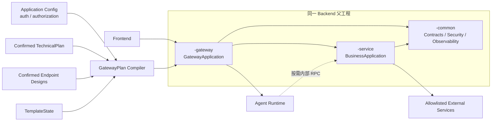
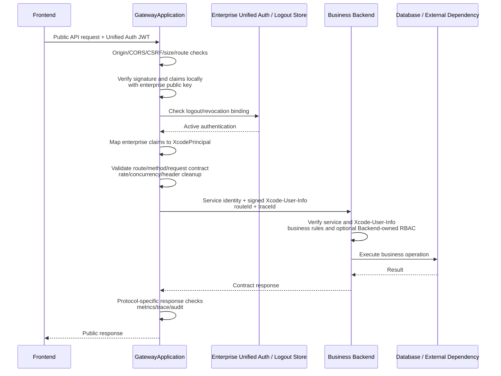
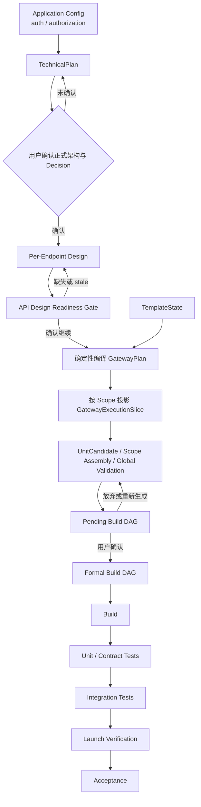
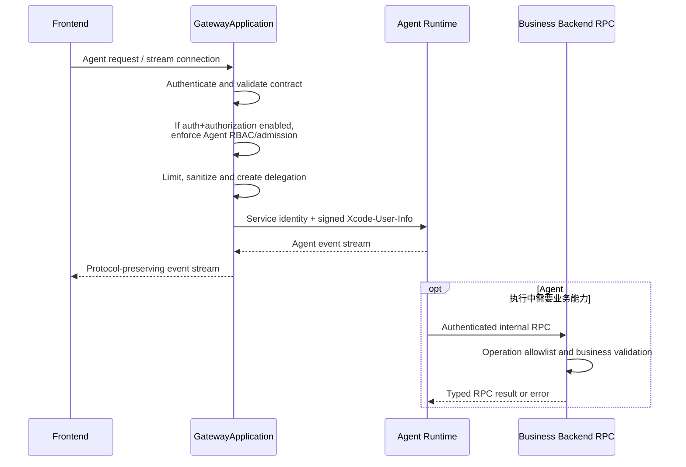

# 生成应用 Gateway 架构设计

> 状态：完整架构设计方案  
> 目标：定义生成应用 Gateway 的职责边界、系统拓扑、业务流程、契约来源、安全模型、构建运行方式和实施路径  
> 适用范围：`gateway_composed` 拓扑，即 Frontend + Gateway + Backend + Agent Runtime 的完整组合

## 1. 设计概述

Gateway 是 `gateway_composed` 拓扑中的统一公开边界，模块名固定为 `<app>-gateway`。只有已确认 `TechnicalPlan.topology.type=gateway_composed` 时才生成该模块，并同时生成 Frontend、Backend 和 Agent Runtime。Gateway 以独立 `GatewayApplication` 进程运行，可与 Backend 同批发布，但不存在嵌入 Backend 进程的模式。

### 1.1 设计目标

- 为页面 API 和 Agent 流式交互提供统一入口，并把外部服务访问固定留在 Backend Adapter；
- 只在完整组合拓扑中生成 Gateway，让拓扑、构建、启动、健康检查和部署行为具有确定性；
- 让正式设计产物、应用配置、生成配置和部署配置各自承担单一职责；
- 通过固定执行器和生成配置完成常规路由，减少生成代码与运行时行为漂移；
- 为本地预览和生产多实例环境提供明确、可切换的安全与限流策略；
- 让架构决策可被生成器、模板校验器、运行时校验器和 CI 自动执行。

### 1.2 非目标

- Gateway 不承载领域业务、事务编排、Agent 推理或长期会话状态；
- Gateway 不提供用户可编辑脚本、动态表达式或任意 URL 代理能力；
- 当前版本不实现历史配置兼容、双写、迁移读取或旧契约回退；
- 当前版本只定义本地开发、预览和独立部署边界，不扩展生产发布平台、灰度和自动回滚系统。

## 2. 总体方案

`gateway_composed` 是 Gateway 的唯一正式拓扑，服务组成固定为 Frontend + Gateway + Backend + Agent Runtime。Frontend 只访问 `GatewayApplication`：公开 Agent Endpoint 路由到 Agent Runtime，公开业务 Endpoint 路由到 Backend；Agent Runtime 仅可按已确认合同调用 Backend 内部 RPC；外部服务只能由 Backend Adapter 调用。

Gateway 是拓扑结果，不是独立应用开关。纯 Agent 应用选择 `agent_runtime_direct`，纯 Backend 应用选择 `backend_direct`；两者都不生成 Gateway 模块、Gateway 配置或 Gateway 进程。本文档不定义 Frontend + Gateway + Backend 或 Frontend + Gateway + Agent Runtime 的半组合形态。

Gateway 是公开入口和流量治理层，不承载领域逻辑、数据访问、业务幂等事实或 Agent 推理。

## 3. 核心架构

### 3.1 源码和进程边界

- Gateway 源码固定属于 `gateway_composed` 的 Backend 父工程；
- 不建立独立 Gateway 模板仓库、技术栈或第四套工程；
- `<app>-gateway` 只由 `gateway_composed` 模板组合提供；其他拓扑不生成空壳模块；
- 启用后，`GatewayApplication` 与业务 Backend 使用不同进程，可独立打包、部署和扩缩容；
- Gateway 可以依赖公共合同、安全和观测模块；业务模块不得依赖 Gateway 实现；
- Gateway 中不得放置领域实体、Repository 或核心业务 Service。
- Gateway 永远不是业务或 Agent Endpoint owner，只投影正式 Endpoint owner 并执行入口治理。

### 3.2 拓扑选择与不变量

- Gateway 是 `TechnicalPlan.topology.type=gateway_composed` 的确定性结果，`.xcodeagent/application.json` 不再保存 `gateway.enabled`；
- `gateway_composed` 必须同时包含且仅包含一个公开 Gateway、至少一个 `business_backend` 和至少一个 `agent_runtime`；Frontend 唯一 Public Origin 必须指向 Gateway；
- Frontend + Gateway + Backend 与 Frontend + Gateway + Agent Runtime 不是可注册拓扑，不允许用 optional service 或空壳模块伪装；
- 纯 Agent 需求匹配 `agent_runtime_direct`；纯 Backend 需求匹配 `backend_direct`；拓扑切换必须走 Formal Revision 并重新确认 TechnicalPlan；
- `auth.enable` 和 `authorization.enabled` 仍由 Application Config 持有，但不决定 Gateway 模块是否存在；
- `gateway_composed` 中 `authorization.enabled=true` 必须同时满足 `auth.enable=true`，用于生成 Gateway Agent RBAC；
- `agent_runtime_direct` 允许 `auth.enable=true` 的多用户认证，但强制 `authorization.enabled=false`；
- `backend_direct` 的领域权限和数据权限归 Backend 所有，不得因普通业务 RBAC 自动插入 Gateway；
- 拓扑 Definition 必须同时在设计、Planning、Build 和 Launch 边界验证上述不变量，任一不满足都 fail-closed。

### 3.3 职责边界

Gateway 负责：

- 稳定公开 Origin；
- 精确路由和路径改写；
- 行内统一认证 JWT 本地验签、登出状态校验与 Endpoint 接口合同校验；
- 可信 `Xcode-User-Info` 内部身份生成；
- CORS、CSRF、Header 清理和请求限制；
- 超时、有限重试、限流、熔断、背压和协议转发；
- `auth.enable=true && authorization.enabled=true` 时，对公开 Agent Endpoint 执行固定的 Agent RBAC/准入治理；
- Trace、指标、审计、健康和启动门禁。

Gateway 不负责：

- 领域业务逻辑和数据访问；
- 普通业务 Endpoint 的角色、页面、动作和资源 RBAC 授权；
- Backend 数据权限、业务规则和业务校验；
- 业务写操作的幂等结果存储；
- 任意 URL 代理；
- Prompt、模型、Memory、Knowledge、Skill 和 Agent 推理；
- 历史合同兼容、旧字段探测或双写。

### 3.4 Endpoint 所有权

| Endpoint/Operation 类型 | 唯一 owner | Gateway 行为 |
| --- | --- | --- |
| 公开业务 Endpoint | `business_backend` | 按 Route Contract 转发，不执行业务转换 |
| 公开 Agent Endpoint | `agent_runtime` | 转发 Agent stream/control，不解释 Agent 业务事件 |
| Agent Tool 对应的内部 RPC Operation | `business_backend` | 不进入 Gateway route table；由 Agent Runtime 单向 RPC 调用 |
| 外部服务 Operation | `external_service` 依赖，调用 owner 为 `business_backend` Adapter | Gateway 不连接外部服务、不持有第三方凭据 |

`services[].kind` 固定为 `business_backend`、`agent_runtime`、`external_service`。Gateway 不进入服务 owner 集合；它只消费 owner 信息生成路由和入口治理配置。

### 3.5 V1 授权边界

Gateway V1 不执行普通业务 Endpoint 的通用 RBAC，但可以对公开 Agent Endpoint 执行固定的 Agent RBAC/准入治理。该能力只在 `auth.enable=true && authorization.enabled=true` 时生成和运行；任一开关为 `false` 时，不生成 Agent 资源键、权限 Filter、策略客户端、授权缓存或调试授权配置，也不能把缺少身份的请求当成已授权请求。

`authorization.enabled` 是 Gateway Agent RBAC 的唯一应用级开关，`auth.enable` 是可恢复可信用户身份的前置开关。`gateway_composed` 中 `authorization.enabled=true` 时必须同时满足 `auth.enable=true`，否则 TechnicalPlan 确认、GatewayPlan 编译、Build Planning 和 Launch 全部 fail-closed。Gateway 只消费 Authorization Manifest 的 Agent 资源与策略切片，不读取页面、动作或普通业务 Endpoint 授权资源。

Agent RBAC 固定覆盖当前 Principal 是否允许访问目标 Agent、用户/Agent 冻结状态和身份相关准入策略。Agent 是否部署可用、协议、请求大小、限流、并发和连接治理属于非 RBAC 入口治理，在存在 Agent route 时仍可独立执行。普通业务 Endpoint RBAC、Backend 数据权限、业务规则和内部 RPC 数据授权继续由 Backend 独立执行。

Agent 的 `allowedRpcOperationIds` 是根据正式 Tool/RPC binding 生成的调用能力白名单，用于限制 Runtime 可调用的内部 Operation；它不是角色或资源授权，必须继续保留。

### 3.6 `gateway_composed` TopologyDefinition 合同

`gateway_composed` 必须通过统一拓扑注册表实现，不得在 Bootstrap、Build 或 Launcher 内分别硬编码一套 Gateway 选择逻辑。

`matches` 必须同时满足：

- 产品事实需要 Frontend；
- 存在至少一个公开业务 Endpoint 或 Backend 业务能力，因而必须生成 `business_backend`；
- 存在至少一个已确认 Agent Contract，因而必须生成 `agent_runtime`；
- Backend 和 Agent Runtime 均有公开 Endpoint 或存在已确认 Tool/RPC binding，需要统一 Public Edge 和跨服务身份委托；
- `authorization.enabled=true` 时 `auth.enable=true`；
- 不存在“纯 Agent、无 Java Backend/Gateway”或“纯 Backend”的已确认约束。

缺少 Backend 或 Agent Runtime 时 `matches=false`；不得因为单独开启认证、业务 RBAC、路径改写或限流就生成半组合 Gateway 拓扑。若多个已注册 Definition 同时匹配，平台必须拒绝静默选择并回到设计澄清。

`compile_design` 固定输出：

- `type=gateway_composed`；
- `public_edge=gateway`；
- Backend 和 Agent Runtime 的稳定 service IDs；
- `authentication_termination=gateway`；
- Frontend -> Gateway -> Backend/Agent Runtime 服务图、Runtime -> Backend 单向 RPC 边和外部服务边界；
- 覆盖拓扑选择输入的 `source_facts_sha256`。

`compile_planning` 固定输出：

- managed roots：`frontend`、`backend`、`agent-runtime`；
- required capabilities：Frontend API/Agent client、Backend service/common/Gateway 模块、Agent Runtime public/internal contract；
- Gateway config、route、registry、internal identity、Agent compatibility 以及条件式 Agent RBAC Unit；
- Backend Adapter/Internal RPC、Runtime RPC client、Frontend public-origin 和集成测试 Unit；
- 复用统一 Pending/Formal Build DAG 的 Unit/Edge Blueprint 和 required checks。

`compile_development` 固定输出：

- Frontend、Backend、Gateway 和 Agent Runtime 的 Generator owner；
- 启动顺序 `Backend -> Agent Runtime -> Gateway -> Frontend`；
- Gateway 是唯一公开探测入口，Backend 和 Runtime 只接受内部身份；
- health/readiness、业务 Route、Agent stream/control、Runtime -> Backend RPC、认证、条件式 Agent RBAC 和 Electron 验收计划。

## 4. 系统架构图



关键点：源码归属和运行进程是两个维度。Gateway 在 `gateway_composed` 的 Backend 工程内，但始终是独立服务；直连拓扑不生成该模块。

## 5. 业务请求流程

下面展示 `gateway_composed` 中一次普通业务请求。直连拓扑的公开边界由各自拓扑文档定义，不是 Gateway 的关闭模式。



固定安全语义：

- 行内统一认证系统是账号、登录、公开 JWT 签发和登出状态的唯一权威；
- Gateway 不保存密码、不实现自有登录/刷新，也不独立签发用户登录 Token；
- 统一认证 JWT 只在公开边界使用，不转发到 Backend 或 Agent Runtime；
- Gateway 将已验证的最小用户上下文签名为 `XcodeUserInfoToken`，通过 `Xcode-User-Info` 内部 Header 传递；
- 服务身份证明“哪个内部服务在调用”，`Xcode-User-Info` 表达“代表哪个 Principal、当前 actor 和允许调用哪些 Endpoint”，二者不能替代；
- Gateway 必须删除客户端伪造的 `Xcode-User-Info`、`Claw-User-Info`、`X-User-Id` 和其他内部身份 Header；
- Backend 必须执行数据范围和业务规则校验；若现有应用启用了 RBAC，则由 Backend 在自身边界独立执行，Gateway 不感知也不参与；
- Backend 是业务写操作和幂等结果的唯一权威。

## 6. 设计、生成与运行流程



必须保持的单向依赖：

```text
正式产物 + TemplateState
  -> GatewayPlan
      -> GatewayExecutionSlice
          -> Build Planning
              -> Build / Test / Launch
```

Build Plan 不能成为 GatewayPlan 输入；模型和客户端都不能修改 GatewayPlan 或 GatewayExecutionSlice。

## 7. 事实源和投影

| 事实 | 唯一权威 |
| --- | --- |
| Gateway 是否存在 | 已确认 `TechnicalPlan.topology.type=gateway_composed` |
| 服务、Endpoint owner、public/upstream path、route kind、criticality | TechnicalPlan |
| 架构 Decision 和选中的策略 Profile | TechnicalPlan |
| Agent Runtime、公开 Agent Endpoint、Tool/RPC binding | TechnicalPlan `services[]`、`api_contracts[]`、`agent_contracts[]` |
| Backend 内部 RPC Operation | TechnicalPlan `internal_rpc_contracts[]` |
| Backend Adapter 与外部服务依赖 | TechnicalPlan `backend_adapters[]`；Operation 细节来自 Endpoint Design |
| 字段映射、外部 Operation snapshot、实现说明 | Endpoint Design |
| 模块路径、Application 入口、协议和可用 Profile | TemplateState |
| Origin/Secret/证书运行值 | 部署环境或 Secret Store |
| 当前 Build Scope、Task 和路径权限 | Formal Build Plan |

只读投影：

- GatewayPlan：完整应用级 Gateway 运行合同；
- GatewayExecutionSlice：当前 Build Scope 的只读切片；
- Route Contract：单个复合 Endpoint 的公开路由合同。

详细字段见[正式合同附录](./GENERATED_APPLICATION_GATEWAY_CONTRACTS.md)。

## 8. 当前版本的运行与发布边界

当前版本明确不建立：

- active/candidate Gateway 配置；
- 独立候选部署槽；
- 流量原子切换；
- 历史可执行包仓库；
- 自动源码或运行包回滚。

Build 在当前 Workspace 执行。失败只记录本轮失败，不标记 Acceptance 成功；Project Launcher 只在 required checks 通过后启动或受管重启当前构建产物。旧进程是否暂时继续运行只是进程现状，不构成零停机或可回滚承诺。

## 9. 技术选型与决策规则

下列方案作为当前版本的确定架构。生成器必须按这些规则产出，运行时和 CI 必须据此校验，不保留并行的模糊实现。

| ID | 确定方案 | 适用规则 |
| --- | --- | --- |
| `GW-CORE-01` | Gateway 只存在于完整组合拓扑 | `TechnicalPlan.topology.type=gateway_composed` 时必须同时生成 Frontend、Gateway、Backend 和 Agent Runtime；缺少任一服务都不允许编译 GatewayPlan；直连应用选择其他拓扑，不生成 Gateway 空壳 |
| `GW-CORE-02` | 固定使用行内统一认证和签名 `Xcode-User-Info` | Gateway 用企业模板适配器本地验证统一认证 JWT 并检查登出状态，再为普通请求或 Agent run 签发同一 `XcodeUserInfoToken`；Backend/Runtime 验签，Runtime 只能原样转发；不转发公开 JWT，不引入第二份用户 Session 或自建登录体系 |
| `GW-CORE-03` | 按部署拓扑切换限流存储 | 单实例本地预览使用进程内限流；多实例或生产部署必须使用 Redis 等共享存储，部署画像不得允许多实例选择内存模式 |
| `GW-CORE-04` | 固定执行器 + 生成只读路由配置 | Gateway 的普通 HTTP、SSE、WebSocket 路由不生成业务代码；协议转换、字段转换、外部适配或聚合代码只能生成在 Backend Adapter/BFF 中 |
| `GW-CORE-05` | 外部 API 固定由 Backend Adapter 接入 | Gateway 不连接外部服务、不持有第三方凭据；需要独立伸缩或故障隔离时把 Adapter 拆为独立 Backend 服务，但公开 Endpoint owner 仍是 Backend |
| `GW-CORE-06` | 页面聚合归属 Backend 页面服务或独立 Backend BFF | Gateway 不执行聚合；默认由 Backend 页面服务承担，需要独立伸缩或多协议复用时建立独立 BFF，二者都属于 Backend owner |
| `GW-CORE-07` | Agent RBAC 由 Gateway 条件式执行 | 仅当 `auth.enable=true && authorization.enabled=true` 时，Gateway 消费 Agent Authorization Manifest 切片并对公开 Agent Endpoint执行用户-Agent访问、冻结与固定准入校验；普通业务 RBAC 和 Backend 数据权限不进入 Gateway |

`GW-CORE-01`～`05` 和 `GW-CORE-07` 是平台和企业模板固定不变量，包括统一认证、条件式 Agent RBAC、`Xcode-User-Info`、Endpoint owner 和外部服务访问边界，不要求低代码用户逐项选择，也不写入 `gateway.decisions`。只有 `GW-CORE-06` 在 Backend 页面服务和独立 Backend BFF 都可满足需求时，才把实际选择写入已确认 TechnicalPlan `gateway.decisions`。GatewayPlan 只做确定性投影，不能成为新的事实源。

`ProductPlan.agents` 非空不再单独推导 Gateway。只有同时需要公开 Backend 和 Agent Runtime 能力时才匹配 `gateway_composed`；纯 Agent 应用必须匹配 `agent_runtime_direct`。ProductPlan、TechnicalPlan、GatewayPlan、Build Planning 和 Project Launch 任一边界发现拓扑与服务图不一致，都必须 fail-closed。

### 9.1 Agent 应用架构

`gateway_composed` 的 Agent 公开调用链固定为 `Frontend -> Gateway -> Agent Runtime`。Backend 不位于 Agent 请求主链路中，也不允许存在 Backend Agent Facade。



固定责任边界：

- Gateway 负责公开认证、Endpoint 接口合同校验、限流、路由、连接治理、Header 清理、Trace 和标准事件流转发；仅在两个授权前置开关同时开启时执行固定 Agent RBAC，不解释 Agent 业务事件，也不执行普通业务 RBAC；
- Agent Runtime 负责 Agent 协议语义、命令校验、线程与运行权限校验、Prompt、模型、Memory、Knowledge、Skill、推理、取消和恢复；
- Gateway 向 Agent Runtime 传递服务身份、一次签发的 `Xcode-User-Info`、`runId` 和 `traceId`，不得转发统一认证 JWT 或客户端可伪造的身份请求头；
- 只有 Agent Runtime 在执行过程中确实需要业务能力时，才允许通过经过认证的内部 RPC 直接调用 Backend；该 RPC 不经过 Gateway；
- Runtime 只能原样转发 `Xcode-User-Info`，不能签发、续期或修改；Backend 同时验证 Runtime 服务身份、Token、源登出绑定和当前 RPC Operation 白名单，再执行业务规则；
- Backend 只暴露明确列入 TechnicalPlan 的内部 RPC 合同，并在每次调用中校验 Operation 白名单、数据范围和业务规则；普通业务 RBAC 与数据权限如已启用，仍由 Backend 独立执行；
- Backend 不得直接或间接调用 Agent Runtime，不得创建 Agent run，也不得向 Runtime 推送任务；所有 Agent run 只能由 Frontend 经 Gateway 发起；
- Agent Runtime 是 thread 元数据、Agent 消息、run 状态、checkpoint、pending interaction 和事件日志的唯一权威；Backend 只拥有领域数据和业务 RPC 的幂等结果；Gateway 只保存连接期临时状态；
- Agent `Xcode-User-Info` 是默认及硬上限均为 6 小时的授权租约，不提供自动刷新；到期后 Runtime 将 run 暂停为 `authorization_paused`，Frontend 必须经 Gateway 重新认证，Gateway 为同一 run 签发更高 `grantVersion` 的新票据后才能恢复；
- 活跃 Agent 流每 60 秒重新检查统一登出状态；Backend RPC 对源登出状态的缓存最长 60 秒。发现登出或校验依赖不可用时 fail-closed，停止流和后续 RPC；
- 页面主流程依赖的 Agent 路由是强依赖，其健康异常使 Gateway `readiness` 失败；非核心 Agent 能力可标记为弱依赖并进入受控降级。

Agent 流式事件、Runtime 到 Backend RPC、状态归属、取消、恢复和故障语义的详细契约见 [Agent 集成附录](./GENERATED_APPLICATION_GATEWAY_AGENT.md)。

## 10. 主要风险与防护机制

| 风险 | 必须具备的门禁 |
| --- | --- |
| TechnicalPlan 缺少 service/upstream/policy 字段 | Schema、模型、Markdown、同步、校验和类型同批升级 |
| 模板声称支持但实际缺少模块或能力 | Engine OpenAPI/Core/Package/fixture 与 XCodeAgent contract tests |
| Route Unit 并发修改共享注册表 | 每 Route 独立文件；平台串行确定性生成 registry |
| 一个 Endpoint 变化触发全量重建 | route/service/public-origin/policy 分片 Hash |
| Gateway 与 Backend 重复认证或幂等事实 | 统一认证系统是公开身份/登出唯一 owner；Gateway 只终止公开认证，Backend 只验证内部身份并拥有业务幂等 |
| SSE/WebSocket 被 JSON Filter 缓冲 | 公共前置链 + 协议专用执行器 |
| 外部 Operation 目录变化偷换正式设计 | Backend Adapter 只消费已确认 Endpoint Design snapshot；Gateway 不直接消费外部 Operation |
| 运行值轮换触发代码重建或泄密 | 合同值与运行值分离；Secret 不进入 Hash/Diff/报告 |
| 6 小时 Agent 票据扩大登出后的暴露窗口 | 活跃流和 Backend RPC 最长 60 秒重新检查源登出状态；Runtime 不得续期；票据到期暂停 run，只允许 Frontend 经 Gateway 重新授权同一 run |
| 半组合服务图被误判为 Gateway 拓扑 | Definition 同时校验 Frontend、Gateway、Backend 和 Agent Runtime；缺少任一项时拒绝编译、Build 和 Launch |
| 把当前进程行为误称为蓝绿或回滚 | 明确当前无 promotion/rollback 合同 |

## 11. 实施阶段

### Phase 0：固化架构契约

- 将 `GW-CORE-01`～`06` 固化为生成器和模板校验规则；
- 固定行内统一认证 Profile、Claim Mapping、登出检查和 `Xcode-User-Info` JWS 合同；
- 建立本地预览与生产部署画像，固定信任、限流和健康检查策略；
- 固定 Application、TechnicalPlan、TemplateState、GatewayPlan、Route 和 ExecutionSlice 合同；
- 固定 `gateway_composed` 四模块不变量、边界矩阵和 current-contract-only 更新范围。
- 固定 `agent_runtime_direct`、`backend_direct` 与 `gateway_composed` 的互斥选择规则，不保留 Gateway 开关或禁用态。

### Phase 1：模板和确定性编译

- `gateway_composed` 模板组合提供 Gateway 子模块和安全扩展点；
- TemplateState 暴露 Gateway capability；
- 实现 GatewayPlan、Route Contract、Hash 和冲突校验；
- 实现 GatewayExecutionSlice。

### Phase 2：Build 集成

- 接入 Unit Skeleton、UnitCandidate、Scope Assembly 和 Pending/Formal DAG；
- 实现 config、route、registry、internal-auth、public-origin Units；
- 接入精确失效和复用。

### Phase 3：运行时闭环

- 完成统一认证本地验签、登出校验、`Xcode-User-Info`、接口合同校验、JSON/SSE/文件、Backend 外部适配和韧性；
- 完成 Frontend -> Gateway -> Backend/Agent Runtime 以及 Backend Adapter -> external 集成；
- 接入 Project Launcher、受管重启、健康和 Electron 验收。

### Phase 4：规模化部署

- 多实例共享限流 Store；
- Backend 权威幂等 Store；
- 服务发现、mTLS、灰度、压测和容量基线；
- 未来如需蓝绿和回滚，另立部署合同。

## 12. 完成定义

- `gateway_composed` 模板组合稳定提供 `<app>-gateway` 和 GatewayApplication；
- `TechnicalPlan.topology.type=gateway_composed` 是 Gateway 存在的唯一事实，Application Config 无 `gateway.enabled`；
- 正式服务图始终同时包含 Frontend、Gateway、Backend 和 Agent Runtime，不能保留任一半组合形态；
- GatewayPlan/Route Contract 由当前正式产物确定性编译；
- 每条 route 解析到唯一、已实现 upstream；
- 所有公开 Agent Endpoint owner 都是 `agent_runtime`，其他公开业务 Endpoint owner 都是 `business_backend`；
- Agent Tool/RPC 只来自正式 Internal RPC Contract，不进入 Gateway route table；
- `auth.enable=true && authorization.enabled=true` 时生成并验证 Agent RBAC；任一开关关闭时不存在 Agent RBAC 产物、运行依赖或缓存；
- 外部服务只由 Backend Adapter 调用，Gateway 配置和进程中不存在第三方 Client 或凭据；
- 前端不包含内部地址或 Secret；
- 统一认证 JWT 验签/登出校验、`Xcode-User-Info`、接口合同校验、Header、Schema 和敏感信息边界通过验证；
- Agent 6 小时授权租约、60 秒登出撤销窗口、到期暂停、重新授权恢复和宽限期终止通过验证；
- 超时、重试、熔断、限流、幂等、缓存和协议策略一致；
- Gateway/Frontend/Backend required checks 全部通过；
- 真实进程完成 health、integration 和故障验证；
- Electron 完成真实页面调用和恢复验收；
- `agent_runtime_direct` 和 `backend_direct` 都不生成 Gateway 模块、业务 route、应用配置、Gateway Origin 或启动项；
- 服务图缺少 Backend 或 Agent Runtime 时，必须切换到直连拓扑并重新确认 TechnicalPlan，不得保留 Gateway。

## 13. 详细设计索引

| 文档 | 详细内容 |
| --- | --- |
| [契约附录](./GENERATED_APPLICATION_GATEWAY_CONTRACTS.md) | 应用配置、TechnicalPlan 决策、GatewayPlan、Route、Hash、鉴权上下文、错误模型和协议契约 |
| [构建与模板附录](./GENERATED_APPLICATION_GATEWAY_BUILD.md) | 模块结构、依赖方向、模板能力、生成器行为、构建方式和测试矩阵 |
| [运行时与运维附录](./GENERATED_APPLICATION_GATEWAY_RUNTIME.md) | 生命周期、端口租约、健康检查、可观测性、容量保护和部署边界 |
| [Agent 集成附录](./GENERATED_APPLICATION_GATEWAY_AGENT.md) | Agent 拓扑、流式事件、状态归属、反向调用、取消恢复和故障语义 |
