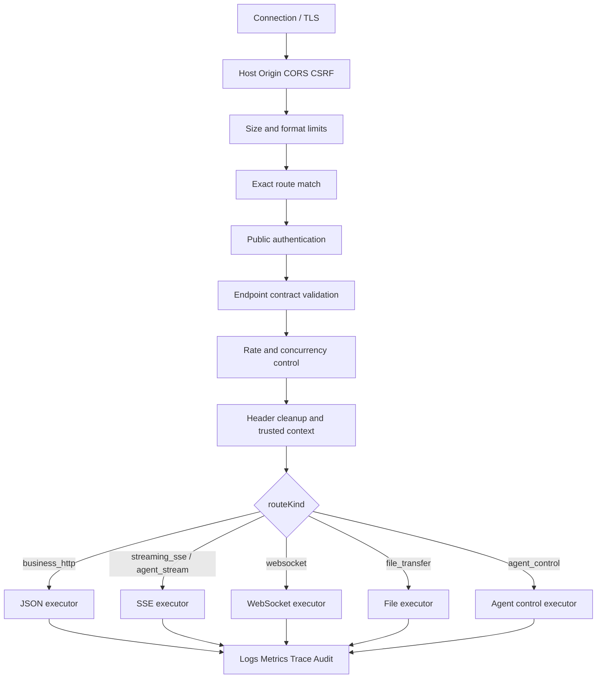

# 生成应用 Gateway 运行时、安全与验证

> 本文只约束 `gateway_composed` 拓扑的运行时。直连拓扑的 Public Edge 和认证终止能力由各自拓扑合同定义。

> 状态：主设计的规范性附录  
> 适用范围：请求处理、认证、内部身份、授权、协议、外部代理、韧性、错误、观测、配置、健康和测试  
> 主文档：[`GENERATED_APPLICATION_GATEWAY_DESIGN.md`](./GENERATED_APPLICATION_GATEWAY_DESIGN.md)

本运行时只消费用户已选择并确认的 `TechnicalPlan.topology.type=gateway_composed`。运行阶段不得根据实际进程、路由数量或服务健康状态重新判断或切换拓扑。

## 1. 运行拓扑

`gateway_composed` 固定运行拓扑：

```text
Frontend
  -> GatewayApplication
      -> Business Backend A
      -> Business Backend B
      -> Agent Runtime

Business Backend / Backend Adapter
  -> Allowlisted External Service
```

Gateway 与业务服务属于同一 Backend 父工程和应用版本，但使用不同进程。前端只知道公开 Origin；业务服务内部 listener 拒绝浏览器凭据和伪造身份 Header。

## 2. 请求处理模型

所有请求先经过公共前置链，再进入协议专用执行器：



禁止为复用 JSON Filter 而缓冲 SSE、WebSocket 或文件流。

## 3. 公开认证

### 3.1 权威和边界

行内统一认证系统是账号、登录、用户公开 JWT 签发和登出状态的唯一权威。生成应用不实现自有账密登录、刷新 Token 或公开 Auth Service。

`gateway_composed` 中：

- Gateway 是公开认证终止点，只接受统一认证适配器声明的公开凭据；
- 浏览器携带的统一认证 JWT 只在 Gateway 公开边界使用，不转发给 Backend、Agent Runtime 或第三方外部服务；
- Gateway 不保存密码、不创建账号、不独立签发用户登录 Token；
- 登录跳转、回调、刷新和登出由行内统一认证适配器与认证中心完成，它们是模板保留路由，不是生成业务 Route Contract；
- TemplateState 不支持行内统一认证 Profile 时，`auth.enable=true` 的 Gateway 方案禁止确认；
- 匿名 route 必须在 TechnicalPlan/GatewayPlan 显式声明，不得因认证组件故障降级为匿名。

Backend 和 Agent Runtime 只启用 Internal Profile：内部 listener 不接受浏览器 Cookie、公开 `Authorization` 或自报身份 Header，只接受受信服务身份和已验签的 `Xcode-User-Info`。部署配置不得同时暴露 Backend 或 Runtime 公开 listener。直连拓扑如何验证公开凭据，由其自身 Public Edge 合同规定。

### 3.2 统一认证校验链

`EnterpriseUnifiedAuthAdapter` 是模板固定能力，不由模型或低代码用户生成。开启认证的请求必须按顺序执行：

1. 删除客户端传入的 `Xcode-User-Info`、`Claw-User-Info`、`X-User-Id` 和其他内部身份 Header；
2. 从适配器允许的唯一位置读取统一认证 JWT，拒绝缺失、多值或格式歧义；
3. 使用认证中心公钥和白名单算法本地验签；
4. 按企业 Profile 校验 `exp`、`nbf`、`iat`、`issuer`、`audience` 和必需 Claims；Profile 不提供的字段必须在模板合同中显式标记，不得在代码中静默忽略；
5. 使用统一认证规定的用户键查询登出/撤销状态，对比时使用规范化 Token 摘要和常量时间比较；
6. 通过固定 Claim Mapping 生成最小化 `XcodePrincipal`；
7. 执行 Endpoint 认证要求、method/path/request contract 校验，然后生成内部 `Xcode-User-Info`。

公钥、Redis 连接和适配器环境标识从部署配置或 Secret Store 注入，不进入 GatewayPlan、Hash、Diff、日志或前端包。统一认证 JWT 带 `kid` 时按白名单公钥集验签；不带 `kid` 的企业 Profile 必须使用受管配置切换和重叠发布完成公钥轮换，不得在请求中接受任意公钥。验签或登出检查所需的必选依赖不可用时必须 fail-closed：凭据无效或已登出返回 401，认证基础设施不可用返回 503，不得当作匿名请求放行。

### 3.3 Claim Mapping

企业模板维护行内 JWT Claims 到 `XcodePrincipal` 的单一映射。基础 Principal 只包含 `userId`、`employeeId`、`sapId`、`enterpriseId` 四个字段；机构路径、虚拟账号实际使用人等扩展信息属于业务或审计上下文，不得扩展基础 Principal。必须明确哪个 Claim 是稳定 `userId`，生成器和模型不得猜测 Claim 名或复制完整 JWT Claims。

## 4. 内部身份

内部调用由两层凭据组成：

1. 服务身份：证明调用方是 Gateway Application 或 Agent Runtime；
2. `Xcode-User-Info`：承载签名的 `XcodeUserInfoToken`，表达 Gateway 已验证的 Principal、来源认证绑定、当前 actor，以及允许调用的公开 Endpoint 或内部 RPC Operation。

当前合同固定使用 `xcode_user_info_jws.v1`，普通 Backend 请求和 Agent 委托共用一套格式：

- Gateway 在外部 JWT 验签和登出检查成功后，使用独立内部非对称密钥签发 `XcodeUserInfoToken`；
- `Xcode-User-Info` 值是带 `kid` 的 compact JWS，不是 Base64 JSON，也不是公开统一认证 JWT；
- 签名私钥只注入 Gateway；Backend 和 Agent Runtime 只获得验签公钥集，并按 `kid` 支持新旧公钥重叠轮换；
- Gateway 必须先删除客户端同名 Header，再写入且只写入一个 `Xcode-User-Info`；
- Runtime 只能在已确认的 Agent -> Backend RPC 中原样转发 Token，不能签发、修改、续期或扩大授权范围；
- Backend 和 Runtime 同时校验服务身份、JWS 签名、`issuer`、`audience`、有效期、`applicationId`、`actor` 和 Endpoint 范围；
- 本地预览使用 loopback 和本轮随机服务 Token 证明调用服务，生产或跨主机部署使用 mTLS；
- 不建立第二份用户 Session、公开 Token 或用户目录事实源。

Token 至少绑定：

```text
version = xcode-user-info.v1
issuer = xcode-generated-gateway
audience = application-internal-services
applicationId
principalType = user | anonymous
userId / employeeId / sapId（按 Claim Mapping 最小化投影）
enterpriseId / organizationId（业务确有需要时）
sourceAuth.provider / sourceAuth.subject
sourceAuth.tokenDigest / sourceAuth.logoutSubject（登录应用）
actor = gateway | agent-runtime
allowedEndpointIds[]（仅 actor=gateway）
allowedRpcOperationIds[]（仅 actor=agent-runtime）
agentId / threadId / runId（仅 Agent 委托）
grantVersion（仅 Agent 委托，从 1 单调递增）
issuedAt / expiresAt
jti / traceId
```

`sourceAuth.tokenDigest` 是规范化统一认证 JWT 的 SHA-256 摘要，只用于把内部身份绑定到登出记录，不得用于还原或转发原 Token。登出检查适配器从统一认证 Store 读取记录后执行同样的规范化和摘要比较。

普通 Gateway -> Backend 请求只允许当前公开业务 Endpoint，使用 `allowedEndpointIds`，Token 默认 TTL 60 秒、硬上限 120 秒。Agent 委托使用 `allowedRpcOperationIds`，其值由正式 `agent_contracts[].tool_rpc_bindings[]` 和 `internal_rpc_contracts[]` 确定性编译，默认 TTL 和硬上限均为 6 小时。两类白名单互斥，Frontend、Runtime 和模型都不能提供或扩大。Backend 必须根据当前实际匹配的公开 Endpoint ID 或内部 RPC Operation ID 校验，不能信任调用方自报的身份 Header。

服务身份和 `Xcode-User-Info` 不能互相替代。Backend 验证二者后恢复内部 Principal，并继续执行普通业务 RBAC、数据范围和业务规则。Gateway 只在 `auth.enable=true && authorization.enabled=true` 时读取 Authorization Manifest 的 Agent 切片并执行 Agent RBAC；它不读取页面、动作或普通业务 Endpoint 策略。`Xcode-User-Info` 只证明可以代表当前 Principal 尝试调用白名单 Endpoint，不代表写操作必然允许。

每个新公开请求和 Agent 启动/恢复/控制请求都必须在 Gateway 重新执行统一登出检查。活跃 Agent 流由 Gateway 每 60 秒重新检查一次，允许按 `sourceAuth` 摘要共享最长 60 秒的安全缓存；发现已登出或检查依赖不可用时，Gateway 向 Runtime 发出取消并终止公开流。Agent Runtime 调用 Backend RPC 时，Backend 安全模块同样依据 `sourceAuth` 检查源 Token，缓存最长 60 秒；已登出或检查依赖不可用均 fail-closed。

当前版本不支持 Runtime 自动续期或 Refresh Token。Agent 票据进入到期前 10 分钟窗口或已经过期后，Frontend 可以通过 Gateway Agent control Endpoint 为同一 `agentId + runId` 发起重新授权。Gateway 重新验证公开 JWT、登出状态、线程权限和当前 Tool/RPC binding，签发更高 `grantVersion` 的新票据并发送给 Runtime。Runtime 只接受同一 run 且版本单调递增的票据，原子替换后从 checkpoint 恢复；不得接受 Frontend 提交的 claims、白名单或版本。

`auth.enable=false` 的匿名 Agent 重新授权不校验公开 JWT 或登出状态，但必须重新校验该 Agent、thread owner token、公开 control Endpoint 和全部 RPC Operation 仍被正式标记为匿名；任何一项不满足都拒绝恢复。

票据到期时 Runtime 必须进入 `authorization_paused`，停止模型执行、事件正文输出和新 Backend RPC，只允许取消与重新授权控制。30 分钟内未完成重新授权则进入 `authorization_expired` 并释放执行资源。用户取消、登出或 run 终止后 Runtime 必须立即停止使用当前和历史票据。

`auth.enable=false` 时仍使用同一 `XcodeUserInfoToken` 结构，但 `principalType=anonymous`，不生成虚构 user/session/sourceAuth。Backend 只允许访问 TechnicalPlan 明确声明为匿名的 Endpoint。

## 5. Header 策略

默认删除：

- 客户端提供的 `Xcode-User-Info`、`Claw-User-Info`、`X-User-Id`、身份、角色、scope、tenant 和其他内部认证 Header；
- 非受信来源的 `Forwarded`、`X-Forwarded-*`；
- upstream Host、公开 `Authorization`、内部 Cookie、内部 Token 和调试 Header；
- Route Contract 未声明的敏感 Header。

Gateway 重新生成可信 Forwarded、trace 和唯一 `Xcode-User-Info`。`Xcode-User-Info` 是内部凭据，不进入 access log、trace attribute、错误 details 或响应。响应返回前删除内部地址、服务版本、框架错误和凭据 Header。

## 6. 业务安全边界

- Gateway 不执行普通业务 Endpoint RBAC；仅在 `auth.enable=true && authorization.enabled=true` 时执行固定 Agent RBAC；
- Agent RBAC 消费当前 Principal、目标 Agent 和 Authorization Manifest Agent 切片，覆盖用户-Agent访问、冻结与身份相关准入，依赖不可用时 fail-closed；
- 任一前置开关关闭时，GatewayPlan、Route Contract、配置和运行链中不得残留 Agent RBAC 资源键、策略客户端或缓存；
- Backend 使用可信身份执行普通业务 RBAC、数据范围和业务规则；Gateway 的 Agent RBAC 不能替代 Backend 授权；
- Agent `allowedRpcOperationIds` 是 Tool/RPC binding 的能力白名单，不是 RBAC；Backend 每次 RPC 都必须校验实际 Operation ID；
- 路由重写不能改变 Endpoint 身份；
- 纯服务任务使用 service identity，不能伪装用户；
- 外部 API 凭据不进入用户身份或前端。

## 7. 协议执行器

### 7.1 JSON HTTP

- 校验请求和响应 Schema；
- 保留 method、状态码和内容类型；
- 限制 Body；
- 大响应使用分页或流式传输；
- 只在完整响应尚未发送时执行 HTTP 错误归一化。

### 7.2 SSE

- 只有明确 `streamingMode=sse` 才允许；
- 禁止响应缓冲和普通 JSON 包装；
- 分别限制连接、首事件、空闲和总时长；
- Route Contract 明确浏览器断开是否取消 upstream；
- 限制事件类型和大小，不记录完整正文；
- 建流后错误使用协议事件或断流语义。
- Agent SSE 在授权票据到期时发送 `reauthorization_required` 后暂停；登出或认证依赖不可用时发送可用的协议内认证错误并终止连接，无法安全编码时直接断流。

### 7.3 WebSocket

- 默认关闭；
- 模板和 TechnicalPlan 都支持时才生成；
- 握手完成认证、Origin、路由和限流校验；
- 连接后限制消息大小、频率、空闲和总连接数；
- 使用明确关闭码，不套用普通 JSON 错误合同。

### 7.4 文件上传下载

- 限制文件数量、单文件/总大小、类型和文件名；
- 文件进入受控临时区或对象存储；
- 需要时执行病毒/内容检查；
- 下载使用受控文件 ID，不接受任意路径或 URL；
- Range、Content-Disposition 和缓存由合同控制。

## 8. Backend 外部服务适配边界

Gateway 不直接访问外部服务，不生成第三方 Client，也不持有 API Key、OAuth Secret 或第三方签名密钥。使用外部数据的公开 Endpoint 仍由 `business_backend` 拥有，Gateway 只把它当作普通 `business_http` 路由。

Backend Adapter 必须遵守：

- Adapter 和外部服务依赖由 TechnicalPlan `backend_adapters[]` 显式声明；
- Base URL 来自 Backend 运行配置，不来自 Frontend、Gateway 或模型输出；
- method/path/query/body 映射来自已确认 Endpoint Design Operation snapshot；
- API Key、OAuth Secret 和签名密钥只注入 Backend Adapter；
- 重定向默认关闭，开启后仍校验目标域名；
- DNS/IP/URL 校验阻止 SSRF；
- 校验外部响应 Schema、大小和内容类型；
- 第三方错误由 Backend 转换为稳定业务错误，Gateway 不识别或重写第三方语义；
- 不可用时返回明确降级，不伪造成功。

外部 Operation 目录变化不会直接改变 Gateway。只有重新确认 Endpoint Design 后，Backend Adapter 和相关业务 Route 才按精确 Hash 失效。

## 9. 超时、重试和隔离

每条 route 通过已确认 Profile 固定：

- 连接超时；
- 响应 Header 超时；
- 响应空闲超时；
- 整体时长；
- 文件和流式专用上限。

客户端不能扩大超时。

重试：

- GET/HEAD/OPTIONS 可有限指数退避；
- PUT/DELETE 只有明确幂等时允许；
- POST/PATCH 默认不重试；
- 部分响应、SSE 已开始或写结果未知时不重试；
- 认证失败、Backend 业务拒绝、Schema 错误、业务冲突和 429 不无条件重试。

隔离：

- 按 upstream service 和关键 route 统计；
- 每个 upstream 限制并发、队列和熔断状态；
- 半开探测必须无副作用；
- 降级只返回正式错误或合同允许的静态只读结果；
- 管理和健康路由使用独立资源预算。

## 10. 限流、幂等和缓存

### 10.1 限流

可组合 application、tenant、user、routeId、service、匿名 IP、并发、RPS、突发和带宽维度。429 返回稳定错误码和安全 `retryAfter`。

Gateway 限流 Store 由 `GW-CORE-03` 决定；它不保存业务幂等结果。

### 10.2 幂等

- 只有 Route Contract 声明幂等的写操作接受 Idempotency Key；
- Key 绑定 user、tenant、routeId 和请求 canonical digest；
- 目标业务 Backend 是提交结果和幂等记录的唯一权威；
- Gateway 只校验格式、绑定可信上下文、透传，并可合并当前进程内尚未完成的相同请求；
- Gateway 不持久化业务成功结果；
- Backend 幂等存储负责 TTL、大小、多实例一致性和敏感响应保护；
- Backend 结果未知时不得伪造成功。

### 10.3 缓存

- 默认关闭；
- 只读公开数据或有明确 user/tenant 隔离键时允许；
- Authorization、Cookie、个性化和写后读一致性必须进入缓存键或禁止缓存；
- 缓存不是业务事实源；
- route/Endpoint 合同变化使相关命名空间失效。

## 11. 错误合同

建流前的普通 HTTP 错误：

```json
{
  "code": "GATEWAY_UPSTREAM_UNAVAILABLE",
  "message": "服务暂时不可用，请稍后重试。",
  "traceId": "...",
  "retryable": true,
  "retryAfter": 3,
  "details": []
}
```

| Code | HTTP |
| --- | --- |
| `GATEWAY_ROUTE_NOT_FOUND` | 404 |
| `GATEWAY_METHOD_NOT_ALLOWED` | 405 |
| `GATEWAY_AUTH_REQUIRED` | 401 |
| `GATEWAY_AUTH_TOKEN_INVALID` | 401 |
| `GATEWAY_AUTH_TOKEN_EXPIRED` | 401 |
| `GATEWAY_AUTH_TOKEN_REVOKED` | 401 |
| `GATEWAY_AUTH_PROVIDER_UNAVAILABLE` | 503 |
| `GATEWAY_FORBIDDEN` | 403 |
| `GATEWAY_REQUEST_INVALID` | 422 |
| `GATEWAY_PAYLOAD_TOO_LARGE` | 413 |
| `GATEWAY_RATE_LIMITED` | 429 |
| `GATEWAY_IDEMPOTENCY_CONFLICT` | 409 |
| `GATEWAY_UPSTREAM_TIMEOUT` | 504 |
| `GATEWAY_UPSTREAM_UNAVAILABLE` | 503 |
| `GATEWAY_UPSTREAM_PROTOCOL_ERROR` | 502 |
| `GATEWAY_INTERNAL_ERROR` | 500 |

公开错误不包含异常栈、内部 URL/端口、SQL、凭据、宿主路径或第三方敏感响应。

## 12. 可观测性和审计

- 接受或生成 traceId，传播标准 Trace Context；
- 客户端不能覆盖内部 span/identity；
- 记录 route/service 请求量、成功率、状态码、P50/P95/P99、连接/首字节、排队、拒绝、限流、重试、熔断、流式连接和大小分布；
- 日志记录 routeId、method、模板化 path、状态、耗时、大小和 traceId；
- 默认不记录 Body、Token、Cookie、Secret 和完整 Query；
- user/tenant 使用受控审计标识；
- 入口安全策略拒绝、Backend 返回的业务拒绝、配置变化、路由发布、凭据失败和管理操作进入安全审计；
- 字段有长度上限并防止换行注入。

## 13. 配置与密钥

- 非敏感配置来自生成应用配置和部署环境；
- Secret 通过环境变量或 Secret Store 注入；
- 统一认证中心公钥、登出 Store 连接、环境标识和 Claim Mapping Profile 由企业模板声明引用，不由生成应用用户填写；
- `Xcode-User-Info` 签名私钥只注入 Gateway，验签公钥集注入 Backend 和 Agent Runtime；`kid` 轮换期间必须允许新旧公钥重叠；
- `.env.example` 只保留名称和无密钥占位；
- Secret、证书私钥和 Token 不进入 Git、Diff、日志或前端包；
- 缺少 required secret 时 fail-closed；
- Gateway public/upstream Origin 与 Backend external Origin 使用不同配置类型；Gateway 配置不得引用第三方 Origin；
- 热更新只有模板支持且可原子校验时开启，否则受管重启；
- Secret/Origin 值轮换不重编译代码，只执行配置校验、重启和健康检查。

## 14. 健康语义

- Liveness：进程和事件循环存活，不同步调用所有 upstream；
- Readiness：配置、route table 和必要本地依赖可用；
- Integration：按 service 执行无副作用探测；
- Production readiness：构建、测试、安全和用户验收证据。

统一认证公钥、Claim Mapping、`Xcode-User-Info` 签名器或验签器配置无效时，`auth.enable=true` 的 Gateway 不得 ready。运行中登出 Store 短暂不可用时 Gateway 进程保持存活，但所有需认证路由 fail-closed 并返回 503，Integration/Production readiness 失败；不得因此放行匿名请求。

required upstream 不可用时不能把整体预览标记成功。部分预览由 TechnicalPlan Route `criticality` 决定，GatewayPlan 只投影。

`gateway_composed` readiness 必须同时验证 GatewayApplication、全部 required Backend upstream 和 Agent Runtime upstream。服务图缺少 Backend/Runtime、Frontend Origin 绕过 Gateway 或内部 listener 对浏览器暴露时，不得把应用标记为 ready。

## 15. 验证矩阵

静态验证：

- 每个前端 Endpoint 解析到唯一 public route；
- route 与 TechnicalPlan 一致；
- Agent route owner 必须是 `agent_runtime`，其他公开业务 route owner 必须是 `business_backend`；
- `external_service` 不能成为公开 route owner 或 Gateway upstream；
- Internal RPC Operation 不能进入 Gateway route table；
- 无通用通配、动态 URL、硬编码 Secret 或内部地址；
- `topology.type=gateway_composed`，服务图同时存在 Backend 和 Agent Runtime；
- `auth.enable` 与 Application Config 一致；Gateway 精确投影 `authorization.enabled`，且只消费 Authorization Manifest Agent 切片；
- `authorization.enabled=true` 的 Agent 应用必须同时满足 `auth.enable=true` 和模板 `agent_rbac_v1` capability；
- `auth.enable=true` 时只启用模板声明的行内统一认证 Profile 和 Claim Mapping；
- 写操作无只读重试/缓存；
- 各协议使用正确执行器；
- Header 和错误清理存在；
- Frontend 只包含 Gateway Public Origin，Backend 和 Agent Runtime 内部地址未进入 Frontend；
- Backend 和 Agent Runtime 只启用 Internal Profile，不存在对浏览器的公开 listener；

合同测试：

- 路由优先级、参数和路径改写；
- Schema；
- CORS、CSRF、统一认证 JWT 签名/时间/Claims、登出状态和伪造 Header；
- Gateway 公开认证、接口合同校验与 Backend 可信 Principal 恢复；
- Agent Authorization Manifest 切片只允许改变 `agentAuthorizationHash`、受保护 Agent Route、RBAC binding 和对应测试；
- 任一授权前置开关关闭时构建与运行产物中不存在 Agent RBAC Filter、资源键、策略客户端或缓存；
- `Xcode-User-Info` 私钥/公钥分离、`kid` 轮换、签名、issuer、audience、TTL、actor、源 Token 摘要，以及普通请求 Endpoint/Agent 委托 RPC Operation 白名单；
- Agent `grantVersion` 单调递增、6 小时到期、10 分钟重新授权窗口、30 分钟宽限期和同一 run 恢复；
- 客户端伪造或多值 `Xcode-User-Info`、Runtime 篡改 Token、扩大 RPC Operation 集合、使用过期 Token 和访问未声明 Operation 时均被拒绝；
- 登出后的源 JWT 不能继续创建内部身份，已启动 Agent 的 Backend RPC 也必须 fail-closed；
- 活跃 Agent 流和 Backend RPC 的登出撤销延迟不超过 60 秒；认证依赖不可用时不得继续执行或输出业务事件；
- `auth.enable=false` 时 anonymous `Xcode-User-Info` 只能访问正式匿名 Endpoint；
- 超时、重试、熔断、限流和幂等；
- Backend Adapter allowlist、重定向和 SSRF；
- 错误脱敏和 trace；
- 流式、WebSocket、文件大小与断连。

集成测试：

- `gateway_composed`：Frontend -> Gateway -> Backend/Agent Runtime；
- 缺少 Backend 或 Agent Runtime、Frontend 直连内部服务、或伪造半组合拓扑均被拒绝；
- 行内统一认证的有效、过期、篡改、已登出 JWT，匿名和跨 tenant/user 拒绝；
- 公开 JWT 不进入 Backend/Runtime，两者只接受受信内部身份；
- 慢 upstream、断开、非法 Schema、部分响应；
- Gateway/Backend 重启、配置错误和端口冲突；
- 单个 service 熔断时其他 route 可用；
- Backend Adapter 调用外部 API 时的超时、限流、凭据失败和错误脱敏；
- Electron 真实页面、网络和恢复。
