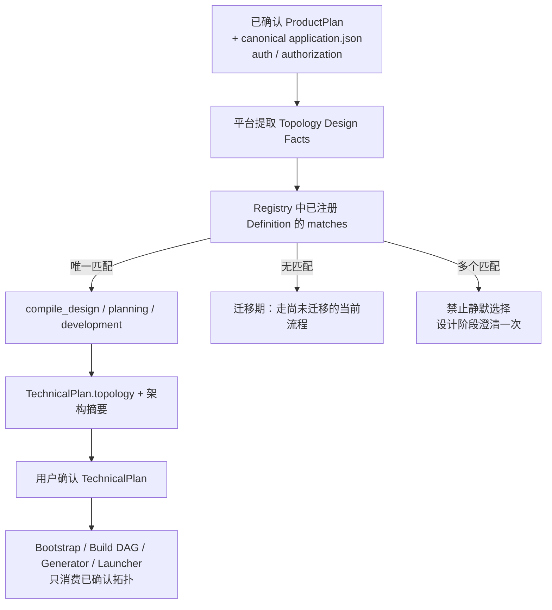

# 生成应用拓扑重构 · 组内评审版

> **文档性质**：评审汇报材料，**非规范性文档**。任何实现口径以同目录 `APPLICATION_TOPOLOGY_DESIGN.md`、`TOPOLOGY_IMPLEMENTATION_TEMPLATE.md` 及各拓扑独立设计为准。
> **存放说明**：本文独立存放，不进入 `README.md` 导航与 `CODEBASE_INDEX.md`，以免与规范性文档混用；评审形成结论后再决定是否归档或吸收。
> **评审主题**：把「Gateway 是一个开关」改成「生成应用拓扑三选一」。
> **一句话结论**：拓扑是设计事实，不是运行开关；同一个应用只属于一套拓扑，拓扑身份由平台确定并写入 `TechnicalPlan`。

---

## 0. 一页纸：今天需要拍板的事

| # | 议题 | 建议结论 | 影响面 |
| --- | --- | --- | --- |
| **D1** | 拓扑集合定几套 | 定为三套：`agent_runtime_direct`、`backend_direct`、`gateway_composed`，不预留第四套 | 决定 Registry 与所有下游分支形态 |
| **D2** | 拓扑身份存在哪里 | 存 `TechnicalPlan.topology.type`；`application.json` **不新增任何拓扑开关** | 决定"唯一事实源"是否成立 |
| **D3** | 迁移顺序 | `agent_runtime_direct`（已在工作树接入）→ `backend_direct` → `gateway_composed` | 决定下午之后谁先开工 |
| **D4** | 是否接受"不存在半组合拓扑" | 接受：不做「Frontend + Gateway + Backend」或「Frontend + Gateway + Runtime」 | 决定 Gateway 的能力边界 |
| **D5** | 命名统一 | 把现有 `gatewayEndpointId` 改名为"Backend Agent 入口"，与新的 Gateway 概念区分 | 决定文档与代码的歧义是否消除 |
| **D6** | 存量已生成应用怎么办 | 按 current-contract-only：**不迁移**，只保证新合同唯一 | 决定是否要写兼容层（建议：不写） |

> 其中 **D1 / D2 / D4 是阻塞项**——不定这三条，后面全是返工。

---

## 1. 为什么要改：旧设计的三个硬伤

### 硬伤一：一个布尔开关，表达不了"谁终止认证、谁是公开入口"

旧设计里，`.xcodeagent/application.json` 的 `gateway.enabled` 决定一切。但"是否启用网关"背后其实是一组**结构性事实**：

- 这个应用有没有 Java 业务后端？
- 浏览器请求的公开入口是谁？
- 用户身份在哪里被验证和终止？
- Agent Runtime 在不在链路上？

一个 `true / false` 表达不了这组差异。于是旧文档只能靠"关闭模式的补充规则"去描述关闭态——写了一大段"关闭时只允许唯一公开 Backend、`path == upstream_path`、禁止多公开 Backend……"，这些规则本身没错，但它们是在**用约束去修补一个表达力不足的模型**。

### 硬伤二：半组合状态在旧设计里说不清

把开关关掉之后，剩下的形态其实有很多种可能，旧模型只能笼统叫"受限 Backend 直连模式"。反过来，如果应用**既有 Java 后端又想要 Agent 能力**，旧设计只能用"必须启用 Gateway"一刀切，没有讨论余地。

结果是：拓扑的真实自由度（有没有后端 / 有没有 Agent / 谁做公开入口）和模型能表达的自由度（开 / 关）对不上。

### 硬伤三：同一事实存在两个地方，迟早打架

旧设计里，`application.json` 持有 `gateway.enabled`，`TechnicalPlan` 又描述服务归属和部署拓扑，同时规定"TechnicalPlan 不能覆盖开关"。

这意味着**同一件事有两个事实源**，而且被明确规定成"一个只能听另一个的"。只要有人只改了其中一边，就会产出"配置说没网关、服务图里有网关"这类不一致产物。旧文档为此专门设计了"开关变更必须走 Formal Revision 并在确认边界原子提交"的流程——流程本身合理，但这套复杂度是**为了弥补事实源分裂**而付出的代价。

### 一个具体场景，说明旧模型为什么别扭

> 某应用最初只有 Agent 对话能力，后来业务要加"订单管理"这个 Java 后端模块。
>
> - **旧模型**：因为原来含 Agent，`gateway.enabled` 被强制为 `true`；现在要加后端，只能去走"关闭 Gateway"的 Formal Revision，但同时必须先删掉所有 Agent…… 也就是说，**"加一个后端"这件事，被迫表达成"先关网关、删掉 Agent"，再重新设计**。
> - **新模型**：应用的服务图从「Frontend + Runtime」变成「Frontend + Gateway + Backend + Runtime」，拓扑从 `agent_runtime_direct` 切到 `gateway_composed`，重新确认 `TechnicalPlan` 即可。业务动作是"拓扑升级"，不是"关开关"。

---

## 2. 新方案：拓扑是设计事实，不是运行开关

新模型只有一句话：**拓扑描述"这个应用由哪些服务组成、公开入口是谁、认证在哪终止"，由平台根据已确认产品事实自动匹配，写入 `TechnicalPlan`。**

拓扑变化 = 服务图变化 = 必须重新确认技术计划。它不是配置项，因此不放在 `application.json`。

关键点：**下游不再有机会自己猜拓扑**。过去 Bootstrap 看目录、Build 看 Agent 数量、Launcher 看某个开关，现在只有一条路——读已确认的 `topology.type`。

---

## 3. 三套拓扑是什么（人话版）

| 拓扑 | 服务组成 | 公开入口 | 认证终止点 | 什么时候用它 | 硬约束 |
| --- | --- | --- | --- | --- | --- |
| `agent_runtime_direct` | Frontend + Agent Runtime | Agent Runtime | Agent Runtime | 应用能力基本由 Agent 对话完成，不需要 Java 业务后端、实体 CRUD、业务数据库事务 | `authorization.enabled` **必须为 false**；`auth.enable` 可选 true/false |
| `backend_direct` | Frontend + Backend | Backend | Backend | 纯业务系统，没有 Agent 能力 | 不生成 Agent Runtime 和 Gateway；业务 RBAC / 数据权限由 Backend 负责 |
| `gateway_composed` | Frontend + **Gateway** + Backend + Agent Runtime | Gateway | Gateway | 既需要公开业务后端，又需要 Agent 能力，需要统一入口和跨服务身份委托 | 四模块**缺一不可**；`authorization.enabled=true` 时 `auth.enable` 必须为 true |

### 为什么 `gateway_composed` 是"四模块缺一不可"

这是评审最需要理解的一条。Gateway 的价值来自"**统一入口 + 跨服务身份治理**"——它要把公开请求分流到 Backend 或 Agent Runtime，并把外部身份换成内部票据。

如果只有单一 upstream，Gateway 就退化成一个纯粹的多一跳代理，没有任何收益，反而多了一个进程、一套配置和一条故障链。所以新设计的立场是：

> **不为单一 upstream 独立开启 Gateway。** 旧模型里的"关闭模式"其实就是"没有 Gateway 的直连形态"，在新模型里它就该是另一个拓扑（`backend_direct` 或 `agent_runtime_direct`），而不是同一个拓扑的开关状态。

---

## 4. 三条不能破的规则

### 规则一：拓扑不是开关

`application.json` 继续只拥有 `auth.enable`、`authorization.enabled` 等**应用级能力配置**，不新增 `topology.type`、`backend.enabled`、`gateway.enabled`。

> 理由：能力可以变，拓扑不能"半变"。能力配置必须**满足**已选拓扑的不变量，但不能**反向伪造**或部分启用某个拓扑。

### 规则二：不存在半组合拓扑

不支持「Frontend + Gateway + Backend」和「Frontend + Gateway + Agent Runtime」。任何缺项都不叫"配置少了一个"，而是**拓扑候选整体无效**，必须改选匹配的拓扑并重新确认 `TechnicalPlan`。

### 规则三：Registry 是唯一可执行入口

每套拓扑必须在唯一的注册表里绑定一个 `TopologyDefinition`，实现四个明确职责：

| 阶段 | 职责 | 不允许做的事 |
| --- | --- | --- |
| `matches` | 只读正式候选事实，判断是否满足拓扑不变量 | 不读目录、不数 Agent、不看开关 |
| `compile_design` | 输出服务边界、公开入口、认证终止点、架构摘要 | 不决定端口、PID、Build Task |
| `compile_planning` | 输出 managed roots、Unit/Edge 蓝图、模板能力、required checks | 不建第二套 DAG |
| `compile_development` | 输出 Generator owner、启动顺序、验收检查 | 不建第二套 Workflow |

配套硬边界：

- **设计未审核，不得注册实现**（只能预留枚举）；
- 多个 Definition 同时匹配 → **拒绝静默选择**，回设计阶段澄清；
- 已确认拓扑的事实发生漂移 → **fail-closed**；
- 每迁移一套拓扑，必须**同步删除旧路径里的结构推断**，不允许两套判据并存。

---

## 5. 新旧对照

| 维度 | 旧设计 | 新设计 |
| --- | --- | --- |
| 拓扑表达方式 | `.xcodeagent/application.json` 的 `gateway.enabled` 布尔开关 | `TechnicalPlan.topology.type` 枚举，三选一 |
| Gateway 存在性 | 由开关决定 | 由拓扑决定（`gateway_composed` 的固定组成） |
| 含 Agent 的应用 | **必须**启用 Gateway | 纯 Agent → `agent_runtime_direct`；Backend + Agent 并存 → `gateway_composed` |
| 关闭态 | 同一拓扑的第二种状态，需要单独一套规则与 Unit | **不存在**。它是另一种拓扑 |
| 半组合形态 | 关闭态隐含多种可能 | 明确不支持，候选整体无效 |
| 下游如何知道拓扑 | 各自读开关 / 看目录推断 | 只读已确认 `topology.type`，Registry 是唯一入口 |
| 事实源数量 | 两个（配置 + 技术计划），且规定主从 | 一个（技术计划） |
| 迁移方式 | 走 Formal Revision 切换开关 | 走 Formal Revision 切换拓扑并重新确认技术计划 |

---

## 6. 落地现状（截至评审当日）

| 拓扑 | 设计 | 注册 | 主流程接入 | 说明 |
| --- | --- | --- | --- | --- |
| `agent_runtime_direct` | 已确认 | **已注册** | **已接入工作树，待聚焦验证** | `TopologyType` 有枚举；Registry 精确注册 1 个；TechnicalPlan 投影、Bootstrap 能力/managed root 编译已接入；Build Unit Skeleton、Frontend/Agent 生成合同、Project Launcher、Runtime 启动支持已在当前工作树接入 |
| `backend_direct` | 目标形态已确定 | 未注册 | 未接入 | 尚无独立设计文档，无枚举 |
| `gateway_composed` | 组合设计已固定 | 未注册 | 未接入 | 设计文档齐全（`docs/gateway/` 五篇），尚无枚举 |

可以对外说的准确表述是：

> **框架已建成，首套拓扑（Agent Runtime 直连）已接入工作树、待聚焦验证；另两套拓扑只有设计、尚未注册。**

不能说的表述（已在本轮文档中修正）：~~"Registry 为空"~~、~~"agent_runtime_direct 未注册"~~、~~"拓扑框架只是空壳"~~。

### 已经就位的能力

- 统一枚举、不可变三阶段蓝图、Definition 协议、受审核门禁的 Registry、确定性 Compiler；
- TechnicalPlan 设计阶段自动匹配 + 拓扑投影；事实漂移 fail-closed；
- Bootstrap 的 RequestedConfig 与 managed roots 消费 Planning 蓝图；
- 针对唯一匹配 / 无匹配 / 多匹配 / 未注册编译 / 已确认漂移的回归测试。

### 尚未完成

- `backend_direct`、`gateway_composed` 的 Definition 设计与注册；
- Runtime 模板对公开 Auth / 匿名会话的实际支持（`agent_runtime_direct` 设计文档已明确"设计确认 ≠ 模板已支持"）；
- 存量结构推断的清理（见第 9 节）。

---

## 7. 迁移路线

| 阶段 | 内容 | 出口条件 |
| --- | --- | --- |
| **Phase 0（已完成）** | 搭框架：枚举、蓝图、Definition 协议、Registry、Compiler；三套拓扑设计定稿 | 设计经用户确认 |
| **Phase 1（进行中）** | `agent_runtime_direct` 端到端打通：模板 Public Edge / Auth、Bootstrap、Build DAG、Generator、Launcher、Acceptance | 聚焦验证证据完整；删掉该路径的旧结构推断 |
| **Phase 2** | `backend_direct` 独立设计 → 审核 → 注册 | 最简单的一套，用来验证"第二套拓扑接入"这条路是否顺畅 |
| **Phase 3** | `gateway_composed` 注册（设计已在 `docs/gateway/`） | 四模块完整性校验、启动顺序、缺项拒绝全部有测试 |
| **Phase 4** | 删除旧路径：`gatewayEndpointId` 相关推断、`bootstrap_managed_roots` 旧分支 | 全仓库只剩 Registry 一条拓扑判定路径 |

> 迁移期允许"没有已注册拓扑满足时继续走当前流程"，但**这条桥必须显式标注**，不能悄悄和新路径并列存在。

---

## 8. 评审决策点（需要结论）

### D1 拓扑集合是否定为三套？
- **背景**：三套是否覆盖了所有真实形态？会不会出现"有后端 + 有 Agent，但不想引入 Gateway"的需求？
- **建议**：先定三套。若真出现上述需求，它是一个**新拓扑**（需要独立设计 + 审核），而不是给 `gateway_composed` 加开关。
- **风险**：如果团队认为"Backend + Agent 直连"是常见需求，需要在评审当场确认是否排进 Phase 2。

### D2 拓扑身份的存储位置？
- **建议**：`TechnicalPlan.topology.type` 唯一持有；`application.json` 不新增开关。
- **这是整个重构的地基**，如果这里保留双写或别名，第 1 节讲的三条硬伤会原样回来。

### D3 迁移顺序？
- **建议**：`agent_runtime_direct` → `backend_direct` → `gateway_composed`。
- **理由**：`backend_direct` 结构最简单，先拿它验证"第二套拓扑接入"的通用流程，再上最复杂的四模块组合，风险最低。

### D4 是否接受"不存在半组合拓扑"？
- **建议**：接受。
- **代价**：某些"只想加一层代理"的场景会被拒绝。这是**有意为之**，需要在评审时让所有相关方知晓。

### D5 命名统一
- **背景**：现在"Gateway"有两个含义——
  - 旧代码里的 `gatewayEndpointId`：指 **Backend 内部的 Agent 入口 Endpoint**；
  - 新设计里的 Gateway：指 **独立运行的流量治理进程**。
- **建议**：把前者改名为"Backend Agent 入口 / Agent Entry Endpoint"，并在文档中给旧概念加限定语。**同名不同义比术语陈旧更容易致错。**

### D6 存量已生成应用怎么办？
- **建议**：按项目既定的 current-contract-only 规则，**不做历史迁移、不保留兼容分支**。新产物只走新合同。

---

## 9. 风险与未决问题

| # | 风险 / 未决 | 说明 | 建议处置 |
| --- | --- | --- | --- |
| R1 | 同一事实仍有两套结构推断 | `project_plan.py` 里旧的 `_agent_runtime_direct_candidate()` 与新的 `resolve_registered_topology()` 并存，判据不完全相同，可能"按 Direct 放行合同、拓扑却没投影出来" | Phase 1 出口前一并删除旧推断 |
| R2 | 下游用字符串硬编码判拓扑 | `project_plan.py`、`build_unit_skeleton.py`、`project_launcher.py` 中均有 `== "agent_runtime_direct"` 直接比较，绕过 Registry。注册第二套拓扑时可能静默走错分支 | 收敛为统一的 `topology_type_from_plan()` |
| R3 | 迁移桥未标注 | `bootstrap_managed_roots` 仍保留按 `agent_contracts` 推断 roots 的旧分支 | 显式注释为过渡桥，Phase 4 删除 |
| R4 | Runtime 模板能力未验证 | `agent_runtime_direct` 的公开 Auth / 匿名会话依赖 Runtime 模板能力，设计文档已声明"设计确认 ≠ 已支持" | 作为 Phase 1 的独立验收项，不以设计替代验证 |
| R5 | 文档冗余字段 | GatewayPlan 中 `topologyType` / `exposureMode` / `sourceLayout` / `runtimeTopology` 四个字段表达同一件事 | 收敛为 `topologyType` 一个 |
| R6 | 术语歧义 | 见 D5 | 与 D5 一并处理 |

---

## 10. 术语表

| 术语 | 含义 |
| --- | --- |
| **拓扑（Topology）** | 生成应用的服务组成 + 公开入口 + 认证终止点的设计事实。三选一，写入 `TechnicalPlan.topology.type` |
| **Public Edge** | 浏览器唯一可达的公开入口。三个拓扑分别是 Gateway、Backend、Agent Runtime |
| **Gateway** | 本方案中指**独立运行的流量治理进程**（`gateway_composed` 的组成服务），不承载业务逻辑与 Agent 推理 |
| **Backend Agent 入口**（旧称 `gatewayEndpointId`） | **历史概念**，指 Backend 内承载 Agent 调用的 Endpoint，与新 Gateway 不是一回事 |
| **半组合拓扑** | 缺少四模块中任一模块的 Gateway 形态。**不支持** |
| **Registry** | 拓扑枚举到 Definition 的唯一映射表。未注册 = 不可执行 |
| **三阶段蓝图** | `compile_design` / `compile_planning` / `compile_development` 的统称，只编译差异，不读写工作区、不启进程 |

---

## 附：一页纸速记（评审开场用）

1. **以前**：Gateway 是个开关，含 Agent 就必须开。
2. **现在**：拓扑有三种，平台自动匹配，写进技术计划。
3. **Gateway 只在四模块齐全时存在**，不为单一 upstream 开代理。
4. **不含 Agent 的应用，永远不生成 Gateway。**
5. **开关不做三件事**：不表达拓扑、不许半组合、不允许下游自己猜。
6. **现状**：框架好了，直连拓扑接进工作树了，另两套只有设计。

> 规范性细节：`APPLICATION_TOPOLOGY_DESIGN.md`（框架）、`agent-runtime-direct/`（首套拓扑）、`../gateway/`（组合拓扑设计）。
