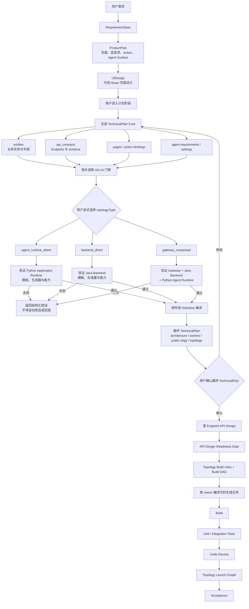

# 用户显式选择拓扑后的整体代码生成流程

```mermaid
flowchart TD
    U[用户需求] --> RS[RequirementSpec]
    RS --> PP[ProductPlan<br/>页面、信息项、Action、Agent Surface]
    PP --> UI[UiDesign<br/>可选 React 页面设计]
    UI --> ENTRY[用户进入计划阶段]

    ENTRY --> CORE[生成 TechnicalPlan Core]
    CORE --> ENT[entities<br/>业务实体与字段]
    CORE --> API[api_contracts<br/>Endpoint 与 Schema]
    CORE --> PAGE[pages / action bindings]
    CORE --> AGENT[agent requirements / settings]

    ENT --> GATE[拓扑选择 AG-UI 门禁]
    API --> GATE
    PAGE --> GATE
    AGENT --> GATE

    GATE --> SELECT{用户显式选择 topologyType}
    SELECT --> DIRECT[agent_runtime_direct]
    SELECT --> BACKEND[backend_direct]
    SELECT --> GATEWAY[gateway_composed]

    DIRECT --> DV[验证 Python Application Runtime<br/>模板、生成器与能力]
    BACKEND --> BV[验证 Java Backend<br/>模板、生成器与能力]
    GATEWAY --> GV[验证 Gateway + Java Backend<br/>+ Python Agent Runtime]

    DV -->|失败| ERR[返回结构化错误<br/>不得自动改选或回退]
    BV -->|失败| ERR
    GV -->|失败| ERR

    DV -->|通过| COMPILE[按所选 Definition 编译]
    BV -->|通过| COMPILE
    GV -->|通过| COMPILE

    COMPILE --> FINAL[最终 TechnicalPlan<br/>architecture / owners / public edge / topology]
    FINAL --> CONFIRM{用户确认最终 TechnicalPlan}
    CONFIRM -->|修改| CORE
    CONFIRM -->|确认| ENDPOINT[逐 Endpoint API Design]

    ENDPOINT --> READY[API Design Readiness Gate]
    READY --> DAG[Topology Build Units + Build DAG]
    DAG --> TASKS[按 owner 编译代码生成任务]
    TASKS --> BUILD[Build]
    BUILD --> TEST[Unit / Integration Tests]
    TEST --> REVIEW[Code Review]
    REVIEW --> LAUNCH[Topology Launch Graph]
    LAUNCH --> ACCEPT[Acceptance]
```
