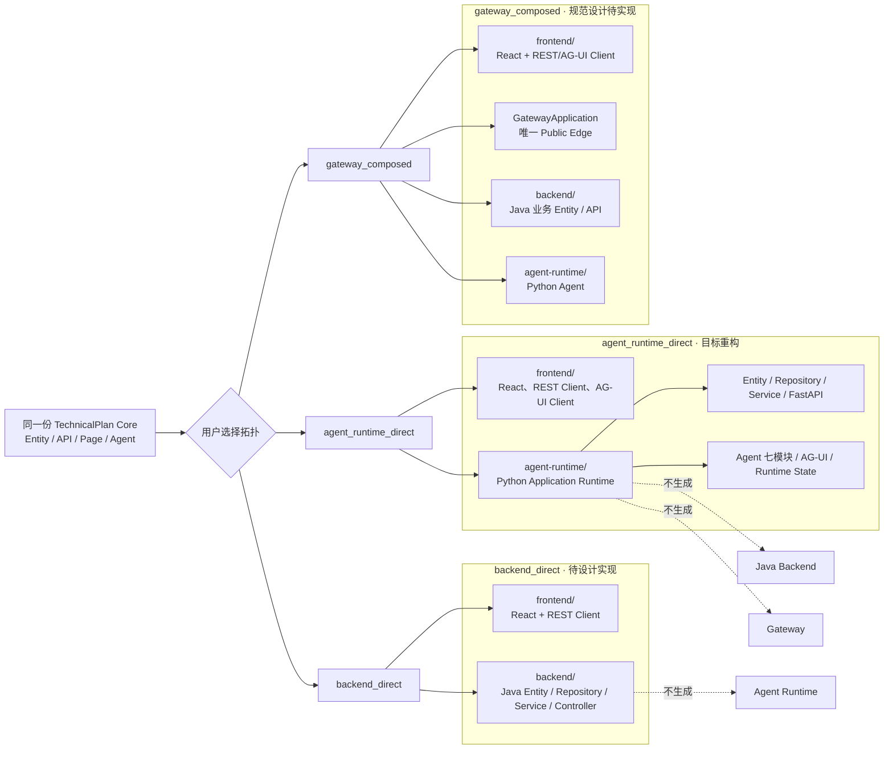

# 三种拓扑的目标代码归属

```mermaid
flowchart LR
    CORE[同一份 TechnicalPlan Core<br/>Entity / API / Page / Agent] --> TYPE{用户选择拓扑}

    TYPE --> ARD[agent_runtime_direct]
    TYPE --> BD[backend_direct]
    TYPE --> GW[gateway_composed]

    subgraph ARD_OUT["agent_runtime_direct · 目标重构"]
        ARD_FE[frontend/<br/>React、REST Client、AG-UI Client]
        ARD_RT[agent-runtime/<br/>Python Application Runtime]
        ARD_BIZ[Entity / Repository / Service / FastAPI]
        ARD_AGENT[Agent 七模块 / AG-UI / Runtime State]
        ARD_RT --> ARD_BIZ
        ARD_RT --> ARD_AGENT
    end

    ARD --> ARD_FE
    ARD --> ARD_RT

    subgraph BD_OUT["backend_direct · 待设计实现"]
        BD_FE[frontend/<br/>React + REST Client]
        BD_BE[backend/<br/>Java Entity / Repository / Service / Controller]
    end

    BD --> BD_FE
    BD --> BD_BE

    subgraph GW_OUT["gateway_composed · 规范设计待实现"]
        GW_FE[frontend/<br/>React + REST/AG-UI Client]
        GW_GATE[GatewayApplication<br/>唯一 Public Edge]
        GW_BE[backend/<br/>Java 业务 Entity / API]
        GW_RT[agent-runtime/<br/>Python Agent]
    end

    GW --> GW_FE
    GW --> GW_GATE
    GW --> GW_BE
    GW --> GW_RT

    ARD_RT -. 不生成 .-> NO_JAVA[Java Backend]
    ARD_RT -. 不生成 .-> NO_GATEWAY[Gateway]
    BD_BE -. 不生成 .-> NO_AGENT[Agent Runtime]
```
