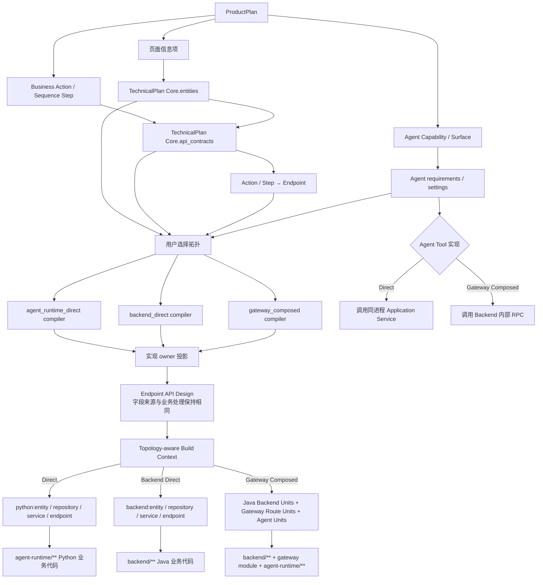

# 实体和 API 契约的拓扑无关权威链路

```mermaid
flowchart TD
    PP[ProductPlan] --> INFO[页面信息项]
    PP --> ACTION[Business Action / Sequence Step]
    PP --> SURFACE[Agent Capability / Surface]

    INFO --> ENTITY[TechnicalPlan Core.entities]
    ACTION --> CONTRACT[TechnicalPlan Core.api_contracts]
    ENTITY --> CONTRACT
    CONTRACT --> BINDING[Action / Step → Endpoint]
    SURFACE --> AGENT[Agent requirements / settings]

    ENTITY --> SELECT[用户选择拓扑]
    CONTRACT --> SELECT
    BINDING --> SELECT
    AGENT --> SELECT

    SELECT --> DIRECT[agent_runtime_direct compiler]
    SELECT --> BACKEND[backend_direct compiler]
    SELECT --> GATEWAY[gateway_composed compiler]

    DIRECT --> PO[实现 owner 投影]
    BACKEND --> PO
    GATEWAY --> PO

    PO --> API_DESIGN[Endpoint API Design<br/>字段来源与业务处理保持相同]
    API_DESIGN --> CONTEXT[Topology-aware Build Context]

    CONTEXT -->|Direct| PY_UNITS[python:entity / repository / service / endpoint]
    CONTEXT -->|Backend Direct| JAVA_UNITS[backend:entity / repository / service / endpoint]
    CONTEXT -->|Gateway Composed| GW_UNITS[Java Backend Units + Gateway Route Units + Agent Units]

    PY_UNITS --> PY_CODE[agent-runtime/** Python 业务代码]
    JAVA_UNITS --> JAVA_CODE[backend/** Java 业务代码]
    GW_UNITS --> MIXED[backend/** + gateway module + agent-runtime/**]

    AGENT --> TOOL{Agent Tool 实现}
    TOOL -->|Direct| LOCAL[调用同进程 Application Service]
    TOOL -->|Gateway Composed| RPC[调用 Backend 内部 RPC]
```
