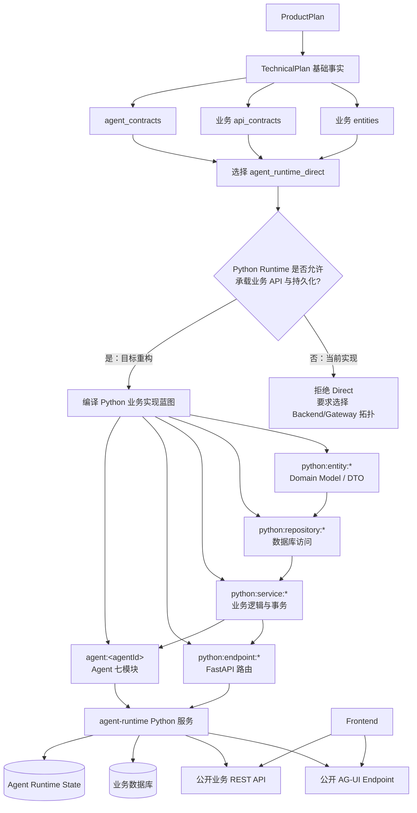

# Python Runtime 承载业务 API 的目标重构流程

> 注意：本图描述目标方案，不代表当前 `agent_runtime_direct` 已经支持业务实体、业务 API 或数据库持久化。

```mermaid
flowchart TD
    PP[ProductPlan] --> TP[TechnicalPlan 基础事实]
    TP --> ENT[业务 entities]
    TP --> API[业务 api_contracts]
    TP --> AGENT[agent_contracts]

    ENT --> SELECT[选择 agent_runtime_direct]
    API --> SELECT
    AGENT --> SELECT

    SELECT --> VALIDATE{Python Runtime 是否允许<br/>承载业务 API 与持久化?}
    VALIDATE -->|否：当前实现| BLOCK[拒绝 Direct<br/>要求选择 Backend/Gateway 拓扑]
    VALIDATE -->|是：目标重构| PYPLAN[编译 Python 业务实现蓝图]

    PYPLAN --> PY_ENTITY[python:entity:*<br/>Domain Model / DTO]
    PYPLAN --> PY_REPO[python:repository:*<br/>数据库访问]
    PYPLAN --> PY_SERVICE[python:service:*<br/>业务逻辑与事务]
    PYPLAN --> PY_ENDPOINT[python:endpoint:*<br/>FastAPI 路由]
    PYPLAN --> PY_AGENT[agent:&lt;agentId&gt;<br/>Agent 七模块]

    PY_ENTITY --> PY_REPO
    PY_REPO --> PY_SERVICE
    PY_SERVICE --> PY_ENDPOINT
    PY_SERVICE --> PY_AGENT

    PY_ENDPOINT --> RUNTIME[agent-runtime Python 服务]
    PY_AGENT --> RUNTIME

    RUNTIME --> AGUI[公开 AG-UI Endpoint]
    RUNTIME --> REST[公开业务 REST API]
    RUNTIME --> DB[(业务数据库)]
    RUNTIME --> STATE[(Agent Runtime State)]

    FE[Frontend] --> AGUI
    FE --> REST
```
