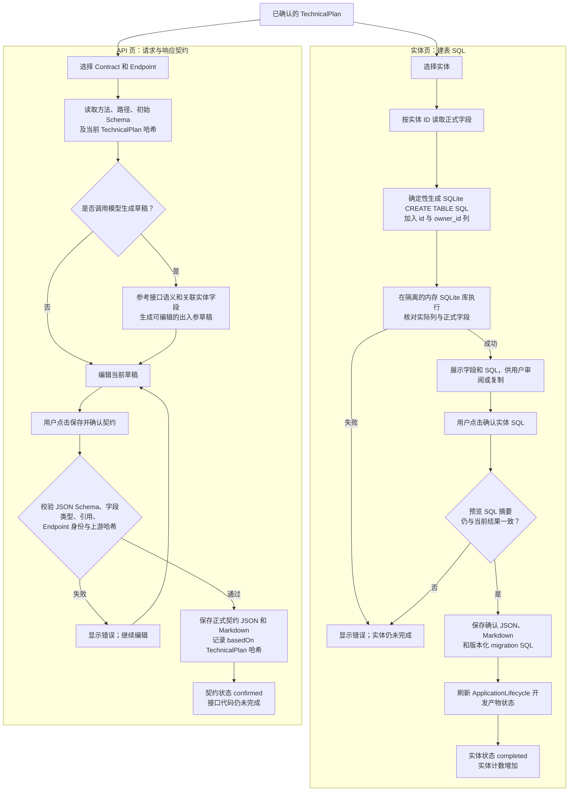

# Direct 实体 SQL 与 API 契约确认

本图描述 `agent_runtime_direct` 当前的开发产物页。实体 SQL 与 API 契约可分别确认；保存 API 契约不要求实体 SQL 已确认。

实体 migration 保存到生成项目的 `agent-runtime/src/app/infrastructure/migrations/sql/`。SQL 只在临时库校验，不会在目标业务库自动执行。TechnicalPlan 变化后，旧 SQL 或 API 契约须重新核对；旧确认不能继续作为当前 Build 输入。
