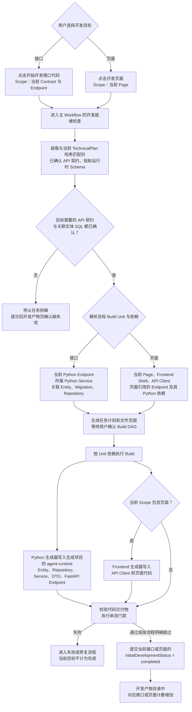

# Direct 接口与页面代码生成

API 契约确认后，用户还需启动接口代码开发。页面开发使用同一主 Workflow，并带入页面依赖的接口。Build 会同时检查目标所需的正式 API 契约和关联实体 SQL。

保存 API 契约只确定 DTO 的字段来源，不会自动写出 DTO、Service 或 Endpoint。代码文件位于生成项目的 `agent-runtime/`；XCodeAgent 自身的 `Backend/app/` 是生成流程的实现，不是生成项目的业务代码目录。接口和页面的具体目标文件由已确认的 Build 任务限定。
