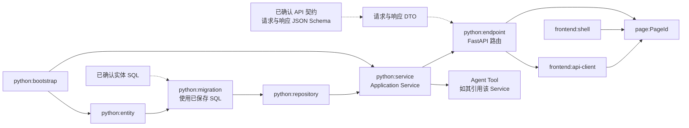

# Direct Python 业务代码依赖与完成判据

实线表示 Build Unit 的主要依赖顺序；虚线表示已确认产物提供的输入。Migration Unit 使用实体确认时已经保存的 SQL，不让模型再次生成或覆盖 SQL。

| 操作 | 当前确认的事实 | 开发产物计数 |
| --- | --- | --- |
| 确认实体 SQL | SQL 已隔离校验、保存并经用户确认 | 实体增加 |
| 保存并确认 API 契约 | 请求与响应 Schema 成为当前正式契约 | 接口不增加 |
| 接口 Build 与单测门禁完成 | Python 接口代码达到本次开发完成判据 | 接口增加 |
| 页面 Build 与单测门禁完成 | 页面代码达到本次开发完成判据 | 页面增加 |

实体计数表示 SQL 确认完成，不表示 Repository 已生成，也不表示目标业务库已执行 SQL。接口和页面计数由 Build、单测门禁后的开发状态提交决定。
